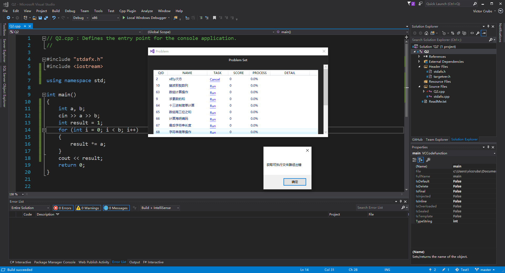
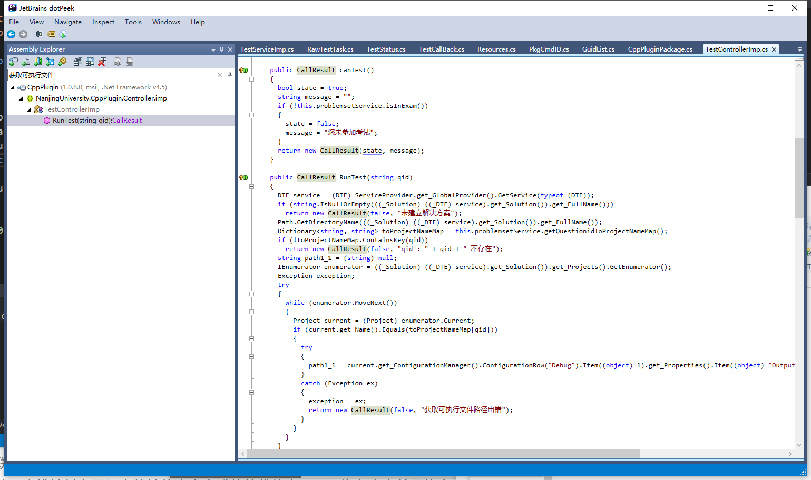
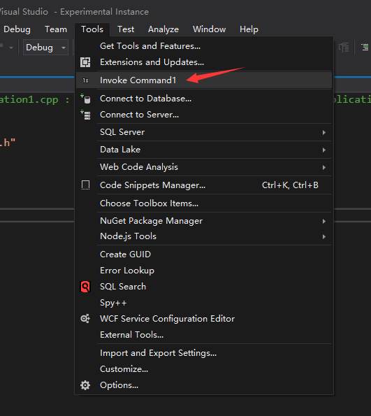
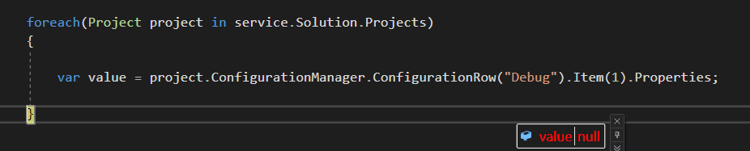

## 前言

因为VS2017是我的刚需（和Azure的交互以及个人的喜好），所以当插件可以下载的时候，我直接解包修改了插件的配置文件从而在VS2017上运行。我以为就这样我就可以用VS2017而不需要虚拟机装VS2013了，但事实还是证明我太年轻了……

## 错误

在VS2017上运行插件，运行测试时，会弹出如下的错误提示。



## 找错

为了找到这个的原因，使用免费的JetBrains的[dotPeek](https://www.jetbrains.com/decompiler)工具对CppPlugin工具解包出的**CppPlugin.dll**文件进行反编译并导出成解决方案到VS里查看。



导出到VS后，需要在nuget里安装**Microsoft.VisualStudio.Shell**和**EnvDTE**依赖以正常获得InteliSense提示。否则就要去翻MSDN……

通过查找报错的字符串*获取可执行文件路径出错*直接定位出错的位置，可以发现相关代码路径是`Controller/imp/TestControllerImp.cs`的`CallResult RunTest(string)`方法。


图中`get_Solution()`、`get_Name()`等语句不是错误，它们是C#的属性编译后的代码。在自己程序中，如需访问`Solution`等属性，**只能**直接`.Solution`，不能直接调用`get_Solution()`代码。

更具体来说，是下部`if (current.Name.Equals(toProjectNameMap[qid])`块中的赋值语句。

```CSharp
path1_1 = current.get_ConfigurationManager().ConfigurationRow("Debug").Item((object) 1).get_Properties().Item((object) "OutputPath").get_Value().ToString();
```

这句话非常长，有很多函数调用。

为了弄清楚具体哪一个调用出错，我新建了一个**全新的VSIX扩展程序**项目，并在点击事件响应中加入了这个方法。



在调试中的VS实例中新建一个C++控制台程序，点击菜单按钮，发现如下结果：



**Properties是null，Item(1)返回的是一个COM对象，无法获得值。**

这就是错误所在了。

## 社区
微软的相关文档中并没有提到任何相关API在VS2017中的变化。

[Configurations.Item(Object)方法](https://docs.microsoft.com/en-us/dotnet/api/envdte.configurations.item?view=visualstudiosdk-2017#EnvDTE_Configurations_Item_System_Object_)

[Configuration.Properties属性](https://docs.microsoft.com/en-us/dotnet/api/envdte.configuration.properties?view=visualstudiosdk-2017#EnvDTE_Configuration_Properties)

同时，在StackOverflow下有类似问题：

[Configuration.Properties object returning null in Visual Studio 2017 VSIX extension
](https://stackoverflow.com/questions/43418796/configuration-properties-object-returning-null-in-visual-studio-2017-vsix-extens)

按描述，题主也是有一个**C++相关的扩展程序**，相同代码在VS2015中能够运行，而在VS2017中出现错误。题主最后提出了一个可用解决方案。如有兴趣请点进去查看，这里就不搬运了。


在官方社区中也有相关问题[ConfigurationManager.ActiveConfiguration.Properties is empty for c++ projects in Visual Studio Extensions](https://developercommunity.visualstudio.com/content/problem/5500/configurationmanageractiveconfigurationproperties.html)，微软官方并未给出有效回答，却以*有效信息不足*的理由关闭了这个问题。这就非常滑稽了。

>Thank you for your feedback! Unfortunately, we don’t have enough information to narrow down this issue and find a solution. If this is still an issue for you, we recommend that you upgrade to the latest version via the in-product notification or from here: https://www.visualstudio.com.  If the problem should again occur, please let us know by creating a new problem report using the latest version.

## 总结
总的来说，这个插件不兼容VS2017，是**微软的锅**：API变动却没有在任何地方体现（~~可能这是个feature吧~~）。请大家可以不折腾这个插件了，安心用虚拟机或者实机安装VS2013吧！
