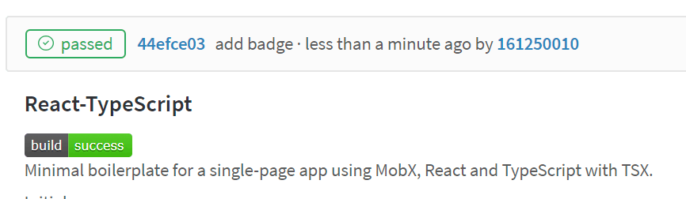
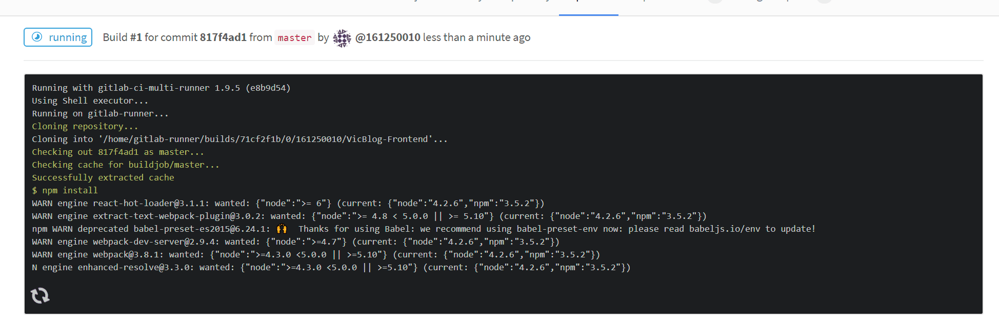
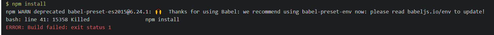
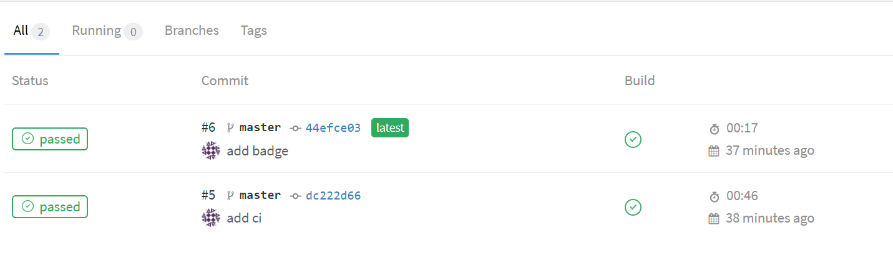

# 动机

因为~~作业要求~~想尝试持续集成的效果，又因为很多开源CI平台不支持自建平台（例如Travis CI），院的GitLab也不开放Shared Runner，所以只能手动配置Runner。在整个配置的过程中，遇到了很多让人很无语的坑。在这里记下来，以让大家参考。同时也记下来折腾的过程。

先放一张效果图。



项目地址：
http://101.37.19.32:10080/161250010/gitlabcitest

## GitLab版本过老，需要使用老版本的runner

院的GitLab版本是


。截止当前（2017/11/6）GitLab CE已经更新到了大版本10，这个8.10版本官方早就已经放弃治疗，甚至在gitlab-runner的[兼容性页面](https://docs.gitlab.com/runner/index.html#compatibility-chart)上都找不到这个版本的信息。~~看来你院使用过时技术的传统看来还要继续延续多年。~~

所以现在在官网的[GitLab Runner安装教程](https://docs.gitlab.com/runner/install/linux-repository.html)已经不适合。

如果使用新版本的gitlab runner运行的话，会提示**405（Method Not Allowed）**错误。这是由于新版本的Runner会使用GitLab从9.0开始换用的新的GitLab API v4，而8.x版本仍然使用老版本的API。这就造成了错误。

同时，Runner从10版本从`gitlab-ci-multi-runner`更名为`gitlab-runner`，但是配置方法大致一样。配置可以参考这个[链接](https://docs.gitlab.com/runner/register/index.html)。

GitLab正确的安装和配置方法方法如下（以Ubuntu 16.04 x64通过apt-get举例）：

1. 根据[这个](https://docs.gitlab.com/runner/install/old.html)设置老版本的apt源;
2. 运行安装命令：`sudo apt-get install gitlab-ci-multi-runner=1.9.5`
3. 配置时使用命令：`sudo gitlab-ci-multi-runner register`

配置好了后，runner页面应该能看到提示的可用的runner。


# Ubuntu官方源Node版本太低

配置好了runner，我首先使用了我的博客前端的程序用来做测试。为了简化，使用了shell executor。这就需要配置runner机器的环境。

先写一份`.gitlab-ci.yml`文件。我使用的文件如下：
```yaml
stages:
  - build

buildjob:
  stage: build
  script:
    - npm install
    - python cleanup.py
    - set NODE_ENV=production
    - webpack -p --color
  cache:
    paths:
      - ./node_modules/
```
直接敲`sudo apt-get install nodejs`，然后就开始build。结果在build的时候才发现node版本很低……




只能自己设置apt源了。Node官方提供的源说明[参照这个链接](https://nodejs.org/en/download/package-manager/)。


# 构建时内存提示不足


上传后，pipeline自动开始build。然而虽然想到了Node非常耗费内存，但是没想到512M内存都不够吃……跑`npm install`的时候被bash无情杀掉。



后来把内存加到2G才够npm install使用。

为了简化工程，后来使用了[Mobx官方提供的boilderplate项目](https://github.com/mobxjs/mobx-react-typescript-boilerplate.git)作为测试。这也就是现在的项目。

# 你正在成功！

成功了！折腾了这些后，终于成功build了一次。


还给README.md加上了badge（题图）[(教程)](https://docs.gitlab.com/ee/ci/pipelines.html#badges)，这样看上去就非常像是一个非常好的开源项目。

# 结语

GitLab CI确实是非常好用的工具，它能和GitLab无缝集成，而且非常的简单易用（这些坑都不是GitLab的）。这几天我会把整个软工2项目的CI环境搭建好，需要学习控制台下gradle相关命令以及Linux下的一些配置，这样真正开始开发的时候才能更高效。
