# 前言

~~前不久迁移博客的时候看到了2017年总结，恍若隔世，2018年就这样悄悄地度过了。~~

咕咕咕到了除夕，距公历新年也过去一个多月了。没想到这一个月中发生了重要的事情，正好借着这个机会写下来，也当做对过去的一年（公历和农历）的总结吧。

# 比赛和项目

2018年从年初到年末，都有比赛陪伴。做比赛的过程确实比较累，但是收获也不少，除了奖金，最重要的还是在比赛中锻炼了技术，学到了知识，提高了姿势水平。由于~~比赛太累~~~~课程任务太多~~太懒，也因为想象力太局限，这一年中大部分空余时间也都花在~~深耕~~折腾个人博客上了。

## 1月：软工2结项，Light x00

虽说在软工2的过程中不停地骂这门课，但是是人还是逃不出真香的道理。软工2成为到目前为止我感受最深、最有收获的一门课之一（当然不是因为课程上教的知识）。

自己设计架构，自己写基础代码，自己造轮子，自己配环境……虽然在过程中经常碰到一鼻子灰，遇到死磕几天都解决不了的、网上也找不到的奇怪问题；虽然不管自己怎么折腾，最后做出来还是远远不如已有的解决方案；虽然自己已经尝试过好几个方案，却还是不能让自己满意……自己思考，自己实践，自己反思的过程真的让人痛苦。可是，最后找到解决方案那一刻，测试成功那一刻，甚至放弃的那一刻，都让我不仅是感觉到满满的成就感，还让我在这时回想起这段时间的尝试和经历时，都让我感觉到一切都是值得的。

举例：2017年11月30前后三天，在九食巴黎贝甜连肝3天，从Linux命令和groovy一无所知，到写出了一个调用了操作系统API的构建脚本，只为了达成让构建脚本能够在测试之前启动服务器，启动成功后运行测试用例，运行结束后关闭服务器这一个目的。即使最后并没有起到应有的作用，但是让人印象深刻。

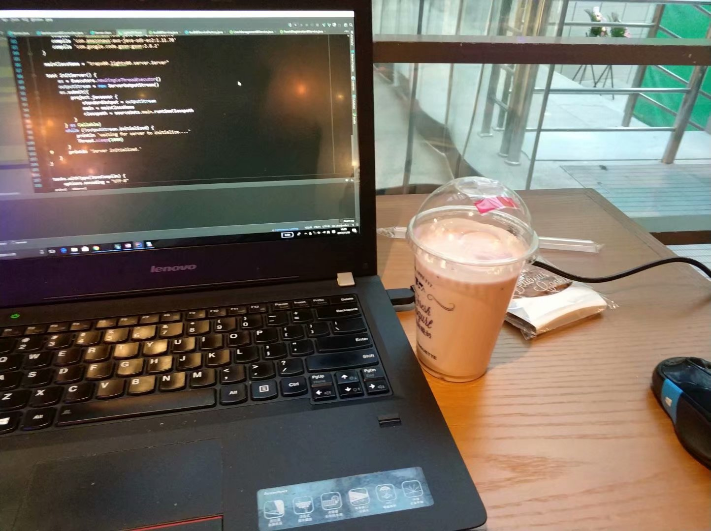

2018年1月，系统展示、最终答辩，24/7被软工2占据的日子终于结束，在如释重负的同时，我还感到了收获的快乐。

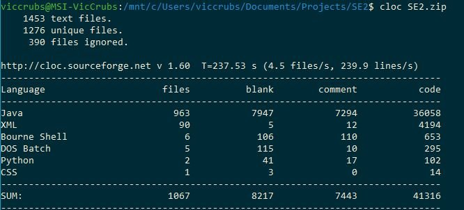

## 3-6月：软工3，Tag x00

软工3倒是没有像软工2一样，把所有时间都花在这个上面。但是，软工3和软工2完全不同，不清晰的需求，不设限的技术选择，甚至最后1个月推导需求完全重做，每一步都和作业似的软工2完全不一样。为了博得评委的好感，增加项目的“亮点”，不管用不用得上，有没有用到位，我们一股脑上了最新最酷的技术（React, TS, Ant Design, Spring Boot, CI/CD，独立域名，响应式，多语言，视频/音频/3D标注，Tensorflow，各种我没有听说过的网络……距结项1个月推翻重做的时候，还提到了用Unity做VR标记....），做了一切我们能想到的工作，甚至答辩（下午）的上午还在加新的功能（当然坚守了不通宵的底线），答辩时也在尽可能在找花哨的词语。最终虽然也拿到了不错的成绩，却让我产生了思考：真实的项目真的是这样做出来吗？一个项目是否成功，真的是“亮点”越多越好，技术越多越新越好吗？

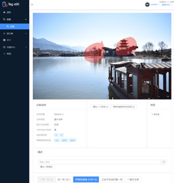

## 4-6月：链谷杯，ChainStore

一个偶然的机会，在同学的“引荐”下，认识了商院的同学，抱着试一试的心态接下来链谷杯的锅；花了用了一个晚上4个小时，从0开始xjb设计的拓扑架构，再以“能用就行”的代码质量要求写出了几千行的代码，大部分还是现学的kotlin和Vue；最后却稀里糊涂地进了决赛，有便宜白不占地去苏州玩了一圈，还在老师“五篇博士论文”的怒怼下自己都不敢相信地得了三等奖，还发现这是大学期间我第一次拿有价值的奖项？更让人震惊的是，同一个项目还在6个月后的类似比赛上又拿了奖，而且比赛听上去更有排面？生活中真是处处充满了惊喜。

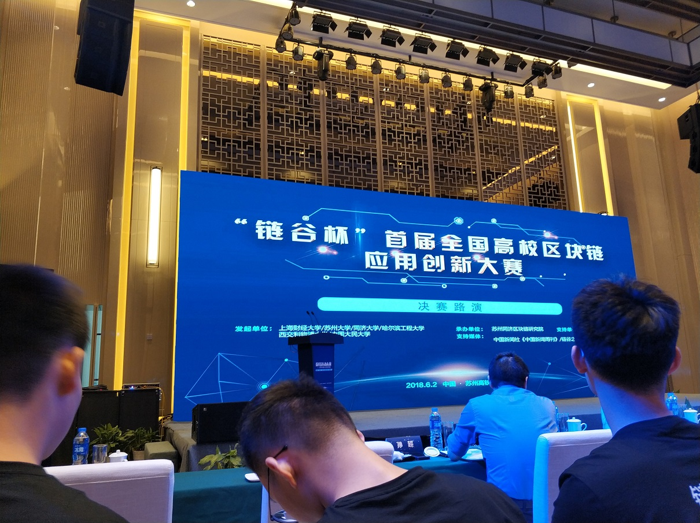

## 8-11月：花旗杯，A+Quant

2017年底就开始听说花旗杯并开始组队了，当时听说队里全是工管、商院的大佬，就答应了，没想到真的让人大开眼界，和真·大佬共事真的是非同一般。就算即使到了结束也不认识其他院的同学（……），但是从100多页的结项报告就能看出大家都为了同一个目标在共同努力。虽然做到后期，加上课程上的压力（数据库:angry:编译原理:angry:）心态已经处于爆炸的边缘，但是在最后结果的时候还是欣喜若狂。同时，春招和实习季马上要来了，短时间之内没有特殊情况应该不会参加新的比赛了，这也算是给人生的一个阶段画上了一个完美的句号。最后还是要非常感谢其他26名花旗杯队员，是大家的共同努力才有了这个结果！[南大青年上的一篇采访](http://mp.weixin.qq.com/s?__biz=MzA3NzExMDEyMQ==&mid=2650907383&idx=1&sn=56008f3ae2e0fa68d1f455bc5b5dd8ef&chksm=84a20cf1b3d585e7bd68d05690d8ad36698c8f27b86a0264949c689146fe41097eae89cdfc1b&mpshare=1&scene=23&srcid=1214TRJOcCZ7iz5gR7DK7IMa#rd)有我更多想说的话。

奖杯

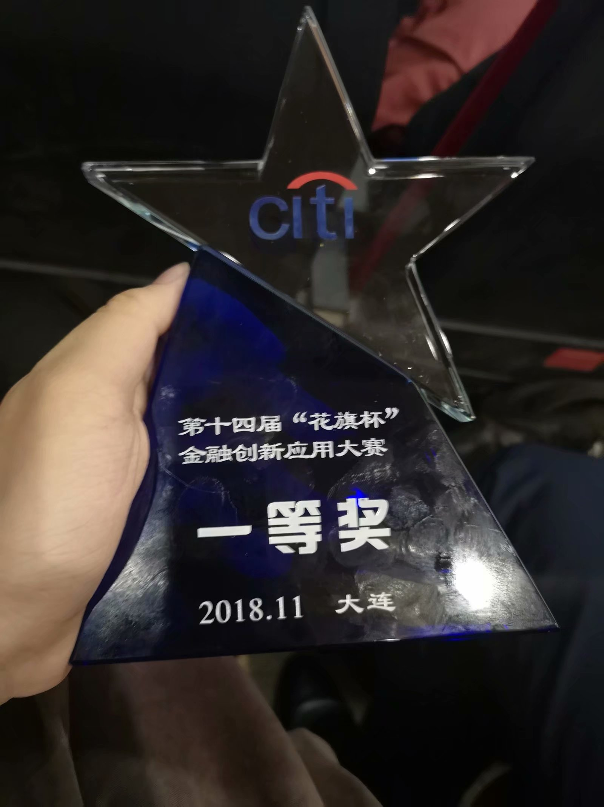

顺便逛了逛大连，真实个美丽的海滨城市，尤其对我这种西部山区出来的，还是非常见世面。

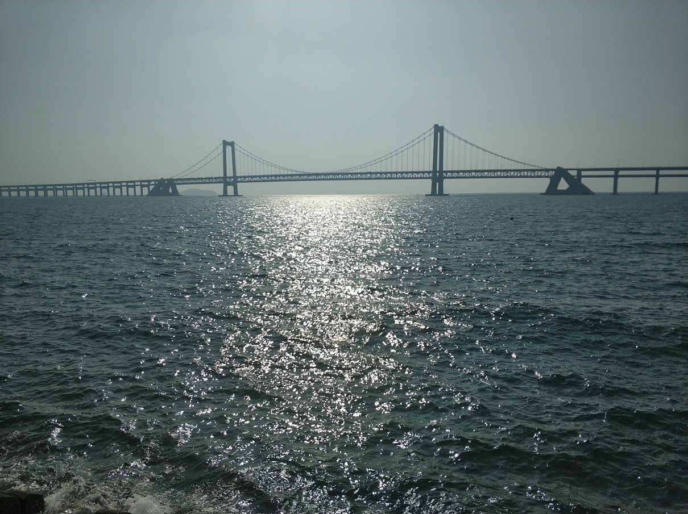

## VicBlog

从2016年10月开始，我的个人博客已经度过了2年了。在这2年里，我完全放弃过2个版本，重写过3次。3月，我抛弃了在2017年暑假写的网站，重新用类似的框架重写一遍，却仍然[遇到了各种问题](/articles/gatsby-powered-vicblog-online)。在8月开始，我完全抛弃了原有的传统网站架构，采用了全静态的思路，使用Gatsby框架，在运行效率（静态网站可以有效cache，加快网站加载速度）、开发效率和灵活性（既能使用React以及前端生态圈的各种轮子，又避免了后端、集成和部署上的杂事）上成功两开花。目前你看到的，就是这个最新的架构上诞生的博客程序。目前来说，它已经满足我的绝大部分需求，只有几个小问题（访客统计等）貌似不容易解决，但是不排除以后再次推翻重写的可能。毕竟，生命在于折腾~

## 其他

- 本想在俱乐部中启动技术实践活动，策划已经完全出来了，但是看了看当时报名人数（好吧就是0）就只能放弃了~
- 我对编译原理很感兴趣，其原因应该没人想得到：**前端**。在最近的前端发展中，操作AST是常规操作：各种编译期优化、babel以及其各种插件、TypeScript、各种奇奇怪怪的语言……这一切都离不开编译原理的知识。所以，在编译原理课程中，我不仅照着规范写了针对C语言的lex和yacc文件，还根据龙书，用java码了一个简单的lex程序和yacc程序（当然这是因为我理解错了需求）。和软工2同样，做它的过程同样也是痛苦的，但是在实现各个算法的过程中让我感到了非凡的快感。有条件有时间的话，我还想把它继续做下去。有兴趣的同学可以看这个[GitHub Repo](https://github.com/ddadaal/Homework/tree/master/Compiling%20Techniques/CompilerLab)。

# 活动

## 俱乐部相关

2018年前半年，作为南大微俱技术部的人，却没怎么做技术相关的事（捂脸），却体验了一把主持人和向导的感觉。而在后半年，换届后我成了一把手，发现各位新部长的才能超强，感到自己非常幸运。我也尝试做到不给俱乐部添乱，希望俱乐部能够更好地发展下去。

俱乐部活动时间表

### MR

一开始只是说着玩的、心里感觉全是噱头的MR，买了后却发现真香，偷偷在宿舍拿出来玩，还成为了微俱的“镇部之宝”。

5月20日校庆夜开放体验

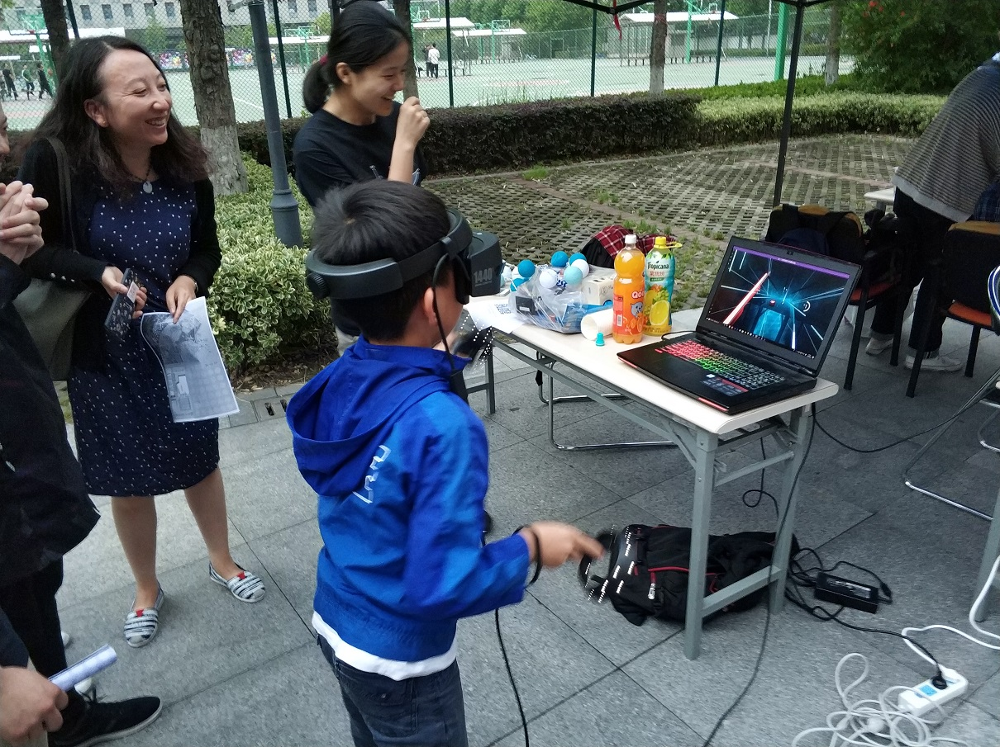

### 参观微软苏州

7月4日，组织四个学校的同学去微软苏州参观，中途意外情况不断，再加上我各种不过脑子的决定和错误，让这次参观出现了很多不该发生的问题。当然了也是宝贵的学习机会，以后一定不会再犯相同的错误了！

## 其他

- 12月两周听了两场音乐会，解放军军乐团和校新年音乐会，惊叹于音乐会现场的震撼的视听感受，新年音乐会的第一首The Seal Lullaby直接让我这个之前一直听纯音乐、new age等音乐类型的爱上了听合唱曲目

解放军军乐团

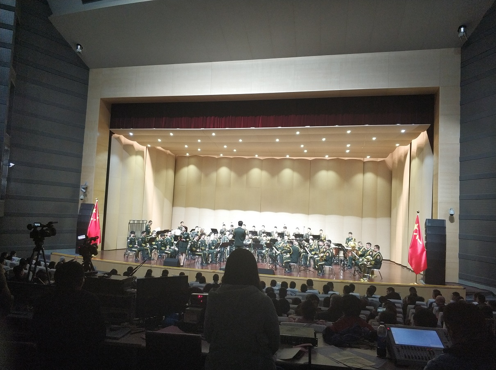

校新年音乐会

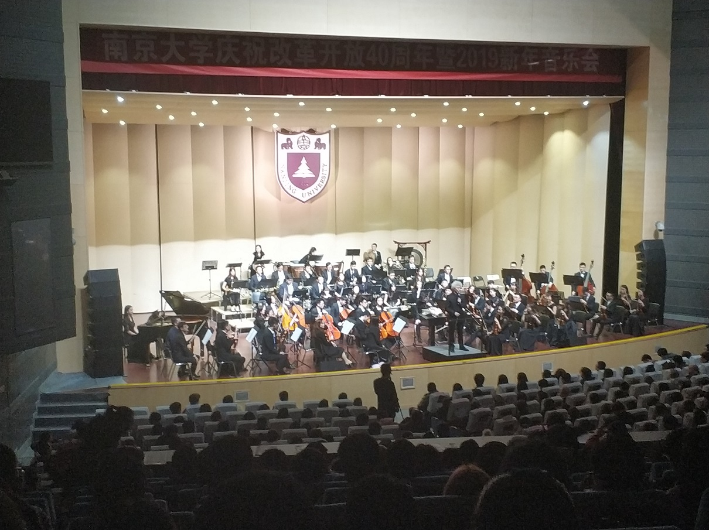

- 10月去参加了微软粉丝之夜，本来以为是100人的小聚会（都有点想鸽）但是发现是1000人的大狂欢……现场很多微软的粉丝和大佬，虽然没有得到奖（心水Surface Go），但是信仰++

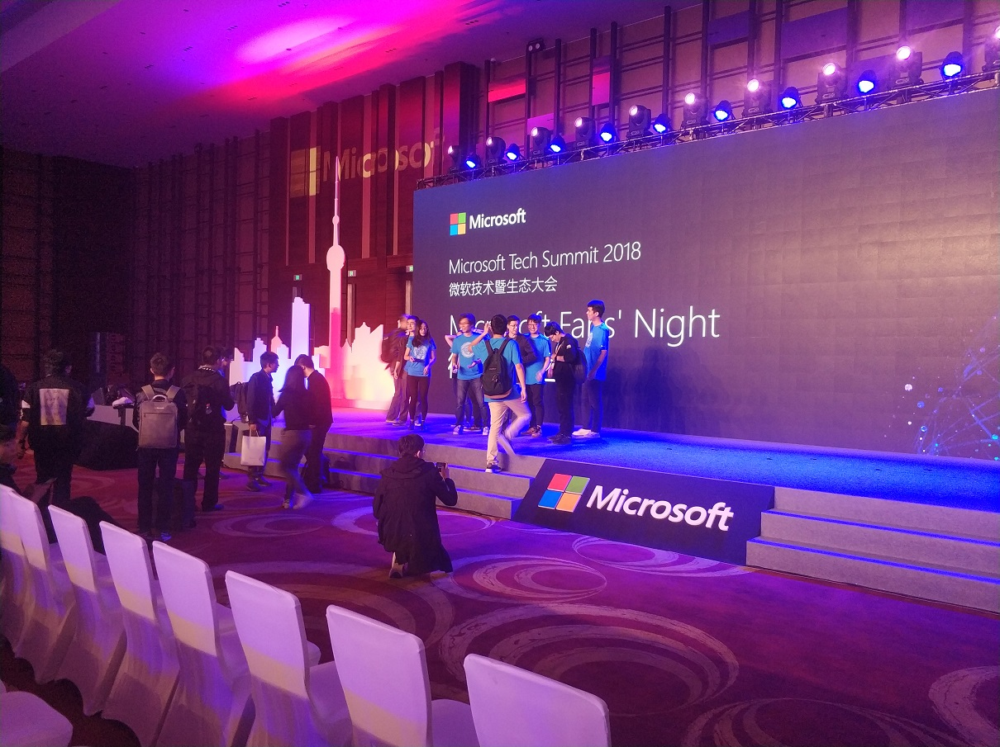

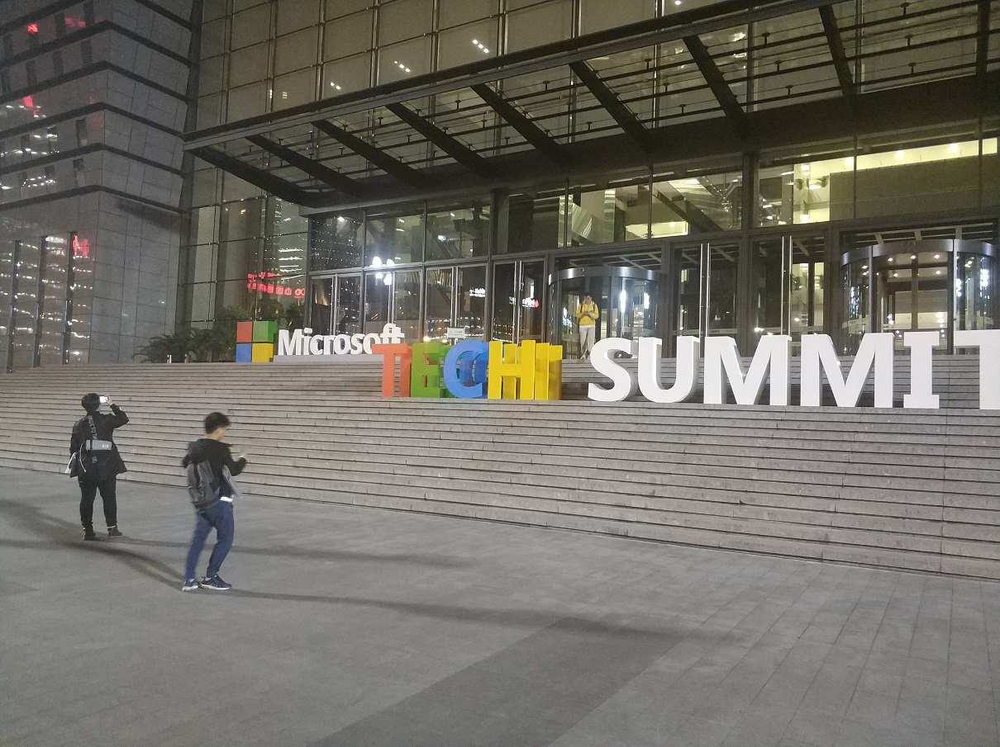

- 10月参观了杭州的互联网公司，贝店，微策略，网易，给我感受的最深的是互联网加班真tm狠啊……以及和梁神的近距离交流让我对毕业后就业的情况有了深入一点的认识（虽然还是非常纠结）

贝店

- 大三终于肯迈开腿出去玩了，身在南京南京的景点却没玩过，说出来还是有点丢人的……栖霞山、先锋书店、南京市长江大桥，果然各有各的风景。下学期还要去更多地方看看。

栖霞山

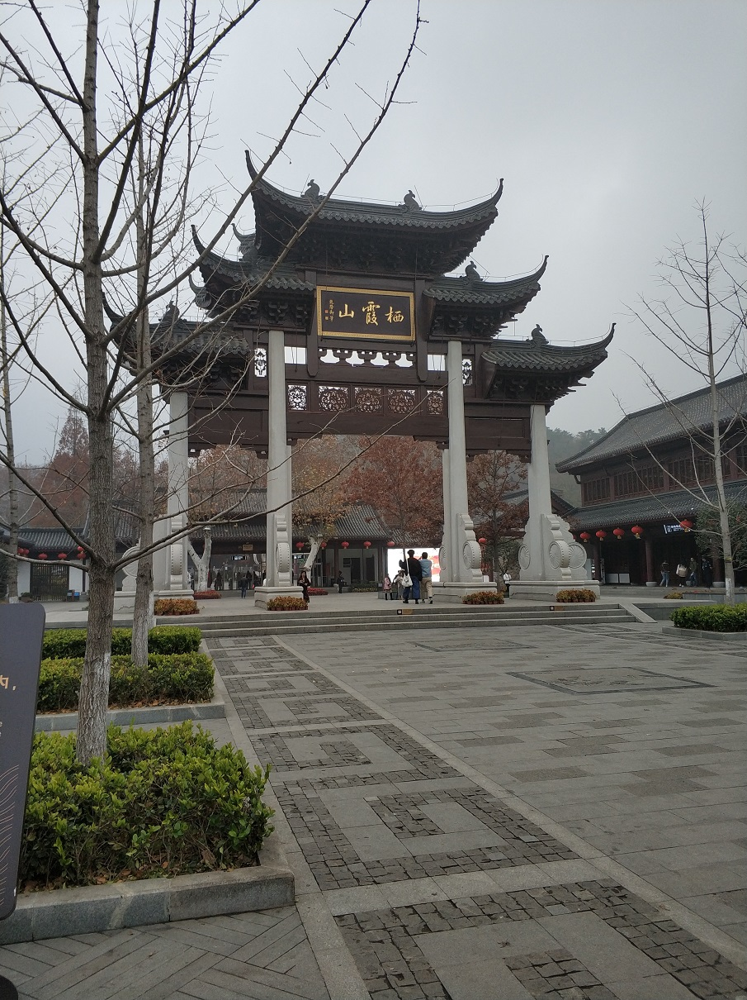

先锋书店

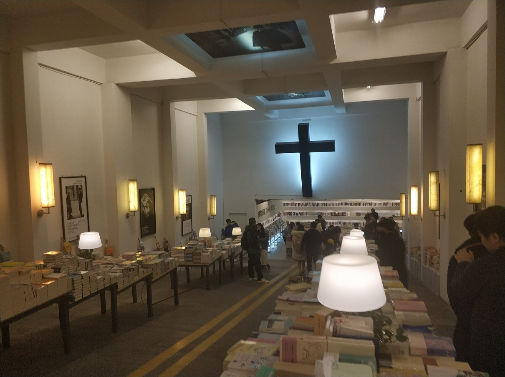

南京市长江大桥

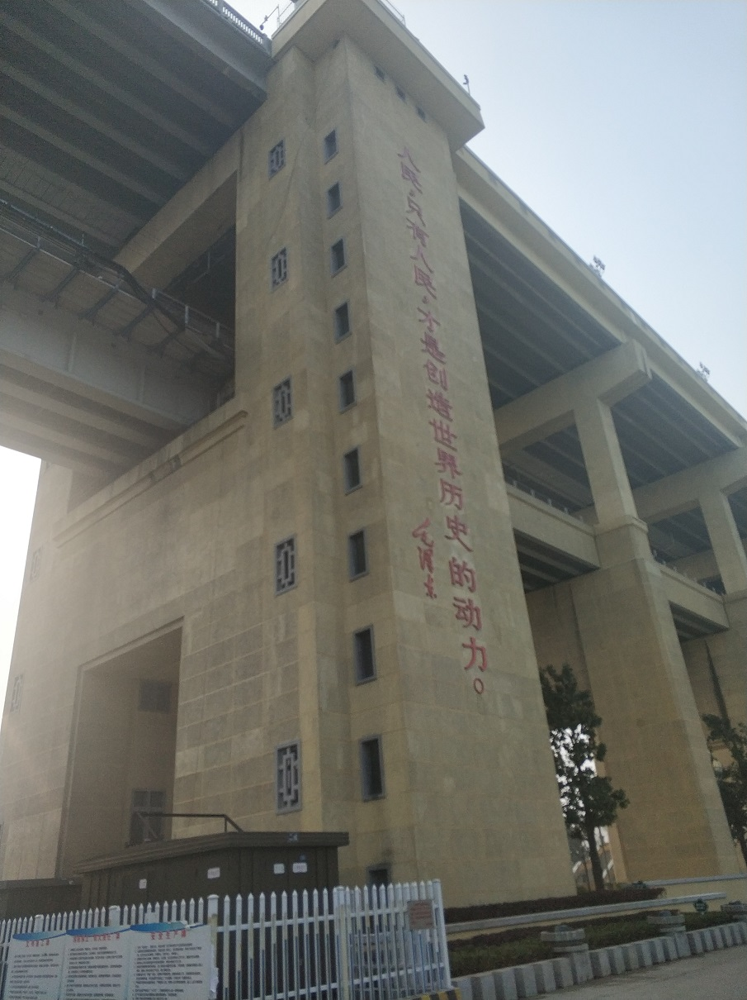

# 实习

虽然说对未来是去保研还是就业还是拿不准，但是目前我的所有准备都是按就业准备的（其实有一个原因是我懒……），所以实习对我来说比一切都重要。

## 微软

从小一直有个加入微软的梦想，终于快到实现的时候了，可是看来是时候不到，两次申请实习，苏州微软时间不合适直接没有进入面试，一次（19年1月）MSRA过了面试就等拿offer了可是[学校一纸规定断送梦想](/articles/MSRA-DKI-frontend-interview-experiences)（可是在同时商院、计科的同学实习地不亦乐乎）。唉，“歪门邪道”是走不了了，只能去参加春招了。

MSRA面试邮件

## SAP

之前从我妈那里听说了这个公司（以及对它的ERP产品繁琐易用性不高的抱怨），没想到这个公司还和学院有个实习项目的合作，听了宣讲会后居然感觉到价值观挺相符……即使听说最终待遇比较低，但是~~参加了总没有坏处~~就报了。暑假参加了一次供应链相关内容和SAP相关产品的培训，虽然就5天，每天还有赶单程1个小时的地铁，却感觉学到了很多知识（毕竟是全新的领域，老师讲的也好）；然后去玩了一圈，虽然活动比较尬和天气比较热，还是非常好玩。按道理暑假需要去实习，所以这段时间我必须在信仰和偷懒之间做出权衡了。

# 其他

- 窟牙初中不带保持器一时爽，大学拔牙带牙套火葬场:cry:
- 从仙林搬到了市中心的鼓楼，运气太好分到了有独卫的宿舍楼（应该是鼓楼除bug般的八舍以外最好的宿舍楼了），严格来说条件比仙林还稍微好一点，但是依然非常不舍，所以还经常回仙林看看
- 当然，不舍归不舍，到了鼓楼，市中心走几步就到了，那还不得天天出去吃出去逛啊？就算市中心随便什么吃的都人均100+（火锅120+嗯非常make sense），KFC都变成最便宜的了（当然麦当劳更便宜，当然KFC更快乐鸭），吃得同学都喊穷
- 借着室友上钢琴课的机会，开始尝试弹6年没有碰过的琴。即使时间太久，而且一开始学的并不是钢琴而是电子琴所以基础技能不足（例如发力等）造成技术不行，但是仍然很快爱上了钢琴，好几次连续弹了3个小时都没有感到疲惫。搬到鼓楼后由于条件限制不能继续弹了。希望以后安定下来之后买一台电钢，在繁忙的工作之余娱乐自己
- 至此，有个重要的事情没有提，有心的同学应该猜到了发生了什么。问题全在我。经过这次个人对此事有了可以说有了更加清晰的认识吧，三观相合真的是非常重要，搞清楚自己和对方想要什么，并且自己和对方都能提供，才能真的走下去。我给我自己总结的个性[在这里](/about/me/cn)，如果有不准确的地方欢迎大家提出意见，我也尽量让自己不要这么“直”，学会多沟通，这样对谁都好。

# 总结

这篇总结从2月4日20:00开始写，到这里已经23:33了。一个小时己亥猪年的第一声钟声即将敲响，2018年也过去了35天了。时间过得可真快啊！

回忆刚过去的一年，经历了赶DDL的痛苦，也收获了奖状和奖金的喜悦；感受到了收到offer的激动，也体会到了人在屋檐下不得不低头的无奈；不舍地阔别了生活了2年的仙林校区，也迎来了充满了社会气息的全新的环境和生活方式……2018年是变化的一年，成长的一年，收获的一年。

在已经迎来的2019年和即将引来的己亥猪年中，更多重要的学习上，职业生涯上和(hopefully)感情上的改变仍然等着我。2018年给我带来了许多，希望在2019年年末，以及在鼠年的新年钟声敲响的时候，我仍然能对这一年无怨无悔。
