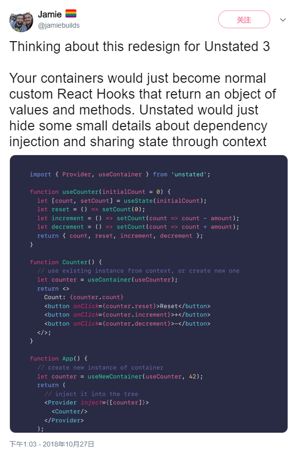

# What is it?

[](https://www.npmjs.com/package/simstate)
[](https://www.npmjs.com/package/simstate)
[](https://travis-ci.org/ddadaal/simstate)
[](https://coveralls.io/github/ddadaal/simstate?branch=master)

As the title indicates, this is yet another React state management library favoring [React Hooks](https://reactjs.org/docs/hooks-intro.html) and [TypeScript](https://www.typescriptlang.org/).

GitHub：<https://github.com/ddadaal/simstate>

# Why use it?

Please read [repo's README](https://github.com/ddadaal/simstate) for why and how to use and integrate `simstate` into your projects, which covers all the APIs, features as well as future roadmap for this library.

# Why write it?

## Respect React's programming pattern

[MobX](https://github.com/mobxjs/mobx) and [react.di](https://github.com/RobinBuschmann/react.di) were extensively used for my last projects to have an frontend infrastructure that looks like backend, which helps a lot in state and dependency management. However, some problems occurred during their integration in the context of React, the most important of which are the inconsistencies between the code styles in OOP with Dependency Injection pattern (encouraged by react.di) and functional pattern (by React).

The following code snippet shows the differences between the patterns with an example to implement a commonly seen component in our code, with event handlers and dependency to external data store.

```tsx

interface Props {
  id: string;
}

// OOP with DI.
// Class component is required
// to have an instance member for dependency to inject :/
@observer
export class AComponent extends React.Component<Props> {

  @Inject store: Store;

  handler = () => { };

  render() {
    return (
        <button onClick={this.handler}>
          {this.props.id}: {store.text}
        </button>
    );
  }
}

// render props with `simstate`
const AComponentWithRenderProps = ({ id }: Props) => (
  <StoreConsumer storeTypes={[Store]}>
    {({ useStore }) => (
        <button onClick={() => { }}>
          {id}: {useStore(Store).text}
        </button>
      );
    }
  </StoreConsumer>
);

// HOC with `simstate`
const LocaleMessageWithHOC = withStores(Store)(
  ({ useStore, id }: WithStoreProps & Props) => (
    <button onClick={() => { }}>
        {id}: {useStore(Store).text}
    </button>
  )
);

// Hooks (best of all)
const ComponentWitHooks = ({ id }: Props) => {
  const store = useStore(Store);
  return (
    <button onClick={() => { }}>
        {id}: {store.text}
    </button>
  );
}
```

The `HOC`, `render props` and `Hooks` are the ones that are more compact, easy to write and most importantly, adherent to React's philosophy than class based components are. The code style of DI adds more mental burdens for developers by constantly switching between two programming patterns. You may argue that it is more like a personal taste: it is true, but it is also obvious that recently React focuses more on functional component over class component, and the whole ecosystem is moving to functional components at a rapid speed.


## Implement the functions and patterns I like

The immediate choice after realizing the aforementional problems is the [unstated](https://github.com/jamiebuilds/unstated). Based on the not-so-new [React Context](https://reactjs.org/docs/context.html) coming with React 16.3, it provides a hybird solution between MobX and Redux: Define state and operation in a class like MobX. But instead of using observables mechanism to detect and react to changes automagically, it requires calling a `setState` function to initiate a state change, like a normal class component. It turns out to be a excellent balance point for many developers, including me. In fact, `simstate` almost implements the exact same functionalities with most code looking alike.

The much hyped [React Hooks](https://reactjs.org/docs/hooks-intro.html) is an another striking thing for all React developers when it is revealed. It gives so much power to functional components in an unexpected way, that nearly every class component can be rewritten into a functional component, and makes the code much clearer than before (See the previous section for comparison, and the YouTube video [React Today and Tomorrow and 90% Cleaner React with Hooks](https://www.youtube.com/watch?v=dpw9EHDh2bM)). Not after that, the author of unstated posted a twitter revealing the incoming hook powered unstated. It was awesome and ambitious, but it hasn't released yet.



To clarify, I am not blaming `unstated`: it wants to achieve more. I just want to *hookify* the use of store, but `unstated` plans to *hookify* store itself as well. It is way more challenging than `simstate` has done now, so it is absolutely reasonable why the new version has not been released. However, I can't wait any longer to put Hooks into my project.

Apart from hating to wait, there are some other reasons that made me build this project. During my 2 year's React usage, I have tried MobX, Redux as well as some other libraries and put all pf them into different real projects, but all of them left me with some disappointments. Rather than endless waiting and learning new libraries, it seems more practical and meaningful to build my own library and integrate it with my own thoughts and experiences.

So, with the eagerness in addition to the simplicity of the implementation of `unstated`, I built my own library based on it and started deriving some new features that I think would be useful, like the Hooks integration. Implementing the initial version of `simstate` took me just one day, and it has always taken the place of `unstated` in my blog project.

Of course, I have more expectations and plans to do with this library than just a copycat to `unstated`, like more support for server-side rendering and [partial observer](https://github.com/ddadaal/simstate/blob/partial-observer/partial-observer-proposal.md). You may see the [roadmap](https://github.com/ddadaal/simstate#roadmap) in README to see what to expect in the future.

## Learning the run an open source project

I have always wanted to maintain a open source project by my own, and here comes the chance. It will also be an excellent chance to learn the tactics of manage an open source project, and have a clearer look and a more real experiences at the open source world.

- Release and manage a library on npm
- Semantic versioning with [standard-version](https://github.com/conventional-changelog/standard-version) and why and how to write good git commit message
- [Jest](https://jestjs.io/) and [Enzyme](https://github.com/airbnb/enzyme) and all the unit tests tactics just to get 100% test coverage
- More efforts and concentration than ever before on the performance and package size of a frontend code
- Realizing the API design should be careful since they can not be changed easily in the future
- more to expect...

# Finally

`simstate` is a simple library, but the problems it aims to solve are all derived from my real world projects, and these problems are solved exceptionally well. It is also my first npm package and attempt to contribute to the community. If you are interested in it as well, please submit any issues, pull requests or some user experiences, and I will be greatly appreciated about it.
