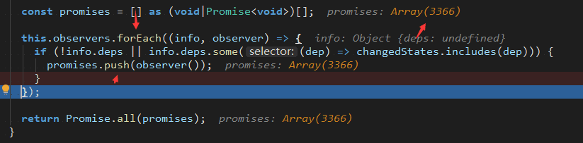
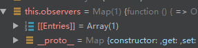

# The Problem

I accidently encountered a problem during the development of the 2.0 version of [simstate](/articles/simstate-and-why): During an iteration of a set of `observers` stored in a ES6 Map, which contained only one element, an infinite loop occurred.



# Investigation

This problem confused me quite a lot. It had been confirmed that this Map had only one element and the element remained unchanged between and inside loops, and the all elements in `promises` array were the same.



My first thought was **data race**. It might be true for other languages with real multi-threading capability, but this is JavaScript: it is single thread only, and so there would be no such concurrent related problems.

Using a function as the key of Map seemed weird for other programming languages, since most Map-like data structure (like `HashMap` in Java, `Dictionary` in C# and `unordered_map` in C++) requires the key to be hashable, and functions are not, at least in the surface. However, MDN clearly states that [any value (both objects and primitive values) may be used as a key](https://developer.mozilla.org/en-US/docs/Web/JavaScript/Reference/Global_Objects/Map). The following code works well, which proves that functions, too, can be used as keys in a Map.

```js
const data = [];
const map = new Map();
function a() { console.log("a"); }
map.set(a, "123");
map.forEach((value, key) => key()); // a
```

# The Root of the Problem

After some investigation, **the call to observer** caught my eyes.

`observer()` will trigger the re-render of observer component and make the updated state available for end-user. To simplify implementation, every time the component is re-rendered, the component will **unsubscribe (delete an entry from a Map) to the stores it subscribes to**, and **re-subscribe (set an entry in a Map) during the render**.

StoreConsumer.tsx omitting some unrelated code

```tsx
export default class StoreConsumer extends React.Component<Props, State> {
  // ...
  instances = new Set<Store<any>>();

  // ...
  private unsubscribeAll() {
    this.instances.forEach((store) => {
      // highlight-next-line
      store.unsubscribe(this.update);
    });
  }

  useStore = <ST extends StoreType<any>>(storeType: ST, dep?: Dependency<ST>): InstanceType<ST> => {
    // ...
    // highlight-next-line
    store.subscribe(this.update, dep);
    // ...
  }

  render() {
    return (
      <SimstateContext.Consumer>
        {(map) => {
          // ...
          // highlight-next-line
          this.unsubscribeAll();
          this.instances.clear();
          return this.props.children({ useStore: this.useStore });
        }}
      </SimstateContext.Consumer>
    );
  }
}
```

Store.ts omitting unrelated code

```ts
subscribe(observer: Observer, dep?: Dependency) {
  // highlight-next-line
  this.observers.set(observer, { dep, shouldUpdate: getChecker(dep) });
}

unsubscribe(observer: Observer) {
  // highlight-next-line
  this.observers.delete(observer);
}
```

**The call to observer (`observer()`), happened during the iteration of the Map, alters the Map itself!**

This is a dangerous action. It has become a common sense not to do so in most programming languages, since it might cause unexpected behaviors, which is exactly what happened here.

In this case, when deleting an entry and re-add an entry during the iteration, even if they are the equal, the item will be **considered as a new item**, which results in an infinite loop.

You may reproduce the case with the following code snippet. Note that since it runs indefinitely, consider running the script in a CLI environment (instead of browser) where you can kill the process to end the execution with ease.

```js
const map = new Map();
function obs() { map.delete(obs); map.set(obs, 1); console.log("obs called"); }
map.set(obs, 1);
map.forEach((value, key) => key());
// endless "obs called"
```

# Conclusion

This is quite a simple problem, and the cause is also easy to understand for most programmers. However, it still confused me for quite a while. After it, I realized that some *bugs* might seem strange and difficult to debug, but it doesn't mean the cause is complicated: sometimes it is the **indirections** on top of all the root that adds to the difficulty. During debugging, it is a good way to track down the code execution flow, and in this process the cause may just reveal itself.
