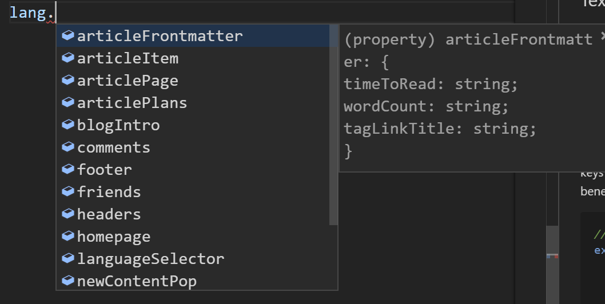
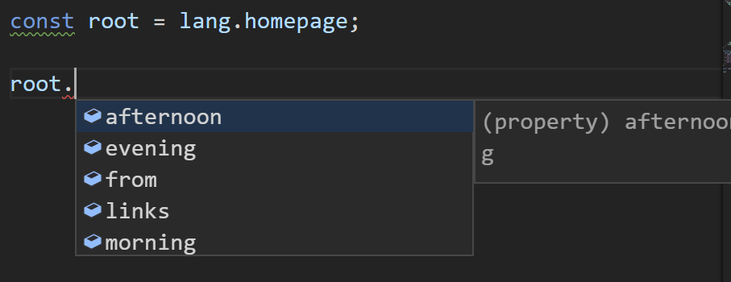

# i18n and The "Raw String" Problem

Internationalization, also known as i18n (18 characters between the leading *i* and trailing *n*), is about making a product friendly to global users, and one of the most important work is to **deliver common contents using different language according to user's preference**. For example, for the same text content `login`, our application should show `login` for English users, whereas `登录` for Chinese users etc.

## Text Placeholder (Id)

One typical technique to achieve it is to use **placeholder** (or **id**) in the places of text contents. During compilation or runtime, these **id**s will be replaced with **localized strings** which are usually defined in dedicated files, each one of these files consisting of all the texts in one language.

## Defining the Mapping from Id to Content

There are many ways to structure a file, and one of them is **nested object**, where the id of a value is all the keys in the path joined with dot(`.`). The nesting structure works as index for a database, which would be beneficial to maintain the file, especially when the number of entries grow.

```tsx
// en.ts, which contains all the texts in English
export default {
  login: {
    button: {
      text: "Login",
    },
  },
}

// cn.ts, which contains all the texts in Chinese
export default {
  login: {
    button: {
      text: "登录",
    },
  },
}

// both language files are isomorphic,
// i.e. have the same structure

// the id for the text content `Login` is login.button.text
```

Another form that is commonly accepted is **plain key-value mapping**, like iOS ([example](https://medium.com/lean-localization/ios-localization-tutorial-938231f9f881)) and ASP.NET Core MVC ([example](https://docs.microsoft.com/en-us/aspnet/core/fundamentals/localization?view=aspnetcore-2.2)), which is just simply, well, an id-to-text mapping.

## Applying the Id

After the mapping has been defined, one way to use the id is to **define a custom component** which **receives an id** and **returns the text content** according the current language setting.

```tsx
// This component receives id and returns the text content.
function LocalizedString({ id }: { id: string }) {
  // get the currentLanguageObject (the object defined above) from anywhere,
  // like React Context, redux store, mobx store, simstate store, or just import it

  // For simplicity, use Ramda to safely get nested value
  return R.path(id.split("."))(currentLanguageObject);
}

// Use the component in the place of raw text content
<Button><LocalizedString id="login.button.text" /></Button>

// Previously...
<Button>Login</Button>
```

## Benefits

It looks promising. By using id, the followings can be easily achieved, which are left as assignments for readers :smile:.

- **Auto update** the text content when language changes
- use the **localized text** where **only string is allowed**
    - and also make it observable
- **String interpolation**
    - insert string or React component into localized text content
    - like `printf("Content %d", anInt);{:c}`
- **Fallback**
    - when current language doesn't define value for a key, use fallback language to provide the text
- **Generate separate pages** for **each languages** in **complie-time**

## The "Raw String" Problem

The biggest problem of this solution is **raw string id**. Without external support from compiler or IDE (like [Angular Language Service](https://angular.io/guide/language-service) whcih supports Angular templates), using raw strings in code is harmful and should be avoided.

- No error check (like typo)
    - increases debugging time
- Hard to refactor the object
- No IDE autocompletion, navigating, and other good stuff
    - have to look up and type the key (which might be very looooog) every time


```tsx
// typo
<Button><LocalizedString id="login.buton.text" /></Button>

// long key
<LocalizedString id="app.header.userIndicator.loggedIn.dropdown.login.button.text" />
<LocalizedString id="app.header.userIndicator.loggedIn.dropdown.username.button.text" />
<LocalizedString id="app.header.userIndicator.loggedIn.dropdown.logout.button.text" />

// What if a key in the path is renamed?
```

# Make it Strongly Typed

By making the call strongly typed, we can avoid raw string in our code and enable the refactors, error checking, autocompletion and other features provided by type inference. However, the following table lists some ways as well as respective weaknesses.

| Solution | Explanation | Weaknesses |
| -- | -- | -- |
| Callback | `<LocalizedString id={(ref) => ref.login.bottom.text} />{:tsx}` | - Affecting performance<br/>- Verbose, especially multiple LocalizedString components |
| Accessing the object directly | `<Button>{lang.login.bottom.text}<Button/>{:tsx}` | - Losing the abilities to **fallback**, **observable**, **string interpolation**... |
| Accessing object with component wrapper | `<LocalizedString id={lang.login.bottom.text} />{:tsx}` | - Losing the abilities to **fallback** |
| Accessing the store (or context) containing language object in the component | `context.language.login.bottom.text{:tsx}` | - Verbose<br/>- Unnecessarily coupled |

The third solution is best of all, but since **it accesses object directly**, it is impossible to *intercept* the chaining call to enable fallback. Besides, designing such a **global variable**(`lang`) that satisfy the need is not an easy work.

# Strongly Typed Id

It seems that using id is the best choice, so is it possible to **generate id by accessing object**? With [Proxy](https://developer.mozilla.org/en-US/docs/Web/JavaScript/Reference/Global_Objects/Proxy) introduced in ES6, it is!

```tsx
// Definition is the type of language object
import { Definitions } from "./definition";

// The wrapper class recording the keys that have been accessed
export class Lang {
  constructor(public paths: PropertyKey[]) { }
}

// The Symbol to access the keys
export const GET_VALUE = Symbol("__get");

// factory function creating proxified Lang object
function factory(langObj: Lang) {

  // The proxy intercepts the object access
  const obj = new Proxy(langObj, {
    get: (t, k) => {
      // if the key is GET_VALUE symbol, return the keys joined with "."
      if (k === GET_VALUE) {
        return langObj.paths.join(".");
      }
      // if not, record the current key and generate another proxified Lang object
      // making the Lang object immutable
      // more on that later
      return factory(new Lang([...t.paths, k]));
    },
  }) as any;
  return obj;
}

// The root proxified Lang object
const lang = factory(new Lang([]));

// Lie to TS compiler
// that lang object is of type Definitions (the type of language object)
// and export the object
export default lang as Definitions;
```

There are also few modifications needed in the LocalizedString component.

```tsx
function LocalizedString({ id }: { id: string }) {
  return R.path(
    // add access to GET_VALUE
    // highlight-next-line
    id[GET_VALUE]
    .split("."))(currentLanguageObject);
}
```

The core idea is to **record the key at every access** using Proxy. By lying to TS compiler about the actual type of the lang, all the type related features are naturally enabled, like the autocompletion showing in the picture below.



By making the proxy object **immutable**, we can introduce a common object containing the **common prefix** without sacrificing type inferenece, resulting in cleaner code, especially when multiple components are needed.

```tsx
// Previously
<LocalizedString id={lang.app.header.userIndicator.loggedIn.dropdown.login.button.text} />
<LocalizedString id={lang.app.header.userIndicator.loggedIn.dropdown.username.button.text} />
<LocalizedString id={lang.app.header.userIndicator.loggedIn.dropdown.logout.button.text} />

// With root object
const root = lang.app.header.userIndicator.loggedIn.dropdown;

<LocalizedString id={root.login.buttom.text} />
<LocalizedString id={root.username.buttom.text} />
<LocalizedString id={root.logout.buttom.text} />

```


# Drawbacks and Conclusion

The benefits of this solution is obvious: **all the aforementional [benefits](#benefits) with type inference**. Therefore, it is wildly adopted in all my projects, including this [VicBlog](https://github.com/vicblog/VicBlog-Gatsby) and my Citi Competition project. On the other hand, it is also worth noting that there are some drawbacks.

- Proxy performance hit
- Too many lang objects and might add to GC burden
- Since the Lang object is immutable and different every time, LocalizedString component might be frequently updated

I believe that type information is important in every periods of programming, including designing, coding, debugging and maintaining, since it significantly helps programmer **avoid stupid bugs** and **reduce the time and frustration** in finding these bugs. Type inference also **increases efficiency** quite radically, since well-designed code can be used as **never-out-of-date docs which are also invaluable in team collabration**. As a result, personally I would prefer strongly typed programming languages and styles and try to use it anywhere possible.
