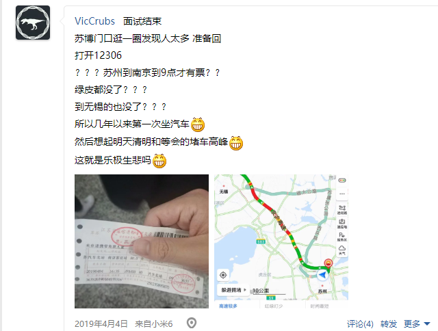

# 介绍

经过几个月的准备、投简历、面试和（最让人难受的）等待，终于在4月16日拿到了**微软苏州STCA SE**的实习Offer。所以在这里记录一下这几个月来所经历过的实习相关的事情，并想发表一下关于实习、关于未来计划的一些思考。

# 面试前

面试前最重要的当然是**刷题**、**选择职位投递简历**。在这次夏季实习之前的2018年底和2019年初，我还经历了一些和微软相关的面试经历。而且，这次夏季实习生的投递简历的过程也是一波三折，在上海和苏州的职位中纠结，最终还是选择了苏州。下图为投递过但最后撤回的职位。

## 2018年底：微软冬季实习

2018年10月份的时候看到了冬季实习的消息（[当时的微信推送](http://mp.weixin.qq.com/s?__biz=MzU1MTU2NjcxMQ==&mid=2247483972&idx=1&sn=f145e95fa8e239730026f76241833071&chksm=fb8e2e5cccf9a74aae92957bc4abd01dec2da4b2868604eaf1d59b5112bf58390776a68d4fd2&mpshare=1&scene=23&srcid=#rd)），感觉非常激动，于是很快就把简历投了上去，选择的职位也是微软苏州STCA的SE Intern。

等了一个月，终于在刚下课的时候等到了来自苏州的一个电话，一接果然是HR，心里非常激动，以为和SAP一样要电面了，可没想到就问了一个可以去的时间，我报了1个月（寒假嘛）后，HR就随便说了说*如果有的话过几天会有HR来通知的*就挂了。然后从同学那里听说这种实习一般都得需要3个月😔，所以就放弃了，最后果然也没有下一步。

## 2019年1月：MSRA和上海Blockchain

之后，在俱乐部邀请两位去过MSRA的学长学姐来介绍实习经历（[俱乐部微信推送](http://mp.weixin.qq.com/s?__biz=MzAxODAzMzczMg==&mid=2659244270&idx=1&sn=84eefec54a126e85853b15714f532000&chksm=80a805c5b7df8cd332704cef69f78060c6f00b787628bebfe2f885569b40f484d75e38787787&mpshare=1&scene=23&srcid=#rd
)）后，学长表示可以内推。心里没忍住，就让学长帮忙内推了MSRA，接下来的事在这篇[面经](/articles/MSRA-DKI-frontend-interview-experiences)中讲的比较清楚，这里就不再说了。这次是我第一次接受比较正式的面试，成功体验到**从自信到自闭**的全过程，最终还收获了宝贵的**我拒了MSRA**的经历。

其实，在这段时间里，我除了投了MSRA，还投过了上海某个**区块链相关**的职位（上图中最后一个）。在拒了MSRA之后我心灰意冷，向和继续在你院浪费半年时间的残酷命运低头，所以过了几天区块链这个职位的HR打来电话问面试时间，我就直接拒绝了面试。

之后迎来了愉快的、本来准备刷题但是最后在家连LeetCode都没打开的寒假。

## 2019年2月：夏季实习投递简历

在寒假后第一个工作日就看到了夏季实习生开始投简历的消息（[当时的微信推送](http://mp.weixin.qq.com/s?__biz=MzU1MTU2NjcxMQ==&mid=2247484256&idx=1&sn=50a28ed30057c6d006c498c348e6f5c0&chksm=fb8e2f78ccf9a66eec2dab0f6aa01076de861e37560fb4161b121c88f4032804ad5021d56699&mpshare=1&scene=23&srcid=#rd
)）。因为刚开学，所以时间比较充足，所以在这次网申开始后，我花了一段时间更新简历，之后立刻开始投简历的。投简历经过了以下阶段。

- **苏州STCA**，**上海C+AI**，**上海C+AI Open Source**

一开始以为可以投多个职位，所以浏览了一下实习列表，除了一定会投的苏州STCA，还发现了上海的两个职位。本来以为上海微软就只有支持，结果发现其实也是有开发岗的。其中普通的C+AI应该和STCA比较相似，但是另一个**C+AI Open Source**的职位吸引住了我。仔细了解后发现这个工作主要是给VSCode写Java扩展……我是VSCode（当然还有其他微软产品，除了Surface）的忠实用户，对这个开源和开发扩展的工作非常感兴趣，于是也把它选上了。

- ~~苏州STCA~~，~~上海C+AI~~，**上海C+AI Open Source**

后来听说**只能投一个职位**。我纠结再三，最后还是感觉在**在MS写开源**和**在MS写Java**听上去非常酷，而且这样也能提高自己**混开源社区**的能力，也可以**避免把自己螺丝钉化**，而且还可以去**体验上海的生活**，所以最后留下了上海Open Source的职位。

- **苏州STCA**，~~上海C+AI~~，~~上海C+AI Open Source~~

结果又没过几天就听说有学长可以帮忙**内推**。这可难办了：内推可以直接**免掉笔试**，而我之前对MS的笔试（好吧那是2015年……）的印象是：*不会做*。而且不仅当时的我不会做，现在的我也不会做啊……虽然刷了一段时间的题但是还是深知自己算法有多么的弱鸡（不管是从自己做题的要死要活的感受以及和同学比较），所以**免笔试**对我来说是个巨大的诱惑；但是学长**只能内推STCA**，而上海的是C+AI，这是两个大组，不能互推。又纠结再三，追求稳妥的我最后还是选择了**先上车再说**，留下了苏州STCA的申请。有关苏州还是上海这一点，文章最后还会继续讲。

## 刷题

当然了，投简历不重要，在面试前的这段时间里最重要的是**刷题**和**准备面试**。而MS的**面试=做题**（这一点请看下面面试部分），所以面试前的准备就是两个字：

**刷题**。

刷题的感觉每个人都不一样，对我来说刷题就是两个字**痛苦**。几乎每遇到一个题我大脑都是空白的状态，即使刷过50、100、150题以后也是如此；给自己安排的配额是**每天5道**，确实发生过很快就能解决5道的情况，但是那是少数，大多数时候都是**2小时2道medium，每道题一段时间后想不出来就忍不住看Solution，之后心态爆炸准备找3道easy水过，结果被easy难住……**；其他同学刷个几十道甚至几道就能在面试场上游刃有余，拿到新题至少有个思路不会惊慌失措，而我甚至在刷了下图这么多题后看到新题仍然是一脸懵逼，心里发慌；更别提其他人刷题就是放松、“找到真正的快乐”，而对我就是折磨……

总之，这段刷题经历让我终身难忘，也是我最后选择**先上车再说**的原因：我确实是不想再经历刷题的痛苦了……

PS: 在4月的时候看了下微软笔试题，发现当时选择内推是正确的，也证明了我对自己的认知没有错。

# 面试

3月1日结束了投简历的环节，然后就边刷题边焦虑地等面试。终于在**3月12日**收到了一封现场面试邀请，确认自己有空的时间后在**3月18日**收到了**3月20日**面试的通知。生日面试可真刺激。第一次面试包含**两轮**面试，两轮都基本就是**在白板上做算法题**，每轮1个小时，听学长说，只要过一轮就会又三面。

## 第一轮

第一轮的面试官把我从楼下带到面试房间后，随便寒暄了几句就开始做题。第一轮的题目是这样的：

> n个人，以i,j元组代表i关注j. 输入关注关系的数组（例如`[(1,2), (2,3)]`表示用户1关注用户2，用户2关注用户3），且认为每个人自己关注自己。计算所有人的被直接关注和间接关注的人数（比如i关注j，j关注k，那么i间接关注k，k的被关注量为3）

这个题目的做法是**DFS**，即对每个用户（比如说`i`），寻找`(k, i)`出现的个数，然后对每个`(k, i)`，寻找`k`的关注量。用一个Boolean数组表示一个用户是否被访问，从而解决环的问题。最终写出来的算法和图的DFS遍历比较相似。

看起来很简单，都知道是DFS，但是当时不知道脑子怎么抽了想的是带回溯的DFS……然后卡了40分钟没想出来怎么处理环，最后面试官（应该是看不下去了才）来提醒了一下不带回溯，并指出来哪些行要改，但是我还是直到最后一分钟才做出来……由于是在MS办公楼一个小房间里里做的，当时卡住的时候紧张地满身大汗，话都不想说了……这种情绪还是得控制一下才好。这轮根据面试官的反应和个人感觉应该是挂了的。

## 第二轮

面完第一轮已经一个小时了，于是休息了几分钟就迎来了第二位面试官。和第一位不太一样的是，第二位面试官一开始还问了20分钟左右的项目经历。我趁势推广了我的博客，面试官在我博客上看到了[An Infinite Loop Caused by Updating a Map during Iteration](/articles/an-infinite-loop-caused-by-updating-a-Map-during-iteration)这篇文章，就饶有兴趣地让我讲讲这个bug以及怎么发现它的。这个部分我个人感觉讲的不错（毕竟算法题这么屎的我还敢面试MS的原因是我项目经验应该还不错吧……），面试官的反应也不错，这让我稍微放松了一些。

之后，还是得做题。这轮面试第一题是这样：

> 在二叉搜索树中，按照节点值的大小顺序，找一个节点的上一个节点。

这个题比较简单，因为对二叉搜索数进行**中序遍历**，其结果的顺序就是从小到大的。所以这个题最简单的做法就是**先做一个中序遍历，将结果存储到数组中，然后在数组中查找要查找的节点。**。

很明显这不是最优的，果不其然面试官要求进行优化。一个简单的优化是**只记录前一项（而不是保存之前所有的节点），在中序遍历中，首先检查当前节点是不是要查找的节点。如果是，则返回前一项；否则，将当前节点记录下来，然后继续遍历**。

以上两个思路可以参考[LeetCode 173](https://leetcode.com/problems/binary-search-tree-iterator/)。之前的两个写法都是用递归的，所以面试官到这里又继续问，能否将递归改成循环。这个也是个比较套路化的做法，背下来就可以了，也可以自己写几个递归算法然后尝试用栈把递归改成循环，可以参考[LeetCode 94](https://leetcode.com/problems/binary-tree-inorder-traversal/)的Solution。值得一提的是我不知道在这里又出什么问题了，又以为碰上了第一轮一样的错误（环），然后又开始纠结，紧张地满身大汗，话都不想说了。当时心里全想的是完了，然后又立刻安慰自己没过还有其他出路……不过还好，稍微冷静下来后仔细看了下代码发现自己纯粹是没事找事，所以就直接给面试官看了。

这个题到这里就结束了。之后面试官又出了一道题：

> 二叉树中，输入两个节点，检验两个节点是不是同深度但异父母。

这个题最简单的思路就是**寻找从根节点到两个节点的路径，然后比较路径的长度和路径的倒数第二项（即节点的父节点）**，也可以采用BFS的思想。

这个题做了之后就让询问面试官一些问题后就结束了。

## 结束一二面后

这一二面还是比较刺激的，随便两道题就将我算法弱鸡的本质毫无保留地暴露出来。这时的心情还是比较**复杂**的：一方面第一面表现实在是太差了，但另一方面个人感觉第二面地表现应该还是可以接受地，面试官的反应应该也比较正面，再加上两面过一面就可以三面，所以还是有希望的。

令人喜悦的是**3月21日**就收到了三面的安排邮件，确认时间后在**3月29**日收到了**4月4日**三面的邮件。还是从学长那里了解到三面的形式不一，可能又会做题，但也可能只聊天。但是我当时已经松懈了，再加上考试的压力，我就没有继续准备了，准备自由发挥，认命了。

## 三面

4月4日前去三面，是和另外一批内推的同学一起面试。他们一天面完三轮，而我们先面了两轮的，这次去只用面试最后一轮就可以了。

见到面试官后，面试就直接开始了。一开始它看我简历，就直接问我React的一些问题，例如

- 三个框架的区别
- 为什么用React（API简单，概念简洁）
- React和Vue检测数据变化的方式更喜欢哪一个（当然是有利有弊了）

后面还看我简历上提了`ASP.NET Core`，又问了`ASP.NET Core`中Request进来到Controller总共经历了哪些步骤。这谁顶得住啊.jpg……只好在脑子里扒两年前用`ASP.NET Core`时的一些技术细节，然后支支吾吾说了个Filter……还好面试官接受了我`ASP.NET Core`就xjb用用的说辞，就没有继续往下问了。

然后又进入了喜闻乐见的刷题环节。这次两道题都是LeetCode原题。第一题[LeetCode 26](https://leetcode.com/problems/remove-duplicates-from-sorted-array/)，题目是：

> 删除排序数组中重复元素

这个的思路就是双指针，**如果两个指针的值相等，就把第二个指针后面的所有数据往前移；如果不相等，两个指针都+1**。

写出来之后，还要写几个测试用例。由于当时还没经过czy老师的教导，就只能凭感觉瞎写了几个。面试官看来也不准备继续在测试用例耗时间，就出了第二题：[LeetCode 10](https://leetcode.com/problems/regular-expression-matching/)：

> 带. *，不带括号的正则表达式匹配。

看到这个我又惊又喜：惊的是这个题在LeetCode上可是Hard题啊；喜的是这个题我还是认真做过，现在还记得思路。根据心里还记得一些思路，用最简单的递归（没有DP）将代码写了出来。面试官似乎有点不太熟悉这个做法，他说他本来想让我写状态机。他一提到状态机，我就想到了编译原理的词法分析的过程，想到了**正则表达式中序转后序**->**后序表达式转NFA**->**NFA转DFA**->**使用DFA分析字符串**的过程，心里一阵发毛：谁tm能现场写这么多，这谁顶得住啊.jpg * 2。之后就和面试官说，这个用状态机比较复杂，然后就DFA、NFA、闭包啥的吹了一通，面试官可能看时间有点来不及了就没让写了）。

最后还是问了问问题，了解到这个面试官是在MS做Microsoft 365企业应用的，前端正好就用的React + TypeScript（可能这是为什么他来面试我的原因把），后端使用的是`ASP.NET Core`，他们还在用[Microsoft Bot Framework](https://dev.botframework.com/)做一些聊天的应用。正好我都有点熟悉，于是和面试官聊了聊这几个技术，现场气氛十分愉悦。

## 三面后

三面结束后感觉还是比较放松的，毕竟题目都做出来了，聊天也没啥问题，感觉没啥理由挂我）。中午微软包了饭（果然还是微软特色：盒饭），没想到居然遇到了二面面试官……闲聊了几句，比如什么面试情况，微软的工作时间，听说微软的工作时间一般945或者1055的时候感觉**这也太棒了吧.jpg**，尤其是在现在到处996的情况下，真的是一股清流。

吃完饭等了一会，下午1点多HR找到我说面试官的反馈还是比较positive的，虽然不能肯定但是offer应该是稳了。非常膨胀，以至于忘了第二天清明节还不提前买票，然后（再次）体验了一把4个半小时的汽车。

# Offer

清明节后第一天收到了面试通过邮件，又过了一周正式收到了Offer，又过了几天收到了分组名单，我分在了Office 365的部门。

# 感想

到这里我的春招应该就结束了。接下来要做的事情比较简单：

- **和SAP提出离职**

讲道理，SAP真的是良心企业，不仅是955，各种岗前培训也表明了SAP是真心实意把候选人当作人才来培养的，就这样走了还真的感觉有点对不起SAP）。希望还有学弟学妹们把握住机会。

- **在第三学期各个课程的轰炸中存活**

czy，zh，4门课3个组队4个大作业，zh四个pre五个报告，测试上三节课就机考，微笑。

但是**每个阶段都有不一样的问题**：面试的问题解决了，一些之前搁置的问题又重新变得突出了：

- **工作**还是**保研**

这个问题纠结了我很久。读个研，用两年时间换个学历，不知道到底有多么重要。学历对我来说倒不是为了什么得到更好的工作（读了研最后不还是这些工作？），也不是薪资的问题（有的公司研究生起薪比本科生高，但是微软不是），而是**退路**问题。

一直说计算机行业不怎么看学历，但是个人感觉这只不过是计算机行业发展前期**供小于求**的劳动力供应情况造成的。这几年计算机行业人才井喷，劳动力供应飞速增长，可是随着行业结束野蛮发展的状态，劳动力需求增长减缓，甚至不增反降。作为一个硬指标和门槛，学历的重要性肯定会提高，甚至不排除发展成金融行业那样的情况。如果以后微软凉了（外企护城河再深，效率再高，国内企业在各种政策、情怀和奋斗比加持下，并不是不可能动摇外企目前看似坚固的业务的根基；再加上国内越来越加深的“国产情怀”，以及国内各种保护政策，微软等外企在国内业务凉掉的可能性并不是不存在），得重新出去找工作的时候，有可能在学历关就被刷掉。这就非常难办了。

但是从个人角度来说，由于各种原因（特别在你院的三年），我确实不想再呆在学校，更加期望能够投入工作，做一些真正有用的东西。就像在[我的关于](/about/me)里说的那样，我还是希望我的工作能够有利于对其他人有用（这也是我喜欢微软的一大原因，[Make Other People Cool](https://www.forbes.com/sites/adrianbridgwater/2019/02/12/microsofts-power-platform-aims-to-make-other-people-cool/)），能够帮助他人提高工作效率，并且做一些自己真的想做的事情，而不是在学校里(这里省略一些字)。

感觉目前来说这个问题还是只能先去实习，亲身感受下工作的环境后再定。

- **上海**还是**苏州**

之前更加喜欢苏州，并不是因为苏州的自然人文环境等（个人确实不太care这些），而是因为苏州的生活成本和最重要的**房价**。除了这个方面，在其他例如**发展前景**（不太看好苏州发展前景，毕竟有个上海，纯个人想法请不要因为这个点撕我）、**新事物的应用**、**机遇**、**资源**（比如说对后代）等其他方便，上海不仅现在更好，以后也只会更好不会更差。

但是对于生活成本这一点，最近查了查上海和苏州房价的对比，发现苏州并没有想象中的那么便宜。当然上海整体会更高，但是上海稍偏远一点的地方的房价和苏州贵一点的地方的相比也并没有离谱到哪儿去。再加上上海的薪资会比苏州高，所以其实这个选择还不是那么容易做的。

目前的打算还是先在苏州实习，在实习过程中更多地了解一下两个城市地情况和转正上海的事情。

# 总结

不管怎样，我的微软实习申请部分到现在就结束了，现在最重要的工作是在这学期的课程轰炸下存活，同时也要在以后找个时候重新开始算法题，毕竟转正面试也是要考算法题的嘛。
