# 0. 作者

| 学号      | 姓名   |
| --------- | ------ |
| 161250010 | 陈俊达 |
| 161250002 | 蔡蔚霖 |
| 161250060 | 李培林 |
| 161250199 | 张凌哲 |

# 1. 简介

在本报告中，我们使用MVC、MVP、MVVM和FRP分别实现了一个Android局域网群聊应用，并通过分析在使用这四个架构实现应用功能的过程中每个架构所表现出的特点，来分析每个架构自身的优点和缺点。

# 2. 项目说明

项目地址：https://github.com/ddadaal/android-chat-in-4-patterns

项目可直接使用Android Studio打开，需注意Android Studio应安装有lombok插件（[安装教程](https://projectlombok.org/setup/android#android-studio)）。本项目分为3个模块 ：app, server, shared。三个模块的说明如下表：

| 模块     | 作用                       | 启动方式                                      |
| -------- | -------------------------- | --------------------------------------------- |
| `app`    | Android应用部分            | 使用模拟器或者实机打开                        |
| `server` | 聊天服务器端               | 直接运行`nju.androidchat.server.ChatServer`类 |
| `shared` | 包含有服务端和客户端公用类 | 不启动                                        |

## 2.1 应用需求

为了展示各个架构在实现功能的过程中的特点，我们将需求分成**基础需求**和**扩展需求**。

### 2.1.1 基本需求

服务器

1.	建立与多个客户端的连接
2.	接受任何一个已连接的客户端发送的消息，并发送到其他所有客户端

客户端

1.	发起到服务器的连接
2.	接受用户输入文字信息
3.	发送文字信息到服务器
4.	接受服务器文字信息并显示

### 2.1.2 扩展需求

| 功能编号 | 实现的功能点简介       | 功能详细介绍                                                                                                                             | 使用架构 | 使用本架构的代码实现                                                                                                                              | 相对于上一个架构的优点                                         | 使用此架构实现本需求点的不足之处                                                                                                                                         | 更好的架构 | 更好的实现                                                                                                                                                                                                            |
| -------- | ---------------------- | ---------------------------------------------------------------------------------------------------------------------------------------- | -------- | ------------------------------------------------------------------------------------------------------------------------------------------------- | -------------------------------------------------------------- | ------------------------------------------------------------------------------------------------------------------------------------------------------------------------ | ---------- | --------------------------------------------------------------------------------------------------------------------------------------------------------------------------------------------------------------------- |
| 1        | 增加消息记录云备份功能 | 增加一个界面，界面中有一个按钮，点击按钮后将本地的消息记录发送到某个云服务器                                                             | MVC      | 增加一个Activity，Activity连接一个Controller。当用户点击备份按钮后，Activity将备份请求转发给C，C转发给M，M发起网络请求，且在结束后通知V修改界面。 |                                                                | 当按下按钮后View无法及时响应（M还在等待响应，没有通知V数据变化）                                                                                                         | MVP        | P能够控制V（对比C不能控制V），所以当V（Activity）将备份请求给P时，P可以控制V进行及时的、恰当的显示（比如显示备份中字样）                                                                                              |
| 2        | 撤回消息               | 某个客户端的用户选择一条消息撤回（只能是自己发的消息），其他用户的客户端上，如果该消息存在于浏览页面，这一消息会被置换为“该消息已被撤回” | MVP      | 在P和V中都增加处理逻辑，P中当接受到撤回消息的请求时，调用V的撤回消息方法；V的响应方法中，将对应消息文本框的text设置成“已撤回”                     |                                                                | 需要同时修改P和V。当业务逻辑复杂时（例如说一个消息可能具有很多状态（撤回也可以考虑成一个消息的状态）每个状态都需要在UI上进行特殊显示时），P和V可能需要增加很多处理函数。 | MVVM       | 将消息状态和界面进行双向绑定，修改消息ViewModel的状态就会同时更改界面中对象消息的状态，不需要单独的逻辑处理。同时也可以把界面上的输入框和某个属性进行双向绑定，减少UI事件处理的代码。（这个其实可以算一个单独的功能） |
| 3        | 过滤脏话               | 当客户端接受到信息时，根据预设的脏话列表（表现为正则表达式数组）匹配信息内容，如果匹配到信息里包含脏话，则信息修改为***                  | MVVM     | 修改在VM和UI组件的绑定处理函数中（就是，当VM改变时UI应该怎么改变），增加判断逻辑。若包含脏话，则将显示的信息设置为***                             |                                                                | 需要修改逻辑。若逻辑更加复杂，则可能使此绑定函数过于冗长，难以维护。                                                                                                     | FRP        | 将接受到的信息看作一个流，增加判断逻辑只是在这个流上增加过滤函数而已；增加逻辑也只需要增加过滤函数而不是修改已有逻辑                                                                                                  |
| 4        | 限制用户发送消息频率   | 限制用户在1s中只能发出一条信息，消息发送后1s内不允许发送。                                                                               | FRP      | 将用户发送信息也考虑为一个流，使用throttle对发送消息函数进行节流                                                                                  | 只需要增加流处理函数，不需要修改已有逻辑，也不需要手动写计时器 |                                                                                                                                                                          |            |                                                                                                                                                                                                                       |


## 2.2 实现说明

1. 使用Java语言
2. 所有客户端和服务器运行在同一台机器，使用Socket通信

在实际实现中，我们将采用以下形式：
1. 首先使用MVC，MVP，MVVM和FRP四种架构分别实现基础需求
    - 初始设计中考虑所有功能点的前置条件
        1. 功能1：客户端本地已经保存消息记录
        2. 功能2：需要项目配好junit，MVP中P对M和V应该是依赖接口，而不是依赖具体类
        1. 功能3：需要区分不同的请求类型；每个接受到的信息可以独立修改
        1. 功能4：倒是没有特殊的前置条件
        1. 功能5：倒是没有特殊的前置条件。
        1. 作业1：每个接受的的信息用单独的容器显示，而不是在一个TextBox里修改其文本（和功能3比较类似）
        1. 作业2：同上
        1. 作业3：这个让他们自己改吧
2.	复制1次MVC的原始代码（称为MVP-0），在复制的MVC代码中实现功能1
    1. 实现了功能1的MVC代码编号为代码MVC-1
3.	复制2次MVP的原始代码（MVP-0），在第一份MVP代码中实现功能1，第二份实现功能2
    1. 实现了功能1的MVP代码编号为代码MVP-1，和MVC-1形成对照
    1. 实现了功能2的MVP代码编号为代码MVP-2
4.	复制2次MVVM的原始代码（MVVM-0），在第一份代码中实现功能2，在第二份代码中实现功能3
    1. 实现功能2的MVVM代码编号为代码MVVM-2，和MVP-2形成对照
    1. 实现功能3的MVVM代码编号为代码MVVM-3
5.	复制2次FRP的原始代码（FRP-0），在第一份代码中实现功能3，第二份代码中实现功能4
    1. 实现了功能4的FRP代码编号为FRP-3，和MVVM-3对照
    1. 实现了功能5的FRP代码编号为FRP-4

## 2.3 应用使用

系统使用配置文件确定**在登录后要进入哪个Activity**（称为**目标Activity**）。

要修改登录后进入哪个窗口，修改`app/assets/config.properties`文件中`chat_activity`为对应的类名。可选的类名有如下格式：
> `nju.androidchat.client.{架构: mvc|mvp|mvvm|frp}{编号: 1|2|3|4}.{架构: Mvc|Mvp|Mvvm|Frp}{编号: 1|2|3|4}TalkActivity`

例如：要进入之上提到的**实现了功能3的MVVM代码**，应将其修改为

> `nju.androidchat.client.mvvm3.Mvvm3TalkActivity`

要启动应用，设置好**目标Activity**后，应首先启动Server。等Server启动完成后（显示下图的字样即启动完成），再使用Android Studio运行多个客户端。

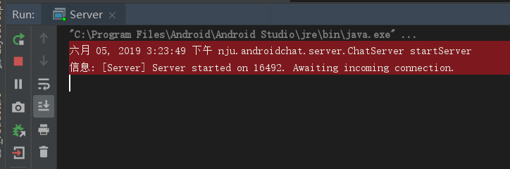

当客户端启动成功后，输入用户名后点击登录按钮进行登录。要注意多个客户端不能使用同一个用户名，否则登录时将会报错。

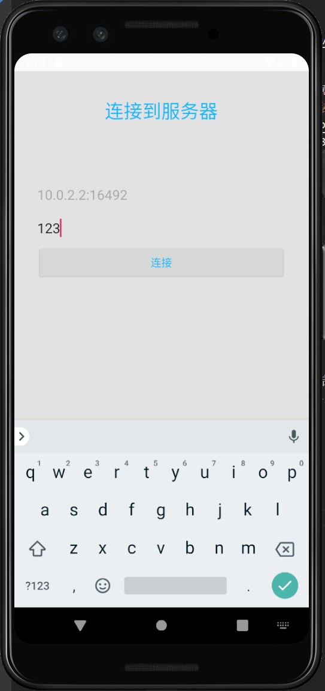

进入主界面后，输入信息点击发送即可将信息发送出去。本机发出的信息显示在右边，其他用户发送的信息显示在左边。

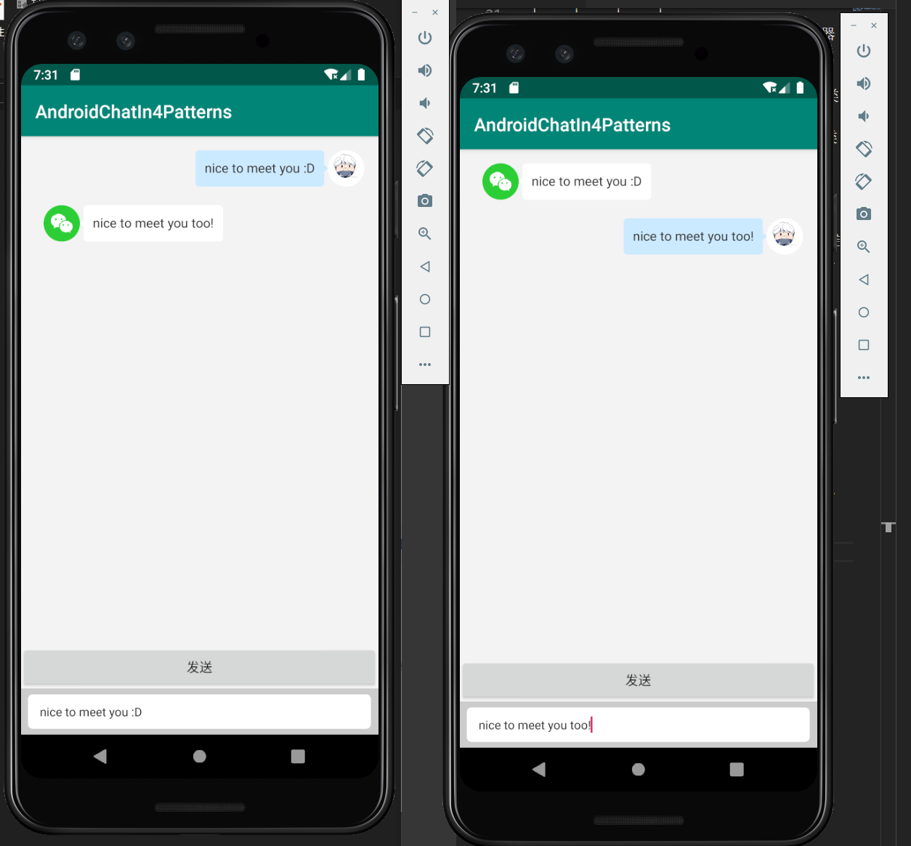

通过修改**目标Activity**，可以尝试各个功能的效果。各个功能的效果gif图可以在下文介绍实现每个功能时看到。

# 3. Android代码和界面交互

首先，我们得搞清楚在Android中，逻辑代码是如何与界面进行交互的。

在Android中，逻辑通过**Java代码**进行编写，而界面中的元素通过**XML**进行定义。在Java代码中，可以通过**findViewById**方法，找到某个元素对应的对象，并进行操作。

例如说，以下XML代码在界面中定义了一个`EditText`组件，并通过`android:id`属性定义其ID为`et_content`。

app\res\layout\activity_main.xml, 57-68

```xml
<EditText
    android:id="@+id/et_content"
    android:layout_width="match_parent"
    android:layout_height="match_parent"
    android:background="@drawable/message_shap_chat_bg"
    android:imeOptions="actionSend"
    android:maxLines="1"
    android:minHeight="36dp"
    android:paddingStart="13dp"
    android:textSize="13sp"
    />
```

这样，在代码中，我们就可以通过`findViewById(R.id.et_content)`获得此控件的实例，并进行交互（例如订阅事件功能）。

app\src\main\java\nju\androidchat\client\mvc0\Mvc0TalkActivity.java, 43-45

```java
// Input事件处理
EditText editText = findViewById(R.id.et_content);
editText.setOnEditorActionListener(this);
```

在代码中也可以通过直接实例化控件的实例，来生成一个新的界面元素，并通过其他控件暴露的方法（例如说`LinearLayout`提供的`addView`方法）将新生成的界面元素增加到界面中。

app\src\main\java\nju\androidchat\client\mvc0\Mvc0TalkActivity.java, 57-71

```java
LinearLayout content = findViewById(R.id.chat_content);

// 删除所有已有的ItemText
content.removeAllViews();

// 增加ItemText
for (ClientMessage message: messages) {
    String text = String.format("%s", message.getMessage());
    // 如果是自己发的，增加ItemTextSend，并传入撤回请求事件处理
    if (message.getSenderUsername().equals(model.getUsername())) {
        content.addView(new ItemTextSend(this, text, message.getMessageId(), this));
    } else {
        content.addView(new ItemTextReceive(this, text, message.getMessageId()));
    }
}

```

这样，我们实现了代码和界面的交互操作。

## 3.1 一个Activity的职责

一个典型的Activity需要负责以下两个部分的工作：

- 处理界面中的事件（例如上面处理的`EditText`的`onEditorAction`事件）
- 业务逻辑的操作

app\src\main\java\nju\androidchat\client\mvc0\Mvc0TalkActivity.java, 115-118

```java
// 界面操作：发送按钮点击事件处理
public void onBtnSendClicked(View v) {
    // 界面操作，隐藏键盘
    hideKeyboard();

    // 业务逻辑操作，发送文本
    sendText();
}
```

## 3.2 问题

如果我们把所有的事件处理代码和业务逻辑操作都堆在Activity中，很容易就造成Activity的代码堆积。

为了解决这个问题，人们提供出了Model-View-Controller架构，即MVC架构。

# 4. MVC架构

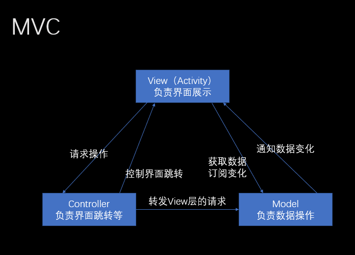

在MVC架构中，**界面相关的代码**和**业务逻辑相关的代码**被分开，分别放在View和Model中。而在Android开发中，View即我们之前提到的Activity。他们三者之间的关系如上图所示，即

- Model负责维护业务模型数据，并进行实际的业务逻辑操作
- View通过观察者模式，从Model中获得数据并订阅其中的数据变化；View要进行事件处理时，通过Controller进行中转。
- Controller将会负责多个View之间的跳转，以及将View层的数据请求转发到Model中。

具体来说，如果我们通过MVC架构实现发送消息这个功能，其数据流应该如下图所示。其中，左边（后缀为1的MVC）为发送者，右边（后缀为2的MVC）为接收者。

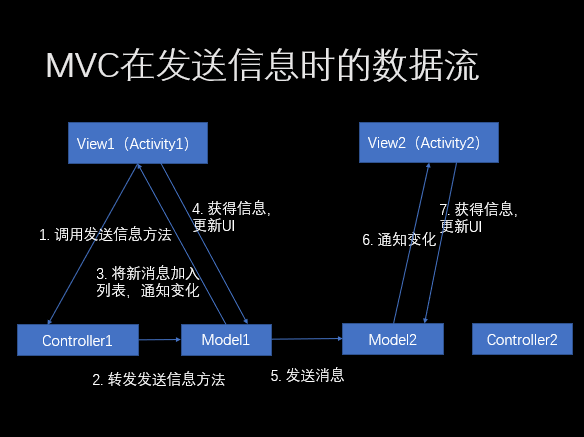

通过这样，

- 界面代码和业务逻辑代码被分离，避免了Activity代码爆炸
- 各个部分也能独立修改，展示的修改不影响业务逻辑部分的代码

## 4.1 问题

根据MVC的数据流图，我们应该注意到一个问题：**界面控制不灵活**。

在传统MVC中，V只能因为M变化而变化（C只能控制V的跳转）。当M的操作**很快**就能完成的时候，V也能很快获得响应；但是如果M的操作**不能很快完成（异步操作，耗时操作）呢？**

## 4.2 扩展功能1：消息备份

我们尝试使用MVC架构实现扩展功能1：消息备份。

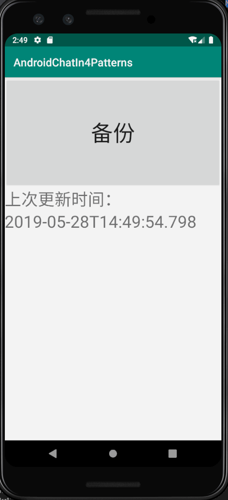

消息备份是一个全新的界面，在这个界面中，上面有一个大按钮**备份**。当点击备份后，系统将会发送一个异步HTTP请求（在真正的实现中，用Thread.sleep）代替。在请求进行中，View的界面请求结束后，将会在界面中显示上次更新时间。

根据MVC架构，我们可以很容易地画出如下的数据流图。

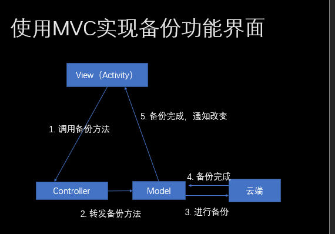

看起来非常的正常，但是我们思考一个问题：**当Model正在进行3. 备份操作时，View如何进行响应？**

就像我们之前所说的，在MVC中V的改变只能由M引起。但是当M没有被修改时，V也无法改变。对于耗时操作，这样就不能及时给用户进行响应，严重影响用户体验。

你可能会说：我们可以将此“正在备份”的状态**也考虑为一种数据**，然后在Model中，在发起HTTP请求之前，我们先修改这个**数据**，引发View改变。根据这个思路的代码实现可以参考代码中`mvc1`下的`Mvc1Backup(Activity|Controller|Model)`三个类，在报告中就不再赘述。

这样的实现的问题在于：

> 这个“正在备份”的数据**和界面相关**，却放在了**应该只处理业务逻辑的Model中**。

现在，我们发现界面似乎并不能直接和业务模型进行一一对应：界面中的数据和业务模型的数据是不太一样的。所以，人们提出了MVP架构。

# 5. MVP架构

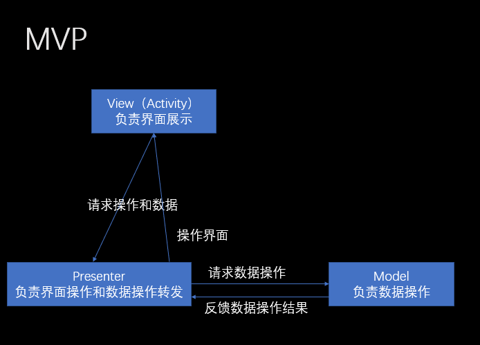

在MVP架构中，负责界面的View和负责数据操作的Model已经不再有直接的联系：他们之间的操作均通过一个专门的Presenter进行转发和处理。Presenter取代并加强了原来Controller的地位：Presenter现在除了要转发View层的操作，还能够直接控制界面层进行界面的修改，还负责给View提供数据进行显示。除了Presenter的引入，View和Model的职责和MVC一致。

使用MVP架构实现的消息备份功能的数据流图如下。注意，在发起**3. 请求备份操作**之前，P已经控制V显示正在备份的数据。

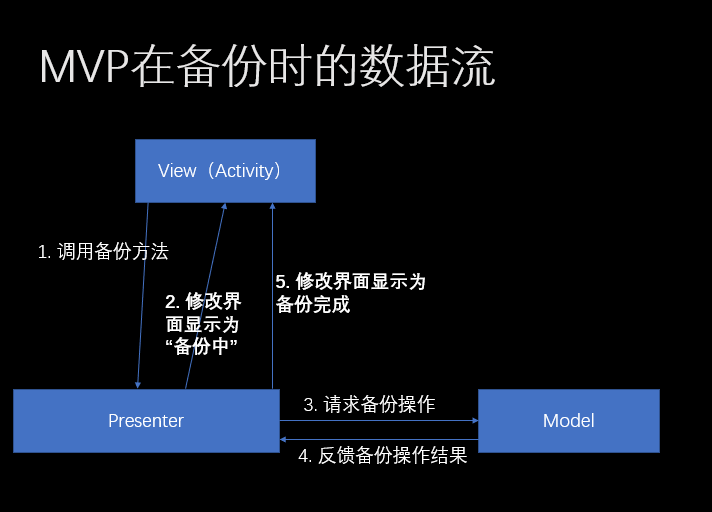

## 5.1 优点

通过设置一个专门的Presenter，之前所提到的MVC的**界面控制不灵活**的问题得到了很好的解决。Presenter在进行耗时操作之前，可以首先控制View修改界面，这样**减小了界面的控制粒度**，使控制界面更加的灵活。

同时，Presenter的引入也让**界面和数据完全地解耦**，使一方的修改可以不影响另一方。

最后，如果我们将MVP之间的控制也全部接口化（即Presenter是控制View接口，而不是实际控制某一个特定的View），我们也让View和Presenter的**重用**变为了可能。在我们的MVP0代码中，所有M，V，P都是通过接口调用而交互的，而这样一份MVP的接口定义又叫做一个合约（Contract）。这样，界面和数据进一步解耦，增强了可重用性和可测试性。

app\src\main\java\nju\androidchat\client\mvp1\Mvp1Contract.java，8-28

```java
public interface Mvp1Contract {
    interface TalkView extends BaseView<TalkPresenter> {
        void showMessageList(List<ClientMessage> messages);
    }

    interface TalkPresenter extends BasePresenter {
        void sendMessage(String content);

        void receiveMessage(ClientMessage content);

        String getUsername();

        //撤回消息mvp0不实现
        void recallMessage(int index0);
    }

    interface TalkModel {
        ClientMessage sendInformation(String message);

        String getUsername();
    }
}
```


## 5.2 扩展需求2：撤回消息

我们再引入一个新的扩展功能：撤回消息，并使用MVP架构来实现它。这个功能的需求是这样的：

> - 长按一个消息，弹出撤回确认框；
> - 撤回消息后消息内容被替换为“已撤回”。

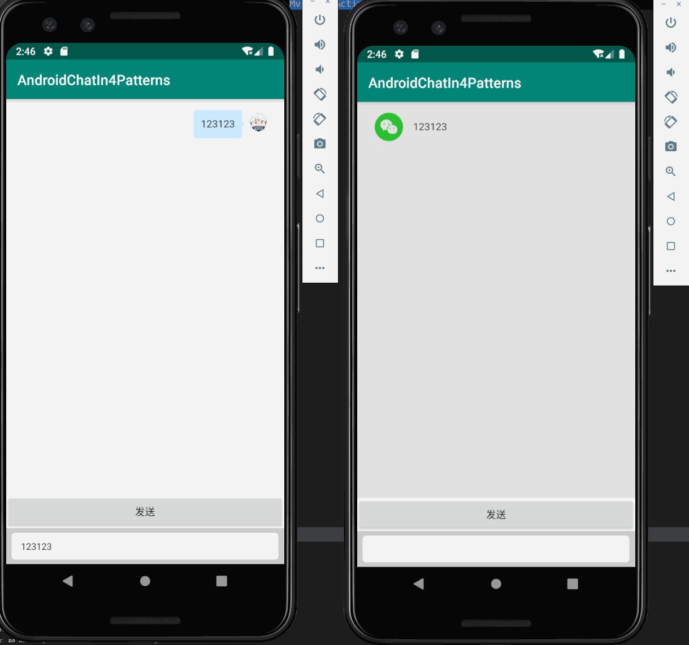

使用MVP架构实现的此功能，其数据流是这样的：

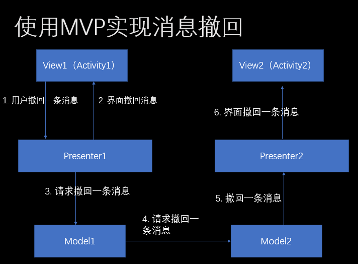

其Presenter的代码是这样的，请留意我其中的注释，再想想我们MVC尝试解决的问题是什么。

app\src\main\java\nju\androidchat\client\mvp2\Mvp2TalkActivity.java，40-57

```java
@Override
public void recallMessage(UUID messageId) {
    // 操作界面
    List<ClientMessage> newMessages = new ArrayList<>();
    for (ClientMessage clientMessage : clientMessages) {
        if (clientMessage.getMessageId().equals(messageId)) {
            newMessages.add(new ClientMessage(clientMessage.getMessageId(), clientMessage.getTime(), clientMessage.getSenderUsername(), "(已撤回)"));
        } else {
            newMessages.add(clientMessage);
        }
    }
    this.clientMessages = newMessages;
    this.iMvp2TalkView.showMessageList(newMessages);

    // 操作数据
    this.mvp2TalkModel.recallMessage(messageId);
}
```

## 5.3 问题

> Presenter既负责操作界面，又负责数据操作。

你是不是对这句话感到很熟悉？我们MVC架构不就是来解决这个问题的嘛！为什么它又回来了？以下代码是使用MVP架构实现的消息备份界面的备份功能的代码，你能在这里面看到Presenter是如何既操作界面，又操作数据的。

app\src\main\java\nju\androidchat\client\mvp1\Mvp1BackupPresenter.java，12-23

```java
@Override
public void backup() {
    // Presenter首先修改界面显示
    this.backupView.editBtnStatusAndText(false, "正在备份");

    // 再进行数据操作
    this.backupModel.backup();

    // 数据操作结束后，将界面改回来
    this.backupView.editBtnStatusAndText(true, "备份");
    this.backupView.editTextView(this.backupModel.getLastUpdated().toString());
}
```

这就造成了，如果我们需要在一个数据被修改的时候**同时操作多个地方的界面**，那么Presenter中就必须**过程式地（imperative）**一条一条地描述要做的工作，当逻辑复杂时，非常容易出错。

另外，虽然Model和View没有互相耦合了，但是**Presenter耦合Model和View**，这就造成Model和View被修改（如果MVP之间是使用接口通信的话，那就是接口被修改），那么Presenter也必须进行相应的改变。

## 5.4 数据和界面的关系

我们现在考虑一下MVP和MVC中**数据**和**界面**的关系：

| 架构 | 界面数据来源            | 产生的问题     | 数据修改如何反应到界面上              | 产生的问题            |
| ---- | ----------------------- | -------------- | ------------------------------------- | --------------------- |
| MVC  | 业务模型数据            | 界面控制不灵活 | 观察者模式，自动修改界面              | 无                    |
| MVP  | 经过Presenter处理的数据 | 无             | Presenter过程式（imperatively）地修改 | Presenter职责过于繁重 |

我们自然能想到，如果有这样一个架构，那么我们就同时有了MVP和MVC的优点，并避开了它们各自的缺点：

| 架构 | 界面数据来源                           | 数据修改如何反应到界面上 |
| ---- | -------------------------------------- | ------------------------ |
| ?    | 某个经过处理的数据（称为**界面数据**） | 自动                     |

幸运的是，我们确实有这样一个架构，它叫做MVVM。

# 6. MVVM架构


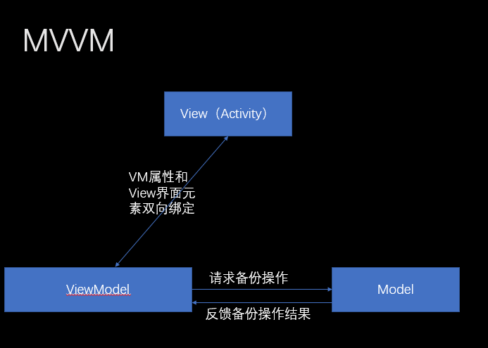

在MVVM中，VM和M的交互则和M和P中的交互没有变化。但是我们使用了一个叫ViewModel的东西替代了原来的Presenter。ViewModel包含某个View需要的数据，需要处理View业务处理请求。除此之外，也是最精彩的地方，

> ViewModel和View进行**双向绑定**：当ViewModel改变的时候，View对应的界面元素**自动**更新；当View改变的时候，ViewModel的数据也**自动**更新。

请注意上文段中的两个**自动**。因为**数据到界面**和**界面到数据**的同步过程都是自动的，我们的业务代码中就再也不需要考虑**修改界面**这个工作了！当VM中的数据被修改时，MVVM框架**自动**帮助我们修改对应的界面。

当我们使用MVVM来实现消息撤回时，其数据流是这样的。

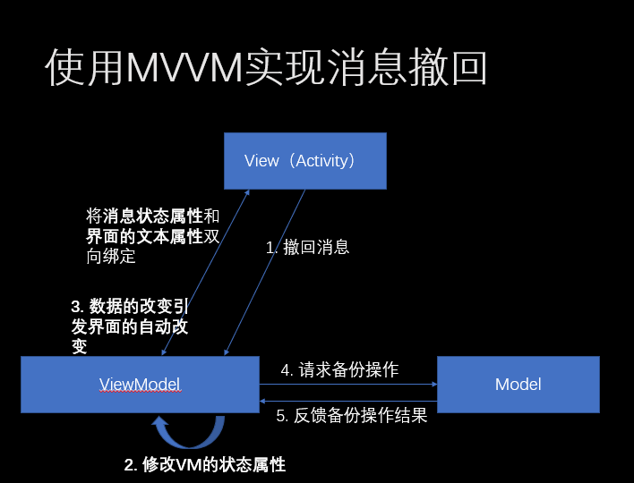

特别注意在第二步，和MVP去直接去修改界面中元素属性不同，**ViewModel只修改了数据**，界面的修改是自动的。

app\src\main\java\nju\androidchat\client\mvvm2\viewmodel\Mvvm2ViewModel.java，62-71

```java
private void recallMessage(UUID uuid) {
    uiOperator.runOnUiThread(() -> {
        messageObservableList.stream()
                .filter(message -> message.getMessageId().equals(uuid))
                .findAny()
                .ifPresent(message -> {
                    // 修改数据的状态即可
                    message.setState(State.WITHDRAWN);
                });
    });
}
```

## 6.1 定义映射关系和观察数据变化

稍微深入一点，MVVM是怎么知道这个状态的改变需要怎么改变界面的显示呢？MVVM又是怎么知道这个状态发生了改变呢？

先说第一个问题：在XML中，我们可以定义和界面有关的数据，并定义界面和数据的对应关系。

app\src\main\res\layout\item_text_mvvm2.xml，16-18，61-69

```xml
<variable
    name="messageBean"
    type="nju.androidchat.client.mvvm2.model.ClientMessageObservable" />

<!-- ... -->

<TextView
    android:id="@+id/chat_item_content_text"
    android:layout_width="wrap_content"
    android:layout_height="wrap_content"
    android:background="@{messageBean.direction.equals(Direction.SEND)?@drawable/message_text_send:@drawable/message_text_receive}"
    android:text="@{messageBean.state.equals(State.WITHDRAWN)?@string/recall_message:messageBean.message}"
    android:textColor="#333333"
    android:textSize="14sp" />

```

在以上XML中，variable定义了这个界面和一个`ClientMessageObservable`对象有关系，在这个XML文件中这个对象被称为`messageBean`；而在TextView的`android:text`定义了这个TextView的值，应该和这个`messageBean`的state属性有关：当其为`State.WITHDRAWN`时，就显示`@string/recall_message`（资源文件中定义的字符串，目前为“已撤回”）；若不是，就显示这个`messageBean`的message属性的值。


你可能已经猜到了，一个`ClientMessageObservable`对象就对应着我们的一个**消息**。当我们每接受到/发送一个消息时，我们就新增一个这样一个`ClientMessageObservable`对象，并将其加到一个列表。这个列表的修改又会造成界面上的新增一个界面元素……

app\src\main\java\nju\androidchat\client\mvvm2\viewmodel\Mvvm2ViewModel.java

```java
ClientMessageObservable clientMessage = new ClientMessageObservable(serverSendMessage);
uiOperator.runOnUiThread(() -> {
    messageObservableList.add(clientMessage);
    uiOperator.scrollListToBottom();
});
```

你可能又发现了，这个类是以`Observable`结尾的。这说明，这个类是一个**可观察的**对象，即它的改变，能够被其他对象观察到，并进行相应的操作。在实现中，这个类继承了`BaseObservable`。这个类是`androidx.databinding`包提供的，用来定义可观察的（observable）对象的基类。在一个类里的标注有`Bindable`的属性，其变化是**可以被观察的**。

app\src\main\java\nju\androidchat\client\mvvm2\viewmodel\Mvvm2ViewModel.java，5-6，29，39-41，48-51

```java
import androidx.databinding.BaseObservable;
import androidx.databinding.Bindable;

// ...

public class ClientMessageObservable extends BaseObservable {
    @Getter
    @Bindable
    private State state;

    public void setState(State state) {
        this.state = state;
        notifyPropertyChanged(BR.state);
    }
}

```

在message对象的`setState`方法中，在修改完`可观察的属性state`后，其调用`notifyPropertyChanged`方法。虽然我们不知道这个方法具体做了什么，但是从它名字我们可以猜到，它通知（notify）了属性（property）的改变（changed）。当这个被触发时，MVVM框架中所有依赖了这个对象的这个属性的界面元素（例如上面提XML中定义的TextView）就会被自动刷新。

这样就实现了**数据到界面的同步**。至于界面到数据的同步，读者可以自己去尝试。更进一步，读者可以尝试一下如何将一个输入框的文本和一个VM中的某个文本属性双向绑定起来，使得当输入框改变时，文本属性也自动改变；文本属性改变时，输入框中显示的文字也自动改变。

## 6.2 优点

虽然我们在5.4节已经说过了MVVM的优点，但是在这里我再想强调一下MVVM最重要的特点：**数据和界面的完全解耦**。

通过MVVM的双向绑定，我们再也不通过`findViewById`获得界面元素并手动操作界面元素；再也不需要再修改某个界面的定义时，在各个代码中搜索并修改所有操作过这个界面元素的代码；甚至，我们也不需要测试数据改变，界面是不是也被如预期地被改变了。我们的代码只需要修改**数据**，将我们从繁琐的UI操作中解放了出来，极大地增强了代码地**清晰度**、**可扩展性**和**可维护性**。

## 6.3 缺点

虽然MVVM的优点非常显著，使得MVVM以及其思想被广泛运用于各个UI开发领域（WPF，JavaFX，Angular...），但是MVVM也有几个不可忽略的缺点：

1. 基础设施复杂

为了在Android中使用双向数据绑定，我们必须引入整套`androidx.databinding`库，也必须重写XML文件以定义数据到界面的绑定关系，我们也必须重新定义我们的数据结构，以使数据的变化能够通知到MVVM框架。

2. 不能处理非数据和界面非一一对应，业务逻辑复杂的情况

我们之前的情况，都有一个共同的特点：数据和界面是一一对应的。有数据，就有其对应的界面元素。如果业务逻辑非常复杂，情况不是这样呢？

## 6.4 扩展需求3：过滤脏话

过滤脏话的需求很简单：当发送内容包含脏话时（在实现时，提供了一个`boolean  containsBadWords(String)`方法来判断），**不显示在界面上**。

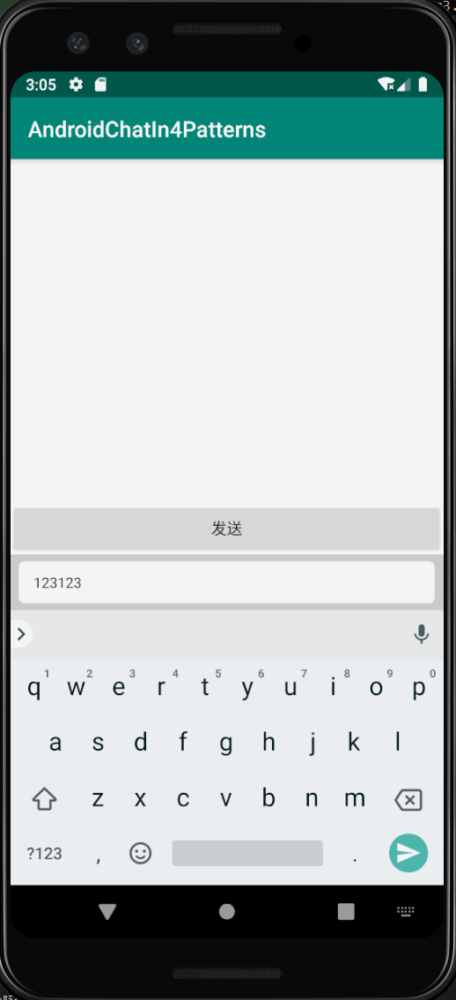

根据MVVM的思想，我们会很快在一个问题上陷入困惑：如何把一个**数据**绑定到**没有元素上**？

除了一些耍流氓般的什么可见性、透明度，我们发现我们只能在**将数据和界面绑定之前**，把这个数据提前过滤掉。

app\src\main\java\nju\androidchat\client\mvvm3\viewmodel\Mvvm3ViewModel.java，59-71

```java
public void sendMessage() {
    if (Utils.containsBadWords(messageToSend)) {
        uiOperator.sendBadWordNotice();
    } else {
        LocalDateTime now = LocalDateTime.now();
        UUID uuid = UUID.randomUUID();
        String senderUsername = client.getUsername();
        ClientSendMessage clientSendMessage = new ClientSendMessage(uuid, now, messageToSend);
        ClientMessageObservable clientMessageObservable = new ClientMessageObservable(clientSendMessage, senderUsername);
        updateList(clientMessageObservable);
        AsyncTask.execute(() -> client.writeToServer(clientSendMessage));
    }
}

```

我们发现，在这种数据和界面非一一对应的情况下，我们无法避免**在绑定进行之前**写逻辑代码。当这样的、必须发生在绑定发生之前的逻辑变得更加复杂的情况下，我们的代码又变成了过程式的（imperative）的意大利面条式的代码，MVVM对此完全无能为力。而随着业务的扩张，功能的增加和变得越来越复杂，这样的逻辑越来越多，为了避免代码质量的雪崩式下降，我们必须想一个办法解决掉这样的问题。

# 7. FRP

FRP，全称Functional Reactive Programming，函数式响应式编程，是最近一个非常火的概念，被广泛运用于各个UI开发领域，很多使用者说它能解决很多UI开发中固有的问题。那么这到底是个什么东西呢？

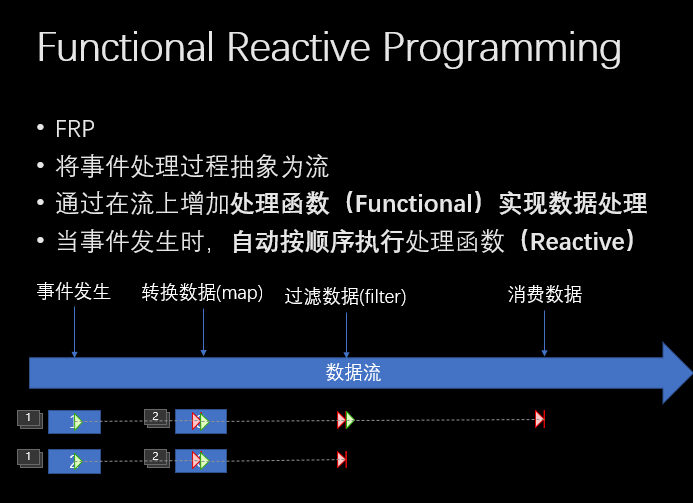

在FRP中，对事件的处理被抽象为一个**流(Stream)**。

处理一个事件的方法，和之前地写**事件处理函数**不同，是在这个**事件流(Stream)**上增加各种**处理函数**。为了提高效率，并防止处理流的过程中意外修改系统的上下文或者全局状态，这样的处理函数应该是**纯函数（Pure functions）**，即输出只和输入有关的函数，例如说常见的**映射**（map，将一个数据变为为另一个数据）、**过滤**（filter）、**节流**（throttle）等。这个通过连接纯函数进行数据处理的概念，称为Functional。

而在FRP中，当事件发生时，其数据被放入流中，流的各个处理函数被**自动**按顺序触发，直到被流的消费者消费掉（subscribeOn），此时流事件结束。这个**自动**触发的概念，称为Reactive。

当然，流也可以被分支（share）成多个流；数据在经过分支时，生成多个副本被多个流分别处理；多个流也可以合并（merge）成单个流：当多个流的数据到达时，按顺序进入被合并的流中进行处理。

通过这些看似复杂的概念，我们将复杂的**事件处理流程**分解成**流的分支合并**以及**各个事件处理函数的附加和删除**，降低了复杂度，提高了代码可读性和可维护性。

## 7.1 使用FRP实现消息发送和接受

让我们来看看FRP是怎么处理消息发送和接受的过程的。

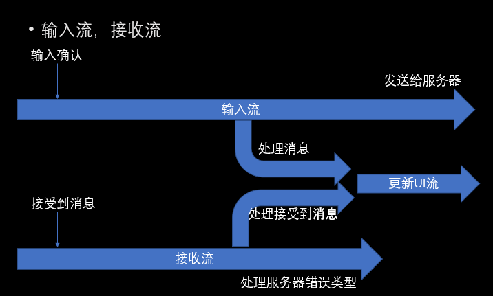

我们将整个系统考虑为两个流：**输入流**和**输出流**。

当用户确认发送一个消息时，这个事件的数据（用户要发送的数据）被放入输入流。输入流在中间被分支为**更新UI流**和**发送给服务器流**。一个用户要发送的数据的副本被**发送给服务器流**的消费者通过Socket发送到服务器，而另一个副本通过**更新UI流**被更新到UI界面上。这样，我们完成了**用户发送消息**这个事件的处理。

当客户端接受到一个消息时，一个**接受到消息**事件被触发，被接受到的消息作为数据放入**接受流**中。接受流会根据消息类型的不同**分支**为多个分支流：在图片中，接受流被分支成了**其他用户发送的消息流**和**服务器错误信息流**。对于后者，其消费者将会在界面上显示一个Toast消息；对于前者，将会**合并**到更新UI流中，和输入流的消息一起被更新到UI界面上。

代码实现如下：

app\src\main\java\nju\androidchat\client\frp0\Frp0TalkActivity.java, 68-120
```java
// 1. 初始化发送流
this.sendMessages$ = this.createSendMessageStream().share();

// 2. 初始化接受信息流
this.receiveMessage$ = this.createReceiveMessageStream().share();

// 3. 将接受信息流分为多个流，分别处理
// 3.1 错误处理流
this.errorMessage$ = this.receiveMessage$
        .filter(message -> message instanceof ErrorMessage)
        .map(message -> (ErrorMessage) message);
// 3.2 服务器发送消息流
this.serverSendMessages$ = this.receiveMessage$
        .filter(message -> message instanceof ServerSendMessage)
        .map(message -> (ServerSendMessage) message);
// 3.2 撤回消息流
this.recallMessage$ = this.receiveMessage$
        .filter(message -> message instanceof RecallMessage)
        .map(message -> (RecallMessage) message);


// 4. 处理每个流
// 4.1 处理错误流
this.errorMessage$
        .observeOn(AndroidSchedulers.mainThread())
        .subscribe((message) -> {
            Toast.makeText(this, message.getErrorMessage(), Toast.LENGTH_LONG).show();
        }, Throwable::printStackTrace);


// 4.2 处理发送流，将每个消息写到服务器
this.sendMessages$
        .observeOn(Schedulers.io()) // 发送消息网络要在 io线程做
        .subscribe((message) -> {
            Log.d("send", message.toString());
            this.socketClient.writeToServer(message);
        }, Throwable::printStackTrace);


// 4.3 合并发送流和服务器接受消息流，并更新UI
this.addToViewMessages$ = Observable.merge(
        this.serverSendMessages$.share().map(message -> new ItemTextReceive(this, message.getMessage(), message.getMessageId())),
        this.sendMessages$.map(message -> new ItemTextSend(this, message.getMessage(), message.getMessageId(), this))
);

this.addToViewMessages$
        .observeOn(AndroidSchedulers.mainThread())
        .subscribe((view) -> {
            log.info(view.toString());
            messageList.addView(view);
            Utils.scrollListToBottom(this);
        }, Throwable::printStackTrace);
```

## 7.2 过滤脏话

有了这样的流结构，要实现过滤脏话，我们只需要在发送流上增加一个filter函数即可。这样，包含有脏话的消息数据，就不会继续被输入流的后续函数和消费者进行处理，被“过滤”掉了。

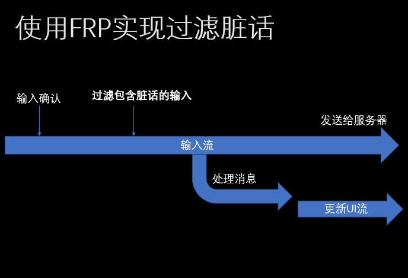

代码实现：

app\src\main\java\nju\androidchat\client\frp3\Frp3TalkActivity.java, 65-68

```java
// 1. 初始化发送流
this.sendMessages$ = this.createSendMessageStream()
        // 在这里加一句filter就可以过滤脏话了
        .filter(message -> !Utils.containsBadWords(message.getMessage()))
        .share();
```

## 7.3 扩展需求4：限制用户发送消息频率

限制用户在1s中只能发出一条信息，消息发送后1s内不允许发送。

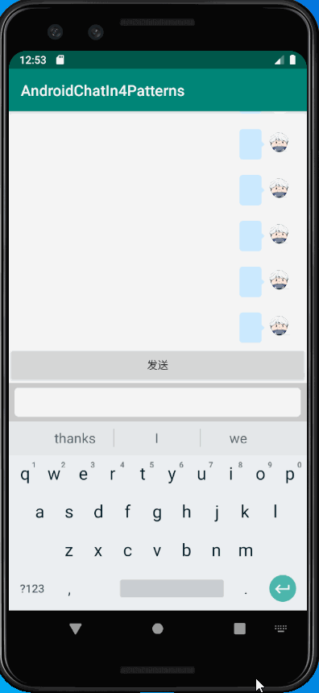

在普通的MVC/MVP/MVVM中，为了实现这一功能，我们不得不手动使用计时器，并通过一个标志位来控制用户是否能够发送。整个代码冗长又易错，如果再扯上多线程……

而使用FRP的思想，我们可以尝试**截断这个流**，使其一定时间内只能通过指定次数。幸运的是，这个需求很常见，我们可以直接使用内置的节流函数（throttleLatest）就可以实现这个功能。这个函数顾名思义，使这个流在指定时间内只能通过一次。

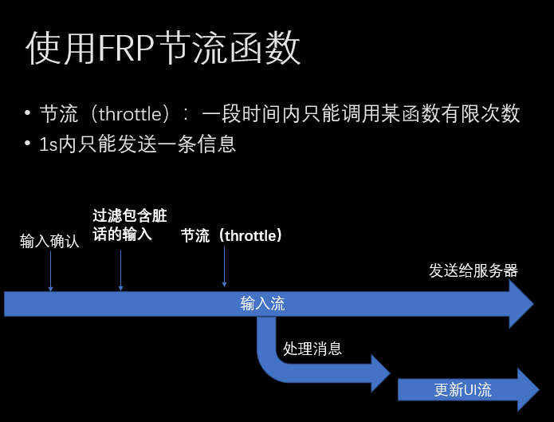

代码：

app\src\main\java\nju\androidchat\client\frp4\Frp4TalkActivity.java, 67-70

```java
// 1. 初始化发送流
this.sendMessages$ = this.createSendMessageStream()
        // 1秒只能发一条
        .throttleLatest(1, TimeUnit.SECONDS)
        .share();
```

## 7.4 优缺点

FRP的思想和传统的命令式编程思想有很大的不同，所以它对程序员思维的影响也是比较大的。这里，我们总结出FRP的优缺点供大家参考，但是也更希望大家能够自己亲自尝试一下，自己体验FRP的特点，并根据自己的业务需求来选择或者不选择使用FRP。

- 优点：非常方便的数据处理，可扩展性极佳

FRP和传统的事件处理范式有很大的不同，这使得FRP在处理复杂逻辑时，能有效避免传统事件处理范式所造成的意大利面条式代码的问题，使复杂的事件处理流程变得更加的清晰和可维护。同时，FRP的一些库也提供了很多的帮助函数（例如Map, filter, flatMap, throttle, reduce, first）等，非常适合应对**来源多样**、**数据处理复杂多变**等情景。

- 优点：简洁的代码

整个应用使用FRP进行构建，只使用一个类，仅173行代码，并且不像其他架构一样有很复杂的依赖和调用关系，使得代码非常的清晰和间接。

- 缺点：原理较为复杂

要想真正用好FRP，必须能够懂得FRP的概念，并且能够正确地用FRP的思想来考虑问题。而正如之前所说，FRP的思想和传统的编程思想也很大的不同，这也为使用FRP设下了很高的门槛。

- 缺点：函数过多且使用易出错

目前被广泛使用的FRP库（例如[ReactiveX](http://reactivex.io/documentation/operators.html)）都会提供非常非常多的函数供用户使用，虽然这增强了FRP的能力，但是却也让新手程序员望而却步；就算是老手程序员，其中一些函数从字面上可能并不能猜出它们地区别，也很容易地就用错了函数（例如下图这两个函数（[地址](http://reactivex.io/documentation/operators.html)），对于很多用户来说，仅从函数名上可能很难理解他们的区别）。要精通FRP的使用，还是需要很长的学习时间。

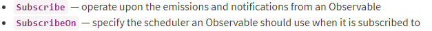

- 限制：使用场景受限

FRP在**数据来源多样**、**数据处理复杂多变**的情况非常好用，但是对于不满足这些条件的情况下，可能并不能带来什么好处，反而会因为其概念和使用的复杂性降低了工作效率。所以，如同前面所说，我们还是建议大家自己去尝试并评估FRP对自己的项目的利弊，并选择对开发最有利的工具。

# 8. 练习

三选一

1.	 MVP：在MVP中，除了之前提到的便于测试之外，由于将业务逻辑和View分离，增加功能也只需要增加一个Presenter和少量修改View即可实现。尝试在MVP的原始代码的基础上实现以下功能：

> 当所发送的信息为``这样的格式时（即markdown的图片），将信息显示为对应的图片。

2.	MVVM：当消息过多时，有的消息可能没有在当前屏幕上显示出来。尝试在MVVM的原始代码的基础上实现如下功能：

> 显示不在当前屏幕中显示出来的消息数量，并随着用户滚动消息列表、发送和接受消息实时更新。（Tip：考虑绑定消息列表的当前位置属性）

3.	FRP：使用现有的XML界面文件，使用流从头实现基本需求，并实现**功能3（撤回消息）**

# 9. 总结

在这篇文章中，我们通过实现一个Android端的局域网群聊应用，介绍了MVC、MVP、MVVM和FRP的特点、优缺点以及使用建议。希望读者能够从这篇报告中对这四个常见的Android客户端架构有更加深入的理解。如果有什么问题，请随意指出。
