# 前言

2016年9月到2019年5月，我在南京大学微软学生俱乐部呆了三年。我从一个初升大学的萌新，变成现在马上就要毕业的大四老狗，其中南京大学微软学生俱乐部给了我许多。新学年的南大微俱的招新就要开始了，我想是应该总结下在我在俱乐部三年的成长和变化，希望有更多学弟学妹们能够加入俱乐部，和俱乐部一起成长。

# 2016年9月：一张海报开始了俱乐部的旅程

上了大学后，很多同学都加入了各种俱乐部或者院系组织，而不擅长交际的我却还窝在宿舍。一个偶然的机会，我看到了微软学生俱乐部的海报，感觉非常好奇：为什么一个公司也会在大学里运营俱乐部呢？

带着这份好奇，加上一直是一个微软粉的缘故，2016年9月6日，我参加了宣讲会，选择了技术部，通过了面试，加入了南京大学微软学生俱乐部。当时的我没有想到的是，这个“名不见经传”的小俱乐部，将成为我大学期间的不可或缺的一部分。

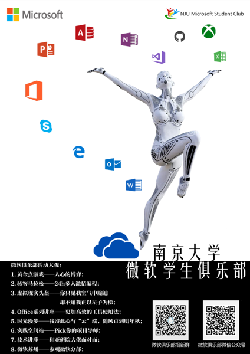

# Hackathon：7天影响了3年

很快时间到了12月1日，南京四校hackathon比赛开始报名了。刚听说这个比赛的我了解这种比赛的规则后，觉得这个比赛**很酷**，便不顾没有做完和作业和不久之后的期末考试，在组队群里拉了另外两名同学组好了队，凭着一股“初生牛犊不怕虎”的干劲，参与了这个比赛。

7天之后，我们的项目拿了个“超级实用奖”。

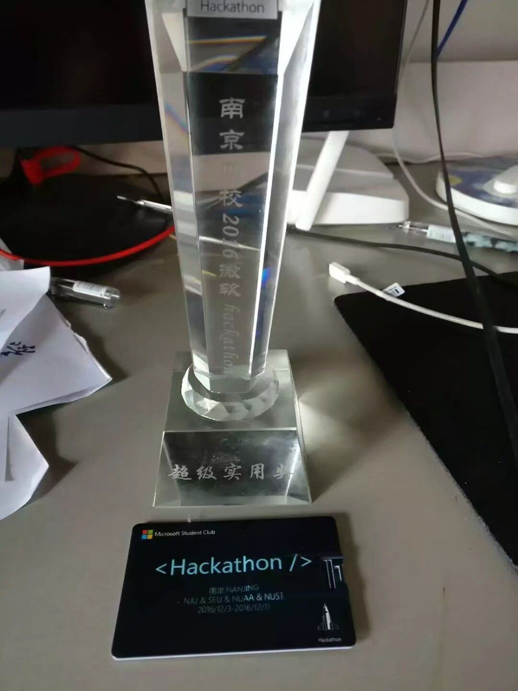

这不仅是我大学以来的得的第一个奖，更重要的是让我有了自信，敢于用代码将自己心中的蓝图实现出来。另外，在接下来的两年中，我和这次比赛中的两名队员（以及另加的一位同学）一起，共同参与了院里组织的一次比赛，共同进行了2个各持续一个学期的课程大作业，都拿到了非常满意的成绩。我们也成为了很好的**朋友**和合作无间的伙伴。而这一切，都是因为2016年南京四校hackathon比赛。

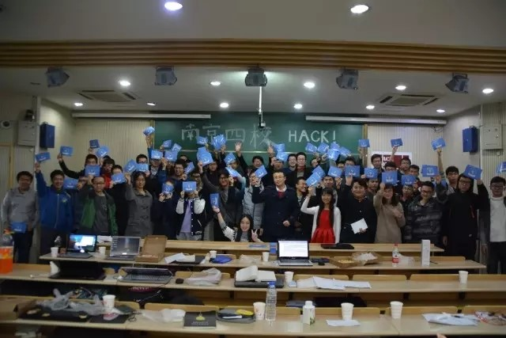

# 夏令营：在俱乐部“春晚”中大开眼界

2017年7月暑假某天，刚非常荣幸成为南京大学微软学生俱乐部技术部副部长的我突然收到了**微软学生夏令营**的邀请函，参加了这个微软学生俱乐部的“春晚“。作为一个大一的萌新，这四天的“高强度”活动中，我大开眼界。

观看了**编程之美决赛**，看到了各个参赛队伍优秀的脑洞、强大的技术能力、当然还有邹欣老师“横扫全场“的澡堂问题；一天听了六场**技术讲座**，对微软的技术有了更深入的认识；和各位owner和俱乐部伙伴一起集思广益，**对俱乐部的未来发展献计献策**；当然还有最后的**hackathon**环节，和小伙伴一起完成一个策划。

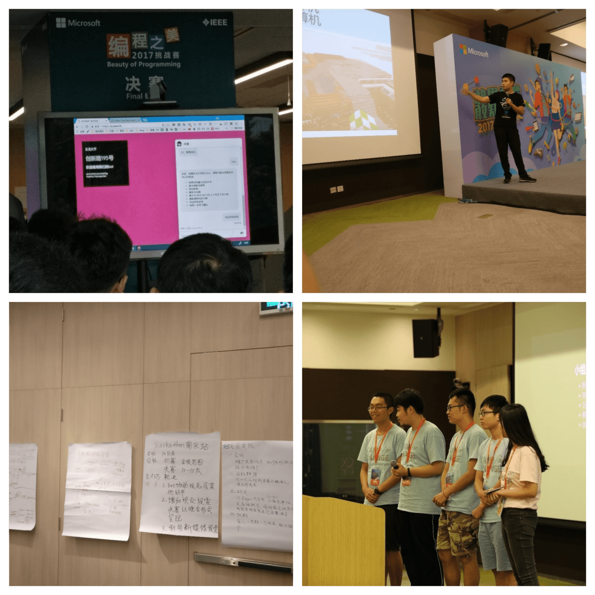

这四天的夏令营的行程不仅让我对微软有了更深入的认识，对俱乐部接下来的发展有了更清晰的规划，更重要的是认识了来自全国的对俱乐部抱有发自内心的爱的微软学生俱乐部成员。南京四校在夏令营之间的提出的hackathon规划，也在接下来一年成为了现实，我们四所俱乐部之间的联系越来越紧密，合作越来越顺利。

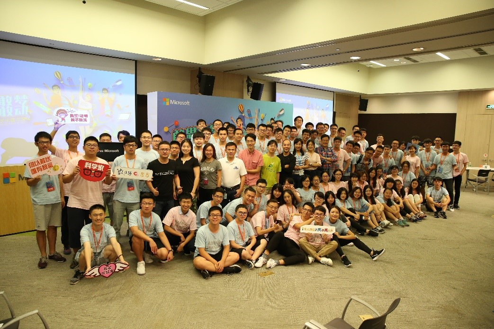

# 俱乐部运营：和俱乐部一起，改变俱乐部

从夏令营回来之后，我们新一届的部长团开始了2017-2018学年的运营。在这一年中，我们购入了一台HP Windows Mixed Reality Headset混合现实头设，在俱乐部内部的简单测试后，在2018年5月20日晚南京大学116周年校庆夜上，面向全校举办了**MR体验活动**。而这次活动出乎意料地受欢迎：在4个小时左右的展台时间中，我们的展台前一直门庭若市，来自全校各个年级各个院系的同学都积极参与体验，甚至吸引了一些小朋友。

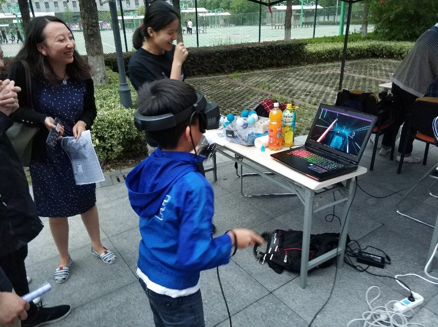

作为一个在以文理科见长的学校的技术性社团，想让全校的同学都参与了解我们俱乐部、参与俱乐部的活动是一件比较困难的事情。而这次活动极大地增强了俱乐部在全校范围内的知名度，也为我们以后的运营指出了方向：降低技术门槛，增加活动丰富度，让更多同学参与进来。

2018年6月，我当选为南京大学微软学生俱乐部主席。2018年-2019年这个学年，在全俱乐部所有成员，特别是各位部长团同学的努力下，南大微俱发生了一些变化。

## 活动

在这个学年中，俱乐部的**活动频率**显著提高了，从之前的一个月一次，提高到平均两周一次、甚至在第一学期保持一周一次的频率。

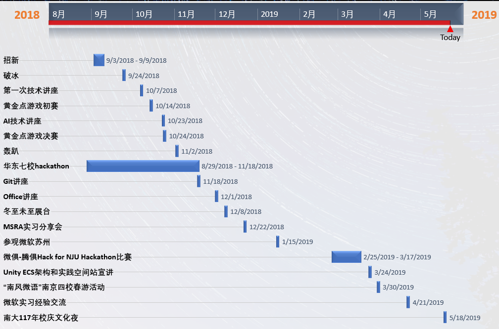

并且，在传统的技术相关的活动（例如说技术讲座、hackathon）之外，我们组织了多次技术门槛不那么高的、有趣味性的、全校所有专业的同学都能进行参与的活动。例如，我们将**MR体验、小冰游戏以及黄金点游戏**带到了12月南大社联组织的**“冬至未至”**和5月的**校庆文化夜**中，吸引了全校同学来了解和体验最新的技术，提高了俱乐部的知名度。

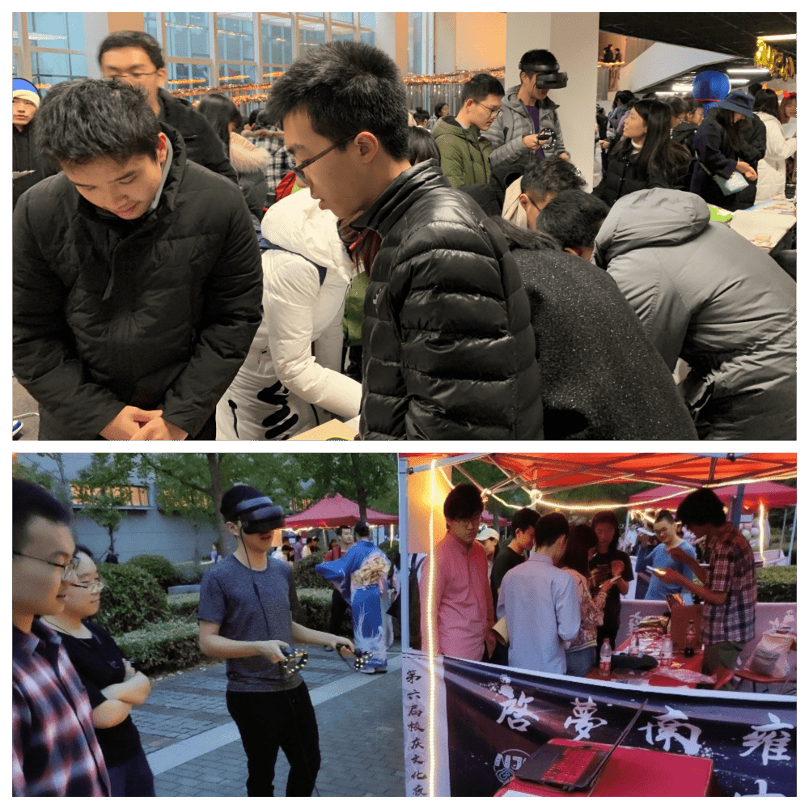

在19年4月，我们联合东南、南航和南理工微软学生俱乐部一起，举办了**“南风微语”系列春游活动的第一站：南大鼓楼**。来自南京四个学校的小伙伴齐聚南京大学鼓楼校区，进行各种活动和游戏。本次活动的参观、游戏将融合在一起，采用定向越野的方式完成。定向越野中的每一个地点都会设置一个团体合作完成的小游戏，我们的工作人员将在设置的地点协助来访同学完成游戏。通过这次轻松的活动，我们加深了和南京另外三个学生俱乐部之间的交流和联系我们也希望此次活动成为系列活动，以后继续办下去。

另外，为了让同学们能够更加了解微软，我们在2018年7月和2019年1月**两次**举办了**参观微软苏州**的活动，也在2018年12月以及2019年4月**两次**举办了**微软实习经验交流活动**。通过参观微软苏州，同学们更加深入的了解了微软和微软的招聘项目，通过工程师的介绍同学们也对微软的技术也有了一定了解，最后在微软苏州的几位南大校友也来进行了相关的分享并为同学们答疑解惑。通过邀请MSRA、苏州STCA和微软CSS部门实习的学长学姐来为同学们介绍微软实习的情况，让同学们更加了解在微软实习和工作的体验，也为想要去微软实习的同学提供了交流的渠道。

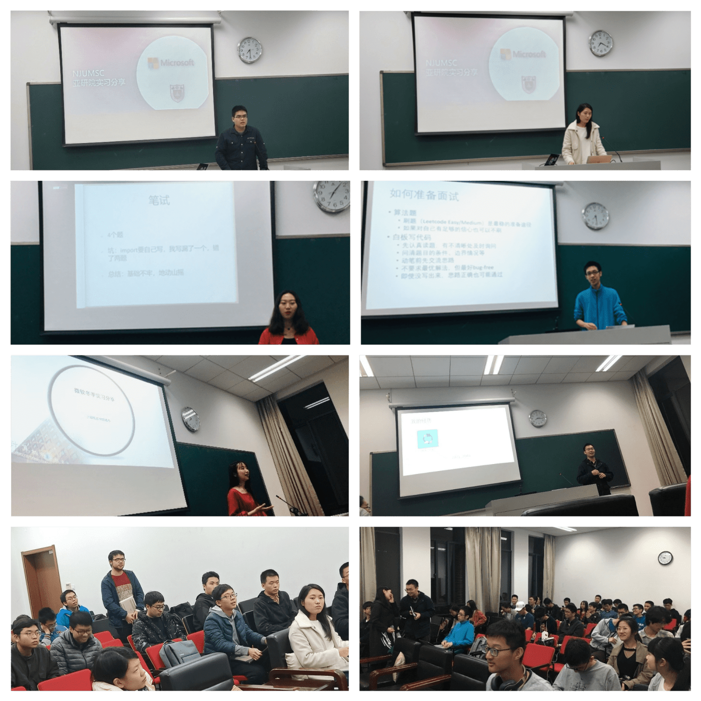

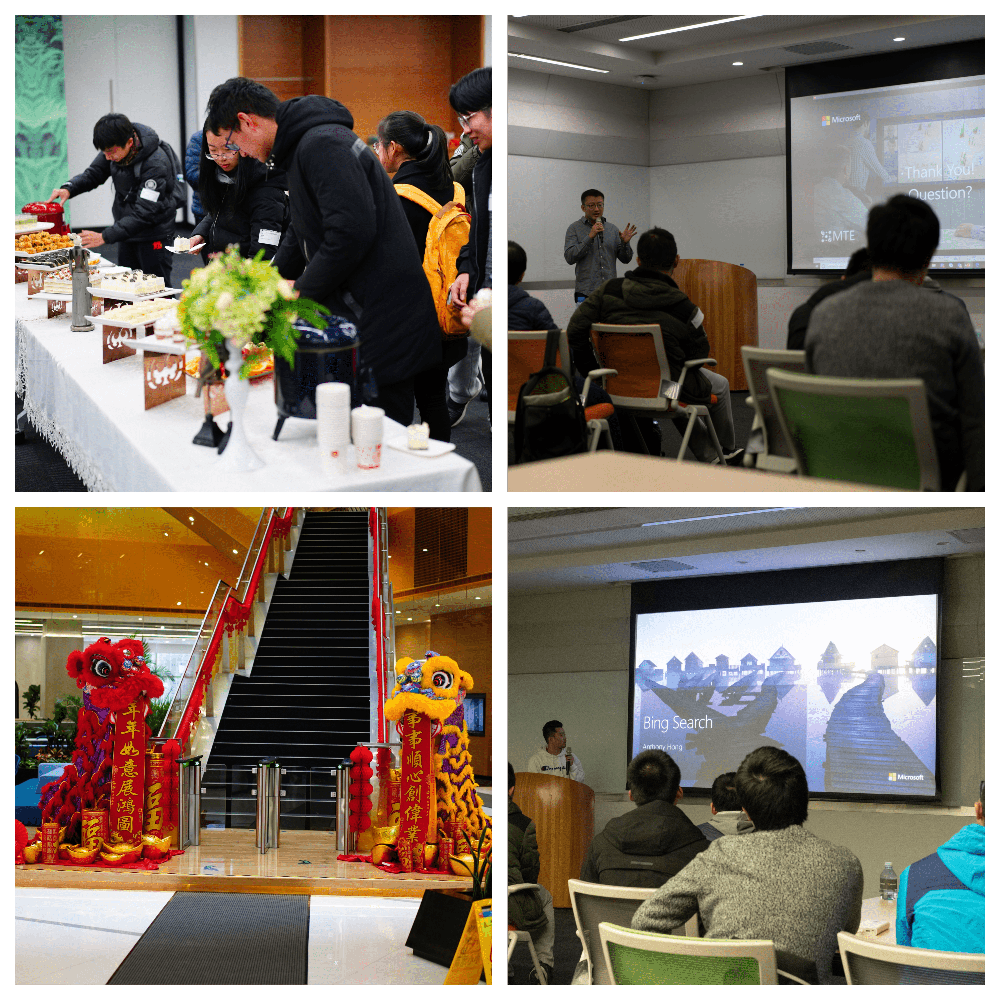

## 技术

在技术方面，我们考虑到南大微俱的几乎所有成员都是来自大一大二，所以我们在技术活动方面也以入门向为主，以提高成员的兴趣为中心。

在学年伊始（10月），南大微俱以2018年微软学生夏令营中的黄金点游戏为基础，组织了一次俱乐部内部的**黄金点AI赛**。这次比赛给了新生一个非常好的机会去学习和了解AI和计算机领域，并且通过这个比赛将他们所学的知识加以运用，并且能获得良好的反馈以促进他们继续学习下去。最终获得最好的成绩的队伍，正是一支来自大一同学的队伍。他们在短时间内学习到包括算法、网络等各类知识并取得如此好的成绩，让人刮目相看。这次活动所使用的平台也是由俱乐部技术部自行开发的，其也被用在了之前提高的两个展台游戏上。在冬至未至活动中，我们也将本次比赛中成绩最好的程序作为一个黄金点游戏的玩家，让它和大家一起体验黄金点游戏的乐趣。

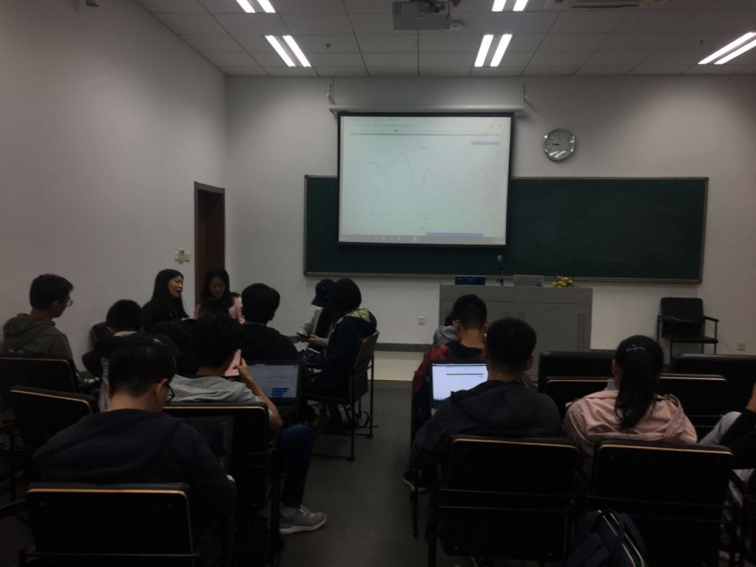

我们还公开举办了5场**技术讲座**，分别是科学上网和如何正确地问问题、Git讲座、和创新工厂合作的AI技术讲座、Office讲座以及和南京大学腾讯创新俱乐部合作的Unity ECS架构的讲座。根据我们俱乐部成员组成的实际情况（绝大部分同学来自大一大二），所以技术讲座以普及实用技术为主。

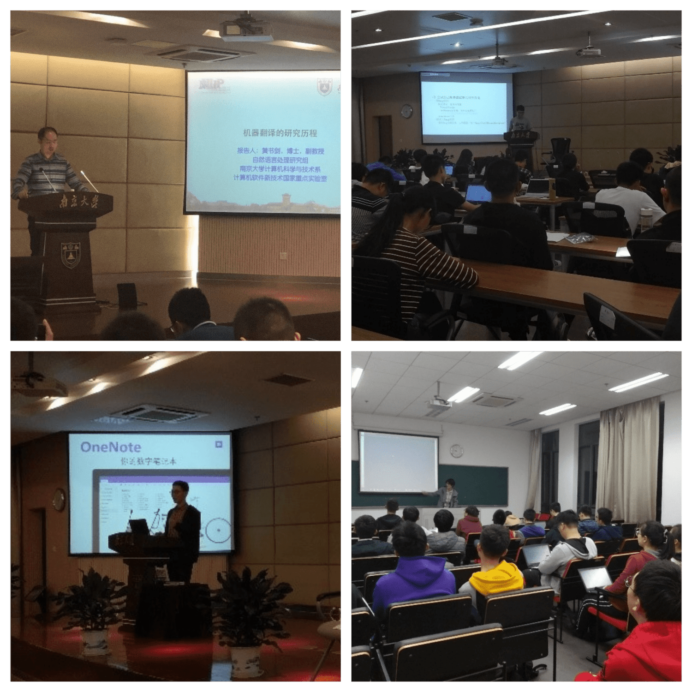

## 对外联系

在这一年中，我们也和很多**其他组织**建立了联系，合作举办了各种各样的活动。不仅提高了俱乐部的知名度，通过和其他组织的合作，也为我们以后举办规模更大、更有意义的活动打下了基础。

在2019年3月，我们和南京大学腾讯创新俱乐部合作，举办了**第一届南大微俱-腾俱hackathon比赛**。本次hackathon的主题是Hack for NJU，希望参赛者能够在七天之内做一个对学校生活有所帮助的工具。Hackathon比赛和南京大学最大的公益社团：IT侠达成了合作，最终吸引了近70名同学、18支队伍报名参赛，包括来个各个年级（大一到研一）、各个院系（计科软院商院到中美中心）的同学。这次比赛是我们第一次和其他社团合作，取得了非常理想的效果，不仅提高了俱乐部的知名度，也让微俱和其他社团（腾讯俱乐部和IT侠等）建立了合作。我们也希望能够将此比赛延续下去，做成和南京四校hackathon一样的系列活动；并且，我们也希望能够继续加强和友社之间的联系，合作互补，办更好的活动。

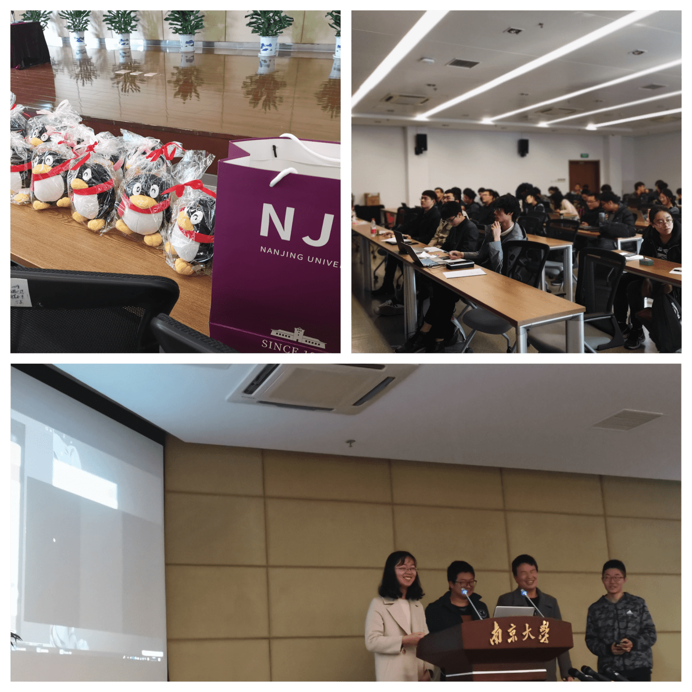

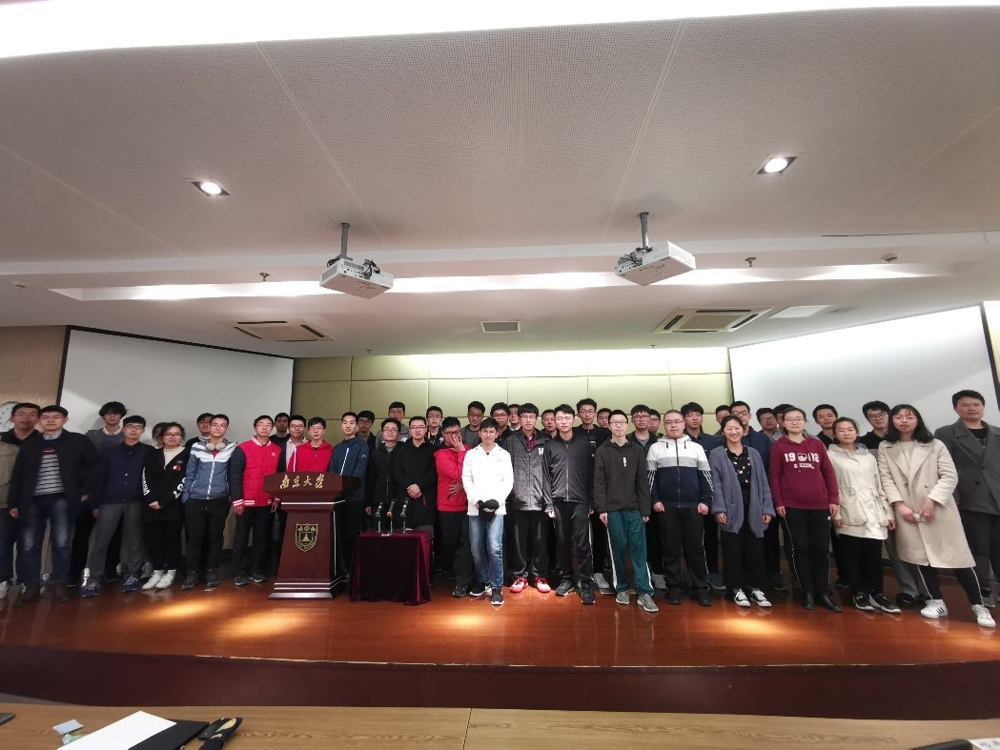

南京四校hackathon今年已经是第四年了，今年我们将范围扩大到了七校，和南理工、南航、东南、中科大、山大和苏大一起，举办了**华东七校联合创客马拉松**。本活动有约200名同学报名参赛，请到了来自南理工、东南、南航和南大的一些老师和京东的相关人士作为评委，在过程中拉到了京东的赞助，以及南京校园直播平台南播玩、苏媒（中国（江苏）高校传媒联盟）和中青在线的媒体和宣传支持。

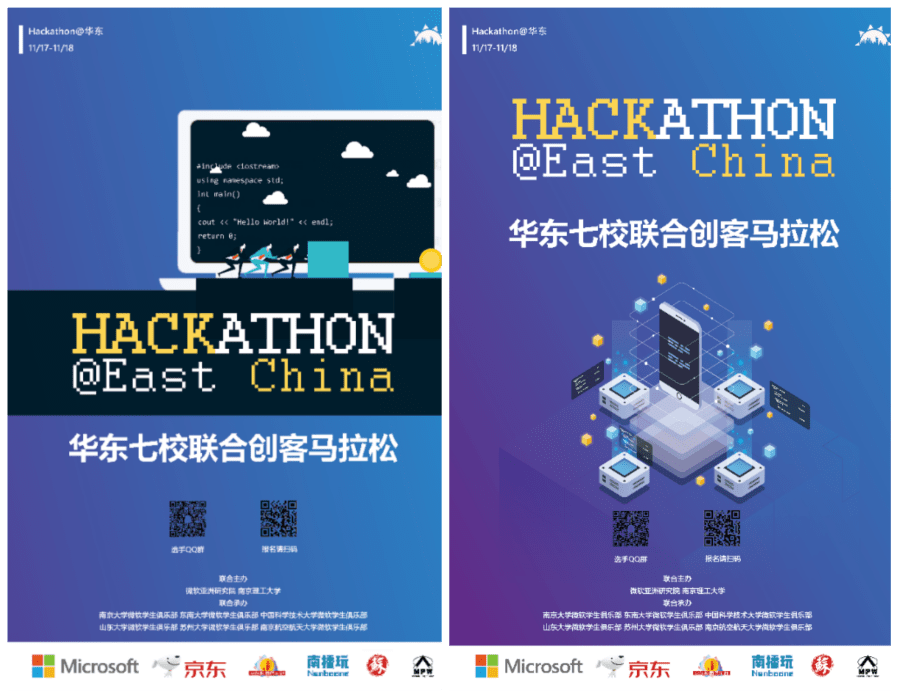

## 全俱乐部的努力

在这一年中，俱乐部的同学都为俱乐部奉献出了他们的力量，正因为有了俱乐部成员的参与和支持，我们俱乐部才有动力举办活动。特别想感谢我们的部长团们。由于这一年中我在老校区，离俱乐部活动的新校区有40分钟的地铁的车程，所有的活动，从策划、宣传到执行，**部长们的全程参与和贡献是最重要的**。可以说，没有他们，这一年的俱乐部就不会有这么大的改变。今年南大微俱获得了品牌活动奖，这是对全俱乐部成员的努力的最好的肯定。
s
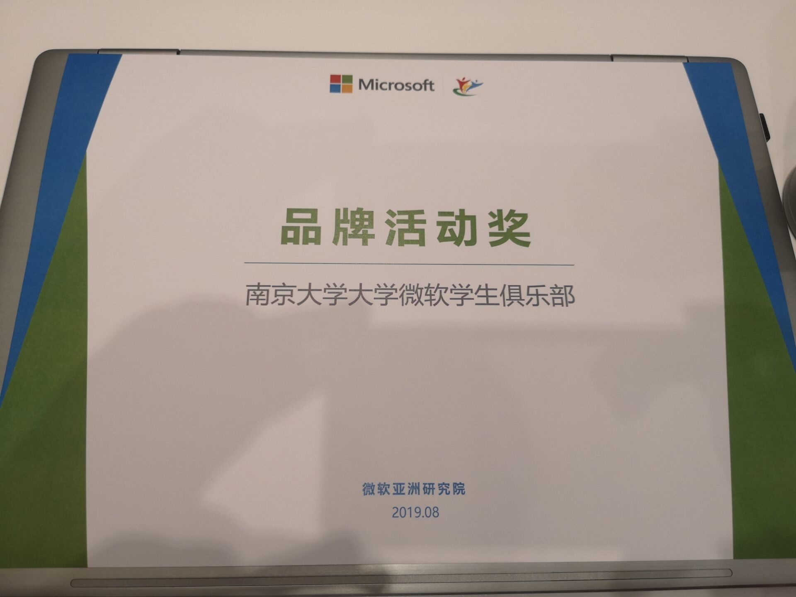

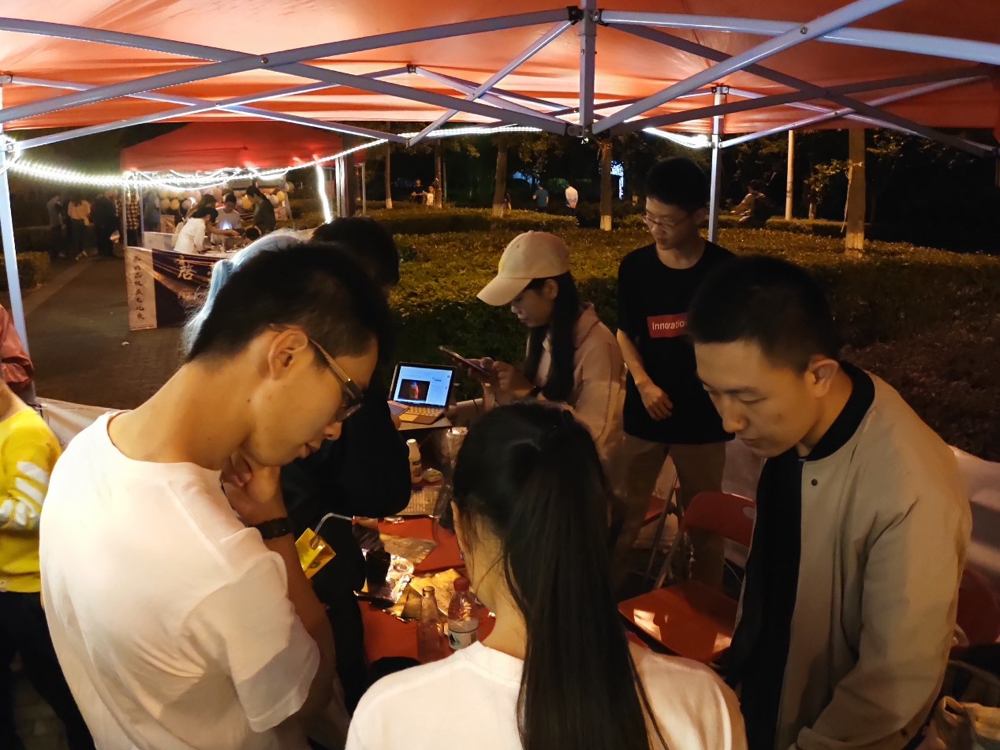

# 未来：和俱乐部一起成长

三年前，刚上大学的我看到了南大微俱的海报，参加了宣讲会；三年后，我结束了在俱乐部的旅程。回想起这三年，俱乐部让我得到了**合作无间的队友**，**认识**了全校、全南京甚至全国愿意为了俱乐部付出的同学，让我得到了我人生中诸多的**第一次**：第一个**比赛**，第一个**奖项**，第一次**主持讲座**、第一次**举办大型活动**……可以说，俱乐部改变了我的大学生活。俱乐部，一个当初默默无闻的小俱乐部，现在有了更多更好的活动，有了更实用的技术活动，有了更强的对外联系，有更多人愿意参与进来，也希望能够给更多的同学带来乐趣和帮助。

我相信，在现任部长团的努力下，我们俱乐部一定能更加活跃，更加技术，更加外向，让更多同学能够与俱乐部一起成长，度过大学难忘的时光。

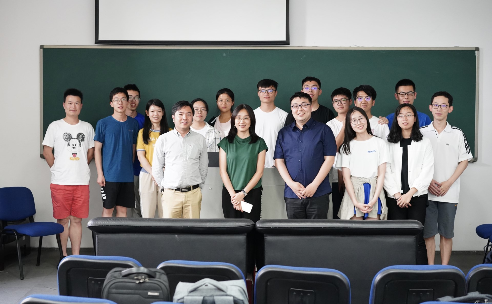
