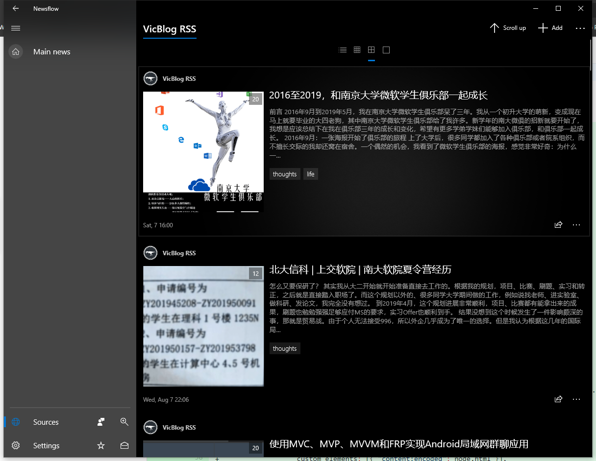

# 前言

不知不觉，gatsby博客已经上线了一年多。在这一年中，虽然从表面看起来博客变化不大，但是我一直在对博客做一些更新工作。特别是最近一个月，我对博客一些耽搁已久的问题进行了解决，使整个博客更加的完善了。这篇简单的文章就简地列举一下最近博客一些特别值得提到的更新，最后也对博客的未来发展做一些展望和规划。

# 更新

## RSS恢复支持

博客的RSS源地址是：[https://viccrubs.me/rss.xml](https://viccrubs.me/rss.xml)。欢迎订阅！

其实博客从很早开始（具体来说，从去年10月的[e2e469](https://github.com/vicblog/VicBlog-Gatsby/commit/e2e469ae05646590c0a05755e4e23f384102120d#diff-b9e136416b90437fa1dac910280b45fc)开始）就已经加入了RSS支持，但是那时候的代码就是随便从网上抄了一段，没有对博客比较特殊的地方（例如说多语言的支持，存在不能显示在列表中的文章等）进行定制，后面对博客一些更新的时候也都直接放弃了RSS。这几天，我针对博客的RSS的功能进行了一些修复，包括：**修复文章中不合法的日期串**、**RSS项中的原文链接变成绝对地址而不是相对地址**，**重新修改序列化方法**等，使得博客的RSS功能基本上可以正常使用了。博客的RSS源地址也在[W3C的Feed Validation Service](https://validator.w3.org/feed/)中成功认证，对于大多数RSS阅读器来说已经可以正常使用了。

当然，根据认证服务的结果可以发现，博客的RSS还有一些问题，其中比较严重是**文章内容的图片地址是相对地址，而不是绝对地址**，这造成了包括Read（一个Android RSS应用，[Google Play](https://play.google.com/store/apps/details?id=com.read.app)）等一些工具不能正确显示图片。但是这些问题可能在短时间内无法被解决，因为我目前暂时没有找到有效的、可扩展的方法hook进入gatsby构建时markdown的渲染流程，并根据我的需求进行修改。

详细地说，目前，将MD编译成HTML是由[remark](https://remark.js.org/)，以及很多周边插件（例如[gatsby-transformer-remark](https://github.com/gatsbyjs/gatsby/tree/master/packages/gatsby-transformer-remark)）共同完成的。这些插件都有一些默认行为（例如图片地址是相对地址）等。

这些默认行为在大多数情况下都是合理的，让开发者能够开箱即用。但是，**约定大于配置的反面就是配置常常不够完善，在遇到少见的需求的时候让开发者感到束手束脚。**

之前，为了一些特殊需求（例如在markdown里插入React组件（我使用过MDX个人不太好用），给code元素加入一些特殊元素（例如显示语言、行号、复制按钮等）），我多次尝试过hook进remark的编译过程，**在remark进行渲染的时候修改AST，使得进入gatsby数据源中的htmlAst和html就是经过定制的**，但是一直没能找到合适的方法。

后来，这些功能都实现了，但是不够优雅：在代码中，从**gatsby数据源**中获取remark渲染后的AST，修改AST后再重新使用[rehype-react](https://github.com/rehypejs/rehype-react)渲染（对这里感兴趣的同学可以查看代码的[ArticleContentDisplay](https://github.com/vicblog/VicBlog-Gatsby/blob/master/src/components/Article/ContentDisplay/index.tsx)组件）。

这样做虽然能够实现需求，但由于在**gatsby的数据源**中，其htmlAst和html并没有经过定制（定制是在页面渲染的时候执行的），这也造成目前各个方法获得的HTML并不统一。

没有一个可靠的hook渲染过程的方法，也造成了我没有办法修改remark的默认行为，其中就包含图片地址为相对地址而不是绝对地址这个问题。

我正在努力想办法解决这个问题，但是看情况短时间内解决希望不大。

## 使用国内托管（腾讯云的[CODING个人版](https://dev.tencent.com/production)）

博客一直是托管在GitHub Pages上的。GitHub Pages很方便，零开销，在国外用的很广，网络上的教程也到处都是。但是它的问题是在**国内速度非常慢，且非常不稳定**。即使我的博客的相关文件已经比较小了，但是GitHub Pages在国内的速度也极大地影响了网站的用户体验。要是当某篇文章有图片，那体验就更糟了。

多亏了我的博客是静态博客，解决这个问题，本质上只需要把文件托管到某个国内访问速度快的类Pages服务上即可解决问题（点[关于博客](/about/project)查看博客工作原理介绍）。我把目标投向了17年参加南京四校Hack.Christmas时赞助商提供的CODING.NET一年免费VIP账号。虽然那时候VIP基本已经过期，但是当时体验还行，并且也发现了它也提供类似GitHub Pages的功能（也叫Pages服务）。于是，我进行了以下操作：

- 在CODING.NET上开启一个repo，存放博客的文件
- 给这个repo开启Pages服务
- 修改[CI脚本](https://github.com/vicblog/VicBlog-Gatsby/blob/master/.travis.yml)，构建后向GitHub和CODING.NET的repo都推送一次

经过测试，CODING.NET的体验还是非常良好的，在国内的速度也非常不错，于是：
- 修改DNS，将根记录（viccrubs.me）指向了CODING.NET，二级域名（pages.viccrubs.me）指向原有GitHub Pages repo
- 在GitHub和CODING.NET平台上修改域名设置

这样，我的根域名就被解析到CODING.NET提供的Pages服务上。经过测试，网站的速度提高了非常多，国内用户的体验得到了很大的提高。

](speed-comparison.png)

## 使用自己开发的[simstate](https://github.com/viccrubs/simstate)进行状态管理

博客一开始是使用[unstated](https://github.com/jamiebuilds/unstated)进行状态管理的。这个库非常的简单易用，很符合react的理念，于是当时我非常喜爱这个库。但是随着后来hooks的推广和unstated迟迟没有跟进hooks等原因（其实已经跟进了只是当时我的不知道……），我认为是时候写一个自己的状态管理库了。这之后故事可以查看[Simstate and Why](/articles/simstate-and-why)文章，这里就不说了。

在v3.0时，我重构了simstate，完全抛弃了class的概念，完全使用React原生的hook就可以完成状态管理。而博客就是第一个完全采用simstate v3.0的项目。在使用新版本的时候，我也积累了一些在项目中正确使用此项目的经验，例如说

- Store取名最好是**大写字母**开头，因为在使用的时候经常出现`ts±const aStore = useStore(AStore);`的代码，若使用小写字母开头，这代码会编译失败。这也可以帮助同时使用多个Store的情况时，区分不同的Store实例
- 可以方便地通过一个专门的Store（例如博客项目的[LocationStore](https://github.com/vicblog/VicBlog-Gatsby/blob/master/src/stores/LocationStore.tsx)）来管理浏览器history
- 

就像去年gatsby博客上线的时候时候
