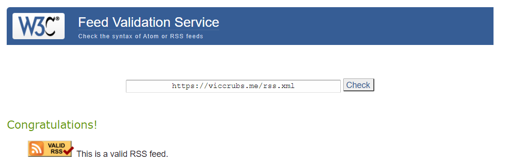

# 前言

不知不觉，Gatsby博客已经上线了一年多。在这一年中，虽然从表面看起来博客变化不大，但是我一直在对博客做一些更新工作。特别是最近一个月，我对博客一些耽搁已久的问题进行了解决，使整个博客更加的完善了。这篇简单的文章就简地列举一下最近博客一些特别值得提到的更新，目前存在的问题，以及对博客的未来发展做一些展望和规划。

# 更新

## RSS恢复支持

博客的RSS源地址是：[https://ddadaal.me/rss.xml](https://ddadaal.me/rss.xml)。欢迎订阅！

其实博客从很早开始（具体来说，从去年10月的[e2e469](https://github.com/vicblog/VicBlog-Gatsby/commit/e2e469ae05646590c0a05755e4e23f384102120d#diff-b9e136416b90437fa1dac910280b45fc)开始）就已经加入了RSS支持，但是那时候的代码就是随便从网上抄了一段，没有对博客比较特殊的地方（例如说多语言的支持，存在不能显示在列表中的文章等）进行定制，后面对博客一些更新的时候也都直接放弃了RSS。这几天，我针对博客的RSS的功能进行了一些修复，包括：**修复文章中不合法的日期串**、**RSS项中的原文链接变成绝对地址而不是相对地址**，**重新修改序列化方法**等，使得博客的RSS功能基本上可以正常使用了。博客的RSS源地址也在[W3C的Feed Validation Service](https://validator.w3.org/feed/)中成功认证，对于大多数RSS阅读器来说已经可以正常使用了。

当然，根据认证服务的结果可以发现，博客的RSS还有一些问题，其中比较严重是**文章内容的图片地址是相对地址，而不是绝对地址**，这造成了包括Read（一个Android RSS应用，[Google Play](https://play.google.com/store/apps/details?id=com.read.app)）等一些工具不能正确显示图片。但是这些问题可能在短时间内无法被解决，因为我目前暂时没有找到有效的、可扩展的方法hook进入Gatsby构建时markdown的渲染流程，并根据我的需求进行修改。

详细地说，目前，将MD编译成HTML是由[remark](https://remark.js.org/)，以及很多周边插件（例如[Gatsby-transformer-remark](https://github.com/Gatsbyjs/Gatsby/tree/master/packages/Gatsby-transformer-remark)）共同完成的。这些插件都有一些默认行为（例如图片地址是相对地址）等。

这些默认行为在大多数情况下都是合理的，让开发者能够开箱即用。但是，**约定大于配置的反面就是配置常常不够完善，在遇到少见的需求的时候让开发者感到束手束脚。**

之前，为了一些特殊需求（例如在markdown里插入React组件（我使用过MDX个人不太好用），给code元素加入一些特殊元素（例如显示语言、行号、复制按钮等）），我多次尝试过hook进remark的编译过程，**在remark进行渲染的时候修改AST，使得进入Gatsby数据源中的htmlAst和html就是经过定制的**，但是一直没能找到合适的方法。

后来，这些功能都实现了，但是不够优雅：在代码中，从**Gatsby数据源**中获取remark渲染后的AST，修改AST后再重新使用[rehype-react](https://github.com/rehypejs/rehype-react)渲染（对这里感兴趣的同学可以查看代码的[ArticleContentDisplay](https://github.com/vicblog/VicBlog-Gatsby/blob/master/src/components/Article/ContentDisplay/index.tsx)组件）。

这样做虽然能够实现需求，但由于在**Gatsby的数据源**中，其htmlAst和html并没有经过定制（定制是在页面渲染的时候执行的），这也造成目前各个方法获得的HTML并不统一。

没有一个可靠的hook渲染过程的方法，也造成了我没有办法修改remark的默认行为，其中就包含图片地址为相对地址而不是绝对地址这个问题。

我正在努力想办法解决这个问题，但是看情况短时间内解决希望不大。

## 使用国内托管（腾讯云的[CODING个人版](https://dev.tencent.com/production)）

博客一直是托管在GitHub Pages上的。GitHub Pages很方便，零开销，在国外用的很广，网络上的教程也到处都是。但是它的问题是在**国内速度非常慢，且非常不稳定**。即使我的博客的相关文件已经比较小了，但是GitHub Pages在国内的速度也极大地影响了网站的用户体验。要是当某篇文章有图片，那体验就更糟了。

多亏了我的博客是静态博客，解决这个问题，本质上只需要把文件托管到某个国内访问速度快的类Pages服务上即可解决问题（点[关于博客](/about/project)查看博客工作原理介绍）。我把目标投向了17年参加南京四校Hack.Christmas时赞助商提供的CODING.NET一年免费VIP账号。虽然那时候VIP基本已经过期，但是当时体验还行，并且也发现了它也提供类似GitHub Pages的功能（也叫Pages服务）。于是，我进行了以下操作：

- 在CODING.NET上开启一个repo，存放博客的文件
- 给这个repo开启Pages服务
- 修改[CI脚本](https://github.com/vicblog/VicBlog-Gatsby/blob/master/.travis.yml)，构建后向GitHub和CODING.NET的repo都推送一次

经过测试，CODING.NET的体验还是非常良好的，在国内的速度也非常不错，于是：
- 修改DNS，将根记录（ddadaal.me）指向了CODING.NET，二级域名（pages.ddadaal.me）指向原有GitHub Pages repo
- 在GitHub和CODING.NET平台上修改域名设置

这样，我的根域名就被解析到CODING.NET提供的Pages服务上。经过测试，网站的速度提高了非常多，国内用户的体验得到了很大的提高。

](speed-comparison.png)

## 多语言环境下文章地址改进

之前，为了支持多语言，本网站的所有文章的地址末尾都增加了语言（cn/en）为了表示这个文章的语言是什么，例如[关于我](/about/me)就有两个版本，`/about/me/cn`（中文）和`/about/me/en`（英文），另外对`/about/me`这种根路径增加了**客户端的跳转**（即在浏览器执行了JS进行跳转，而不是通过服务器发送301（Moved Permanently）的响应。对于静态博客，服务器发送301是不可能的，因为服务器端不能执行这么“复杂”的逻辑）到**本文章的所有版本的第一种语言版本**（知道你对第一种语言版本感到疑惑，继续往下看）。

这样做有2个问题：
1. 对于所有文章，包括占大多数的只有一种语言版本的文章，其地址栏最后都有语言字符串，造成路径不必要的太长；
2. 这个“第一种语言版本”的结果每次执行可能是不相同的，有可能造成根路径在每次更新后都出现变化（没有验证过，只是存在这种可能）。

我在最近也重新设计了路径的计算方法，较好的解决了这个问题。以id为`an-article`的、有两种语言版本（`cn`和`en`）文章来举例子：
1. 首先，对一篇文章的所有语言版本，**根据lang的字典序进行排序**，使得每次所有版本的顺序都是相同的，解决了第二个问题
     - 例子中，顺序为`[cn, en]`；
2. 选取中文版本（`cn`）的文章，或者如果中文版本不存在的话，选择第一个版本（由于所有版本的顺序是相同的，第一个版本也总是相同的），生成根路径`/articles/${articleId}`的页面
     - 例子中，选择了中文（`cn`）版本生成`/article/an-article`的页面；
3. 生成`/articles/${articleId}/${上一步生成的版本的语言}`到`/articles/${articleId}`的客户端跳转
     - 例子中，生成了`/articles/an-article/cn`到`/articles/an-article`的跳转
4. 对其他所有语言，生成`/articles/${articleId}/${语言}`的页面。

通过这样，可以保证博客中大多数单语言的文章都生成在**根路径**，不再有碍眼的多余的语言字符串，同时也保证了多语言功能和向前兼容性。

举几个例子：

| 文章 | 语言 | 之前的路径 | 现在的路径 |
| -- | -- | -- | -- |
| 关于我 | cn | `/about/me/cn` | `/about/me` |
| 关于我 | en | `/about/me/en` | `/about/me/en` |
| 2018年总结 | cn | `/articles/summary-for-2018/cn` | `/articles/summary-for-2018` |
| Simstate and Why | en | `/articles/simstate-and-why/en` | `/articles/simstate-and-why` |

最后提一下，一般来说，网站要支持多种语言，目前大家通常使用以下的两种方法实现，但是由于他们都需要特别的处理，也为了能够**热切换语言**，最后采用了以上这个比较简单的方法（即在路径最后增加语言表示）实现：

| 方法 | 解释 | 例子 | 问题 |
| -- | -- | -- | -- |
| 二级域名 | 每个语言的子网站都有自己的二级域名 | 淘宝 | 本质上是两个网站，当一种语言的页面不存在时，需要做跳转，懒得维护 |
| 子页面 | 每个语言采用类似`https://domain.com/{zh-CN, en-US}/path/to/page`的方法，通过路径的第一个部分区分不同语言 | 微软官网（[切换语言的页面](https://www.microsoft.com/en-us/locale.aspx?absoluteReturnUrl=https%3a%2f%2fwww.microsoft.com%2fzh-cn)） | 处理路径时（例如导航栏高亮），需要单独切分掉`pathname`的第一部分；当一种语言的页面不存在时，需要做跳转 |

## 使用自己开发的[simstate](https://github.com/ddadaal/simstate)进行状态管理

博客一开始是使用[unstated](https://github.com/jamiebuilds/unstated)进行状态管理的。这个库非常的简单易用，很符合react的理念，于是当时我非常喜爱这个库。但是随着后来hooks的推广和unstated迟迟没有跟进hooks等原因（其实已经跟进了只是当时我的不知道……），我认为是时候写一个自己的状态管理库了。这之后故事可以查看[Simstate and Why](/articles/simstate-and-why)文章，这里就不说了。

在v3.0时，我重构了simstate，完全抛弃了class的概念，完全使用React原生的hook就可以完成状态管理。而博客就是第一个完全采用simstate v3.0的项目。

在使用新版本的时候，我也积累了一些在项目中正确使用此项目的经验，例如说：

- Store取名最好是**大写字母**开头，因为在使用的时候经常出现`const aStore = useStore(AStore);{:ts}`的代码，若使用小写字母开头，这代码会编译失败。这也可以帮助同时使用多个Store的情况时，区分不同的Store实例；
- 如何写一个专门的Store（例如博客项目的[LocationStore](https://github.com/vicblog/VicBlog-Gatsby/blob/master/src/stores/LocationStore.tsx)）来管理浏览器history
- 在把Store和自己的hook（例如`useCallback`等）进行组合的时候，需要把Store实例加为hook的一个依赖，因为Store实例是**不可变的**

这些常见问题也写到了[simstate项目的README](https://github.com/ddadaal/simstate)中，也是给未来自己（和其他人，如果有人在用的话）带来方便，帮助解决这种常见问题。

## 其他值得提到的近期的修正（太远的我也记不住了……）

- 修正了错误的授权协议（`BY CC-SA 4.0` => `CC BY-SA 4.0`）
- 最后更新时间和文章发表时间正确支持了多时区（时间将会以用户的本地时区进行显示）
    - 在CI上构建时，机器给出的时间是UTC时间，如果不经过处理就显示会让人产生误解
- 修正了一些没有正确使用的HTML元素的属性造成可访问性（accessibility）问题
    - 例如，在文章列表界面中用鼠标点击文章标题，可以进入文章内容。但是使用vimium等工具在文章列表界面导航时，会发现文章项的标题的链接不能点击。
    - 这是因为在实现时，点击标题进入文章是通过绑定`onClick`事件跳转实现，不符合HTML标准使用`a`标签的`href`属性进行跳转。
    - 修改后，vimium恢复了正常。

# 问题和后续计划

去年[Gatsby博客上线](/articles/gatsby-powered-vicblog-online)的时候提到：

> 博客的大厦已经基本建好，接下来只需要小修小补即可。

其实这一年中博客的发展和变化还是比较大的，已有的功能继续完善，没有或者缺乏的功能也正在加入。在接下来，我会在以下几个方面继续完善我的博客：

1. 文章数量和质量

毕竟博客的本职工作的写文章（而不是像我这样大多数时间在写网站本身……），以后我会带来尽可能多尽可能高质量的原创文章。

1. 重构样式和完善UI设计

目前博客是使用大名鼎鼎的[bootstrap](https://getbootstrap.com/)的组件库进行设计的。虽然很方便，bootstrap也还算比较耐看，但是，由于要将使用SCSS编写的bootstrap和我偏好的CSS-in-JS方案（例如[styled-components](https://www.styled-components.com/)）组合起来使用，造成了一些问题：

- 目前我的博客的样式有`CSS`，bootstrap带来的`SCSS`和分散在各个组件里的`styled-components`组件，非常的混乱，不容易维护（例如说某个共用颜色，必须要在多个地方定义多次）；
- 由于上个原因，没有一个中心化的配置，很难实现**黑暗模式**
- 基于传统的CSS/SCSS的**全局的样式解决方案**和**组件化**的React和CSS-in-JS是两种不一样的思维方式，让开发者有一种**思维分裂**的感觉
    - 例如：对于重用一个样式的需求，
        - 使用CSS/SCSS的思维方式是写一个类（使用BEM命名规范规避类型冲突），然后通过组件的`className`组合样式；
        - 而`styled-components`的思维方式，是在一个已有的样式的组件上，通过``styled(Component)` /** styles **/ ` ``进行扩展。
        - 这个[`ListGroupHeader`](https://github.com/vicblog/VicBlog-Gatsby/blob/master/src/components/UI/ListGroup/ListGroupHeader.tsx)组件就是强行使用组件化的方式重用CSS的样式，这种模板代码非常的浪费时间和不灵活。
- bootstrap看厌了，想看点新鲜的 ::smile::

5月份的时候，我尝试在[`styled-system`](https://styled-system.com/)的支持下写自己的UI库[vicui](https://github.com/ddadaal/vicui)。组件基本都完成了，但是在使用的时候遇到了[很奇怪的问题](https://github.com/ddadaal/vicui/issues/1)，造成我完全无法在其他项目中使用。

同时，我在项目中采用了将[Rebass](https://rebassjs.org/theming/)这样的`primitive UI components`和`CSS`混用的方式，使得不仅在保证在React中使用方便和可扩展性，同时在以后迁移到React生态圈之外时，已有的CSS的可以重用，但是在`无法避免全局样式类名`、`对用户公开多大自定义样式的能力`等问题上也存在一些问题。

对于样式，这个前端”永远的难题“，我还需要更多的学习和实践。

3. 补充功能

静态博客无法单独实现**所有依赖于服务器的功能**，包括访客统计、评论、点赞等功能。我已经使用[gitalk](https://github.com/gitalk/gitalk)解决了评论问题，解决地还算满意；使用[CNZZ](https://www.cnzz.com)解决访客统计功能，虽说是能统计，但是它甚至没有提供API，不能编程实现网站访客的显示，更别提分文章的统计了；至于点赞，这还是算了吧……

要解决这个问题，可以自己写后端，将这个博客变成一个SPA。目前使用场景非常适合微服务，即每个功能之间是的独立的。例如，对访客统计写一个服务，对点赞写一个服务，各个服务之间相互独立，独立开发、渐进部署。我也正在学习这个方面的技术，期待早日能有一个可靠的、可扩展的、博客专用的基础设施和服务能够上线。

4. 一些其他问题：例如中文字数统计不正确、之上提到的自定义MD渲染过程等

# 感谢！

博客已经走过一年了。在这一年中感谢所有支持我的博客的读者和网友，感谢你们对我文章的支持！我也会在之后继续完善博客的内容、设计和功能，让博客更加地完善、丰富和易用！

