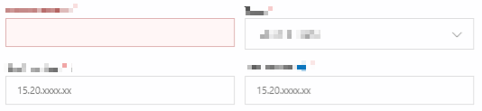
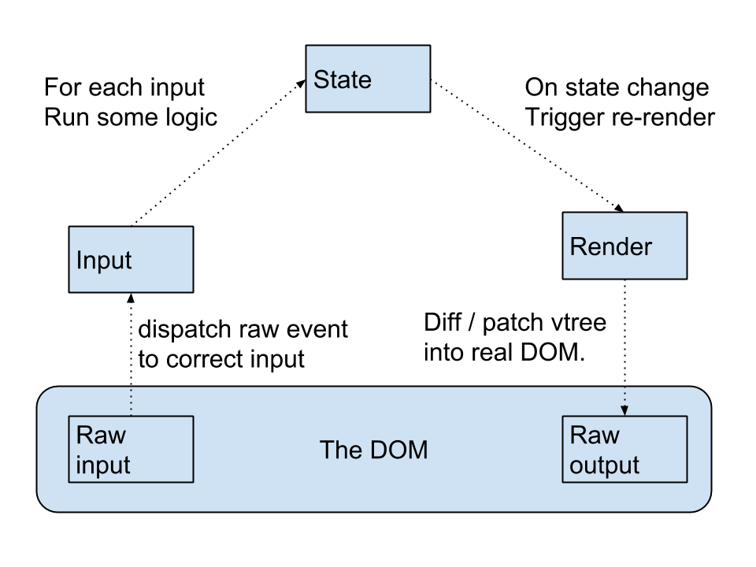
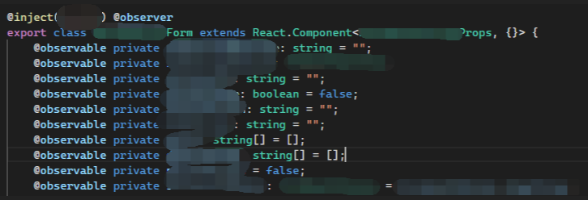
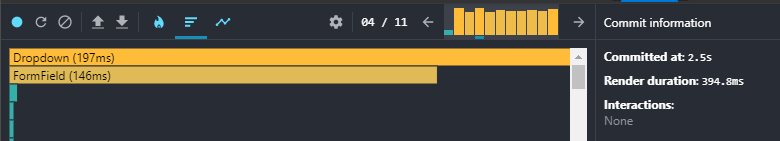
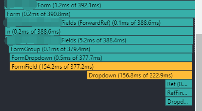
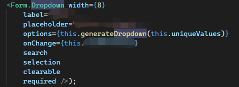
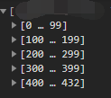
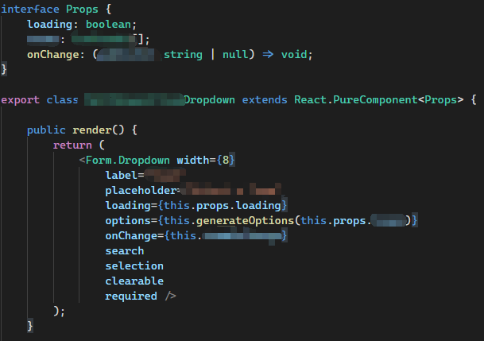
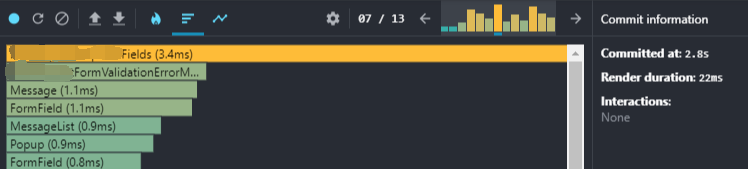

> Note: This code is from an internal project. Measurements apply to protect confidential information, but the problem and methods mentioned in the article are universal and not limited to specific projects.

# The Problem

I was working on a form that had very poor performance. To be specific, at every key stroke, the form responded pretty slowly. What's worse, the component and the whole website became completely unresponsive for **seconds** if several keys were stroked sequentially (like input a long number), which was, unfortunately, the normal use case for this field.



# Investigation

## Validations?

From the gif provided above, you may find some details that are worth taking notice of:

- The first field had the **worse performance**,
- The first field had some kinds of input validation (loading indicator when the first inputs were registered),
- The field below the first field had better performance than the first one, and it had no validation.

Hmm...It looks like **the validation** might be the cause.

However, the validation process was merely some format check, and a request which would be cancelled if next key stroke had come before it completed. It did increase the delay of input, but should not be so significant.

## Re-renders of the Whole Form?

### The Challenge of Forms in React

The **re-render of the whole form at every input** might be the problem as well.

React has been known as *not good at implementing forms* because of its famous **unidirectional data flow**.



Unidirectional data flow simplifies the data flow and fits seeminglessly with the concept of React. However, since **each update to the state will trigger the component to re-render**, it might impact the performance of the app.

Form is one of such cases, because a form consists of multiple input fields, and **each input to any one of them** would update the state, and re-render the whole form and every other fields. Therefore, writing forms in React has always a challenge.

### Complicated Form

Looking at the code, the form was implemented in a very React way: the form contained all the fields, and handled every `onChange` event for each input fields.



The form was complicated with dozens of fields, several **sync/async and cross-field validations**, **dynamic placeholders** and some unnecessary **duplicate calculations** (which could be improved with constants and cache).

It seemed pretty evident that the **re-renders** and **the complicated calculations** during the render were the cause to the problem.

### No Easy Solutions

Having found the reason, what's left was to find a solution. However, the reason that form implementation is called a *challenge* in React is that it can not be solved easily. There are lots of React form library from the community (like [react-form](https://github.com/tannerlinsley/react-form), [formik](https://github.com/jaredpalmer/formik)) trying to solve the form as a whole by providing a complete solution to some common form challenges, including input management, async validations, and submission. They may be viable for many users and should be considered if you are having trouble building a form in your project, but I couldn't adopt them in this project because:

- hiding complexities usually means introducing other complexities
    - for example, when using the libraries, more problems are introduced, like **less flexibilities**, **less understandable code**, **interop with UI libraries** and **the cost of learning and adopting a new set of APIs**.
- The code is involved with several internal concepts and conventions, which I am not familiar enough. As a result, I don't have the confidence to rewrite the logic correctly in a short time;
- introducing a new library into this project is hard, for it is a internal project that has over 200K lines of TypeScript code, hundreds of authors and users, so the review for this project is strict.

## Maybe Not Re-renders?

Besides, my experiences told me that it was possibly not the **re-renders** that was to blame, since the updates of the form should not be so costly that would result in such a significant delay.

I have encountered situations where even **a whole page** re-rendered at every interaction, but React and modern JavaScript engines is more than capable to drive it smoothly without even a stutter. This form had several fields to be re-rendered at every input, but when taking the whole page into consideration, the number of re-renders inside this page was negligible.

## Profiling, Profiling, Profiling

After wasting days on *brainstorming* the source of problem, I decided to diagnose the issue in a scientific way -- **profiling**.

[React's official devtool of Chrome](https://chrome.google.com/webstore/detail/react-developer-tools/fmkadmapgofadopljbjfkapdkoienihi) has a built-in profiling tool. By recoding a sequence of user interactions, profiler can provide performance metrics on each commit during the record, like what components are re-rendered, how many time they take to re-render, with which the developer can locate the components that have biggest impact to the performance, and optimize them accordingly.

Start the recoding, repeat the operations of the gif above, and I had the following result:




The first chart (ranked chart) showed the time to re-render for each component that had re-rendered on this commit. The second chart (flamegraph chart) shoed the re-rendered components **hierarchically**: that is, the time to render the component itself, and each of its children.

As you could see, a **Dropdown** component took a significant time to re-render. In fact, all the graphes on all the last 10 commits had led me to the same component. By following the hierarchy provided by the flamegraph, it didn't take long to locate the component, which was the dropdown **on the right side** of the first field with slow responsiveness, and implemented as follows:



It looked like a normal dropdown with the exception of a **duplicate calculations**: generating an options array at every render. **Providing different instances at every render** is a common source of performance problem in React, because it signals React that the props have changed and a re-render is required, even the objects between renders are **deep equal**. The solution is straightforward: instead of generating a different instance each time, provide a constant or a class field that only changes when it is modified.

But unfortunately, in this case, after replacing the call to `this.generateDropdown` to a constant, the problem persisted.

## Large Quantity of Options

The source of options of the dropdown came from a network request that was initiated when the page loaded. Another clue that I found during investigation was that when network errors happened, the input became very **responsive**, at which time **the dropdown had no option**. And after several intentional experiments, I found the correspondance between options and performance to be true (no option -> good performance, had options -> bad performace).

I was just a maintainer of the component, not the original authors, so I didn't take notice of the contents of dropdown during my previous investigation. Now, according to the correspondance, I checked out the options of the dropdown, only to find it had over 400 options.



Rendering **so many options** at each render would definitely impact performance pretty hard, unless the component had thought of it and selectively re-rendered only the changed part.

This project used [React Wrapper of Semantic-UI](https://react.semantic-ui.com/) which was a famous component library and open source. By diving into the source code, I found that the dropdown did re-render every options every time without any memoing or caching.

https://github.com/Semantic-Org/Semantic-UI-React/blob/master/src/modules/Dropdown/Dropdown.js#L1275

```jsx
// omitted
renderOptions = () => {
  // omitted
  return _.map(options, (opt, i) =>
    DropdownItem.create({
      active: isActive(opt.value),
      onClick: this.handleItemClick,
      selected: selectedIndex === i,
      ...opt,
      key: getKeyOrValue(opt.key, opt.value),
      // Needed for handling click events on disabled items
      style: { ...opt.style, pointerEvents: 'all' },
    }),
  )
}

renderMenu = () => {
  // omitted
  return (
    <DropdownMenu {...ariaOptions} direction={direction} open={open}>
      {DropdownHeader.create(header, { autoGenerateKey: false })}
      {this.renderOptions()}
    </DropdownMenu>
  )
}

render() {
  // omitted
  return (
    // omitted
    {this.renderMenu()}
    // omitted
  )
}
```

# Solution

In this case, the options didn't update anymore after the request had completed. Therefore, there was no need to update and re-render the options every time the component had changed.

To stop the re-render, I extracted the dropdown out into a separate component, passed the options as a prop, and most importantly, made it a `PureComponent` which only re-rendered itself when the props had changed.

The dropdown was used in a **uncontrolled** way -- that is, not managing its `value` by the DOM instead of as a state of React component by not passing value to the `input` DOM field. I had to admit it was not the React way, but here, not passing value to it meant that the component would **never update**, which was exactly what I wanted.



The optimization worked like a charm: the render time of the whole form for each input had reduced from **~400ms** to **~22ms**, and there was no any unresponsiveness and delay at every key stroke.



# Verdict

Form is React is indeed a challenge. Without careful designing and implementation, problems may occur at any time, anywhere.

The issue here was ultimately the re-renders, but not the form I originally thought of, but the dropdown with large number of options. It is important to app performance to **understand React update strategy** and **control the component update** with lifecycle functions, property hook usage, memoing and caching, especially when the the number of component to render is too large.

The **profiler** was the key to finding the component to blame by providing the data of time to re-render for each component. Therefore, when a performance issue is detected, stop wasting guessing which compoenent causes it, and let profiler take you straight to it.
