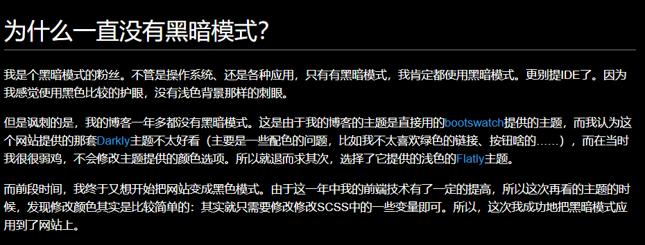
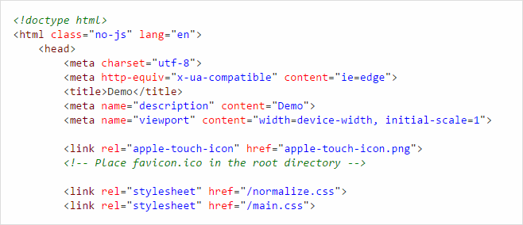
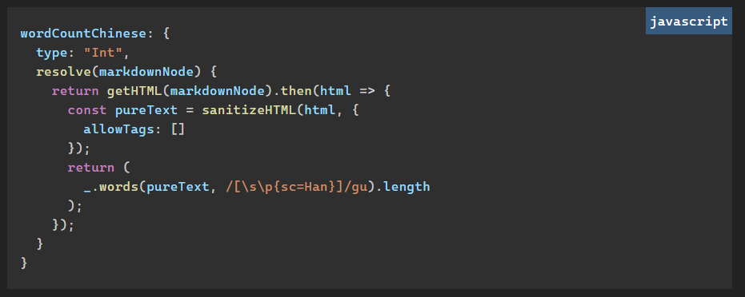

# 为什么一直没有暗色模式？

我是个暗色模式的粉丝。不管是操作系统、还是各种应用，只有有暗色模式，我肯定都使用暗色模式。更别提IDE了。因为我感觉使用黑色比较的护眼，没有浅色背景那样的刺眼。

但是讽刺的是，我的博客一年多都没有暗色模式。这是由于我的博客的主题是直接用的[bootswatch](https://bootswatch.com/)提供的主题，而我认为这个网站提供的那套[Darkly](https://bootswatch.com/darkly/)主题不太好看（主要是一些配色的问题，比如我不太喜欢绿色的链接、按钮啥的……），而在当时我很很弱鸡，不会修改主题提供的颜色选项。所以就退而求其次，选择了它提供的浅色的[Flatly](https://bootswatch.com/darkly/)主题。

而前段时间，我终于又想开始把网站变成黑色模式。由于这一年中我的前端技术有了一定的提高，所以这次再看的主题的时候，发现修改颜色其实是比较简单的：其实就只需要修改修改SCSS中的一些变量即可。所以，这次我成功地把暗色模式应用到了网站上。

# 有哪些修改？

其实网站的主题方面大概来说变化不大。**主题色**没有改变，标题栏和footer等组件的样式没有变化。主要修改的是**背景色**、**文字颜色**以及**代码块的颜色**。

## 背景色、文字颜色

对于背景色和文字的颜色，你可能会感觉这是个很简单的工作：暗色模式嘛，**背景纯黑**，**文字纯白**就可以了。但这样的效果其实并不好：黑白对比度太高，白色文字显得过于**刺眼**。纯黑的背景和网站的其他部分的颜色也不是很搭配。

所以，有的应用的暗色模式，不是使用的真正的黑：

- VSCode的默认暗色背景的颜色是`#1E1E1E`
- JB系IDE的默认暗色背景的颜色是`#282828`
- Chromium Edge的暗色背景的地址栏周围的颜色为`#3B3B3B`
- ...

因此，通过一些尝试和主观感觉，在我的网站中，背景和文字颜色分别选择的色号是`#222`和`#ced4da`。

当然了，如果读者对颜色选择有一些意见，欢迎在下面评论框留言。

## 代码块的颜色

本网站使用[prism.js](https://prismjs.com/)对代码块进行高亮处理。这个插件负责把代码处理成一个一个的token，然后使用CSS对各种token进行样式处理的。之前代码块使用的是类似**Visual Studio**的样式（[地址](https://github.com/PrismJS/prism-themes)），如下图：

看起来还是蛮不错的，但是它是浅色的，放在黑色背景下很瞎眼。所以这让我去找暗色的配色方案。

通过寻找，我也成功找到了一个[类似VSCode默认的暗色配色（dark+）的方案](http://templarian.com/2018/08/08/prismjs-visual-studio-code-dark-theme/)。把它下载下来后，经过一些魔改（设置背景色、字体优先[Cascadia Code](https://github.com/microsoft/cascadia-code)等），就成功用到网站上了。效果如下（下面是张图片）：类似

# 不足

其实我的本意是像其他很多网站一样，可以在暗色模式和浅色模式中切换的。但是由于我的样式是使用的SCSS，各种颜色是使用的SCSS的**变量**功能，而SCSS其在网站构建的时候被编译成CSS（就像TypeScript在构建的时候被编译JavaScript一样），这些变量的信息就丢失了，编程出来的CSS里就是写死的颜色。要做到可以动态切换，有两种办法：

1. 使用`CSS Variables`功能（[MDN](https://developer.mozilla.org/en-US/docs/Web/CSS/var)），即使在SCSS中，首先把所有的SCSS变量设置成CSS variables，然后使用单独的CSS类来设置各个CSS Variables，以此来实现动态切换颜色
2. 写多份SCSS文件，每份文件设置一个颜色主题，然后编译的时候产生多个CSS文件，然后通过引用不同的CSS来实现的颜色切换。这个只是理论可行，实际代码上怎么写没有试过。

其实第一种方法的可行性挺高的，但是就像我在之前博客总结的一样，我的博客的样式方面的代码就是一团乱麻：有的样式是写成scss的，有的样式是用`styled-components`写的，而二者的互操作性又基本为0，所以造成了**样式同步**的问题：

`styled-components`无法使用`scss`的变量，使得有的常量定义在SCSS中，有的定义在ts文件中（[`variables.scss`](https://github.com/ddadaal/ddadaal.me/blob/master/src/styles/variables.scss)和[`variables.ts`](https://github.com/ddadaal/ddadaal.me/blob/master/src/styles/variables.ts)）。但是有点常量又是公用的，所以只能在ts和SCSS都定义一次，这又不能做到修改一处全局生效（例如这次修改暗色模式的之后，文章列表中每一个文章的标题仍然是黑色的，因为这些标签的样式是用`styled-components`，并不能和SCSS中定义的颜色相同步）

这次更新我也对代码做了一些很有限的重构（例如把文章列表的每一个文章项的样式的风格写成了SCSS ([`article-item.scss`](https://github.com/ddadaal/ddadaal.me/blob/master/src/components/Article/ArticleItem/article-item.scss))，并且在其中引用`variables.scss`中定义的颜色。这样，修改`variables.scss`之后，文章项的样式也能自动同步）。但是这是治标不治本的，并没有解决我的样式代码过于混乱的问题。我希望在以后能够完全使用一个统一的框架和规范来编写我的样式，从而不仅提高代码的可维护性，也能实现诸如主题切换这种功能。

