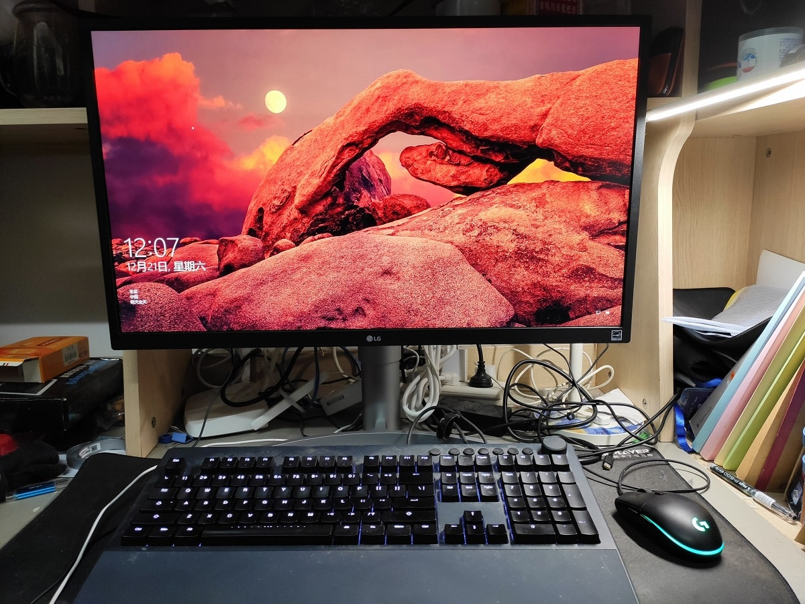

# 出手已有显示器

最近身边几个同学配了新台式机，而且都是3700X+1660Ti的特别香的配置，让我心里直痒痒 :persevere:，但是身为一个坚决的等等党 & 防止49年入国军 & 明年下半年要换个城市呆着，台式机还是等到明年到新学校后，配Zen 3和30系显卡比较好。

但是呢，同学装机，得要显示器吧，我的显示器（ThinkVision X24q）正好也用了3年多了，用起来虽然没什么大问题，但是以后换了电脑，用个2K60还是太浪费配置了，换是肯定得换的。要换新，就要卖掉旧的显示器，而从闲鱼出的话，得清洁、拍照、和卖家详细介绍、包装、快递的，更别提碰到杀价党。而同学装机，也需要显示器，这不正好是一个出手好机会？不用清洁、不用拍照、不用快递、不用当售后，直接抬到楼上就完事了，省事:thumbsup:

当时这显示器买成1800，是当时最便宜的2K显示器了，虽然没啥特色功能（高刷新率、FreeSync、HDR啥的），但是显示效果、色彩、外观都是一流，并且刚刚能放进学校的这又浅又矮的桌子，是非常值得推荐的显示器。

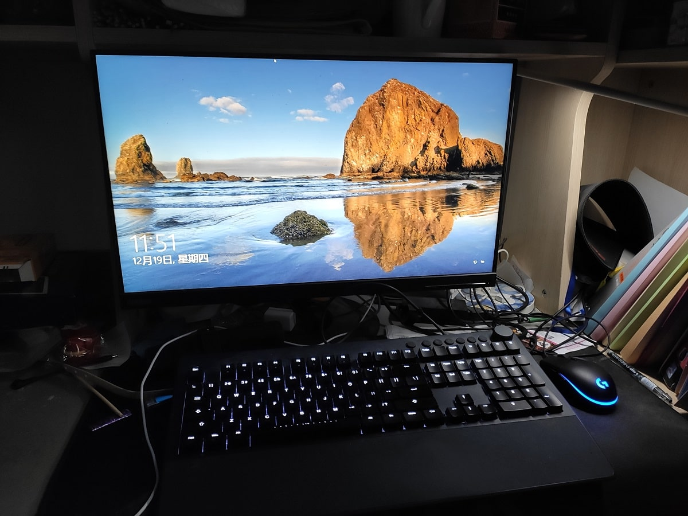

本以为这几年显示器可能变化不大，现在出个1000块应该还是可以的，没想到联想变了，这显示器全新只要999了，比一些1080P的显示器都便宜……

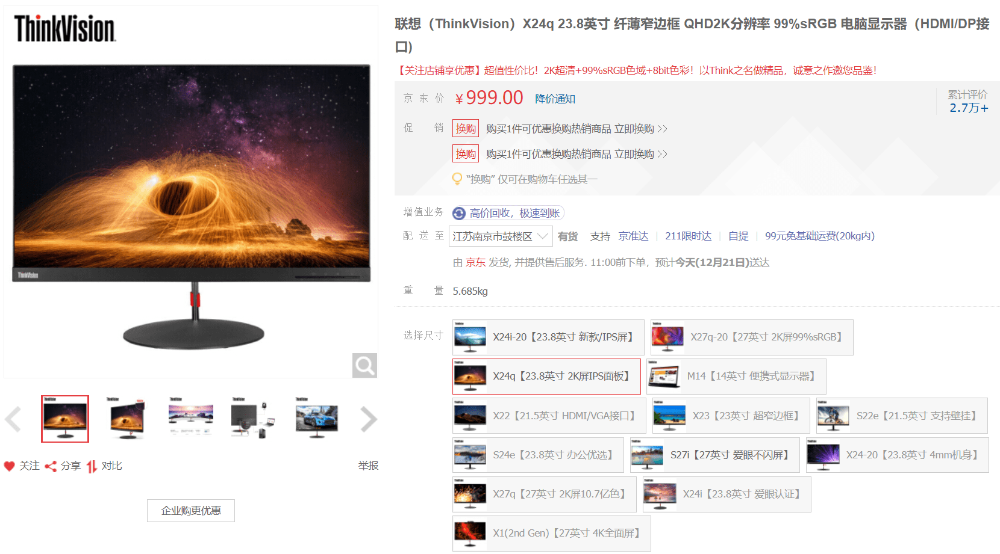

于是没有办法，直接500块丢给了同学。然后，我就开始了选新显示器的过程。

# 2K144 vs 4K60

选显示器第一个是选分辨率和刷新率，具体来说，就是在2K144和4K60里选。

4K60和2K144的显示器差不多，都有1700-2000左右的选择（主要是AOC和LG的，只要不要加Type-C等功能，这俩厂的确实便宜），最重要的差别就是分辨率和刷新率。

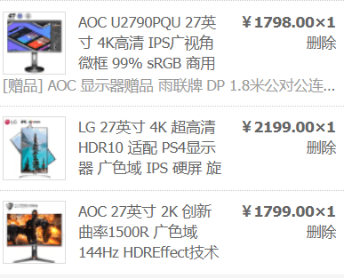

这个问题让我非常的纠结：

## 144Hz

高刷新率的**丝般顺滑**确实**能够显著提高包括游戏在内的所有日常工作的体验**。而且我个人也是主玩FPS类型的游戏，高刷新率在这类游戏里很有优势。

我的游戏笔记本的内置屏幕只是一块75Hz的屏幕，但是当我第一次用它，也感觉到之前没有体验过的顺滑，并且在我在换用60Hz的X24q时，也感到60Hz不太流畅。75Hz都这样了，更别提144Hz了。

但是，根据我的观察，2K144普遍使用的是广色域的屏幕，但是不知道是不是广色域的原因，我在体验了一同学的2K144后，感觉**颜色有点不自然**。

另外，从一屏能显示的内容来说，从2K60换到2K144，分辨率没变，一屏显示的内容也不会有变化，在生产力方面可能基本没有什么变化。

## 4K

但是4K显示器的**清晰和生产力**也是我想要的。

我的X1C自带的屏幕是1080P的，让我自己换成了2K屏，这个清晰度的提高又让我回不去1080P了。

之前室友有一台LG 27UK650，体验过一下，确实也感觉到了4K的分辨率优势，虽然体验的变化没有60Hz到144Hz那么大，也没有X1C从1080P到2K的变化那么明显，但是确实文字更加的清晰了。

并且，通过降低显示器的缩放比例（DPI）（之前我2K屏是用的100%缩放，4K现在用的125%缩放），也可以**增加显示器一屏显示的内容，提高生产力**。（4K屏默认是150%缩放，但是150%缩放下的4K屏显示的内容和2K 100%是一样的（2160/1.5=1440正好是2K的垂直分辨率，水平分辨率原理相同））。

下表显示了几个尺寸和分辨率的PPI值（[计算工具](https://www.sven.de/dpi/)），可以看到这PPI提高是比较显著的。这里需要注意的是，PPI越高越清晰，但是这也需要和眼睛和屏幕距离有关。下表显示的距离是我自己的习惯的实测，每个人的偏好都不一样。眼睛和屏幕距离越长，需要的PPI就越低。14寸的两个是笔记本。可以看到，虽然24'2K到27'4K的PPI变化（计入距离的减小）和14'1080P到14'2K差不多，但是主观体验上来说还是笔记本的分辨率提高带来的变化更大。

| 尺寸分辨率 | PPI    | 个人的坐正工作时眼睛到屏幕的距离                   |
| ---------- | ------ | -------------------------------------------------- |
| 24' 2K     | 122.38 | ~65cm（24寸能放进桌面，看之前的桌面图）            |
| 27' 2K     | 108.79 | ~56cm （27寸不能放进桌面，只能突出来，降低了距离） |
| 27' 4K     | 163.18 | ~56cm                                              |
| 14' 1080P  | 157.35 | ~38cm（笔记本）                                    |
| 14' 2K     | 209.8  | ~38cm                                              |

## 高度

另外还有一些其他小区别：比如LG的全系都放不进学校的桌面（学校桌面高度**42cm左右**，LG的最低只能放到43cm-46cm，AOC的是可以的放到40cm左右的）；LG的不带可升降底座的会便宜200块左右。

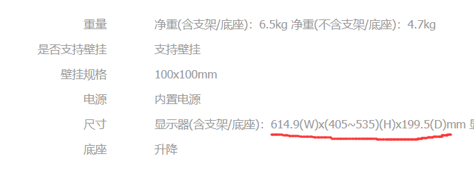
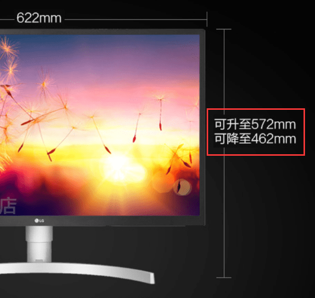

但是高度不需要太过在意，这个把位置挪挪就能解决，并且有个额外的好处：可以通过可升降底座**提高显示器的高度，防止长期低头对脖子的伤害**。

从文章第一张图和之前那张X24q的桌面的对比，可以看到目前的显示器的高度比较高（测量**桌面到屏幕显示部分的距离**，现在是**18cm-52cm**之前是**12cm-42cm**）。这样我用电脑的时候头甚至会稍微抬一点。这样虽然一开始不习惯，但是用一段时间后我确实发现了脖子会舒服一些。在微软工作的时候我也发现我和身边的同事的显示器的高度都是比较高的。

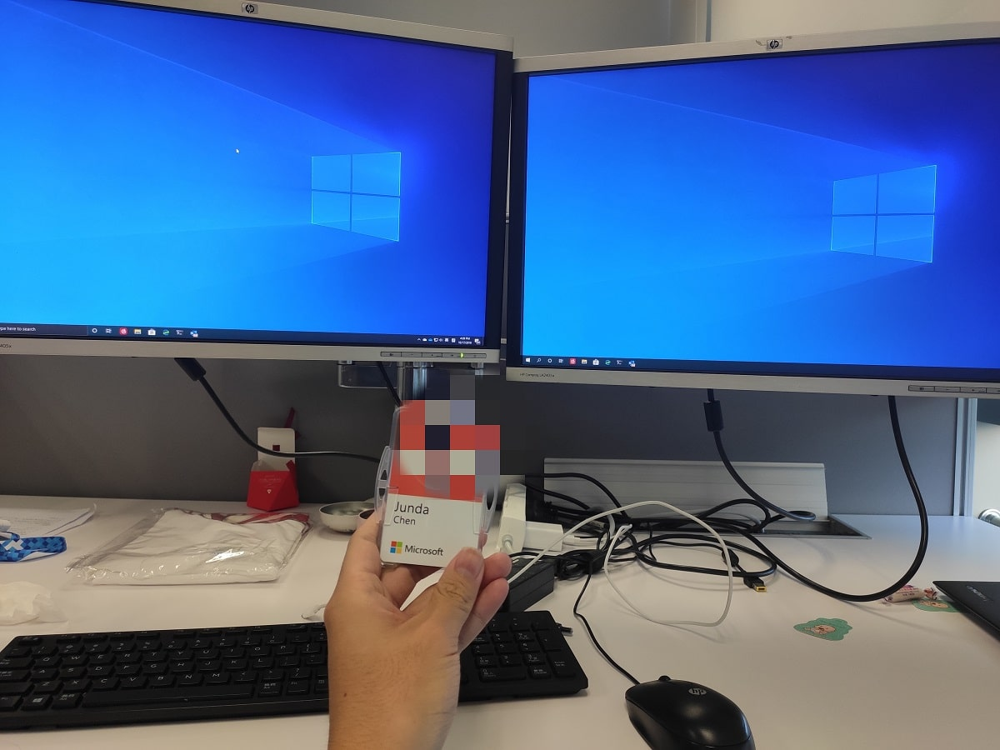

## 选择

选择4K60，就意味着放弃了高刷新率的丝滑体验，并且花钱买了我不需要的东西（10bit面板、准确的颜色等设计师专用的），还有看YouTube要耗更多的流量了；

选择2K，就放弃了更多的一屏内容和更加清晰锐利的文字。

这真的是个艰难的决定。

最后选了4K60，购入了LG 27UL550。最终让我下手的原因其实会让你们感到哭笑不得：

**怕用惯了144Hz后，对其他所有屏幕都感觉卡顿**。

嗯。这理由非常让人信服。

## 4K144

其实呢，俗话说**世界上所有问题都是没钱的问题**。截至写稿时，市面上已经有好几款4K 144的显示器了，其中最便宜的是宏碁XV273K，某淘宝店最低卖到4600块。嗯，2K144+4K60=4K144，不管从性能还是价格上来说都没有毛病:thumbsup:。

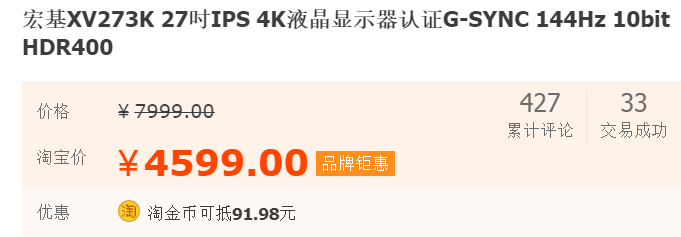

过段时间的CES2020上肯定也会有新的更便宜的4K144出现，但是个人推测最低不会低于3000，低于3000我会立刻吐血，还是没有掏出49年国军的命运。

## 21:9 1440P 144Hz带鱼屏

其实个人现在觉得要生产力和游戏兼备的，除了4K144，**21:9 1440P 144Hz带鱼屏**也是个比较好的选择。左右分屏空间大，1440P保证了垂直高度也是比较够用的，从生产力角度来看可能比4K更有优势。而且也有高刷新率，最后价格也非常不错：小米的可以到2499块（[JD](https://item.jd.com/100009387754.html)）。但是1440P的带鱼屏（注意不要买成1080P的）都是34寸的，对我来说还是太大了，宿舍空间还是太小了。要是有充足的桌面空间的话，可以看看带鱼屏。

# DisplayPort和HDMI的各种版本以及HDR

## 4K60

在1080P甚至2K屏时代，一般不需要太纠结接口的问题，因为目前早已经烂大街的HDMI 1.4和DisplayPort 1.2（包括mini DisplayPort）的带宽都能支持2K。但是4K60就有点不一样了：**HDMI 1.4只能支持到4K30**，所以要想要4K60，只能使用HDMI2.0或者DisplayPort 1.2或者1.4。

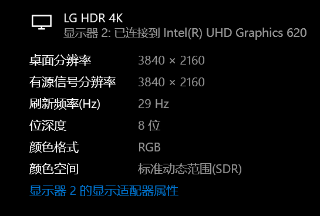

我的游戏笔记本（MSI GT72VR 6RD）自带了一个mini DisplayPort和HDMI。对于HDMI，官网显示这个HDMI是支持4K60的，所以应该是HDMI 2.0。而mini DisplayPort并查不到其具体的版本，但是由于1.2版本的DP就已经支持了4K60，所以这个口支持4K60是没有什么问题的。但是这个DP口到底是1.2版本的还是1.4版本的，我并查不到资料。

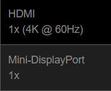

之前为了使用VR而空出HDMI，电脑上一直是通过一根mini DP转DP线接在显示器上的。所以拿到新显示器后，我直接把DP线插上去了，4K60一点压力都没有。甚至可以打开10bit颜色深度。

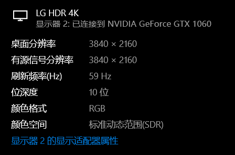

## HDR

本来事情已经就这样结束了。但是当打开HDR的时候，显示效果突然就不太对劲了：

- 黑色变得**白**了一点（感觉对比度下降）
- 文字变得锯齿感更重了
- 鼠标移动的流畅性出现了明显的降低

后面两个效果能用肉眼看出来，但是尝试过多次无法使用视频或者照片表现出来，但是第一点可以对比以下两张照片看出来（两张照片均为设备小米9SE手动模式拍摄，光圈f/1.75，快门1/30s，焦距4.77mm，ISO 100，显示器亮度没有变化，第一张开启HDR，第二张关闭HDR，两张照片的顺序真的没有反）

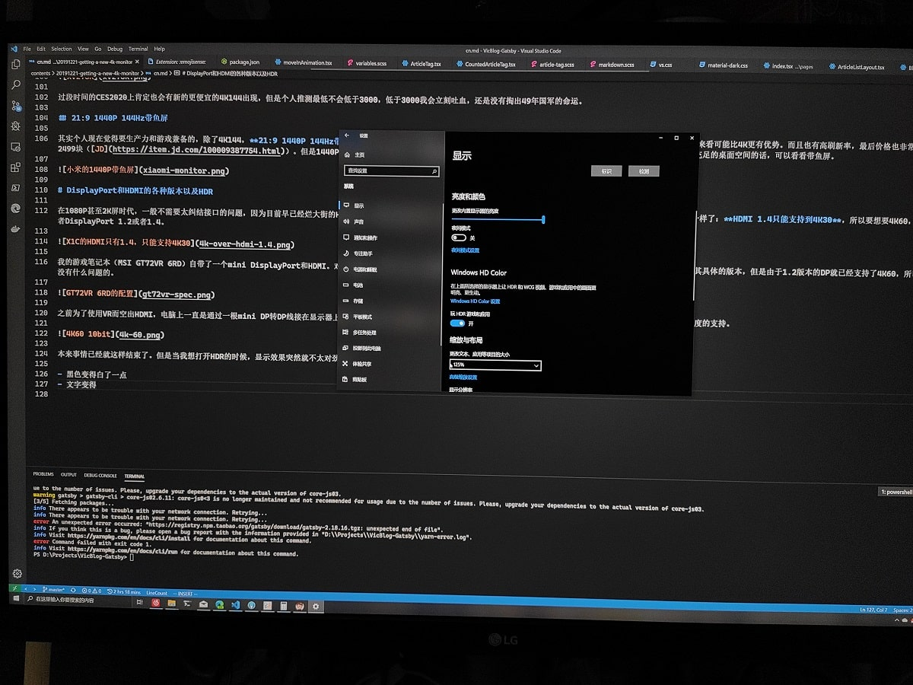
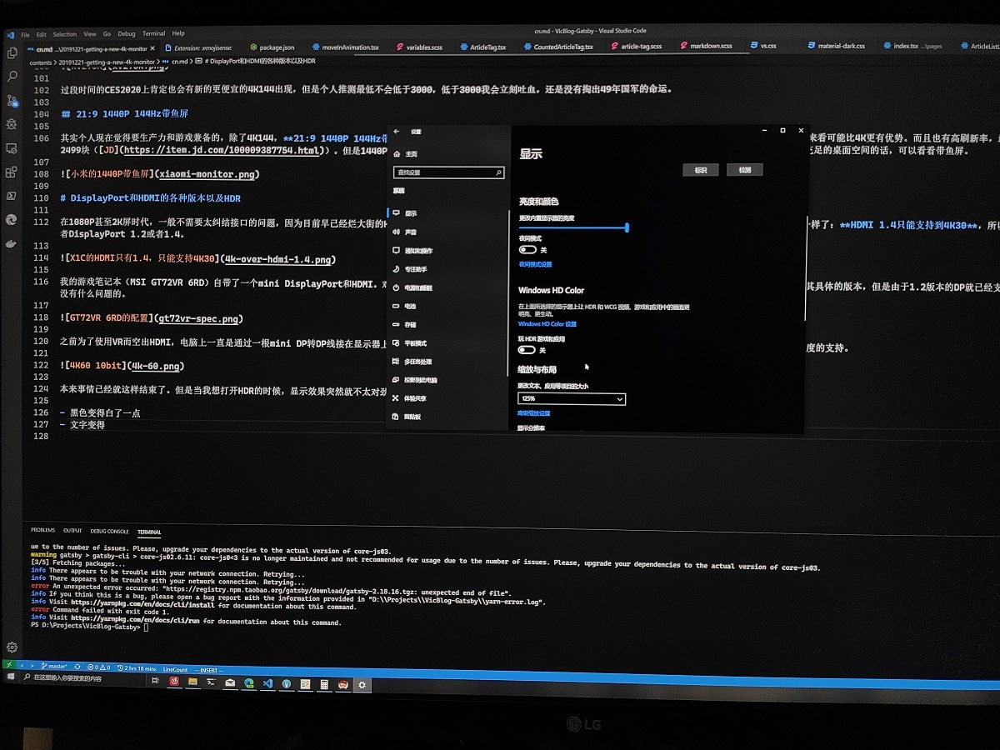

这就非常奇怪，因为按理来说HDR的效果应该是黑色更黑白色更白（对比度提高），文字和鼠标移动应该不会有太大的影响。

之后我去网上找资料，发现**DisplayPort 1.2**是不支持HDR的（从1.4开始支持）。

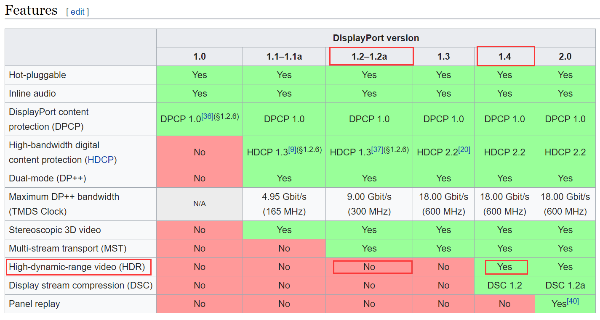

如果我的电脑的DP是1.2的话，由于带宽不足。这个可以解释文字和鼠标移动的流畅性，因为带宽不足，开启HDR会损失画面数据，从而造成鼠标卡顿和画面劣化。

之后，我将显示器搬到了另一个同学的装有RTX 2080的台式机上，接上DisplayPort 1.4的接口和线进行测试，发现**鼠标移动的流畅度恢复**了，但是画面仍然不太正确，仍然存在**对比度下降**和**文字不够清晰**的问题。

这说明画面劣化问题可能是面板，而不是显卡或者线的问题。**这块面板应该不支持真正的HDR效果**，但是LG仍然把它标在宣传语上，同时操作系统也认为这块面板支持HDR，所以开启后发现画面出现了明显的劣化。这也说明了我的电脑的DP口应该是1.2的，鼠标卡顿的问题确实可能是由于带宽不够而造成的。

对于HDMI，虽然我的电脑配置上写的支持4K60，但是插上显示器自带的HDMI线后，电脑并不能认到这个显示器，没有信号输出，我也无法测试用HDMI 2.0能不能正常显示了。

最后，经过这些查找资料和实验，我认为可以得出以下的结论：

- DP1.2不支持HDR，打开HDR会造成鼠标卡顿
- 如果厂商上声明HDMI接口支持4K60，那么HDMI接口至少是HDMI 2.0
- LG的这块面板的HDR显示存在问题

最终，我还是将HDR关闭，使用4K 60帧 10bit色彩进行显示。虽然没有HDR是一个不大不小的损失，但是4K60的显示效果也足够惊艳了。

# FreeSync和G-Sync Compatible

G-Sync可以用来解决**画面撕裂**， 即屏幕不同部分显示的内容不一样，造成画面撕裂。下图是[维基百科screen tearing词条](https://en.wikipedia.org/wiki/Screen_tearing)上的示例图片，可以很明显发现撕裂点。

导致这个问题的原因是**显卡发给显示器画面的发送频率快于显示器自身的刷新频率**，使得显示器还没有渲染完上一帧时，显示器就收到了并开始渲染下一帧，**导致显示器上同一刻显示了两帧不同的画面**。游戏里常常会有**垂直同步**选项可以用来解决这个问题。其工作原理大致解释为**当显示器绘制完当前帧之前，显卡不能渲染下一帧**。这解决了撕裂的问题，但是也浪费了显卡的处理能力，当硬件的刷新率低于显示器的刷新率时，会很大程度影响画面帧数。

而NVIDIA在2016年左右推出的G-Sync**通过让显示器的刷新帧率和显卡同步**来解决了这个问题，但是这要求显示器上有一块专门的芯片来动态修改和同步显示器和显卡的刷新帧率，提高了成本。我的笔记本的内置显示器带有G-Sync功能，打开后确实既能获得不开垂直同步帧数，也能避免画面撕裂。AMD也推出了类似的方案FreeSync，由于FreeSync是免费的，很多厂商支持的是AMD的FreeSync方案。但是当时，FreeSync只支持AMD的显卡，但是AMD的显卡确实还不够Yes，所以适用面比较有限。

以上对画面撕裂、垂直同步、G-Sync和FreeSync的介绍比较粗略和不准确，想知道更详细、更准确的关于这几个名词的知识，可以参考[这篇我认为比较通俗易懂的中文文章](https://blog.csdn.net/xiaosongluo/article/details/44730251)。

2019年，NVIDIA宣布了G-Sync Compatible，其对支持FreeSync的显示器也开启了部分G-Sync的功能。所以从现在开始，FreeSync的显示器也可以使用N卡获得G—Sync类似的功能。这是一个非常好的消息。所以到手后我就从NVIDIA控制面板把这个功能打开了。软件里面说`“所选显示器”未被验证为G-Sync Compatible`，是指的这个显示器不在[NVIDIA官网上列出的验证过可用的显示器的列表](https://www.nvidia.com/en-us/geforce/products/g-sync-monitors/specs/)中。但只要显示器支持FreeSync，这个功能也可以被打开。

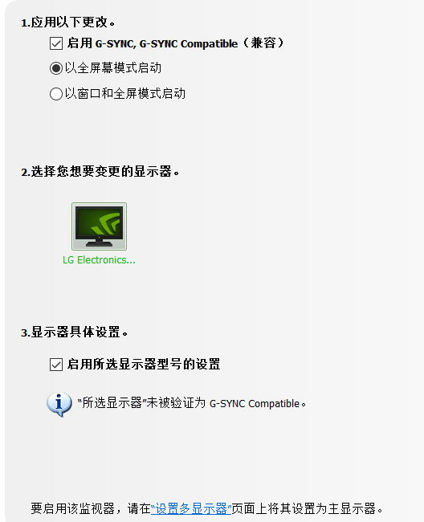

这里需要注意的是，**不要选择以窗口和全屏模式启动**。开启后一些应用（例如Windows Terminal）会帧数下降。GitHub上也有一个[issue](https://github.com/microsoft/terminal/issues/649)在跟踪Windows Terminal的开启G-Sync后帧数下降的问题。其实G-Sync Compatible真正用处在游戏上，而大多数也是全屏打游戏的嘛，所以就以全屏幕模式启动就没问题了。

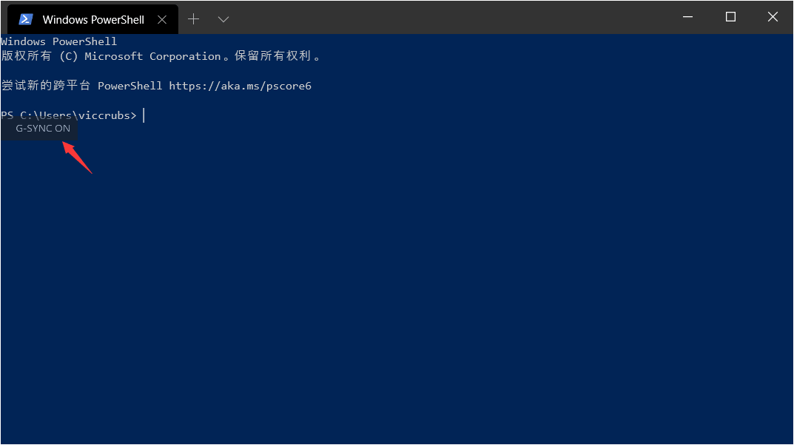

至于效果，我体验了一把BF5，确实完全没有发现画面撕裂的问题，帧数也稍有提高，可以说还是有点效果的:thumbsup:。

# 超频

虽然放弃了144Hz选择了4K，但是我仍对高刷新率耿耿于怀，仍然想最后**超频**一下试试，看看能不能在降低分辨率的情况下提高刷新率。

显示器也有**超频**的概念，即提高显示器的刷新率。显示器的分辨率是不能提高的，因为像素点就那么多，没法提高。但是理论上来说刷新率是可以被提高的，比如很多75Hz的显示器其是60Hz的屏幕超频而来。

显示器的超频比较简单，通过NVIDIA控制面板，按下图的步骤就可以尝试。修改刷新率后，点击确定，如果画面正常，可以继续尝试修改；但如果画面出现问题，等待20s，系统会自动恢复之前的设置，所以还是比较安全的。

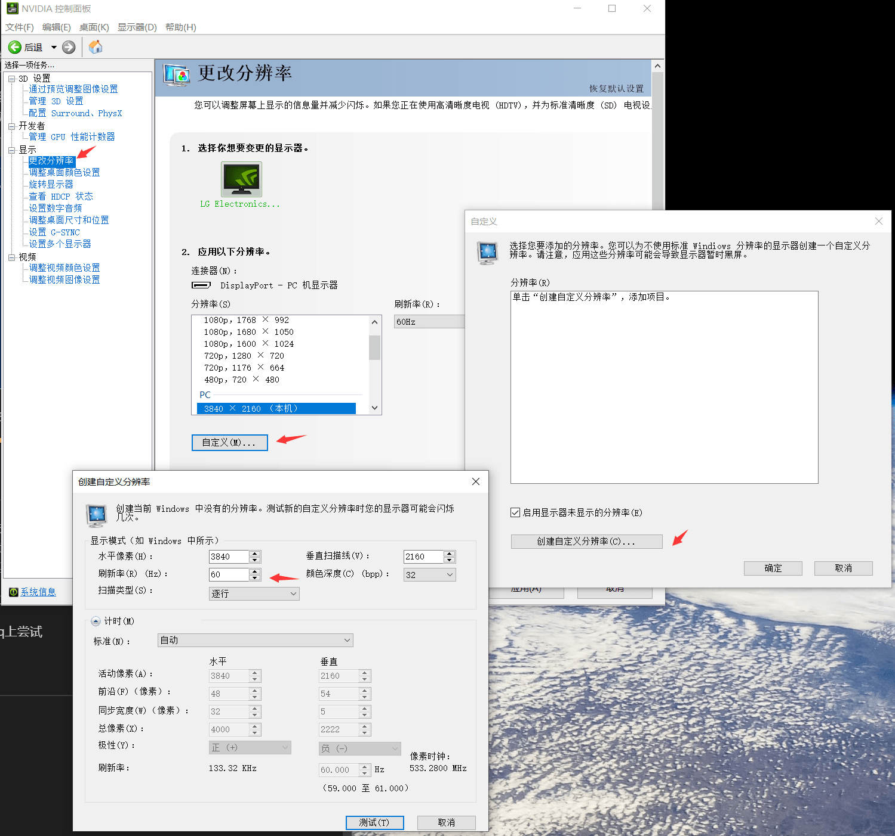

我在之前的ThinkVision X24q上尝试过，面板本身可以支持到70Hz（即到70Hz的时候还可以正常显示），但是那时候显示器上出现了一个一直显示的提示信息，说**输入信息超出标准，请改回2K60**。所以没有办法，只能调回去。

这次入手显示器后，我也想尝试进行超频。但是很遗憾的是，这块显示器在4K、2K和1080P分辨率下，**最多只能提高1Hz的频率（即到61Hz）**，再提高就会直接不能正常显示。所以没办法，只能等着4K144白菜价时，再体验高刷新率的顺滑了。

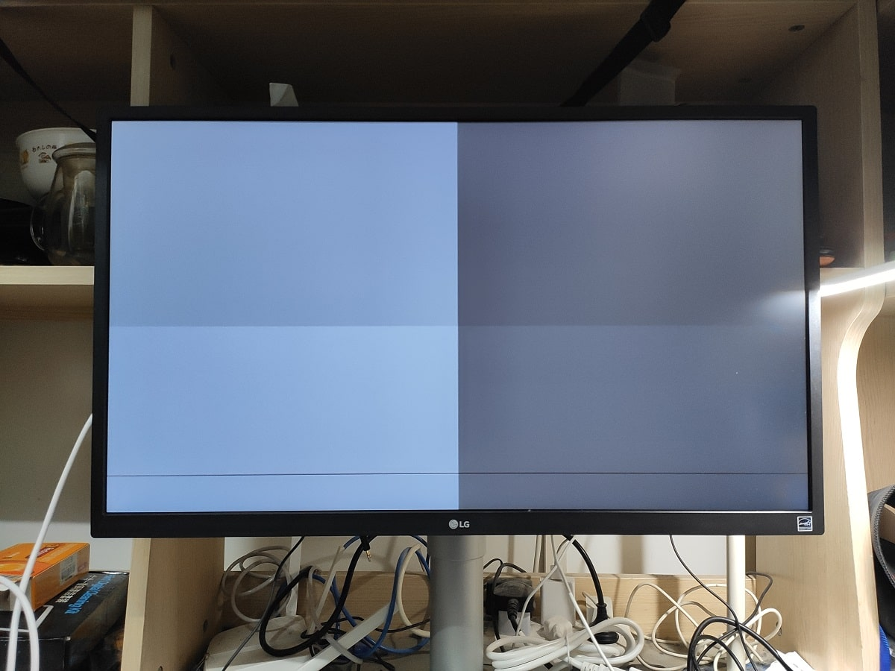

# 总结

买一个显示器真够纠结和折腾的，但同时也学到了和体验到了很多的东西，比如目前市面上有哪些显示器、各种显示器的价位区间、各种接口有哪些不同、4K显示器真正用起来是怎样的、HDR效果到底是不是噱头、超频到底可不可能等。这显示器目前接在1060上还是比较浪费的，3A作品还是只能开1080P才能流畅玩。等到了明年下半年，接上3070或者3080，开着4K光追60帧玩着游戏，那才叫爽吧:laughing:
