# 前言

吸取了去年的年终总结从元旦咕咕咕到除夕的教训，这次我提前3天（2019年12月29日）开始写了，终于赶上了~

# 最后的课程（？）

这一年中，上了本科阶段最后的课，考了本科最后的考试，除了毕设，基本已经可以和本科做告别了。这一年的课程基本都是软院的典型课（=大作业+背书考试），其中zh的体系结构和实证软件工程、czy的测试课和人机交互给了我比较深刻的记忆。

## zh

zh作为成绩杀手果然名不虚传：体系结构同一门课，两个班不同老师讲（其中一个是zh），卷子不同，总评平均分可以差10分。体系结构虽然讲的内容挺体系结构的，既有理论也有实践，但不可避免的是仍然成为了纸上谈兵的课程。三篇不知所谓的论文，外加8人团队2周做（赶）出来的[项目demo+66页的文档](https://github.com/ddadaal/ClassroomAssistant)+[PPT](https://github.com/ddadaal/Slides/tree/master/20190328-%E4%BD%93%E7%B3%BB%E7%BB%93%E6%9E%84%E9%A1%B9%E7%9B%AE%E5%B1%95%E7%A4%BA)，在最后的演讲中，可以明显感觉到大家对大作业的迷茫。

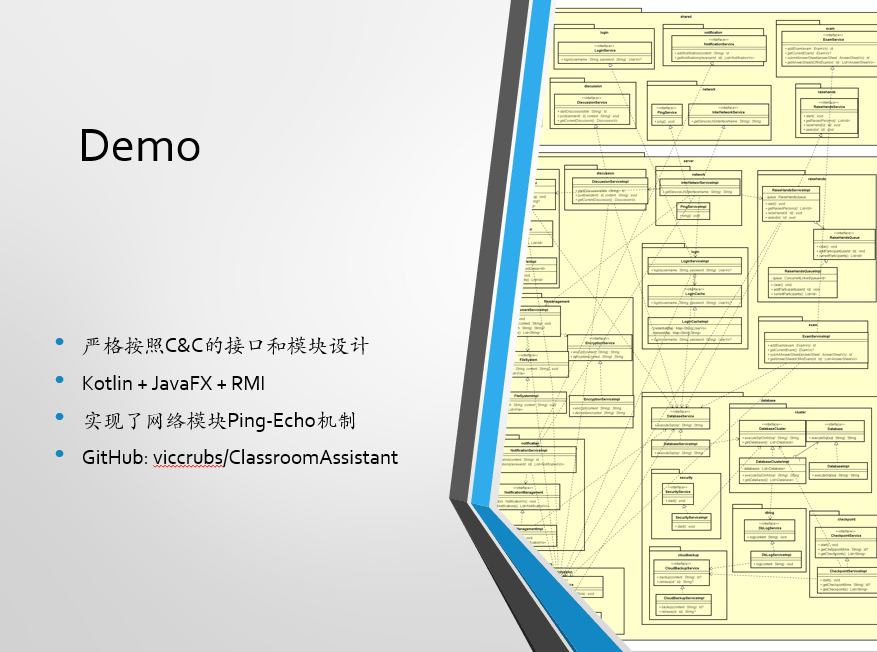

虽说如此，在这段经历中仍然能学到不少东西：界定一个项目哪些应该做哪些不应该做，把一个繁杂的项目拆成多个部分，每个部分分配给其他同学做，在这过程中做自己的部分+检查其他部分完成的大致情况，掌握项目的阶段以及各自的时间点……虽然这段时间很短，尽管有的事情可以做的并不到位，即使写这份文档并没有让我学到它实际上想让我们学到的东西（软院常规操作），但是进行这样一个项目至少让我知道了看到一个复杂的需求不要慌，divide and conquer，总是能够解决的~另外，为了堆这个垃圾的过程中，我还要kotlin堆了一个简单的[DI框架](/articles/a-kotlin-di-framework-in-50-lines-and-thoughts-on-kotlin)，虽然并没有什么实用价值，但是用各种java等传统语言过程中不存在的概念写这样一个小工具也是个非常愉悦的体验。

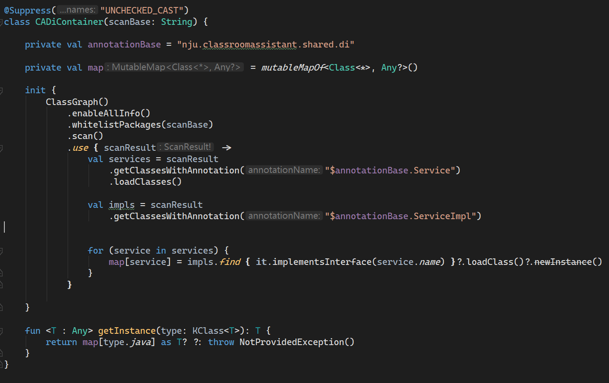

第三学期的实证软件过程（经验软件过程）却是另外一个从来没有在软件接触到的体验：**收集论文，读论文，撰写报告，做报告**。为了体验一把我以后不会从事的方向，虽然我一直没有做学术的体验，但是我还是把这门课选成了方向课。事实证明，这个决定让我第三学期变得更刺激了：

- 抱到yyq、xxz等学术大佬的大腿
- 读了一些软工领域顶会论文
- 学到如何快速”读“完一篇论文，最后虽然自己似懂非懂也能写出点什么总结性的文字
- 见识到队友如何在DDL前2小时，从0赶出一篇要交的文章
- 一天肝出2800词的学术垃圾

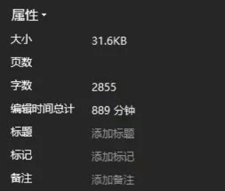

通过zh老师发的论文、他之前的各种经历以及它做的方向，感觉它不像是传统的工程导向的本院老师，确实它也给本院带来了不同的体验。即使如此，还是推荐大家如果还在意成绩的话，选zh课的时候还是一定要慎重。

## 测试

测试课的第一个月还是挺硬核的：学的知识比较理论，还有难度比较大的机考，但是从第二个月（5月）开始，又恢复了本院常态，比如上课念API。值得一提的是最后的6月开始的大作业：当 时的大作业是二选一：**机器学习测试**和**移动应用测试**。作为一个完全没有接触机器学习的、也不对机器学习有兴趣的同(guai)学(lei)，虽然移动应用测试选的人少（最后200多人的院只有20几个人选），资料也少，还是毅然迈入这个大坑，在踩掉无数坑（10个应用6个坑）后，终于用简单的**图+DFS算法**外加人肉尝试出的各种暴力**打洞hack**（比如遇到哪个控件的时间不要继续进去遍历、遇到什么元素时让它最后再遍历到等），在10个测试用的APP中达成了比较好的效果。嗯，这很软件工程。如果你有兴趣可以试试[这个玩意](https://github.com/ddadaal/Homework/tree/master/Testing/AppAutoTesting)，万一它还真的有用呢？

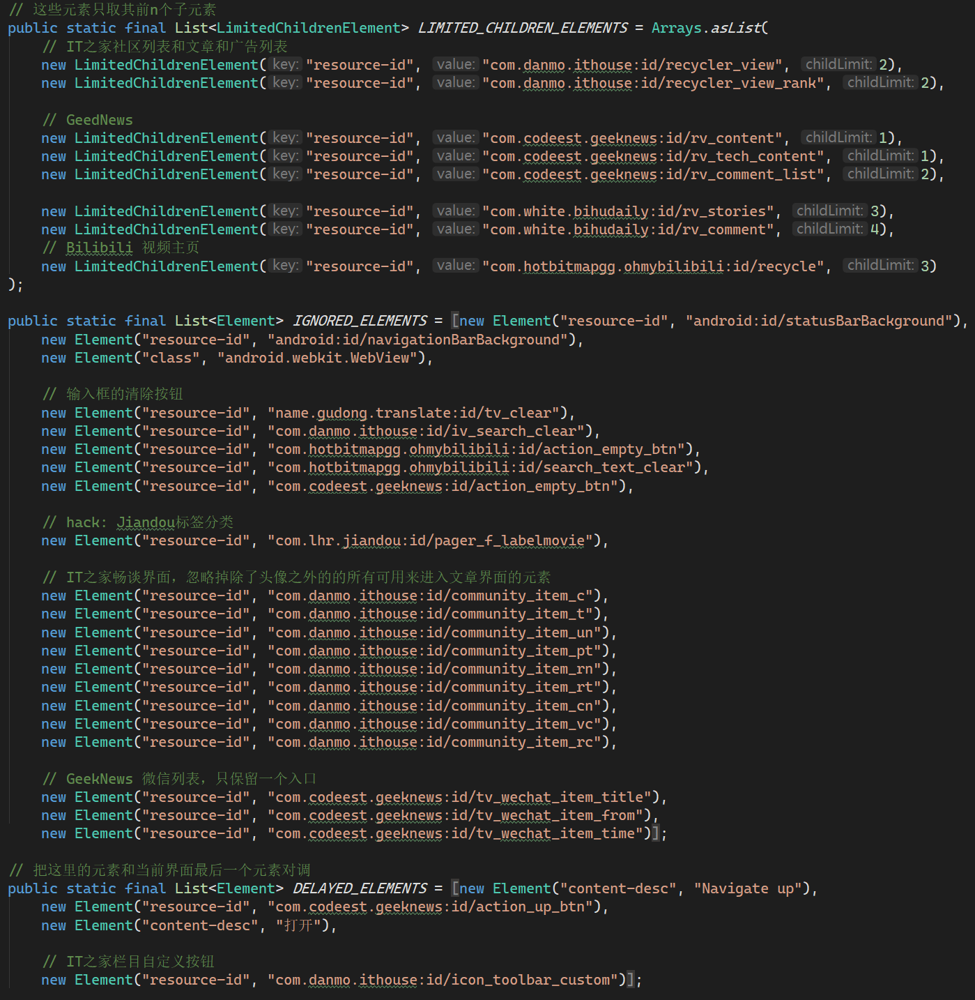

## 人机交互

人机交互课在6月开始大作业之前都是比较正常的本院课。而大作业就完全变了一个样：不仅要写一个完整项目，还要**录视频**！

项目的idea基于**体系结构大作业**（变废为宝），本来只想在体系结构课的demo上随便改改（那就是个javafx的几个默认按钮），但想到本院所有项目**即使老师说界面不重要，最后还是基本只看界面**的实际情况，还是以软工2的项目为基础（变废为宝x2），两周时间和另外3个同学搞了android端和服务器端，最后功能基本完整，完全达到预期，也有一些人机交互的设计，比如下图的及时反馈：当教师端关闭讨论功能时，客户端也同时禁止发布新消息。

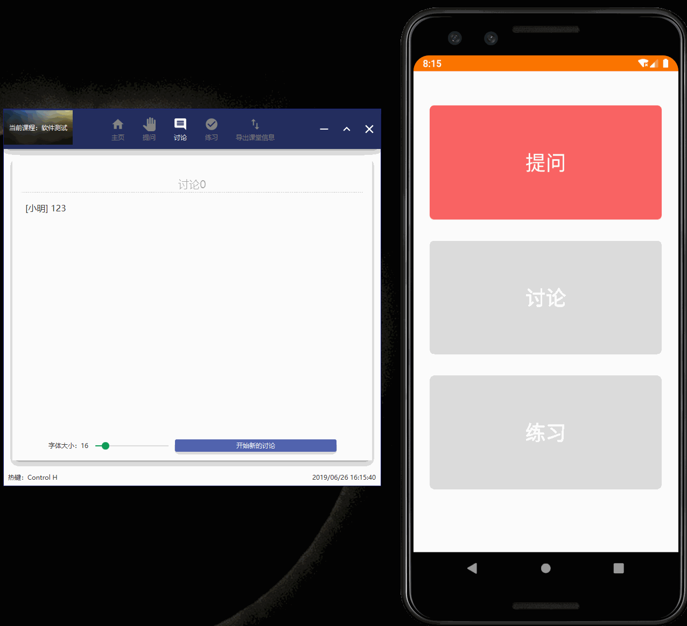

而为了拍视频，我们也投入了不少精力：

- 搞了单反，借了三脚架，搞了云台，还买了外置麦克风（虽然最后发现手机收音效果也不错）
- 写了剧本，中途强行插入cos czy老师的片段
- 每个镜头也多次尝试，以获得最后的效果
- 因为有同时的多镜头（手机录屏+云台拍演员）以及一人分饰多角（谢谢cjy），最后也做了精心的剪辑

最后得出的视频效果其实不谦虚的说，挺不错的:D

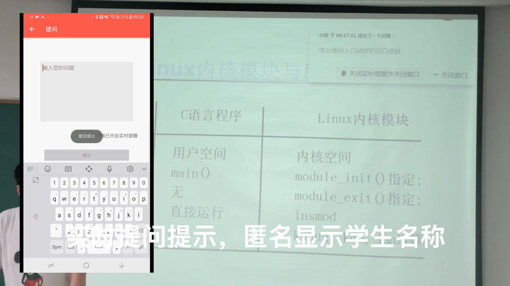

## 魔鬼月

测试+人机交互+俱乐部的事情一起堆到同一时间，也让我得到了5月底开始的魔鬼月。那段时间我每天早起早睡，一起床就去机房写项目，每时每刻都在想项目的事情。写完人机交互写测试，写完测试复习背书，复习完考试，考试完立刻火车卧铺去北京参加保研夏令营……可能这就是传说中的，**黎明前的黑暗**？

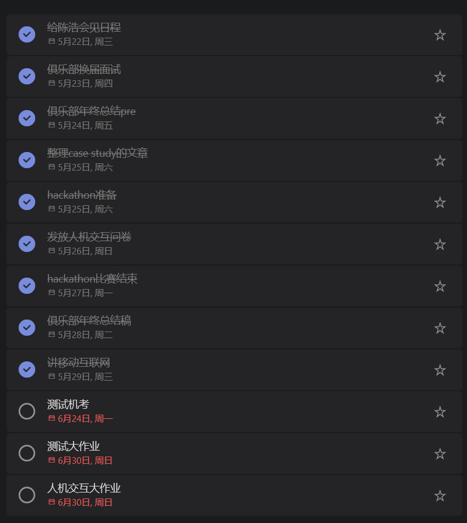

## 最后

其实我一般不会对软院课程有很深的印象，但是今年的上半年是个例外。虽然这些课程本身还是没什么大用，但每门课我都投入了不少的精力，尝试了没有尝试过的领域（读论文、学全新的语言和开发平台、拍视频等），整个过程中也有给力的同伴/大腿们的助力，让我这半年的纯粹的学校生活变得有滋有味，虽然如果可以选的话，我不会想再来一遍~

# 实习，工作 => 保研

## 实习

这一年最重要的是，莫过于**实习**和**确定自己未来的方向**了。

实习间断性地刷了几个月题，顺利地拿到微软苏州的offer。拿我说说里的内容来说，我的实习体验可以概括成：

> 虽然我很多时间在划水，但是FTE同事真的很厉害，工作的时候全神贯注，放松的时候尽情放松，真羡慕这种健康的、张弛有度的工作生活态度，还有良好的工作环境和人际关系，以及各种技术、娱乐和交流活动。技术栈上虽然和其他的公司不完全一样，但是也都是最新的技术，完全不用担心落伍，而且还有各种学习资料和学习的机会，想学都是有时间和机会的。

经过这次实习，我有个感觉，就是实习的时候相对于学习新技术，更重要的应该是**感觉公司的环境和文化**，包括工作环境、人际关系、技术文化等各个方面。在微软这三个月，虽然不能说非常完美，但是确实也让我感到了一个真的把人看做人、而不是工具的企业应该是什么样子。虽然在国内这种内卷成性、法律监管缺失的大环境下，这样的环境是持续不下去的，但是，嘿，人总得有个梦想吧？可能以后就会变好的吧？（虽然实际上来说是不可能的）

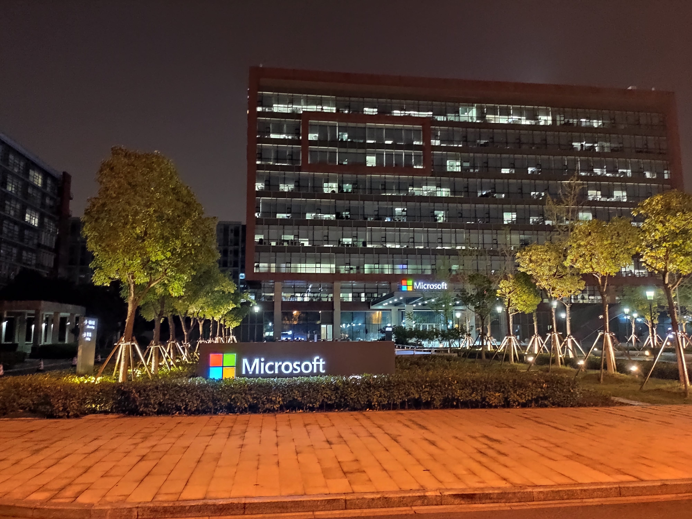

工作之外，通过晚上和周末的时间，我还逛了下周边（965工作制至少每天还有时间做自己的事情，难以想象996的生活），用双脚和自行车参观了苏州工业园区的一些区域（图中外圈内的区域通过共享单车到达过，内圈内的通过走路到达过）。可以说苏州工业园区的规划除了地铁太少之外，简直是城市规划的典范：街道宽敞且整洁、绿化完善、遍布全园区的邻里中心让生活非常方便、每条街道都有的几乎免费的共享单车让通勤也问题不大（虽然有时候自行车太少）。相比到大城市里过着租着3000块的房子、每天通勤单程1个小时的生活，在苏州工业园区生活可能会是一个更好的选择。

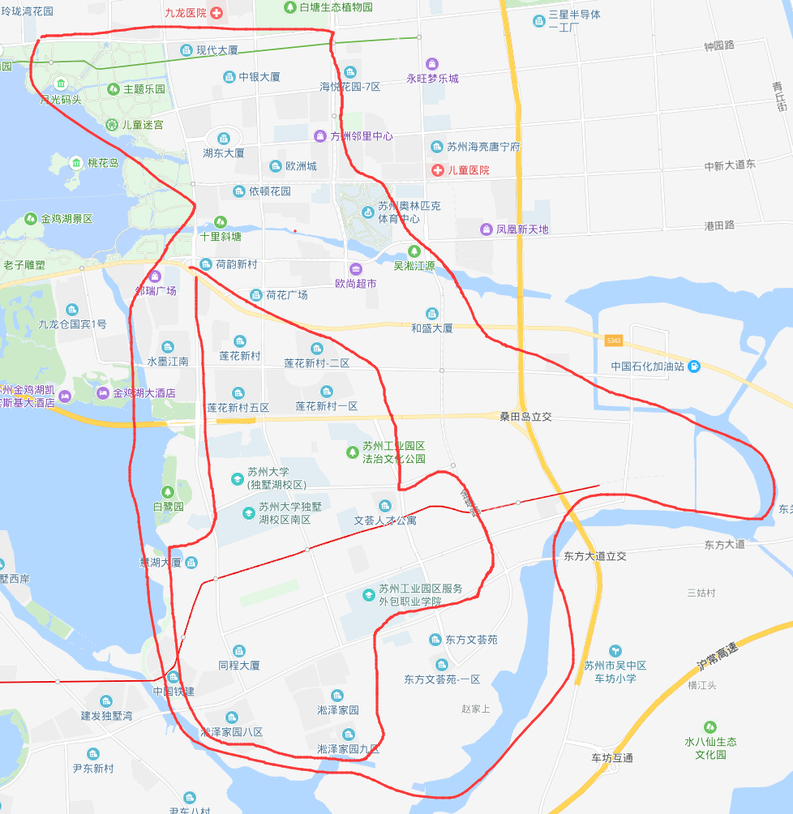

## 保研

对于未来的方向，就像我之前所说，直到4月份，我还是以就业为目标而进行打算的：选择去微软苏州实习也是为了直接转正。我甚至还拖了朋友问问上海转正的事项。但是由于大环境的变化等一些复杂的原因，最终还是决定再去研究生混三年，同时也可以多了几年更自由一点的时间，也能体验可能如果直接工作的话、以后不会再有机会经历的研究生生活。由于仍然对科研没有希望，所以还是在学术气氛浓厚的北大计科专业里选了一个工程导向的组。希望一年后、两年后的我不会为这个选择后悔。对夏令营感兴趣的同学可以看[我的北大信科 | 上交软院 | 南大软院夏令营体验](/articles/progress-to-recommended-postgraduates)文章。

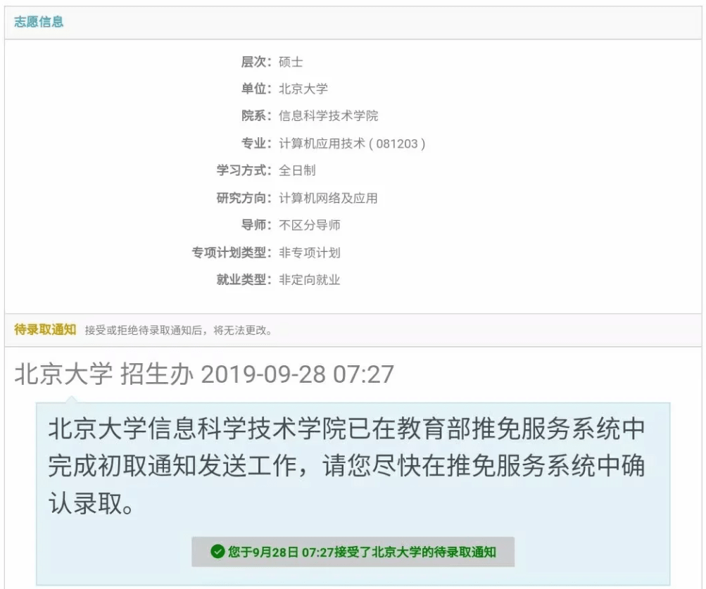

## 多尝试多准备

在一切尘埃落定之后的10月27日，我受邀和另外几个大佬一起，给大一大二的学弟学妹们做了一次关于未来规划的演讲（[PPT](https://github.com/ddadaal/Slides/tree/master/20191027-%E2%80%9C%E4%BC%B4%E4%BD%A0%E5%90%AF%E8%88%AA%E2%80%9D%E4%BA%A4%E6%B5%81%E4%BC%9A)）。在这次PPT里，我的核心观点只有一个，即：**多尝试多准备，找到真正所爱，或给自己更多选择**。

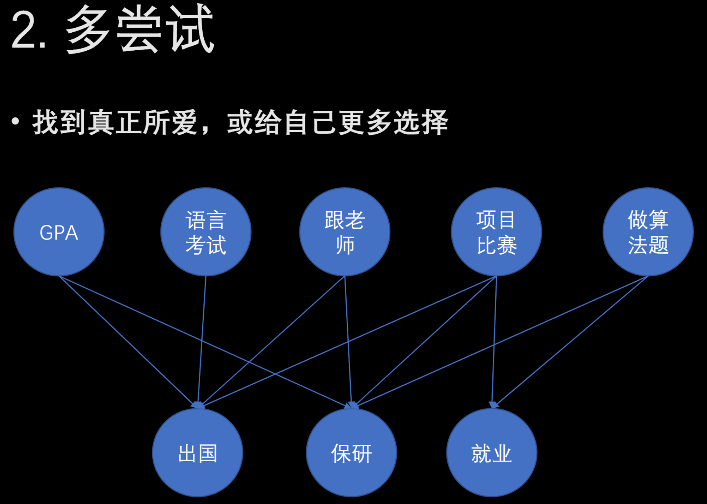

站在现在这个时间点，我感觉这也是我对我的大学生活最大的遗憾之一：从大一以来我就以工作为导向进行准备，一切和工作无关的事情都不进行尝试。现在想来，可能错过了一些可能痛苦、但也可能美好的体验，例如做志愿活动、和老师看论文做实验写论文、出国看看世界体验没有经历过的文化和生活。很多事情现在不体验，以后也不会有机会做了。所以，希望我能够在以后不计较得失，在有机会的时候尽可能多的体验新东西，多尝试，多体验，多准备，获得更丰富的经验。

# 俱乐部

在这一年里也彻底和微软学生俱乐部做告别了！

由于课程和实习的缘故，上半年我并没有给俱乐部做出太多的工作。俱乐部在上半年和腾俱举办了**一次hackathon比赛**，~~由于实在找不到老师~~去做了评委，看了很多学弟学妹的有趣的创意和虽然不成熟（嘿他们才大一大二呢）但是能用的实现，真实感到长江后浪推前浪，年轻人真是一代比一代强！另外还有因为考试没能参加的联合**春游**，还有最后~~回到最初的起点~~又一次在校庆夜的面向全校的**展台活动**。

在离别之后，还有幸在微软亚研院的官方微信上[发了一篇文章](http://1t.click/bgTF)（[博客版本](/articles/growth-with-njumsc-2016-to-2019)）总结这三年俱乐部的点点滴滴。微软学生俱乐部是个小社团，但是他承载了我三年来的一些美好的记忆和体验，我也有幸能够为俱乐部尽自己的一份力。希望有更多人能够加入俱乐部，在里面提高技术、结识朋友，和俱乐部一起度过大学生活。

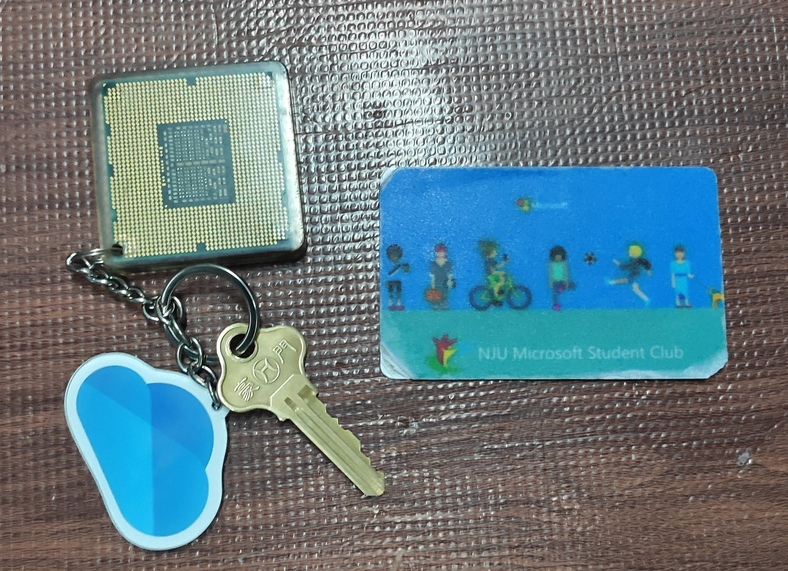

# 比赛

不像2018年，最后这一年里只参加了5月份学院组织的hackathon比赛，在大佬队友的帮助下，借助一个斐波那契项目（花旗杯（前面界面）+区块链（项目大噱头））拿到了奖。

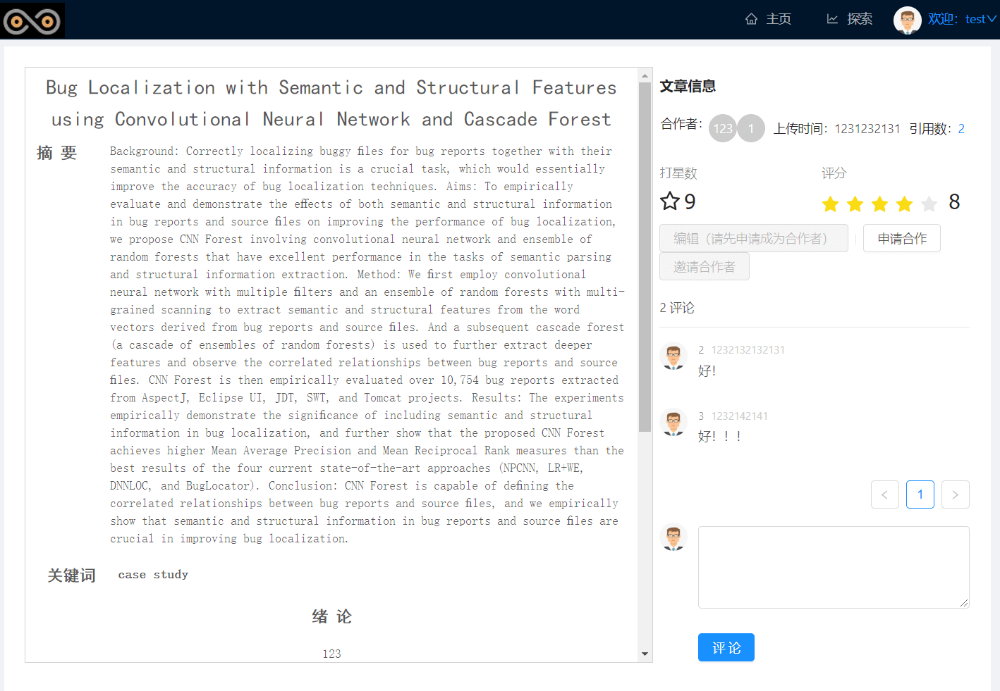

其实可以说这是我参加的第一个**完整的hackathon比赛**。之前的hackathon，要么是7天的长期项目（2016年微俱hackathon）、要么晚上根本没有熬夜（微俱夏令营，晚上九十点出去吃烧烤晚上正常睡觉你管这叫hackathon？）、要么是作为组织者进行参加，而在这次比赛中，我们四个人是真正的从0开始，去除中间3个小时左右的睡眠时间，连续写了20余个小时的项目。现在看来那一个晚上的工作量简直爆表，要让我现在按正常工作时间来做，可能几周都做不完。hackathon果然让人疯狂。

其实进了微软的时候，微软内部的Hackathon正在进行，我也和同学一起报了名，项目也已经开始，但是由于时间问题最后没能提交。即使如此，最后还是有幸到了微软hackathon展示的现场，看看各位微软员工做的工作，体验真·hackathon。其中一位参赛者都30多岁有孩子了，他做的产品是关于家庭的（具体忘了），且在介绍自己的产品时仍然非常激动，像自己的孩子一样给所有参观者介绍项目的亮点，这让我十分感动，可能只有在生活没有压力的情况下，才能保有这样的年轻的心态吧。

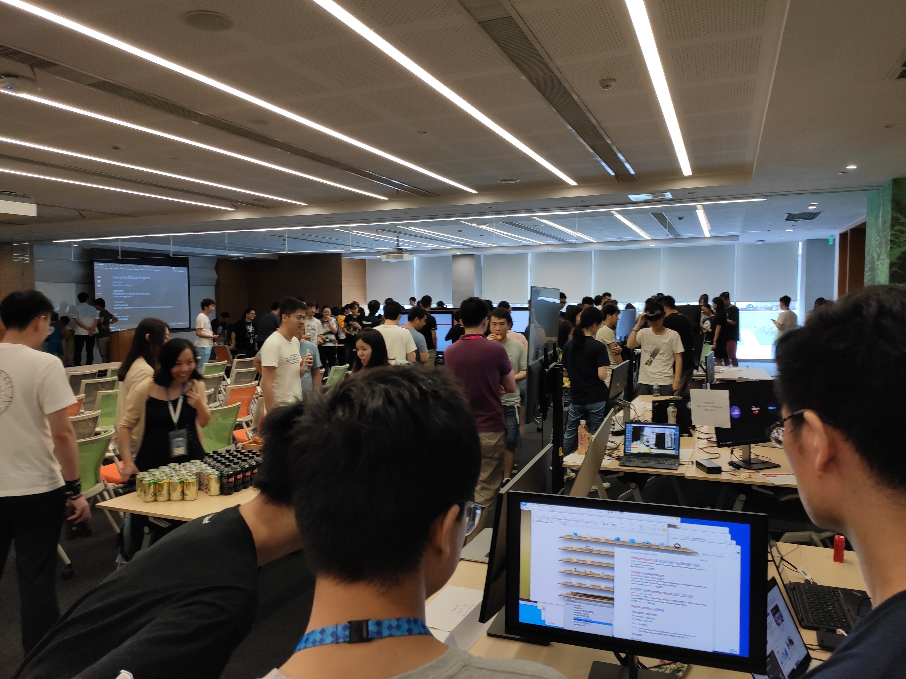

# 退休前最后一个无忧无虑的假期

10月18日实习结束后我没有像其他大佬一样继续实习，而是回到学校躺尸。仔细想想，可能这是退休前最后一个没有什么负担的假期了吧。

这几个月主要做了以下这些事：

- 检查下一届操作系统作业
  - 有的同学说我检查太严，甚至我最后一次检查中有一段时间前面一个助教排队排了10多个人，我这儿一个人都没有……
  - 还发现了不少祖传代码（滑稽，甚至有人抄我的代码居然还来我这里检查，你们抄代码至少知道源头吧…
- 学车
  - 在仙林时那么近不珍惜，现在学车得6点半起床一个小时多地铁+公交才能到驾校
  - 考个科目二早上5点50起床，本来1个小时的公交车程中途遇到堵车跑了2小时，还好一把过了，不然我受不了再来一次……
  - 自动挡虽然比较简单，但是分配的资源太少了（科二8个坡道1个自动挡的，12个倒库2个自动挡的），考试排队也得提前才能约到。为什么大家都开自动挡车却学手动挡呢？
- 看电影
  - **11月以来看了30几部电影**
  - 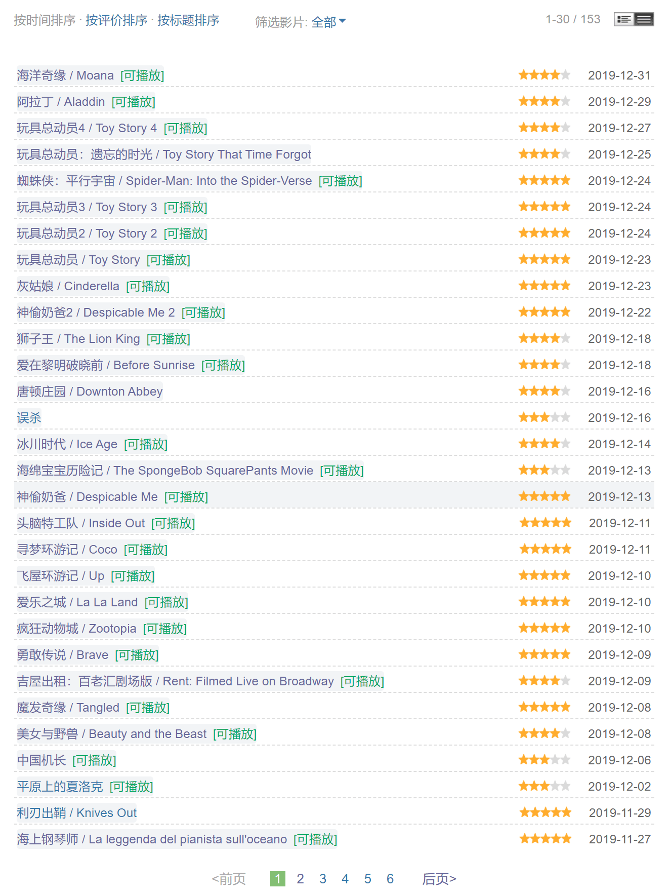
  - 大多数是迪士尼和皮克斯的动画片。迪士尼的片子主要馋画面和歌曲（比如长发公主（魔发奇缘）里尤金和乐佩看天灯那个场景配上歌曲I See the Light简直太美了），现在天天在云音乐里循环播放各个电影里的歌曲；
  - 皮克斯的点子和剧情也够吸引人的，比如看玩具总动员1时发现这是95年的3D动画就惊了。发现还有好多好的动画电影没看，就像发现个大金矿一样，太让人满足了。
  - 
- 打羽毛球
  - 平均每周2次的节奏，一到冬天球一打就坏，打得人直喊穷

本来还想把给博客写点新功能（比如之前[博客的发展1](/articles/blog-updates-1)里说的统计、评论等），但是一玩起来谁还想做正事啊……

# 总结

2019年结束了本科阶段的所有课程和考试，确定了未来三年的走向，进行了第一次实习，享受了一个无忧无虑的假期。

2019年是收获的一年，也是思考的一年。通过亲身体验和思考，我对以后我想过的生活有了不一样的认识。而这个认识是否正确，那就只能用2020年、以及接下来更长的时间来检验了。希望站在2020年底、或者以后的任何一个时间点回望这一年的各种事情、各种思考、各种决定，我能说，我已经做到最好了。
