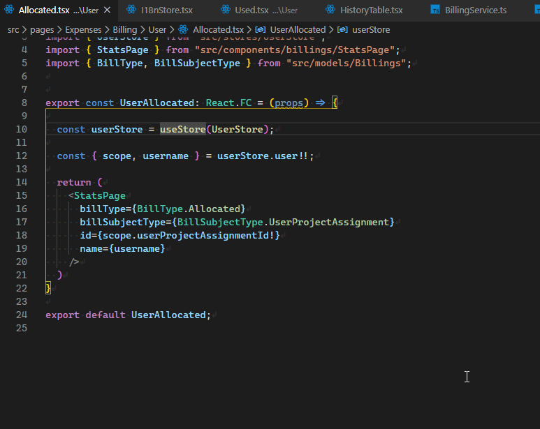
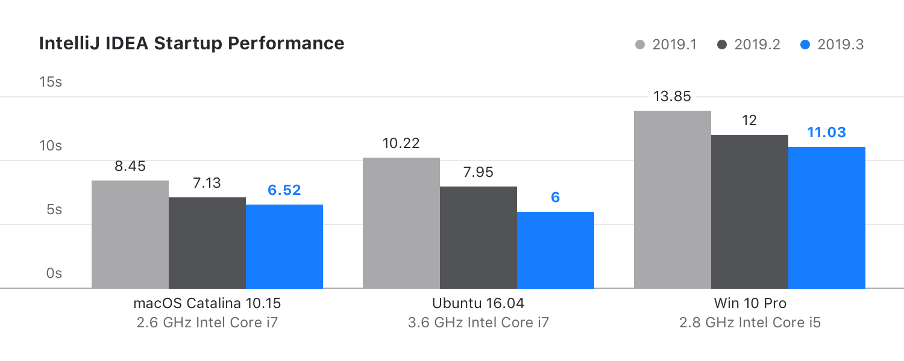
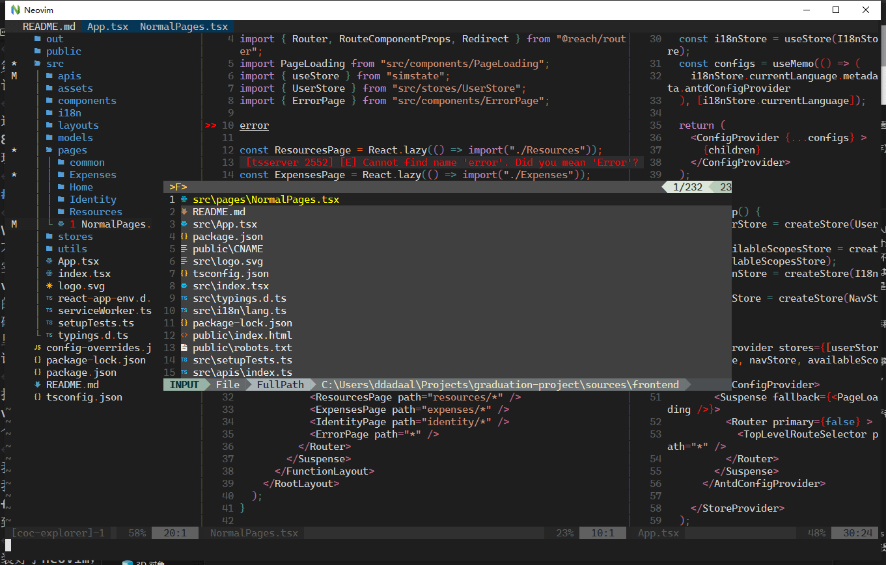
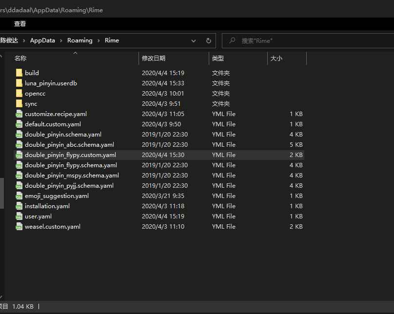
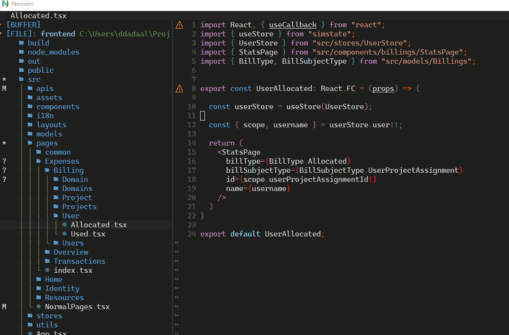
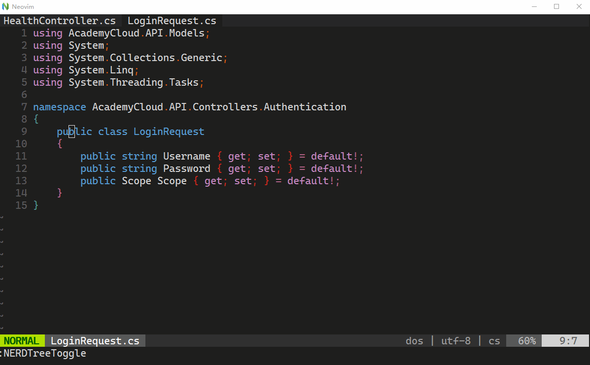
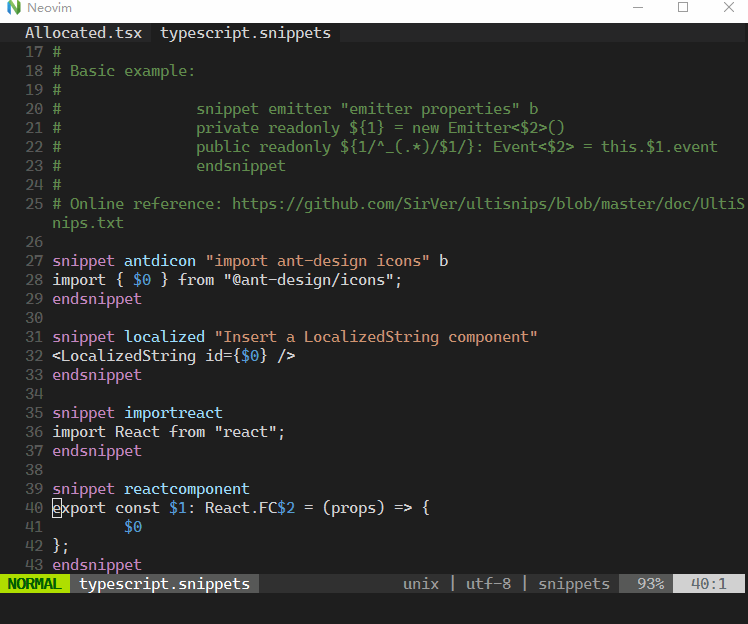
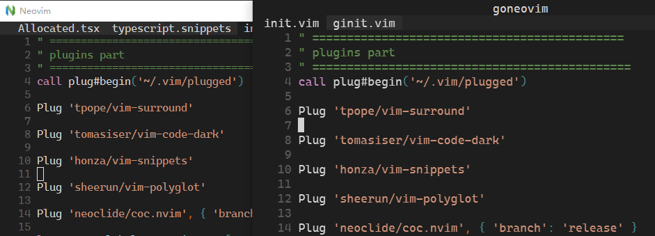
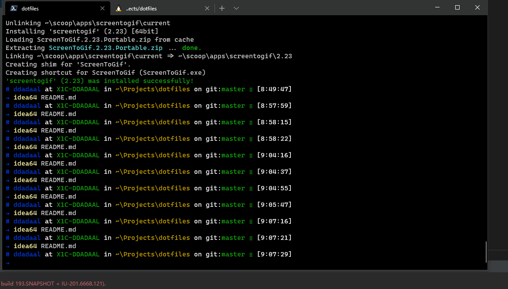
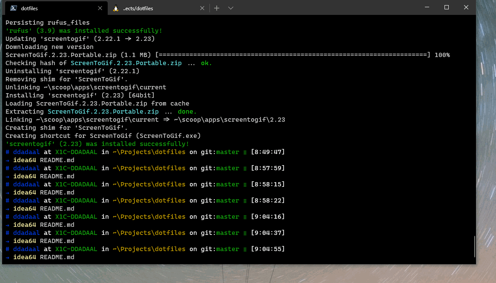

# 题外话

最近3个月博客都没更新，不是因为我弃坑了，而是因为这几个月一直在忙着搞毕设。本以为毕设只是个j2ee，没想到朝9晚9搞了2个多月。现在终于搞完了，博客也（应该？）开始恢复正常更新了。幸运的是，在做毕设期间我积累了很多可以用来写博客的材料（本篇文章也是其中之一），接下来的几个月将慢慢更新。

# VSCode

当大家一提到编辑器还是Sublime, Notepad++时，我就开始用VSCode了，也很喜欢VSCode的优点：

- 生态丰富，功能多样
- 界面现代
- 对WSL友好
- 对Windows友好
- 在不同场景下拥有统一的体验
- 等等

因此，我在用VSCode做尽可能多的事：前端开发、新语言（Rust, Golang, Haskell等）的学习、写Markdown等。本博客的代码和所有文章也都是在VSCode下写完的。我也借用各种插件把VSCode打造成了一个“完美的编辑器”。

但是VSCode有个很大的劣势：**性能**。

可能你会说，VSCode起家不就是靠快吗？如果和Atom比，VSCode当然是快的（消费过气编辑器）。但是根据我的体验，Windows下的VSCode的**性能问题**体现在两个地方：**启动速度**和**编辑延迟**。

## 启动速度

VSCode的启动速度虽然已经经过多次优化，但是不能做到秒开。尤其是当加了插件后，随便打开一个文件，都需要等待可见的几秒才能开始编辑。下面的动图展示了使用VSCode打开Rime的配置文件时的速度。请注意，由于使用了Vim插件，即使在VSCode已经显示文件后，仍然不能编辑，只能等到vim插件已经准备好后（光标从|变为方块状），才能开始编辑。从右键选择使用VSCode打开到可以编辑，耗时7s左右。


Rime配置文件是个很小的、很简单的纯文本（yaml）文件，打开尚且需要等待7秒。

而VSCode的打开时间大致是随着文件和项目的大小而增加，和项目打开的文件和文件大小有关。打开我10000行左右的毕设前端项目需要10s左右。我记得在微软工作期间，打开我组的20万行左右的前端项目，需要时间应该在15s以上。

讲道理，这个速度对一个文本编辑器来说，有点太慢了。

## 编辑延迟

在以下情况下，VSCode的LSP提供的**自动完成**、**Code Actions（即自动修复，Ctrl+.）**等功能经常出现**较为严重的延迟**的问题。

- 项目大（例如在微软工作期间的20万行项目，几乎所有操作都能得等1s以上）
- 连续编辑一个项目一段时间
- 新打开、新建文件

等等。



另外，更严重的是，当系统资源不足时，或者项目更大、连续编辑一个项目更久时，VSCode连打字都会出现延迟。即已经输入了字符，但是在屏幕上字符需要等待一段时间才能出现。

这些编辑中出现的问题极大地影响了编辑的效率和感受。尤其是打字延迟我认为是无法忍受的：作为一个编辑器，打字响应应该是第一优先级，在任何情况下都应该首先保证打字的响应速度。JetBrains系列IDE就是一个很好的例子：JetBrains占用资源大，启动慢，但是启动完成后，打字和自动完成几乎都可以保持瞬时响应。

## 可能的原因

VSCode出现这些问题的原因可能也很好解释。

Electron应该背主要的锅。Electron的本质是一个Chromium浏览器。VSCode使用了Electron，除了一些性能攸关的组件外，VSCode的功能几乎都是用前端技术栈开发的。前端技术栈的效率一直就是个问题。V8引擎已经改善许多了，但是和原生技术相比，前端技术的效率还是差了一个数量级。不仅是VSCode，其他几乎所有用Electron的应用的速度都不敢恭维，如Postman、GitKarken等。

另外一个原因是Windows。Windows下的编辑器、IDE等程序的效率似乎没有Linux等其他操作系统下面高，例如根据[JetBrains的Intellij IDEA 2019.3的更新报告](https://www.jetbrains.com/idea/whatsnew/)，IDEA系列IDE在Windows下启动动辄10s以上，而在Linux下可以几秒内完成。我在Linux下也测试过VSCode的启动速度和编辑速度，确实遥遥领先Windows操作系统。



第三个原因可能是插件的数量。但是，插件是VSCode立身之本之一，为什么要让用户在速度和功能之间做选择呢？

这些性能问题，电脑配置越差，插件越多，越明显。在我的X1C6上（i7 8550U + 16G内存），这些问题非常明显。对于Electron和使用它的应用，我现在都尽量不用，因为被已有的这些electron项目整怕了。

# Vim

Vim的鼎鼎大名大家应该都听说过，但是实际用vim的，我好像只在网上见过？不得不说入门Vim确实是地狱难度。我学vim也尝试了三次，最后一次是在微软实习时，使用VSCode的Vim插件，耗时1个多月，才最终能够较为熟练地使用vim，以至于到现在没有vim无法写代码，用word都随手ESC的程度。由于vim的使用全程不需要离开键盘，能够减少手伸到鼠标的次数，一定程度地提高打代码速度和体验。并且如果你经常折腾配置文件，尤其是在linux平台下，在终端里使用vim比使用nano等工具效率会高不少。所以如果有时间我还是推荐大家试试vim，但是在练习的时候一定要有耐心，"vim不是一天炼成的"。

扯远了。在做毕设期间，由于被VSCode的性能问题折腾的有点疯，以及用了vim后对效率和速度越来越敏感，所以我开始尝试配置vim，想把vim打造成一个IDE。

我在2月14日左右，连续干了10几天毕设后，我停下来休息了3天。在这3天里，我开始折腾vim。我用的是[Neovim](https://neovim.io)，一个vim的fork，据说比原版Vim更精简、有更多的功能，但是使用体验和原版Vim并无二致，并随着vim 8的加入，二者的差距其实也变得比较小了。

装好了neovim，找各种教程、插件，再加上不断的尝试和调整（这几个月的休息时间几乎都投入到vim配置上了），终于配置出了一个比较舒服的vim环境。

下图为我的neovim的环境，使用了包括[Leaderf](https://github.com/Yggdroot/LeaderF)、[coc.nvim](https://github.com/neoclide/coc.nvim)等插件。



## 快

使用nvim最大的原因，也是之前提到的VSCode最大的问题，那就是**快**。

打开文件的速度快。

很多人是在终端（CLI）下用Vim，而由于Windows平台一般不在终端工作，以及Windows Terminal目前还有一些问题（例如不支持鼠标输入等，有个版本说支持了，但是在我这里测试仍然不能支持，不知道是什么原因），所以目前我主要在GUI下用Vim，主要用[neovim-qt](https://github.com/equalsraf/neovim-qt)（GUI的事等会还要谈）。

用neovim-qt打开一个项目和文件的速度相当的快。下图为打开和之前同样的Rime配置文件，可以看到neovim-qt在3秒左右就已经打开了，并且立刻可以开始编辑。对比VSCode的7秒，这确实是一个相当大的提高。即使是打开项目，neovim-qt的速度同样可以维持几乎不变的水平。



编辑的速度同样很快。

Vim本身就以速度闻名，也基本做到了打字响应优先级最高。并加上现在的neovim和vim 8都加入了异步的功能，即使在处理复杂任务（如获取自动完成的信息）需要耗时，打字的速度仍然可以不受影响。

自动完成和LSP支持我使用的是[coc.nvim](https://github.com/neoclide/coc.nvim)，它不仅为neovim提供了LSP的支持，还提供了一个node.js环境，让更多的功能可能实现在neovim平台上（如[coc-explorer](https://github.com/weirongxu/coc-explorer)，功能很强大的文件树浏览器）。它的标语是Make your Vim/Neovim as smart as VSCode，我认为它确实达到了这个目标。

VSCode能支持的语言，它都支持，并且由于都是用LSP协议，功能基本都一样；VSCode能做的功能，vim一般都能做；vim不能做的，coc.nvim也基本都支持了。

另外讽刺的是，用的同样的LSP Server，vim的自动完成和Code Actions的响应速度比vscode快，而且长时间编辑后，当vscode已经慢的不能接受时，vim的响应速度几乎没变。基于这个原因，毕设的前端项目我基本都是用neovim开发的，开发体验比vscode强了许多。



## 纯键盘操作

另外用vim对我最大的影响，是**纯键盘操作**。

虽然VSCode也可以使用键盘完成很多的工作，但是在VSCode下，死活想有伸手用鼠标的感觉。这有几个原因：

一是VSCode的**键盘并不能完成所有工作**。

比如，在不安装插件的条件下，即使装上vim插件，并不能在文件管理器只使用键盘管理文件，如重命名、新建文件等。即使使用[File Utils](https://marketplace.visualstudio.com/items?itemName=sleistner.vscode-fileutils)等插件，也并不能做到像[ranger](https://github.com/ranger/ranger)（一个Linux下运行在CLI中的文件管理器）直观地、快速地管理文件。并且正由于VSCode并不能使用键盘完成所有工作这一事实，每当我想使用键盘做一个事时，总得先试试VSCode到底能不能用键盘做这个工作，然后这又浪费了一些时间了。

二是VSCode、以及一些传统的IDE的快捷键，我认为键位不够科学。

例如，VSCode的打开侧边栏的各个功能的快捷键总是三个键，过于复杂，如`Ctrl+Shift+E`打开文件浏览器，`Ctrl+Shift+F`打开搜索等。要按这样的组合键，总得变换一下手姿。

另一点是`Ctrl`键，基本所有快捷键都依赖`Ctrl`，但是按`Ctrl`要么变化手姿，要么使用小指这个最力量最弱最不常用的手指，这样总会影响一点效率和舒适度。

而使用vim就可以比较好的解决这些问题。

对于问题一，使用vim可以确保键盘一定能完成vim能完成的所有任务。且由于vim生态中所有插件都以纯键盘操作为核心，所有插件的操作也非常键盘友好。例如，下图为使用[leaderF](https://github.com/Yggdroot/LeaderF)进行文件搜索和跳转，使用[NERDTree](https://github.com/preservim/nerdtree)进行文件创建、重命名和删除操作，都可以非常直观的使用键盘进行操作。



对于问题二，我的解决方法是自己定义快捷键。为了避免使用`Ctrl`键，所以把很多快捷键都绑在了`Alt`，例如`Alt+A`打开和关闭文件管理器、`Alt+,`和`Alt+.`在buffer（即打开的文件）中切换，`Alt+h/j/k/l`在各个pane（分屏）之间切换，`Alt+q`关闭当前buffer等。

```vimscript
map <A-j> <C-W>j
map <A-k> <C-W>k
map <A-h> <C-W>h
map <A-l> <C-W>l

" Leader A to open coc-explorer
map <A-a> :CocCommand explorer<CR>

" <Alt>-, and <Alt>-. to switch between buffers
nmap <A-,> :bprev<CR>
nmap <A-.> :bnext<CR>

" :Bc or Alt-q to close current buffer and show the previous (p) buffer
command! Bc :bp | bd#
map <A-q> :Bc<CR>


```

另外，vim还有leader key的概念，即一个特殊的按键（记为`<leader>`，我设置成了空格`SPC`），按下这个按键后，接着按其他按键，可以进行更多的操作。这相当于新增了一个快捷键的命名空间，避免了一些重复的（比如VS的`Ctrl+K Ctrl+D`）、又或者是复杂的（比如`Ctrl+Shift+?`），可以定义更多的快捷键，既方便使用，也方便记忆。

比如说借助[CamelCaseMotion](https://github.com/bkad/CamelCaseMotion)这个插件，`<leader>w`可以按大小写分词来移动，即`|camelCase`（`|`代表光标），按下`SPC w`后，就变成了`camel|Case`。这在浏览代码的时候非常有用。又比如，`coc.nvim`在提供的示例配置里，把`<leader>qf`绑定为了LSP的**快速修复(quick fix)**功能，又好用又好记。

当然，在各种编辑器和IDE里，也可以自己绑定快捷键，但是这会破坏IDE自己定义的快捷键本来有的助记性（Mnemonic）。比如虽然VSCode侧边栏各个功能的快捷键比较复杂，但是它们是有规律的：`Ctrl+Shift+E`（Explorer），`Ctrl+Shift+F`（Find）等。这虽然不是什么大问题，但是我个人不太喜欢，而且重定义快捷键也是额外的工作。

VSCode也有一个对VSCode的各种功能模拟leader key的插件[LeaderMode](https://marketplace.visualstudio.com/items?itemName=michaelgriscom.leadermode)，但是由于VSCode的限制（[对应vscode issue](https://github.com/Microsoft/vscode/issues/13441)），这个插件和VSCode的Vim插件不能一起使用。


# Vim的问题

一开始用Vim非常舒服，但是在稍微用的比较久一点之后，我也发现这套配置的一些问题。

## 插件的质量、功能性和兼容性

由于Vim的很多功能都由插件提供，所以插件的质量就非常重要。虽然Vim有很多高质量的插件，但是不可否认的是，也有很多插件的质量、以及插件之间的兼容性是很有问题的。

比如[vim-polyglot](https://github.com/sheerun/vim-polyglot)，一个支持多种语言、给多种语言提供代码高亮等支持的插件，和`coc.nvim`的`coc-tsserver`，即typescript的LSP支持就不兼容，indentation会出错（比如应该indent 2个空格的会indent 4个）。且`vim-polyglot`提供的TS语言支持其实不太正确，复杂的语法高亮会出错，所以就必须关闭`vim-polyglot`的TS支持，而换用另一个typescript插件[typescript-vim](https://github.com/leafgarland/typescript-vim)来提供typescript的高亮。

又比如[coc-snippet](https://github.com/neoclide/coc-snippets)，在`coc.nvim`平台上的code snippet插件，称可以支持使用[UltiSnips](https://github.com/SirVer/ultisnips)，另一个code snippet插件的snippet定义文件，但是实际上在我这里测试，它不支持在自定义`UltiSnips`格式定义文件定义的placeholder之间的跳转。




另外，由于用vim的人比较少，所以也很少有一些官方团队会来vim上进行深度开发，造成在vim上这些库的体验不如VSCode等有专门开发的编译器。

比如[vim-styled-components](https://github.com/styled-components/vim-styled-components)，`styled-components`的vim插件，只能在vim上提供CSS块的代码高亮，不能提供自动完成等其他特性。

又比如rust的下一代Language Server [rust-analyzer](https://github.com/rust-analyzer/rust-analyzer)，官方团队在VSCode上开发，对VSCode还有一些例如类似JetBrains IDE的、在变量旁边显示其类型的功能。而在Vim虽然可以正常使用LSP提供的自动完成、错误检查等功能，但是功能性仍然比不过VSCode。

其实所有开放的生态圈其实都或多或少有这个问题。整个生态圈由不同的开发者用爱发电的，那总会有插件不能完全满足所有用户的需求，我们也不能因此而责怪开发者，毕竟开源的东西嘛，你行你上啊。

## 高级编辑功能和学习成本

VSCode等编辑器或者IDE不仅有最基本的编辑功能，还有各种高级的、和语言有关的编辑功能，如查找所有引用（Find All References）、全局查找等，这些功能虽然少用，但是每当需要时也可以方便的从各种菜单中找到。

这些功能虽然在VIM下也能实现，比如使用[leaderF](https://github.com/Yggdroot/LeaderF)可以调用[ripgrep](https://github.com/BurntSushi/ripgrep)实现全局查找的功能，而且vim下可能功能更加灵活强大，但是要学习这些高级功能就要多学习一个程序的用法、或者多学习一套API，又或者需要多记一套命令，这些都是需要成本的，尤其是对于没有完全习惯CLI下操作习惯的用户。而IDE等默认提供了这些功能，学习成本很低。

## Windows的支持和WSL

对Windows用户来说，VSCode一大优点就是对Windows支持很好，毕竟都是MS的亲儿子。安装时把用VSCode打开加入右键菜单，WSL和远程开发的无缝支持，这些都对Windows用户来说很方便。

而neovim的各种GUI，要想加入右键菜单得自己改注册表；虽然也支持远程连接，但是这种远程连接并不像VSCode的远程开发一样，能够保留本地VSCode的各种自定义选项，而需要在远端（或者WSL）里重新配一遍WSL。虽然可以通过各种方法（比如共享文件夹等）实现两边的配置文件同步，但这也远远不如VSCode默认自带的方便。

并且有的vim插件默认用户使用*nix系统，依赖外部依赖，在Windows下直接无法使用。比如leaderf可以与[GNU GLOBAL](https://www.gnu.org/software/global)交互实现类似Find All References之类的功能，虽然GLOBAL声称可以在Windows下用，我仍然一直没有配置成功，不知道为什么。

## GUI

neovim有[很多GUI前端](https://github.com/neovim/neovim/wiki/Related-projects#gui)，但是很讽刺的是，没有一个是完美的。

[fvim](https://github.com/yatli/fvim)是一个跨平台的.NET平台实现的GUI，界面渲染不错，性能也还行，问题是**CapsLock没用**。不管按没按下Capslock，出来的一定是小写。而我和其他人不一样，重度依赖CapsLock，打大写都偏好CapsLock -> 字符 -> CapsLock。

这是因为它使用的跨平台GUI库[`AvaloniaUI`](https://github.com/AvaloniaUI/Avalonia)只给了应用程序raw key的响应（比如用户按了`A`键，应用程序就获得了`a`，并不会根据CapsLock按键进行转换），且没有实现获得当前CapsLock状态的API（[对应issue](https://github.com/AvaloniaUI/Avalonia/issues/2422)）。

对很多本来就不怎么用CapsLock，甚至把CapsLock绑定到其他按键（fvim作者就是）的用户来说这是好事，但是这对我来说是一个deal breaker，完全没有办法正常使用。

[neovide](https://github.com/Kethku/neovide)是一个Rust实现的前端，比较正常，但是它的问题一开始是无法输入中文，后面换用SDL2（一个跨平台的多媒体库）实现后，可以输入中文了，但是输入中文时无法弹出输入法的候选框。这个issue也一直在项目的issue里[跟踪](https://github.com/Kethku/neovide)，看起来也很难解决，毕竟作者自己并没有输入中文的需求，且这个问题很有可能是SDL2库的问题，作者也无力解决。

[goneovim](https://github.com/akiyosi/goneovim)是一个用Go实现的、以Qt为框架的前端。这个虽然自己有一些外置GUI，比如minimap、Markdown预览等，个人不太喜欢，我比较喜欢纯粹的、在不同平台和GUI上都统一的Neovim体验，不喜欢每个GUI自己的私货（当然这些可以关闭），但是功能较性能嘛，性能也不错。这个的问题是字体渲染比较难看（下图），并且当窗口在两个DPI不同的显示器之间拖动时，窗口内部的内容在新DPI渲染会出错，完全无法使用，只能拖回它启动的显示器里才能恢复正常。



[nvim-qt](https://github.com/equalsraf/neovim-qt)是最接近完美的，也是我找了半天最后只能妥协下来使用的GUI。但是它不支持ligature，且标题栏不能隐藏（见上面的图），比较丑。

# 其他编辑器

当然了，我也尝试过一些其他的编译器，但是都是浅尝则止，这里说一下我短时间使用的感受。

## Emacs

Emacs和Vim都是赫赫有名的编辑器，我学了Vim吃到了甜头，当然也必须试试Emacs，看它会不会也给我带来一些没有想到的好处。

我一开始准备尝试原生Emacs，但是由于不熟悉Elisp，而且也很不喜欢Emacs的默认快捷键（一个原因是重度使用Ctrl和连续按多个组合键），所以去试了下[spacemacs](https://github.com/syl20bnr/spacemacs)。这是一个已经预配置了很多emacs的配置的、可以开箱即用、各种功能按需开启的、默认有vim插件的（evil）、适合小白的emacs“发行版”。但是我感觉有几个问题：

- 并没有搜到太多的spacemacs文档，没法入门
- spacemacs启动很慢
- master分支仍然没有LSP支持等问题

就放弃了，转而去用了[doom-emacs](https://github.com/hlissner/doom-emacs)，另一个发行版，比较轻量，默认有LSP支持，而且各种快捷键是以evil模式为中心。用了一些，且YouTube上有一些简单的入门视频，感觉体验不错，其可以用leader key（和vim中的leader key是一样的）操作emacs的几乎所有功能是相当棒的。但是试用下来感觉有以下几个问题：

- 使用[straight.el](https://github.com/raxod502/straight.el)进行包管理。这个包管理就是直接从github上下包在本地编译，没有从MELPA等包库上直接拉编译好的包。这个本来没什么太大问题，但是在国内github连接质量太差，不开那啥连包都没法下，开了那啥也特别花时间。安装一次doom emacs需要花一两个小时，太离谱了；而MELPA在国内是有镜像的，且不用现场编译，在国内体验会好很多
- 完全以leader key为中心完成所有功能听上去很诱人，但是实际操作起来对于常见操作也需要按多个键才能完成，也会影响效率。举例，在doom emacs里，切换到右边的pane需要按`SPC w l`，但是在vim里用我的快捷键只需要`Alt+l`即可，效率差别是很显著的
- 在Windows下的体验仍然一般。doom emacs虽然启动速度应该很快了，但是在Windows上冷启动仍然需要10秒左右的时间。当然这是Windows的锅，因为我在Linux下测了，几乎秒开。

另外，不管是哪个emacs，其实也会遇到和vim同样的问题：第三方插件的问题。第三方插件的质量、功能性和兼容性上都存在一定的问题。比如上面提到的`styled-components`，在emacs上甚至没有一个能用的解决方案。另外，emacs也是标榜可以在emacs里完成所有工作，但是真的需要在一个工具里完成所有工作吗？

## Onivim 2

Onivim也是一个想在保留vim的特色编辑行为（称为modal editing）的基础上扩展vim功能的编辑器。其1代是在Electron上做的，看了上文的同学应该知道了我对electron的态度，所以就没怎么体验。

而去年的时候发现onivim团队开始开发[Onivim 2](https://www.onivim.io/)了，不仅它是使用的原生技术栈开发的（Reason语言和原生跨平台UI库Revery），而且还声称要支持所有VSCode插件。这就激起我的兴趣了。

虽然Onivim 2是收费的，但当时Onivim 2还在第一个阶段“想付多少就付多少（Pay what you want）”，所以当时就就花了一点钱（具体花多少忘了）买了个license。

Onivim 2开发时间挺长的，到现在还在Alpha阶段，但是可以下载来试试。体验了一下，感觉速度确实不俗，但是界面和交互目前来看还是比较原始的，且功能还没完全做完，还不能支持日常使用。

对于这个项目我个人来说感觉是比较有特色的：原生技术栈和VSCode扩展支持，性能和扩展性都有了，确实很吸引人。但是项目本身并非完全免费的，非商业和教育使用免费，商业使用是收费的（[README.md](https://github.com/onivim/oni2#license)），这可能会影响其生态的建设。另外，这个技术栈极为小众（你听说过Reason语言吗？），不太清楚开发团队是否实际能否驾驭，按时完全项目的开发。

## JetBrains IDE LightEdit模式（2020-4-10更新）

JetBrains系的IDE在2020.1更新后加入了一个LightEdit模式（[官方博文](https://blog.jetbrains.com/idea/2020/04/lightedit-mode)）。就像名字所说，这是个轻量（Light）的编辑（Edit）模式，就像简单的文本编辑器一样，只提供一些简单的功能，但是保证较快的速度。

其实我一开始见到这个模式的时候不以为意，想我有VSCode、Vim，为什么要yet another editor呢？但是它更新后我尝试了一下，却非常惊讶。

在**已经打开IDE**后，启动它太tmd的快了！



速度和原生vim和神器记事本有一拼！

而且还有代码高亮、Markdown预览（虽然idea的Markdown预览太垃圾了）等常用的功能，和原生的vim相比，它对鼠标操作的支持更好（简单的文本编辑时鼠标定位还是比vim用键盘更快）。

但是这有个前提，就是需要先启动IDE，才能获得这么快的启动速度。如果不先启动IDE，则速度特别慢，感觉是得先启动IDE再启动LightEdit窗口。但是对于Java程序员来说，一般IDE都是一直打开的，所以缺点应该不太严重。




# 总结：二者互补

有的人认为，**应该在不同场景下选用最适合的工具**。最典型的例子就是苹果：iOS给手机用，iPadOS给iPad用，macOS给电脑用，互不侵犯。Unix哲学也体现了这个观点：Do one thing and do it well.

而有的人认为，**应该可以用一个工具就能完成所有的工作**。UWP就是这个思想的典型代表：无论手机、电脑，还是Xbox，甚至HoloLens，所有平台都可以用UWP；Emacs也是，不仅能写文本，还能用IRC、电子邮箱等，被尊为“操作系统”，其也是想让用户在Emacs里就能完成所有的工作。

虽然UWP的愿景在现在看来凉得差不多了，但是其实我们也可以看到：iOS和macOS也正在互相融合；JetBrains的平台的本质其实也是想在各个语言下都能有统一的JetBrains IDE体验。

这个问题的讨论其实是无止境的：一个工具，到底应该尝试帮助用户做更多的事，还是应该只专注于一个领域呢？

尝试帮助用户做更多的事，用户能在做不同事情的时候都能有一个统一的体验，但是就必定面临着在某些场景下体验不完美的问题；

只专注于一个领域，用户能够就会面临着不同工具之间的质量的参差不齐和兼容性问题，以及对每个工具的学习成本。

目前看来，没有一个完美的解决方案，可能也永远不会有一个完美的解决方案。我们确实只能亲身体验，根据自己的偏好，在两者之间作出权衡，并从多处取长补短，让每个工具更好用。

目前，在我开发前端应用时，我仍然选择vim，因为它速度快，效率高，容易专注；而当我在调试由C#和Python写成的毕设后端时，我仍然会选择VSCode，因为它对鼠标较为友好，对多种语言的支持更加强大。并且，我从Vim中学到了`Alt+h/j/k/l`在各个pane之间跳转效率很高，所以把它抄到了vscode中。`coc.nvim`默认配置里使用`[g`和`]g`在LSP提供的各个报错信息中跳转，我首先把它改成了`g[`和`g]`，更利于记忆（`g`代表`go`），然后也把这个快捷键抄到VSCode中了。

以后我也将在两端反复横跳，甚至可能不时再搞搞emacs，哪个好用就用哪个，然后再把更好用的按键配置抄到其他的地方去。一切以好用为主。

# 相关资源

我的[dotfiles](https://github.com/ddadaal/dotfiles)，有各种工具的（nvim, doom emacs等）的配置文件，以及还有一些配置Arch Linux, i3wm等的自动化脚本。
