# 引言

我是个智能手表的老用户了。从13年开始购入我第一款智能手表Pebble开始，我的左手手腕一直都被智能手表占据着。在这篇文章中，我想简单讲讲我购买并使用过的智能手表的体验，我对智能手表的分类、作用、问题和发展趋势的分析，以及最后我对智能手表的期待的三个层次：可靠性、辅助功能和多屏协同。

# 我用过的智能手表

本节以下照片除了有提到引用来源之外，均为我自己实拍，标题括号里为我的购买时间。

## Pebble（2013年12月）

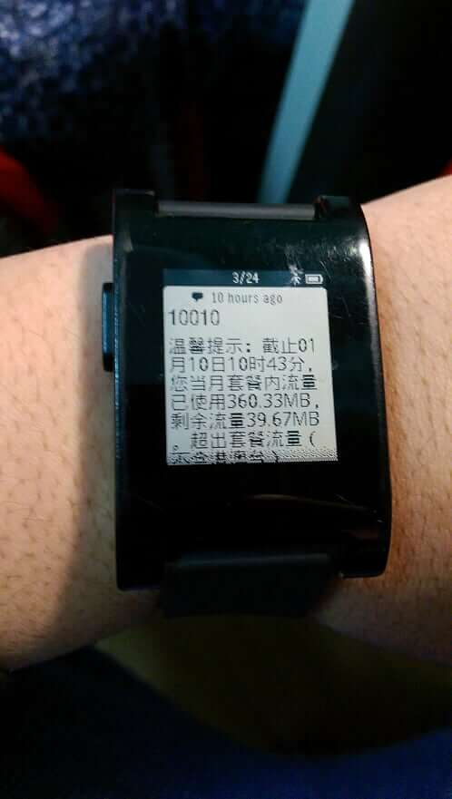

智能手表其实出的很早，不提20世纪那些电子表类型的“智能手表”，21世纪的第一个十年也已经有一些智能手表问世。而如果你现在去看各种智能手表的榜单（如[这篇文章](https://www.wareable.com/smartwatches/smartwatch-timeline-history-watches)），Pebble绝对会在里面有一席之地。

为什么？

我认为，这是因为Pebble在智能手表的功能和使用体验上找到了一个绝妙的平衡。

Pebble的功能不是最多的。Pebble没有彩屏，没有触屏，没有Wi-Fi，没有心率检测，没有高性能的CPU，没有运动检测，没有GPS……但是Pebble有：

- 类似E-Ink的反射性屏幕
  - 和现在主流的OLED相比，反射性屏幕可以保证我在任何条件下都能看清楚屏幕内容，且晚上时手腕不会发光，白天时外面越亮显示屏越容易看见
- 实体按键
  - 让我操作手表时不需要担心手指脏不脏
  - 不需要用手指在屏幕上划来划去遮挡本来就不大的屏幕空间
  - 按实体按键也有非常可靠的触觉反馈
  - 不用担心划伤屏幕
- 3天-1周的续航
  - 和某些手表的1-2天比，简直是天与地的差别
- 软件功能简单可靠，几乎没有出现过软件崩溃现象
  - 我想用它的时候，它一定能满足我的要求
- 塑料机身
  - 虽然不够Premium，但是也带来了轻薄和耐草的好处
  - 作为一个需要经常暴露在外的东西，手表耐草省下了很多维护成本
- 足够亲民的价格（我的Pebble新品买成800块）
- 开放了应用商店和SDK
  - 加上当时Pebble的极高的热度，有各种开发者Pebble开发软件，甚至可以在Pebble上玩flappy bird，在学校的时候经常无聊的时候玩，不用拿出手机，非常安全😄️

作为一个智能手表的辅助，Pebble在保证手表的功能性的基础上，提供了消息通知、短信/电话提醒等实用的功能。即使在现在看来，这些特性也完美满足了我对智能手表的大多数幻想，并且在屏幕、续航、系统稳定性等很多方面比现在的一些主流智能手表做的还要好。

所以在当时，我对Pebble一直爱不释手，有事没事就去应用商店找有没有新的应用和表盘可以体验，它的极高的稳定性和长续航让我不用随时担心它是不是又停止了工作。Pebble也养成了我目前的智能手表的使用习惯：静音+手表消息通知。这一点将在后文详细介绍。

## Pebble Time （2016年6月）

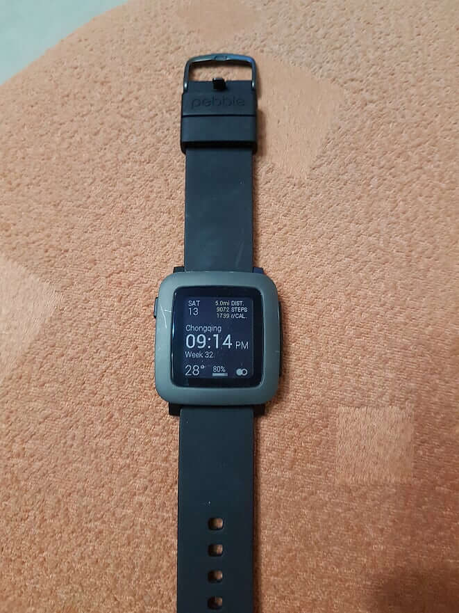

Pebble公司在Pebble成功后，还推出了Steel（钢制机身）、Time（这款）、Time Round（圆形机身）等产品，从机身材质、屏幕等方面对Pebble进行一些改良。

我个人对钢制机身和表带、圆形屏幕等并不感冒，但是对Pebble Time引入的**彩屏**非常感兴趣。于是在2016年6月在闲鱼上花612块淘来了这个玩意。

Pebble Time引入的彩屏也算解决了Pebble的黑白屏幕这一痛点，且彩屏并没有影响反射性屏幕的可见性和续航优势，也完全没有改变Pebble的简单可靠的操作逻辑和使用逻辑，可以说是一个没有代价的升级。生态中也有一些彩屏表盘和应用出现。

Pebble Time还有一个我后来换成其他表之后才意识到的优点：**线性震动马达**。Pebble Time在15年已经用上了线性震动马达，在手腕上的震感非常的舒服。用过线性震动马达的手机用户应该知道线性震动马达对震感的提升是非常好的，在手腕上感觉更甚，甚至因为手表提醒用户就是通过震动马达实现的，一个好的震动马达对消息通知体验的提升比手机更为显著。当时以为各个智能手表设备都应该换成线性震动马达了，但是直到后来才发现，很多设备直到现在都在用廉价的转子马达。

Pebble公司在Time之后，Pebble还推出一些产品，如加入运动检测功能、产品外观更现代的Pebble 2, Pebble Time 2等，这些产品的Kickstarter众酬活动也不断打破着当时的记录，似乎前景看起来非常光明。但是很可惜的是，2016年12月，Pebble被Fitbit收购，从此没有再推出新的产品，已有产品的生态也组建萎缩。

从我个人角度来说，Pebble的被收购是一个非常遗憾的事实。直到现在我都一直认为，Pebble的产品是最适合我的：它维持了手表最基础的功能：看时间，并在功能性、稳定性和续航上找到了一个极佳的平衡点。虽然不知道为什么公司要选择在风头正劲的时候卖身，但是这对我们这些智能手表用户，甚至整个智能手表行业的发展都造成了很大的影响。

## Microsoft Band 2（2015年12月）

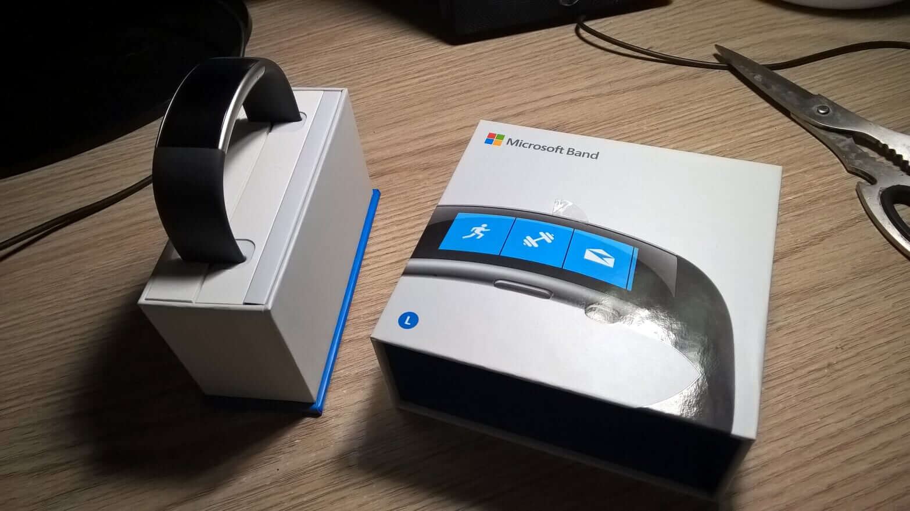

微软在2014年10月推出了Microsoft Band系列，并在15年推出了第二代：Microsoft Band 2。作为一个软粉兼可穿戴式设备爱好者，我当然不会错过这个系列的产品，所以在2015年12月，从淘宝海淘了Microsoft Band 2。这款产品有几个优点让我非常感兴趣：

- 金属外壳
- 大弧度曲面OLED屏+曲面玻璃
- Metro界面的系统和手机应用
- 特殊的佩戴方法（屏幕朝内）

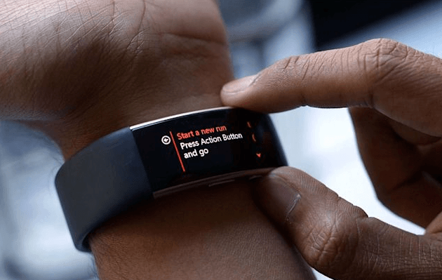

除了常规的消息通知、邮件提醒、通话提醒之外，这款手环还有：

- Cortana，可以通过麦克风和Cortana对话
  - 虽然不支持中文
- 相当完善的运动检测、健康检测等功能
  - 似乎还有紫外线强度检测等高端功能
  - 这些运动健康相关的功能也是我体验过最完善的可穿戴之一

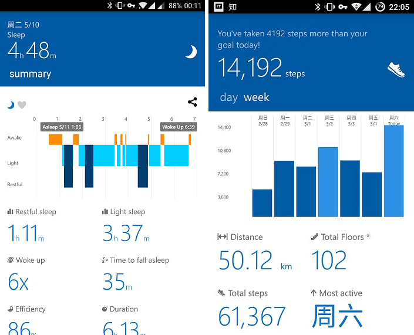

最重要的是，这款手环也是当时唯一可以和Windows Phone配对和正常使用的可穿戴式设备。由于我当时使用的是Lumia 830，可以和Windows Phone配对使用也是我买Microsoft Band 2的重要原因。

这款手环的功能相当全面，从办公相关的邮件提醒，到运动相关的运动、健康检测，可以说几乎适合任何场合、任何人群（可能应该去除当时作为高三学生的我）。并且，当时微软在通过Windows 8和Windows Phone 8构建一个独立的Windows生态系统，并且在当时看来势头良好，搭载有Cortana的这款产品将是这个Windows生态系统的一个重量成员。

这款产品的产品素质非常高，但是它较厚重，续航较短，只有1-2天；完全不支持中文，连中文字体都没有；

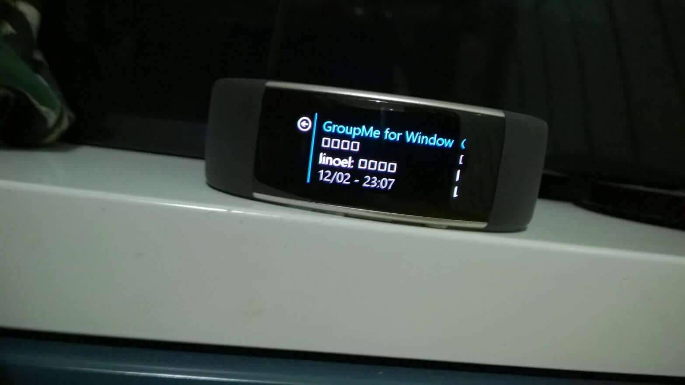

以及最重要的，不知道是不是普遍现象的，质量问题。我的Microsoft Band在买来第二个月（2016年1月），就出现了无法充电的问题。找到店家寄回美国返修，花了一个月，结果到手后一个月后，又再次出现了同样的问题。这让我对微软产品的质量相当失望，还好信仰足够坚定，让我自己吃下了这个大亏。

另外，随着Windows生态圈的全面溃败，这款产品的“潜力”也大打折扣。Microsoft Band 3一直没有推出，其对应的在线服务Microsoft Health也在2019年5月31日[被停止且删除所有资料](https://support.microsoft.com/en-us/help/4467073/end-of-support-for-the-microsoft-health-dashboard-applications)。

光从产品来说，Microsoft Band 2确实让人眼前一亮，曲面屏的设计、特殊的佩戴方式和交互方式非常有趣，其和Windows生态圈的集成也至少让我们这些软粉畅想了一波Windows生态圈的未来。但是，Windows生态圈的失败断送了产品作为生产力工具的未来；在失去了Windows生态圈后，这款产品的核心：硬核健康功能也很难吸引普通消费者花大钱（我买成1700）去购买这款产品；这款产品作为一个手环，也没有一些高价手环可以作为装饰品的作用。这样，微软手环的结局可能也不是非常让人吃惊了。

## LG G Watch（2016年3月）

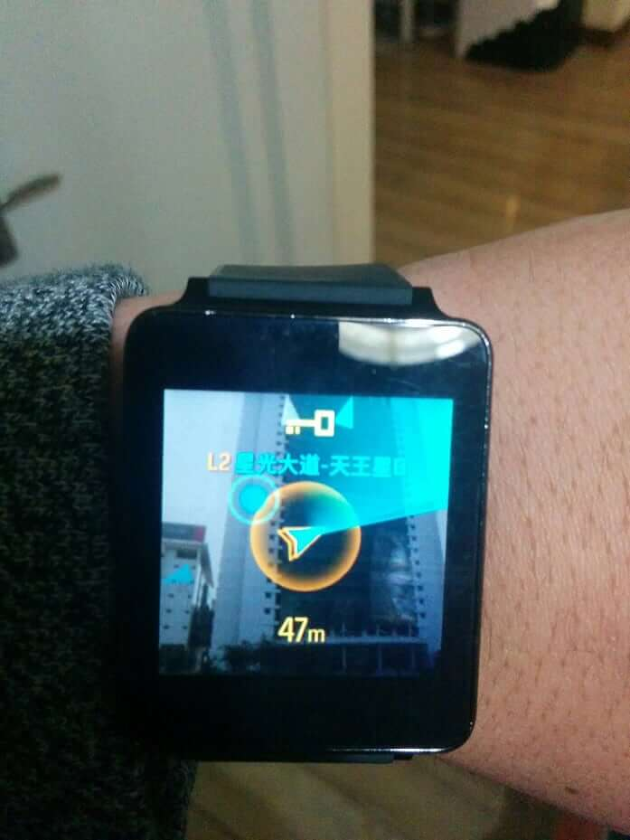

LG G Watch是2014年谷歌推出Android Wear后第一批首发的智能手表，同一批首发的还有备受人关注的Moto 360。Android Wear作为当时Google的穿戴式设备的尝试，其独特的卡片式设计、与当时Android相同的Material Design、和Android的集成也是非常吸引人，开放API和应用商店也似乎预示着一个丰富的生态系统。

但是和其他可穿戴一样，Android Wear的后劲明显不足，大厂对Android Wear的支持要么比较初级，要么根本没有；小厂的Android Wear应用也很多不堪大用，再加上硬件几年没有大幅更新（高通最新的Snapdragon Wear 3100芯片组还是28nm的A7，真是连牙膏都不挤），以及Google自己对这个平台的忽视，所以即使现在Android Wear改名为Wear OS by Google，即使已经发展了这么多年，现在的Wear OS体验仍然非常一般。如果关注YouTube上的各种手表评测的话（比如[MrMobile](https://www.youtube.com/channel/UCSOpcUkE-is7u7c4AkLgqTw)的），不管产品本身质量怎样，只要涉及到Wear OS的体验，都会说一般都会说Wear OS拖了整个产品的后腿。

我在2016年花了350块从闲鱼上收了这个表来体验体验，果然体验非常一般。滑动界面都能顿卡，Play里确实有app但是质量低下，Ingress的App看上去挺酷炫，但是其实并没有什么用。国内的app和Google体验就不用说了，就像没有一样。再加上一天不到的续航，这表用来体验体验还是不错的，日常使用还是别想了。

## Amazfit Watch（2017年6月）

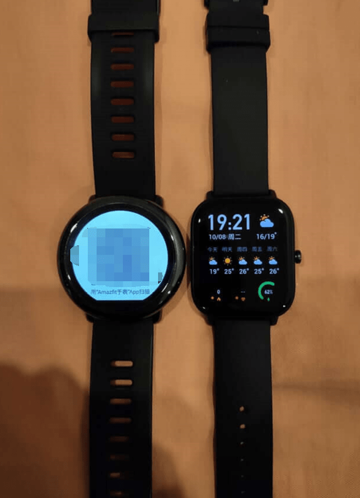

高考之后，我一直都是戴的Pebble Time，但是由于Pebble公司没了，Pebble的体验也原地踏步，有点厌倦了。于是当时把目光投向了华米的初代Amazfit Watch。

Amazfit Watch有几个和Pebble很像的优点：

- 反射性LCD屏幕，而且防刮伤，用了2年多一个划痕都没有
- 功能简单
- 续航长（3-4天左右）

但是也Amazfit Watch更注重运动检测功能，自带了心率检测器和其他一系列传感器，软件功能也倾向于运动检测，而不像Pebble一样倾向于一些日常功能。另外，Amazfit Watch没有开放API，只能用自带的功能。

这个表日常使用其实和Pebble感觉差不多，因为Pebble虽然能装第三方app，但是一般都不会经常用那些app。至于运动功能，由于我不怎么跑步啥的，用的比较少，这里就不评价了。

但是Amazfit Watch有个非常严重的问题：系统和触屏响应延迟大。尤其是当我想用手表的时候，按下手表侧边的按键，手表要等好几秒才会唤醒，唤醒之后用手去触控，系统也完全不会响应，得尝试很多次、等待一段时间后系统才能正常使用。这种情况不是偶尔发生一次，是每次都是这样。这个问题使我几乎都不碰手表了，完全不与手表进行交互，完全不使用它内置的功能，因为它的响应实在太慢了。

一个有趣的一点是Amazfit Watch在后期加入了搜狗地图，但是由于其恐怖的触控延迟以及低下的性能，搜狗地图基本处于无法使用的状态，不知道为什么华米会加这么一个功能。

## Amazfit Watch GTS（2019年9月）

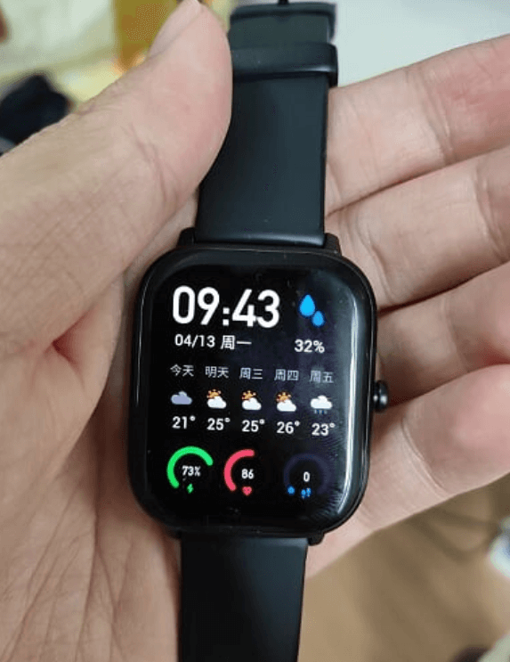

其实我很早之前都有换掉Amazfit Watch的想法，因为它看上去比较丑，比较大，系统响应极慢，以及用了一段时间后电池续航下降明显，但是当我浏览了一圈之后，发现Pebble之后，并没有完全满足我的需求的手表，Amazfit Watch变成矮子里的高个，就一直这样等下去了。一直等到了2019年8月，华米发了GTS，虽然GTS也不满足我对智能手表的所有需求，但是它较为轻薄小巧、方形屏（我更偏好方形屏，在显示文字时屏幕利用率更高）、续航较强、功能足够，于是就下手了。

这款手表相信所有人看到它的第一眼都觉得它抄袭Apple Watch。确实，从外形和表盘来看，它确实和Apple Watch一模一样，但是我个人觉得这一点并没有什么大问题，国内厂商抄袭是一个连新闻都不用上的事情。而这款表除了和Apple Watch像之外，作为一个“大号手环”，其实几乎没有什么缺点，而且市场上也少有类似的竞品（华为表是一个，但是我是华为黑，以及华为表价格几乎是这个的两倍），再加上价格较为便宜（800块），所以我对它比较满意。

这块表和初代Amazfit Watch的最大的不同点，除了更轻薄更现代的外形，就是屏幕了。这块AMOLED屏幕分辨率和PPI达到了视网膜的标准，看着非常舒服，另外最重要的是这块屏幕和系统响应速度非常快，完全没有Amazfit Watch那种卡顿和缓慢的感觉。这块屏幕一个劣势也是来自于AMOLED，不像反射性屏幕，它需要自己发光，虽然它亮度足够在白天正常阅读，但是从它被点亮到光线感应器感应到外界亮度调整屏幕这个过程需要2 3秒的时间，不像反射性屏幕一样即抬手即用。另外由于我一直开启常显，在晚上的时候手腕总有一束光，看着比较奇怪。

对于屏幕这个点，在AMOLED和反射性屏幕之间选，我还是更倾向于反射性屏幕，因为**阳光下可读性**我认为是手表一个非常重要的特点：出门后我连时间都看不到，为什么要戴个表？但是市场已经做出了它的选择，所有厂商基本都使用的OLED屏，作为一个普通消费者也做不了什么，只能从命啦。

## 其他体验过的设备

- Fitbit

Fitbot是另一家智能运动穿戴厂商，也在2014-2016年左右当时红极一时，主要产品手环和手表都非常注重运动相关功能。2015年托朋友的福，体验了一下Fitbit手环，具体型号忘记了。其实它和现在的小米手环并没有什么大区别，就是做运动检测，但是对我这种不做跑步这种运动来说基本并没有什么作用。另外，我当时体验的Fitbit产品没有显示屏，连时间都看不了，果然算了。

- Ticwatch E

Ticwatch也是一个比较老牌的智能手表厂商，也是从Android Wear出来后没多久就开始做智能手表。托室友的福，我体验了一波[Ticwatch E](https://www.ticstore.com/products/p000276)。它比较接近于Android Wear形态的手表，功能比较丰富，开放SDK，可以装各种应用，但是续航较短。这款手表对我来说最大的问题就是之前提到的**阳光下可读性**：这款AMOLED屏幕亮度太低了，在阳光下完全不可见。再加上这块表的续航太短（不足一天），功能虽然多但是实际上有用的没几个，所以很快就还给同学了。

# 智能手表的分类以及各自优劣

其实读了上一节的你可能已经发现了，虽然这些设备都叫做智能手表，但是它们之间的区别还是非常大的。有的重续航，有的续航只有一两天；有的可以自己装app，有的只能用自带的app。一般把现在的智能手表分成两类：**大号手环**和真正意义上的**智能手表**。

**大号手环**指的是那些功能简单、不支持自己安装应用的手表。这些产品一般以运动检测功能为主，续航较长（一般在3天以上），较为轻薄。由于这些手表的功能实际上和那些手环产品差不多，所以被称为大号手环。大号手环例子有上面提到Amazfit Watch和GTS，以及华为和荣耀表系列。

而真正意义上的**智能手表**指的是那些功能丰富强大、支持自己安装应用的手表。这些手表一般也包括运动检测功能，但是续航较短（一般一两天），且由于需要性能的支撑较为厚重。真正意义上的智能手表的例子有Apple Watch、Android Wear（或者说Wear OS by Google）系列（上面提到的LG G Watch）、小米表等。

二者的优势和劣势其实也是相当明显。

大号手环续航长，较为轻薄；但是由于不能扩展，功能受限制；并且由于这种表为了追求续航，性能一般都比较低，一般内置的功能也都是较为普遍的运动检测等功能，诸如备忘录、地图等功能，我到现在还没有看过有大号手表搭载。

而智能手表正好相反。其能够扩展功能，如果生态跟得上的话（例如苹果表的生态），能够使用到很多功能。但是由于其对性能和电池的追求，其机身一般不会很轻薄（苹果表已经算是个好的例子的，可以去参考机身厚度超过10mm的小米表），并且即使这样其续航一般都不会超过2天。

有的智能手表还支持4G，支持独立通话和网络通信。这个功能可能对于有的用户（例如跑步的用户）来说，支持独立4G让用户可以让手表脱离手机独立完成一些工作，但是对于绝大多数场景，手表还是更应该当作一个手表的附属。道理很简单：就那么小块屏幕，即使支持4G，能干什么？除了打电话之外，发短信、聊QQ/微信、看网页、玩游戏等智能手机日常操作都完全不能做，开了4G还更加影响续航，电池本来就只能支持一两天，开了之后，续航就更惨不忍睹了。

# 当前各类智能手表的发展趋势

我对智能手表的发展趋势是比较悲观的，因为电池技术没有突破，手表必须在续航和功能之间二选一。而功能性上，智能手表较为低下的性能也影响了智能手表的使用体验以及可以完成的功能，除了运动检测以外，智能手表厂商现在仍然没有找到适合智能手表完成的工作。

现在市场上的手表几乎已经可以完全分成上述提到的大号手环和智能手表了。下面我就分成这两类来讲讲我对智能手表的发展趋势的分析。

## 智能手表

智能手表目前苹果表最好，没有之一。苹果表具有更好的硬件、更好更统一的生态，从任何角度来说都比Android这边的智能手表产品有更好的发展趋势。其他厂商的智能表，小米表一出来就被全国人看笑话，Wear OS by Google半死不活。

苹果表之外的智能表总有两个致命问题：**硬件弱鸡**和**生态垃圾**。

就像上面所说的，高通最新的可穿戴芯片组Wear 3100还在用28nm的A7架构。在手表这种功耗敏感的设备上，采用如此古老的制程工艺，一开始就输了。功耗降不下来，影响手表的续航；性能低下，影响手表的功能的开发，也严重影响了手表的流畅度。

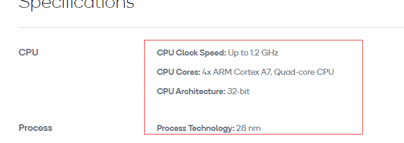

而生态垃圾就不用说了。Wear OS by Google发展了这么多年，还有Google爸爸的亲自背书，都发展成这个样子，就更不用提Ticwatch、三星等厂商的智能手表生态系统了。另外，三星自己搞一台Tizen生态系统，其实也分流了开发者，加重了开发者的负担，进一步恶化了智能手表的环境。

更严重的是，硬件弱鸡+生态垃圾这个问题是负循环的：硬件差，功能和使用体验无法提高，影响生态的建设；生态建设不上去，吸引不到用户，硬件就没有动力持续改进，只能停留在几年前的地步，软件厂商也不去给手表做应用，软件体验也没什么改进。

## 大号手环

而对于大号手环，现在的新厂商都在这里发力。华为表系列、Amazfit系列、小米手表Color等，新款层出不穷，似乎欣欣向荣。

但是如果你仔细看的话，其实这些大号手环除了外观之外，几乎都是一样的：一样的AMOLED屏幕、一样的健康、运动、睡眠检测功能、一样的NFC和卡包，连续航时间都差不多（不开常显2周或者3周，开常显减半），一样的……没有其他功能。其实严格来说，连外观也都差不多，除了Amazfit GTS之外，都是圆形。即使华为表系列加入了麦克风和语音通话功能，华米部分手表有与小爱同学交流的功能，但是其实都不是主要的功能（语音助手确实还是不是那么有用）。其核心功能和手环并没有什么变化，仿佛，就是在手环上加了一个较大的屏幕而已。

我并不是说屏幕没有作用：相反，这块屏幕是我买智能手表而非手环的最重要的原因：起码我能够用智能手表看时间。但是大号手环的同质化简直太严重了，并且，3年前的初代Amazfit表和现在的各类大号手环，从功能性上看，其实也差不多。

# 我对智能手表的期待

我对智能手表的期待，可以分成三个层次：**可靠性**、**辅助功能**和**多屏协同**。

## 可靠性

**可靠性**是我对所有手表甚至工具的基础要求。一个工具应该在任何我需要的时候，都能可靠地高效地完成的我的工作，关键时刻响应慢甚至掉链子都是不可忍受的。

在可靠性上做的不好的智能手表产品其实很多：

- 屏幕亮度太低，让我出门在外想看屏幕的时候看不见（Ticwatch E）
- 功能响应慢（Amazfit Watch）

其实续航短也可以算是可靠性上的问题，一个连一天都无法支撑下来、需要我时刻担心充电的“工具”，若不是对我生活有巨大的好处（例如智能手机），我宁愿不使用它，少担心一个事情。

这一点上，其实很多真正意义上的智能手表对我来说都可以排除了，因为就像之前所说的，现在很多真正意义的智能手表在基础体验的可靠性上都欠佳，系统流畅度、功能可靠性、续航上都不能达到“可靠”的标准。这样，即使一个设备功能再丰富，那又有什么用呢？

## 辅助功能

**辅助功能**指的是智能手表作为手机的附属，以它在手腕上、随时可触及的优势，给生活带来改进的功能。

其中最重要的辅助功能，对我来说，是**通知提醒**。通知提醒是至今为止智能手表给我生活带来的最大的提升和改变。

自从Pebble开始，我的手机就一直保持静音的状态，所有通知全靠手表提醒。当通知时，手表将会震动一下，然后把信息投送到手表上。用手表、而非响应或者手机震动提醒通知的好处实在是太明显了：

- 绝对不会错过电话和消息
- 不会打扰到其他人
- 可以快速查看消息，以确认需不需要进一步处理

所以，对我来说，通知是否能够及时到达、通知内容是否能够高效显示、通知震动的感觉是否恰到好处，这些通知提醒的体验是非常重要的。

通知提醒之外，智能手表还可以提供一些功能，以提供一些我们平常不经常用的、但需要用的时候感觉非常有用的功能，比如：

- 寻找手机（按一个键让手机响铃）
- 运动检测（简单和复杂的都可以）
- 闹钟

BTW，辅助功能也是我偏好方形屏幕而非圆形屏幕的原因，因为方形屏幕在显示文字的时候天生比圆形文字更有优势，而对我来说智能手表最重要的通知提醒功能就非常依赖文字阅读。

## 多屏协同

最后，**多屏协同**是我希望手表未来的发展方向。

多屏协同其实是个很古老的话题，从Windows Mobile、到现在的智能手机和平板，如果能把各个设备的优点结合起来，数据共享，将会产生1+1>2的效果。多屏协同在硬件层面上早已没有问题，但是在软件层面上，由于各个设备之间的厂商的壁垒，多屏协同对绝大多数来说都还是一场梦。

微软自己的共享功能，由于缺乏了手机这一重要一环，只能在UWP和Windows电脑之间用；而微软的手机和电脑的连接工具Your Phone，做了这么久却没有开放中国区的使用，且国内的连接稳定性堪忧；DELL等厂商也做了一套和Your Phone差不多的软件，却只预装在自己的电脑上；第三方厂商的协同工具，例如Airdroid，虽然功能强大，但是仍然无法解决第三方软件厂商的软件。

这个方面做的最好的，莫过于苹果和华为了。我没有使用过苹果生态链，这里就不多说；华为的手机、平板、电脑和电视之间的多屏协同虽然较为处于一个原始的阶段，但是也已经达到非常可用的状态。更重要的是，华为认识到了多屏协同的优势，并且做出了比其他厂商都要完善的工作，这已经是非常难得的。

说到手表上，其实我认为在多屏协同中，手表也是一个非常重要的一环。因为手表屏幕较小，操作不便，但是手表又有一直在手腕上可以方便与之交互的巨大优势，多屏协同的重要性完全不低于电脑、平板和手机。

举例，我希望手表能够和其他设备交互，实现：

- 导航

当我走在路上，在手机上的地图选择一个目的地后，手表可以给我显示路线，并在到达路口的时候提醒我转弯。这样，我就可以不用一直打开手机拿在手机。

之前有的版本高德地图在息屏后可以通过通知提示路线，手表可以接收这个通知，这已经非常接近了。但是，如果手表能够实时显示地图，并用图的形式显示地图，那将是再好不过了。

目前有的手表有地图软件，但是这些地图软件还是需要在手表上设定目的地，手表上屏幕小，操作不便，我希望的是能够在**手机**上选择一个目的地后，**手表**能够作出提示。

- 闹钟

当我在手机上设置了闹钟后，在响铃时，手表也同步震动。手机系统也可以在设置闹钟时选择是否在手表上响，以免打扰其他人。

现在很多手表都可以设定闹钟功能，但是在手表上设置闹钟仍然有操作不便的问题。Amazfit支持在手机上设置手表闹钟，但是在应用里设置闹钟和我们已经习惯的在系统里设置闹钟的体验是割裂的，并且应用里的闹钟设置较为简单，不支持例如MIUI的工作日响铃等高级功能。

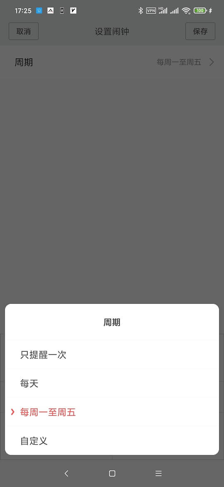

- 更详细的通知和简单的通知处理

现在的消息通知都不支持图片，并且若没有软件厂商的支持，也无法进行进一步操作。理想情况下，手表上的通知应该能够显示聊天工具发来的图片，并也应该能对通知进行简单的进一步处理，例如发送一些简单的回复等。

Wear OS by Google是可以对符合Android标准的应用进行处理的，例如回复短信、邮件等，但是在现在这个不遵循标准的第三方聊天工具（说的就是QQ和微信）支配的时代，没有对应厂商的支持，这个功能基本是无法实现的。而腾讯对第三方的支持，呵呵。

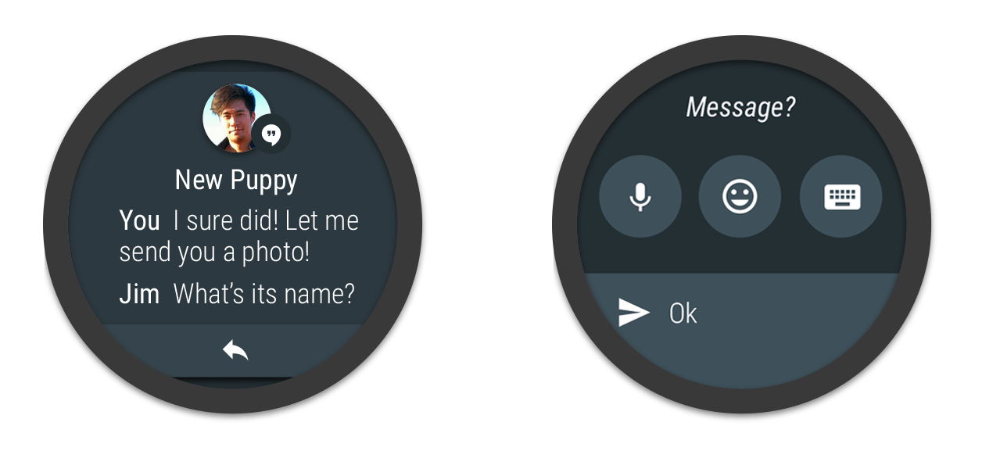

其实这些功能在硬件层面早已没有问题（可能蓝牙传送图片有带宽的限制），软件实现方面也没有涉及到人工智能等目前看来较为玄学的技术。这些功能的实现最重要的还是来自各个软件厂商之间的合作和数据共享，而这可能也是最难的。

# 总结

我一直无法忘记2012年Google Glass推出给我带来的震撼，那种科技与现实交融的感觉充满了未来感。而在现实中，可穿戴设备和智能手表就是最接近这种未来感的设备。

我一直是个可穿戴设备的爱好者，希望尝试各种可能给我的日常生活带来改变和提高的的设备，也希望科技能够一直发展，持续给我们的日常生活带来方便。
