# 切换到Linux

最近Windows在我电脑上不知为何响应很慢，非常影响我使用电脑的体验，甚至在用WSL2时，输入命令都出现了卡顿。

而一般来说，Linux相对于Windows，一个很大的好处更节省资源，并且在运行一些程序时效率更高，比如VSCode、JetBrains系IDE、emacs等等开发者常用工具在Linux上的启动速度和Windows完全不是一个等级的。

所以我产生了在实体机上装Linux的念头。但是由于主力笔记本有时候还是需要使用Windows下的一些软件的，所以我选择在家里的一台2013年的老电脑上安装Linux。

之前也折腾过很多次Linux，但是无一例外，之前的Linux要么是虚拟机，要么是Intel核显的笔记本。这台陪伴了高中三年的游戏生涯（咦）的老电脑有一块GTX 660 Ti，虽然以现在的眼光看660 Ti很弱鸡，但是在当时（2013年），它还是一个可以稳稳玩战地4这种“新”“显卡危机”游戏的显卡呢，前段时间还用这台电脑通关了Ori and the Will and the Wisps。同时，查询资料发现，已经有一些开源项目在尝试在Windows下的应用和程序运行在Linux下，并在Steam的努力下，Linux已经可以玩一些Steam游戏了。

所以，这次我决定自己试试，看看Linux下玩Steam游戏，到底怎么样。

# 安装Arch Linux和配置

自从上次尝试了Manjaro后，我就算踏入了Arch邪教大坑，用过Arch的官方库和神器AUR之后就完全回不去Ubuntu等Debian系的包管理了，什么东西都能直接`sudo pacman -S`从官方库安装，如果官方库没有，那就`yay -S`从AUR安装。再加上极度丰富的Arch Wiki，Arch系Linux发行版的使用起来真的是舒服。之前Manjaro只是浅尝则止，这次折腾之前想了想，为什么不试试正版Arch Linux呢？

很多人都说Arch Linux难装，其实最大的障碍是Arch Linux的ISO没有一个图形化的安装程序，只提供了命令行界面，这就让很多Linux用户很为难。其实，Arch Linux官方是提供了一个[安装教程](https://wiki.archlinux.org/index.php/installation_guide)的，其实只要随着这个安装就可以了，实话说，安装过程还不如后面配置过程耗时间。

这里记录一下安装过程中的一些教程里没有提到的事情以及容易错的东西（适用于UEFI系统）：

- 创建EFI boot分区时，使用`mkfs.vfat /mnt/boot`将分区格式化为FAT32
- 安装完成后重启前，安装[GRUB](https://wiki.archlinux.org/index.php/GRUB)
  - 若EFI分区为`/boot`，使用这个命令安装grub：`grub-install --target=x86_64-efi --efi-directory=/boot --bootloader-id=GRUB`
  - 安装完成后一定要生成配置文件！不然无法启动机器：`grub-mkconfig -o /boot/grub/grub.cfg`
- 安装完成后重启前，记得安装[NetworkManager](https://wiki.archlinux.org/index.php/NetworkManager)并enable，不然启动后没有网络
  - `pacman -S networkmanager`
  - 记得enable：`systemctl enable NetworkManager`
- 使用Login Manager，不要自己去配置X11或者Wayland
  - 安装GNOME的话，直接`sudo pacman -S gnome gnome-extra gdm`，然后`systemctl enable gdm`和`systemctl start gdm`就可以进入桌面了

我选用的一些重要软件包如下：

- GNOME
  - 把KDE、Cinnamon、Deepin、i3等各种DE和WM试下来，发现虽然GNOME稳定性欠佳，但是确实是社区支持和功能最全面的，真是又爱又恨）
- Pling Store
  - 装主题的，啥都有，GDM、GNOME、GTK等等等主题都可以一见安装，甚至还有GRUB主题（安装需要解压然后运行`install.sh`，也不麻烦）
  - 就是安装比较麻烦，需要首先`yay -S appimagelauncher`装AppImageLauncher，然后去Pling Store下载AppImage文件，使用AppImageLauncher整合到桌面中，然后启动
  - 装AppImageLauncher过程中需要clone特别多的东西并现场编译，建议使用稳定的梯子
  - Pling Store若下载太慢，可以从terminal中运行并设置`HTTP_PROXY`和`HTTPS_PROXY`代理。`AppImage`文件可以在`~/Applications`中找到
- [Matcha GTK主题](https://github.com/vinceliuice/Matcha-gtk-theme)
  - Manjaro GNOME的默认主题，类似Material Design的主题，比较完整耐看
  - 可继续使用github里推荐的`qogir-icon-theme`（从pling store安装）做图标、指针等样式，比GNOME自带的好看多了
  - 安装这个主题请直接去github上clone下来然后`./install.sh`，不要从pling store里安装，否则字体会出现一些问题
- [TopIcon Plus](https://extensions.gnome.org/extension/1031/topicons/)
  - GNOME在之前某个更新中去掉了系统托盘功能，这样一些需要托盘的应用就无法显示托盘图标了，QQ这种Wine应用甚至只能多开个Wine System Tray窗口，特别难用
  - 讲道理完全无法理解GNOME的这一举动
  - 还好这个插件存在可以继续支持托盘图标
- qv2射线
  - 全平台统一的GUI、支持测ping、订阅、自带SOCKS5和HTTP代理、支持绕过中国大陆、支持自动设置自动启动（XDG Autostart标准，非systemd）……想要的功能都有了
- Rime输入法
  - 这个输入法其实比较主观，我使用它的主要原因是它可以使用OneDrive同步配置文件和词库，并且在Windows/Linux平台都可以使用，这样我在各个平台的词库都可以同步
- [abraunegg/onedrive](https://github.com/abraunegg/onedrive)
  - OneDrive客户端，虽然不支持Windows和macOS下的占位文件，但是支持可选同步，即选择只同步哪些文件，虽然需要自己写需要同步的路径（[配置](https://github.com/abraunegg/onedrive)），但也总比把OneDrive所有文件拉到本地要好多了。
  - 其实可以写个工具来自动生成可选同步的文件，看看以后有没有时间继续折腾Linux


`screenfetch`截图如下：

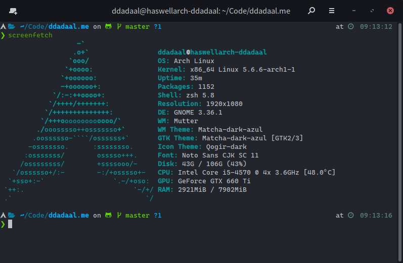

# 驱动

安装完后，我尝试直接用内核自带的开源驱动启动Steam下的游戏，但是没有启动成功，点了开始后没有反应。但当时我是在Wayland下使用的，不知道是驱动的原因还是Wayland的原因。但是由于当时本来就是试试，发现不行就直接准备上NVIDIA的闭源驱动。

都说Linux上的闭源N卡驱动比较坑，但是根据我的测试，在单个显示器的情况下，在Arch Linux上其实问题不是很大。万能的Arch Wiki不出任何人所料地有一篇关于NVIDIA显卡的[Wiki](https://wiki.archlinux.org/index.php/NVIDIA_(%E7%AE%80%E4%BD%93%E4%B8%AD%E6%96%87))，安装上面做一轮，一般就能解决大部分问题了。

简单来说，对于一个纯NVIDIA显卡的系统（即不是笔记本平台的Optimus），其实只需要做以下两步：

1. 先在`/etc/pacman.d/mirrorlist`里开启multilib以装32位包：去掉这两行的注释：

```
[multilib]
Include = /etc/pacman.d/mirrorlist
```

2. 运行以下命令安装包，安装完成后重启电脑。

```bash
sudo pacman -S nvidia lib32-nvidia-libgl nvidia-settings
```

第一个`nvidia`包就是臭名昭著的NVIDIA的闭源驱动了。理论上来说，装了这个驱动后重启应该就可以用了，但是……

第二个`lib32-nvidia-libgl`是必须装的，不装的话，重启之后会发现虽然驱动正常加载、系统可以正常进入，但是会发现一些奇怪的问题，比如：

- deepin qq、Steam等均不能正常启动，
- GNOME自带的Night Light功能（夜晚把屏幕变黄）会失去作用

使用控制台启动Steam的话可以看到如下报错：

```
libGL error: No matching fbConfigs or visuals found
libGL error: failed to load driver: swrast
```

网上查了一些资料后发现了这个`lib32-nvidialibgl`包，装上问题就解决了。

第三个是NVIDIA控制面板，和Windows上的NVIDIA控制面板比较类似，装上后可以通过GUI查看一些信息和进行一些设置等，截图如下：

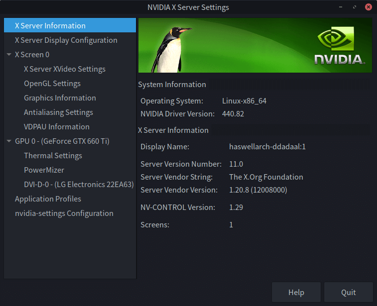

驱动安装后最大的变化是：**不能使用Wayland进入GNOME了，只能使用X11**。对我来说Wayland相对X11最大的优势并不是性能，而是Wayland可以对不同显示器设置不同的DPI，而X11只能有一个全局的DPI。X11果然还是太老了，DPI只能全局这个XX设定就很离谱，尤其是对需要连接外接显示器的高分屏笔记本，基本就无法使用。但是对于台式机还好，如果没有不同DPI的显示器的话，X11其实也能用。

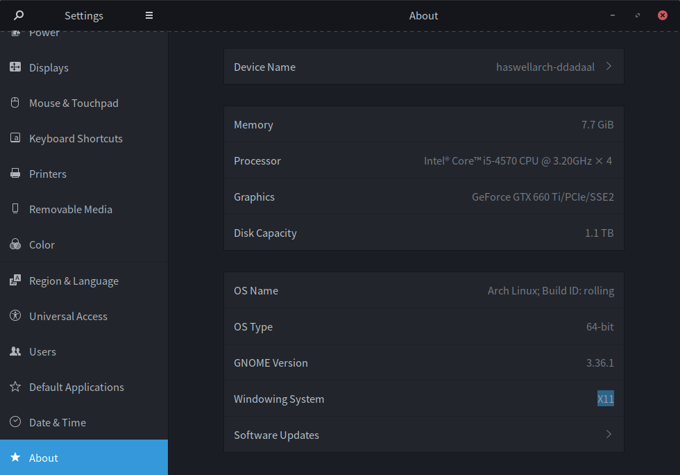

BTW，根据我最近的体验，Wayland在GNOME上的体验已经非常好了，完全可以日常使用，个人认为要是没有游戏需求的话，建议能用Wayland就用Wayland，X11还是太老了。

另外，Manjaro，Ubuntu等一些发行版设置自带了管理显卡驱动的工具，如果不是执意要Arch Linux的话，完全可以选择这些自带管理显卡驱动的工具的发行版。这些工具似乎还可以很方便地配置Optimus双显卡的情况，非常值得推荐。

# Steam和Proton

Valve虽然一直不会数3，但是在Linux游戏领域还是做了很多贡献的。之前推出的SteamOS虽然目前发展状况不佳（我连ISO都找不到？），但是它推出的[Proton](https://github.com/ValveSoftware/Proton)工具还是非常给力的。

Proton是一个针对游戏的、Linux下的Windows的兼容层，基于Wine、[DVXK](https://github.com/doitsujin/dxvk)（在Vulkan上实现的Direct X）等开源项目。它能够让一些Windows独占的游戏跑在Linux上。虽然Wine做了这么久，还是效果不怎么理想，但是Proton的发展却异常不错，很多游戏已经可以Linux可以运行了。虽然效率有损失，但是可以运行就是一个胜利嘛。

Proton甚至可以有一个网站[ProtonDB](https://www.protondb.com/)，记录了各种游戏在Proton下的兼容情况，可以发现其实很多流行游戏：例如CSGO、GTA5等已经可以在Proton下较好的运行了。

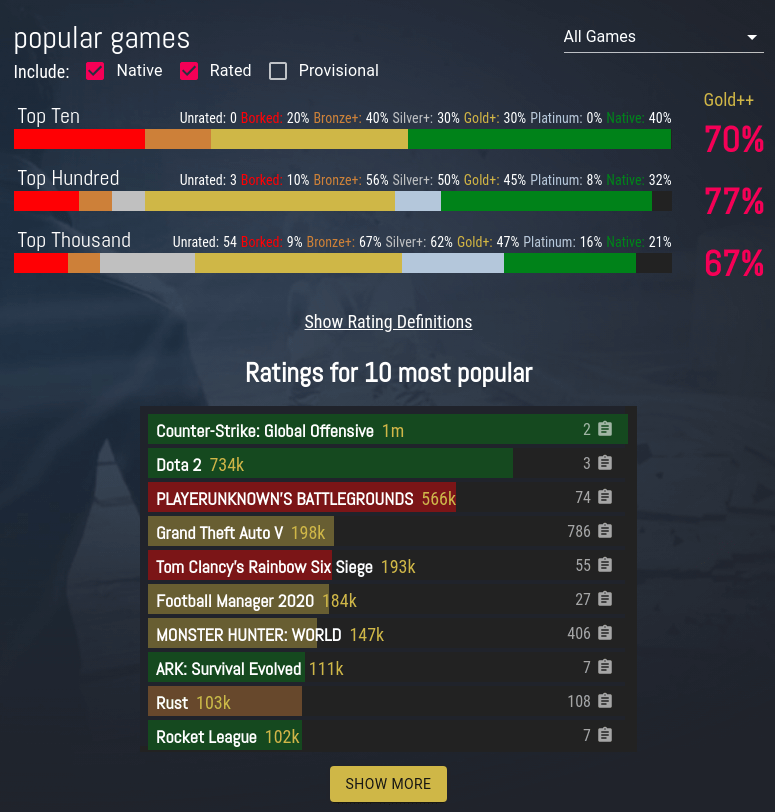

所以，我安装好Steam后，第一件事就是去设置里打开Steam Play，让所有游戏都可以尝试在Proton兼容层下运行。

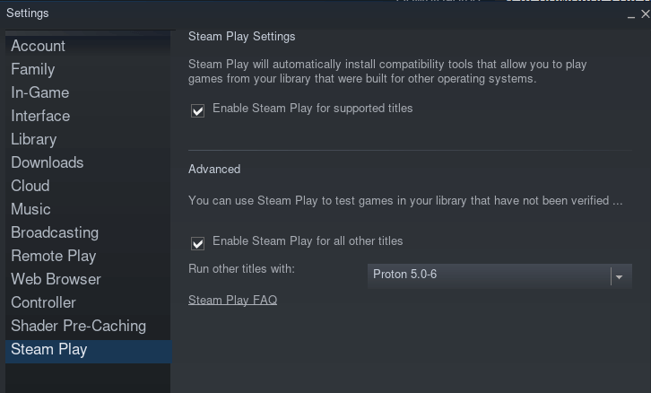

重启Steam之后，所有游戏都可以进行下载并尝试运行了。作为测试，我下载并打开了红色警戒3（中学时期一直是RA3粉，最近看了一些新MOD和解说后又想继续玩了）。

刚打开时，会有一个Steam Play提示说游戏运行在兼容层里。

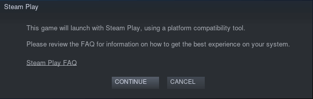

确定后，Steam会装一些DirectX等游戏依赖库，然后就开始运行游戏了。RA3在点击运行到游戏中途启动用了好几分钟，当我差点失去耐心后，游戏突然蹦了出来！

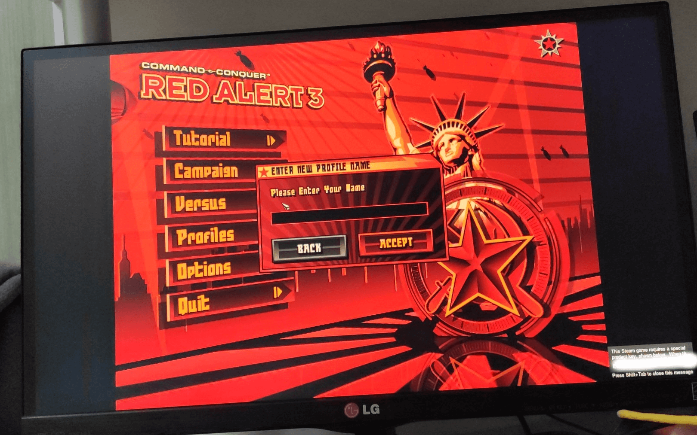

设置分辨率，打开分辨率，选择阵营，进入游戏，可以正常游玩，并且性能并没有可见的损失。

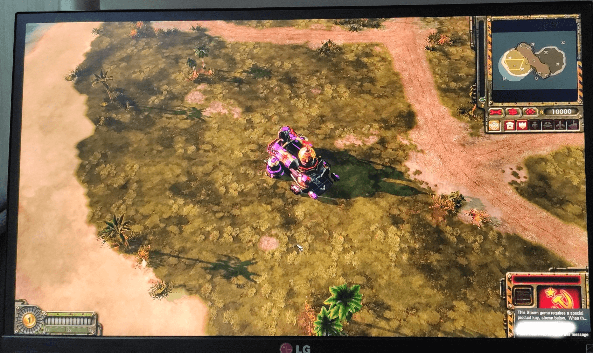

我让我很惊喜。退了RA3后，我从我的Steam库里找了几款游戏并尝试运行，运行情况如下：

| 游戏 | 情况 |
| -- | -- |
| Red Alert 3 | 完美运行 |
| Call of Duty Modern Warfare 3 | 无法运行。打开运行后过段时间自动退出了 |
| Ori and the Will of the Wisps | 完美运行，而且启动速度比Windows快 |
| Halo: Master Chief Collection | 可以运行，但是性能比较低，开启垂直同步后都仍然有画面撕裂的问题 |
| Crysis 2 | 可以运行，但是性能损失似乎比较大，而且窗口运行退出后，GNOME侧边栏、顶栏等失去了鼠标响应，键盘可以用，重新登录可以解决 |

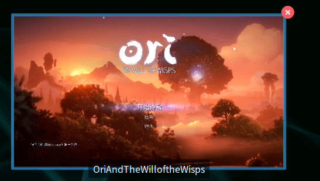

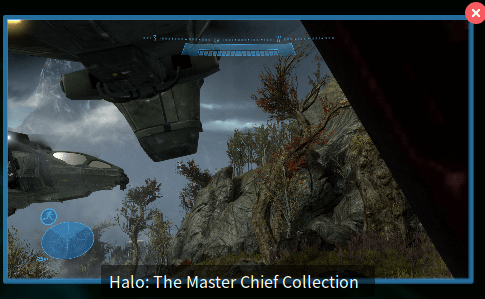

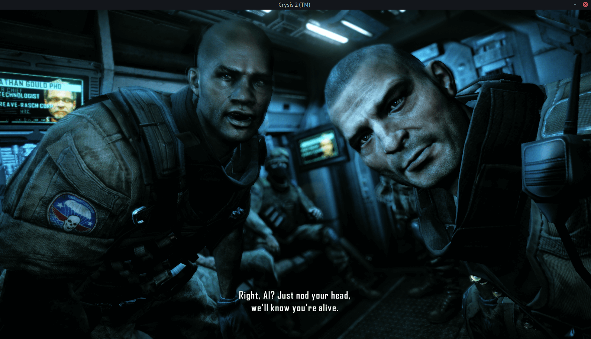

# 总结

虽然Proton的支持仍然比较初级，但是这么多的游戏已经可以运行，开源社区的力量真的非常强大。

游戏之外，总体来说Linux的运行速度确实比Windows快，打开IDEA、VSCode、Emacs等应用比在Windows上快了不知道多少，资源占用也更少。我甚至可以在Linux上同时运行我的毕设系统、一个3台虚拟机组成的OpenStack系统、VSCode和多个浏览器，同时保证系统仍然可以流畅的响应。之前在Windows上这么运行，系统早就卡的不能用了。至于生态，在深度等公司的努力下，一些国内的毒瘤应用，例如QQ、微信等，也可以在Linux下运行地比较好，国内的Linux生态其实早已没有那么贫瘠了。

最后，不管一个产品有多好，只要它垄断了，它早晚都会做出一些不利于消费者的事，Windows也不例外。所以作为一个普通的用户和消费者，即使可能长久Windows，但是Linux在游戏、生产力等各种领域的发展和补足也会让微软感受到压力，从而推动整个行业的进步。
