# 小款手机已经消失了

我记得，当我第一次拿到一台HTC Desire HD（G10）时，那4.3寸的屏幕带给我的震撼。

我记得，当三星刚推出5.3寸的Galaxy Note时，众人对这“巨大”的屏幕的感叹。

我记得，当苹果第一次推出4.7和5.5寸的iPhone 6和6s时，网络上对未来的iPhone的调侃。

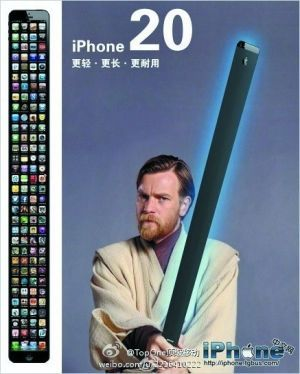

可是，从2018年起，手机越来越大、越来越重的趋势无法阻挡了。

或者更准确地说，**小款**的手机已经消失了。

2017时，一种**宽度在70mm以下，重量在160g左右**的版本占据了手机市场的半壁江山。在16:9屏幕的非全面屏时代，这个尺寸大小的手机一般为5寸屏。而占据另一半的手机，宽度普遍在75mm左右，而除了iPhone的Plus款以外，大款的重量也一般控制在180g左右。在非全面屏时代，这个尺寸一般是5.5寸屏。

| 年份 | 手机型号      | 高度(mm) | 宽度(mm)  | 厚度(mm) | 重量(g)                          |
| ---- | ------------- | -------- | --------- | -------- | -------------------------------- |
| 2017 | 小米6         | 145.17   | **70.49** | 7.45     | 168（玻璃后盖）、182（陶瓷后盖） |
| 2017 | 华为P10       | 145      | **69.3**  | 6.98     | 145                              |
| 2017 | 华为P10 Plus  | 153.5    | 74.2      | 6.96     | 165                              |
| 2017 | 三星S8        | 148.9    | **68.1**  | 8.0      | 152                              |
| 2017 | 三星S8 Plus   | 159.5    | 73.4      | 8.1      | 173                              |
| 2017 | iPhone 8      | 138.4    | **67.3**  | 7.3      | 148                              |
| 2017 | iPhone 8 Plus | 158.4    | 78.1      | 7.5      | 202                              |
| 2016 | 一加3         | 152.7    | 74.7      | 7.35     | 158                              |

而到了2020年，旗舰款手机的三围和重量却变成了下面这样。宽度除了S20已经没有低于70mm的了，而同样除了S20之外，所有手机的重量都在180g左右（P40）或以上。

| 年份 | 手机型号         | 高度(mm) | 宽度(mm) | 厚度(mm) | 重量(g) |
| ---- | ---------------- | -------- | -------- | -------- | ------- |
| 2020 | 小米10           | 162.6    | 74.8     | 8.96     | 208     |
| 2020 | 华为P40          | 148.9    | 71.1     | 8.5      | 175     |
| 2020 | 华为P40 Pro      | 158.2    | 72.6     | 9        | 209     |
| 2020 | 三星S20          | 151.7    | **69.1** | 7.9      | **163** |
| 2020 | 三星S20+         | 161.9    | 73.7     | 7.8      | 186-188 |
| 2020 | 三星S20 Ultra    | 166.9    | 76       | 8.8      | 222     |
| 2019 | iPhone 11        | 150.9    | 75.7     | 8.3      | 194     |
| 2019 | iPhone 11 Pro    | 144.0    | 71.4     | 8.1      | 188     |
| 2020 | 一加8            | 160.2    | 72.9     | 8.0      | 180     |
| 2020 | 一加8 Pro        | 165.3    | 74.3     | 8.5      | 199     |
| 2020 | OPPO Find X2 Pro | 165.2    | 74.4     | 8.8/9.5  | 217/200 |

和2017年的手机相对比，可以发现，当时占据半壁江山的宽度70mm以下、重量160g左右的小款手机，已经消失了。

# 临界点

手机尺寸经过这么长时间的发展，最终稳定在75mm宽、重量200g左右这个水平，说明了一件事：

**这个尺寸已经是大多数人能够接受的手机尺寸的临界点**。

这就和屏幕分辨率一样：

- 2010年左右流行800*480
- 2012年就飙到了1080P（2012年HTC Bufferfly，2013年成为主流）
- 2014年OPPO Find 7、魅族MX4 Pro就已经开始尝试2K屏，甚至还有索尼的4K屏

但是之后，只有三星仍然在坚持使用2K屏，其他厂商除了少许机器（如2017年Mate 10），主流分辨率一直被锁死在1080P，直到2019年一加7Pro采用2K90屏幕之后才激起人们对分辨率和刷新率的关注。而很多人通过实验已经说明，在手机屏幕的尺寸上，1080P和2K屏对于绝大多数人影响不大。市场固定在1080P这一事实也从市场层面说明了这一事实：1080P已经是大多数人能够接受的分辨率的临界点。

| 分辨率级别   | 时间      | 代表机型                                                                  |
| ------------ | --------- | ------------------------------------------------------------------------- |
| 800*480      | 2010-2011 | HTC Desire HD，小米1（2011年发布）                                        |
| 1280*720/800 | 2011-2013 | 小米2，三星Galaxy Note                                                    |
| 1920*1080    | 2013-现在 | 首款为2012年的HTC Bufferfly，这个时间段的**几乎所有手机**均采用这个分辨率 |
| 2560*1440    | 2014-现在 | 首款为2014年的OPPO Find 7，之后只有三星在主流机型上配置2K屏幕             |

# 小手怎么买手机？

很多人能够适应这个大小，所以大多数实惠的、为了走量的手机也会采用这个尺寸以满足更多人的需求。对大多数人来说，这是好事。

但对我不是。

我空有180cm的身高，但是手的大小却在身高对应的正常范围里偏小。我的手从中指指尖到手腕长约19cm，左右最宽只有10.3cm；数字可能不直观，但是在电子琴上，我最大只能按下9度：一个普通的170cm左右身高的人也应该能按下9度。

由于知道这个事实，同时因为我对单手操作一直情有独钟，所以一直以来，我的手机都尽量选择的是小款，**宽度控制在70mm左右**。而2016年一加3从反面证明：对于这样的手掌大小和使用习惯，75mm左右的宽度太宽了。

| 年份 | 手机型号       | 高度(mm) | 宽度(mm) | 厚度(mm) | 重量(g) |
| ---- | -------------- | -------- | -------- | -------- | ------- |
| 2013 | Google Nexus 5 | 137.84   | 69.17    | 8.59     | 130     |
| 2014 | HTC One M8     | 146.4    | 70.6     | 9.4      | 160     |
| 2016 | 三星S7         | 142.4    | 69.6     | 7.9      | 152     |
| 2016 | 一加3          | 152.7    | **74.7** | 7.35     | 158     |
| 2017 | 小米6陶瓷      | 145.17   | 70.49    | 7.45     | 182     |
| 2019 | 小米9 SE       | 147.5    | 70.5     | 7.45     | 155     |

下图两张图为小米9SE（宽度70.5mm）和iPhone 11（宽度75.7mm）在正常单手持机打字时的区别，可以体验到9SE单手打字会比iPhone 11轻松很多。两张图里手姿不太一样，这是我试验过后得到的握持两个手机最正常的姿势：若将9 SE的姿势用在iPhone 11上，确实可以更轻松地够到另外一边，但是那时候手机已经拿不稳了。

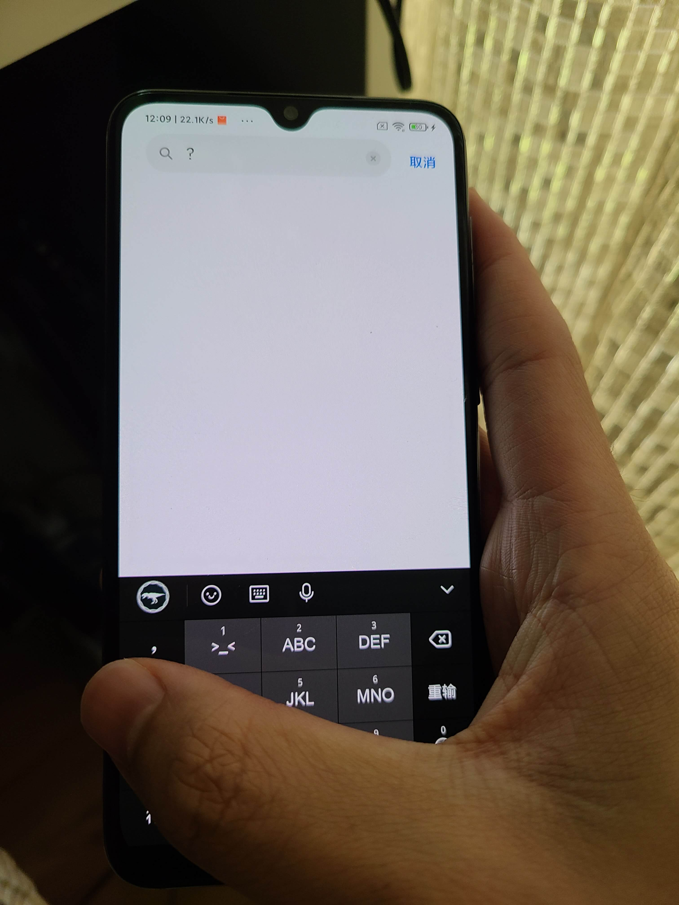

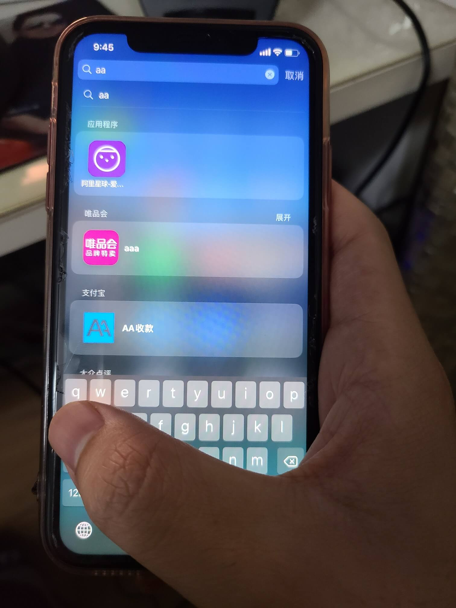

# 2020年选择

2019年中，我的米6突然出了问题，电源键卡住，机器完全无法使用。正好，米6的夜拍确实比较垃圾，我正好有换手机的欲望。于是，经过一番对比，我在米9和米9 SE中选择了米9 SE，其中最重要的原因，就是尺寸：米9的宽度为74.67mm，9 SE的宽度为70.5mm。另外，我本来打算在2020年换5G手机，9 SE便宜的售价正好可以用来当作用一年的过渡机。所以当时走到了学校旁边的一个小米之家，现场提了小米9 SE。

（找了很久还是没找到图）

刚用9SE的时候还是比较舒服的，因为全面屏和6的16:9还是区别很大的；但是它**垃圾的震动马达**（官方说是线性马达，但是明显感觉有开始震动的过程，感觉就是转子马达）、**羸弱的处理器和硬件配置**（SoC是712，连米6米的835都不如，日常操作比米6慢多了）、以及升级MIUI 12的**夸张的掉帧**让我不得不换手机，并且确定只能买旗舰CPU的手机。

而2020年，满足我的手要求的宽度的要求的旗舰手机（其实可以去掉旗舰手机的要求，因为连红米等都早已没有了小手机），只有以下几款可选：

| 型号        | 高度  | 宽度 | 厚度 | 重量 | 亮点                                    | 缺点                                             | 价格                          |
| ----------- | ----- | ---- | ---- | ---- | --------------------------------------- | ------------------------------------------------ | ----------------------------- |
| 三星S20     | 151.7 | 69.1 | 7.9  | 163  | 轻薄小，堆料足                          | 较贵，电池较小，软件本地化比MIUI弱，且后续更新慢 | 5150（港版，4月29日，12+128） |
| 华为P40     | 148.9 | 71.1 | 8.5  | 175  | 软件体验更贴合国内需求                  | 堆料太少，阉割太严重，无线充电、高刷都没有       | 4488（8+128）                 |
| 一加8       | 160.2 | 72.9 | 8.0  | 180  | 系统简单，价格较便宜，外观还行          | 没有无线充电                                     | 3999（8+128）                 |
| iPhone SE 2 | 138.4 | 67.3 | 7.3  | 148  | 很轻薄很小巧，而且还有A13处理器，还便宜 | 不想进入苹果生态，除了处理器之外的配置都复古     | 3799（128G）                  |

在这几款手机中，对我来说P40、一加8的问题是一样的：它们都阉割了**无线充电**，并且华为P40连**高刷屏**都阉割了。

而根据我的使用习惯，无线充电能够给我带来很大的好处：我基本一直坐在电脑前，无线充电使得手机可以一直放在充电板上，随时保持满电，并可以随用随取，比插拔线缆更方便。所以自从2014年开始一直没能用上无线充电的我，这次再怎么说也得用无线充电的手机。

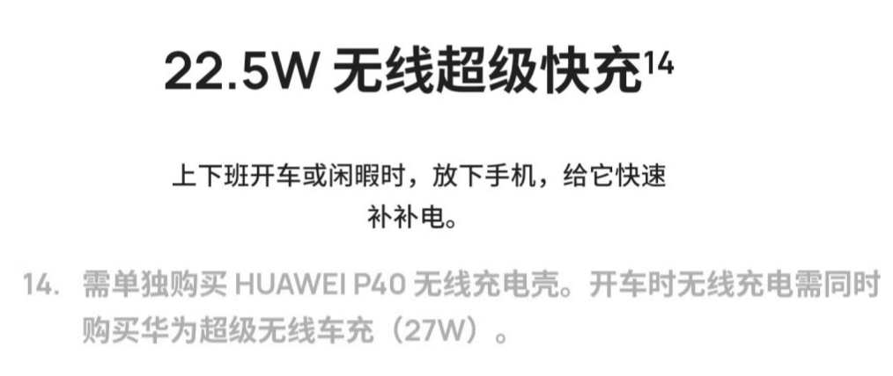

另外，高刷屏确实是用了就回不去的那种东西，60Hz到90Hz的体验变化是巨大的，而90Hz和120Hz倒是可以不太在意。

而S20在这里面，堆料是所有手机里最猛的，无线充电、120Hz高刷屏、4000mAh电池一应俱全，并且更难得的是，S20的三围和重量还是这些手机（除了SE）外最小最轻的。

S20在国内的一个最大的劣势是价格：6999的起步价，对于一个Others厂商来说，确实有点过分了。

但是嘿，买三星为什么要买国行？港行刷国行固件，它不香吗？😄️

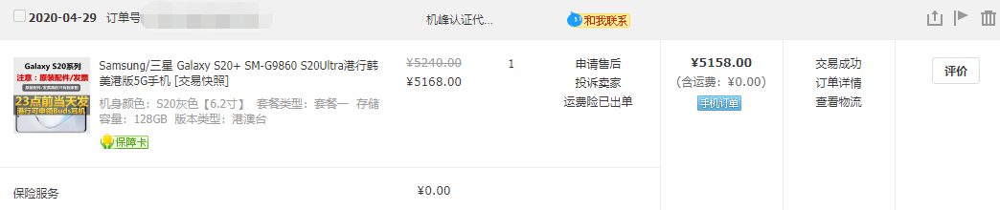

# Galaxy S20简单体验

## 大小对比

下图为S20和小米9SE对比，可以看到其实二者宽度差不多，但是高度上S20会高上一头。从数据也可以看出这个区别。

| 型号     | 高度  | 宽度 | 厚度 | 重量 |
| -------- | ----- | ---- | ---- | ---- |
| 三星S20  | 151.7 | 69.1 | 7.9  | 163  |
| 小米9 SE | 147.5 | 70.5 | 7.45 | 155  |

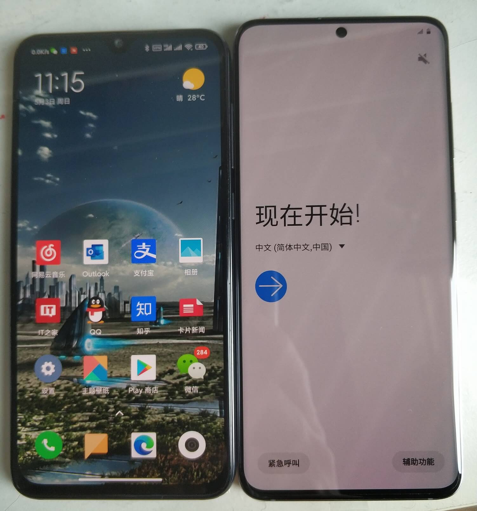

S20的宽度也保证了就算戴着保护套，也可以单手打字：

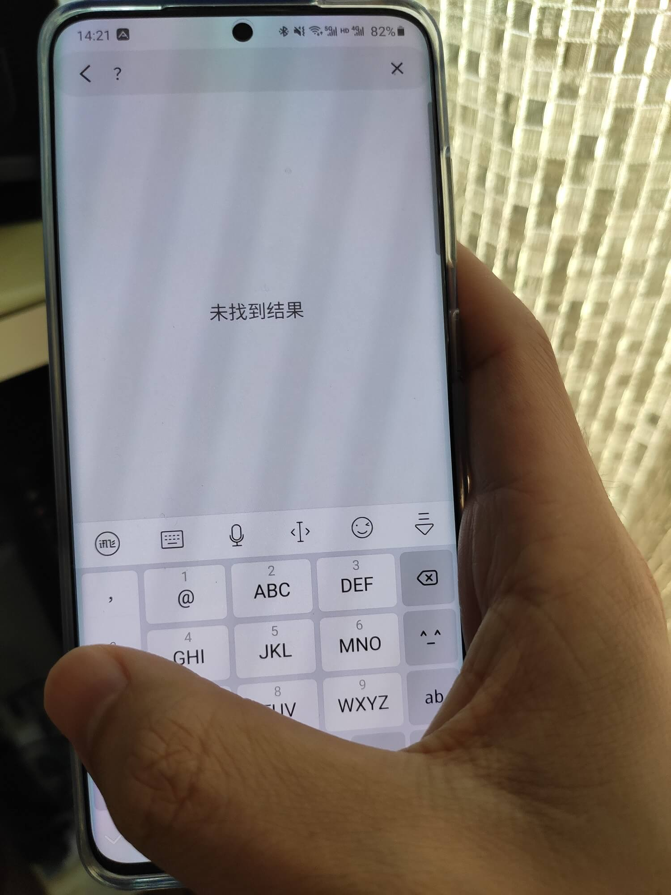

## One UI

y1s1，确实没有任意一个Android UI可以和MIUI相比，尤其是当MIUI 12发布后，那动画效果、那设计、那功能，啧啧。

但是其实One UI也挺好用的，各种功能也比较完善，设计也比较质朴耐看，动画也和MIUI 11差不多（当然比不上MIUI 12），当作日常使用也是非常合格的，配上120Hz屏幕和865处理器自然是丝版顺滑。

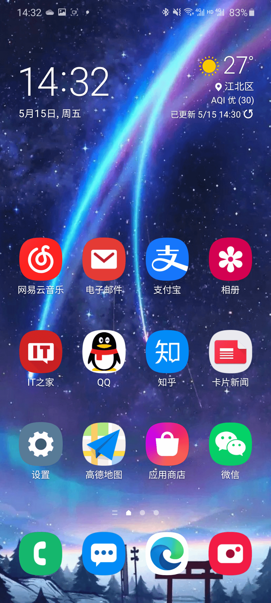

负一屏就比较让人意外了：可以快速打开微信小程序这个功能比我想像中的有用多了；还有快速打开扫吗、车票追踪、快递追踪等功能。Samsung Pay中还有各种公交卡、支付方式等。三星这种在国内都Others的厂商居然还做了这些贴心的本地化功能，让我感到很意外。

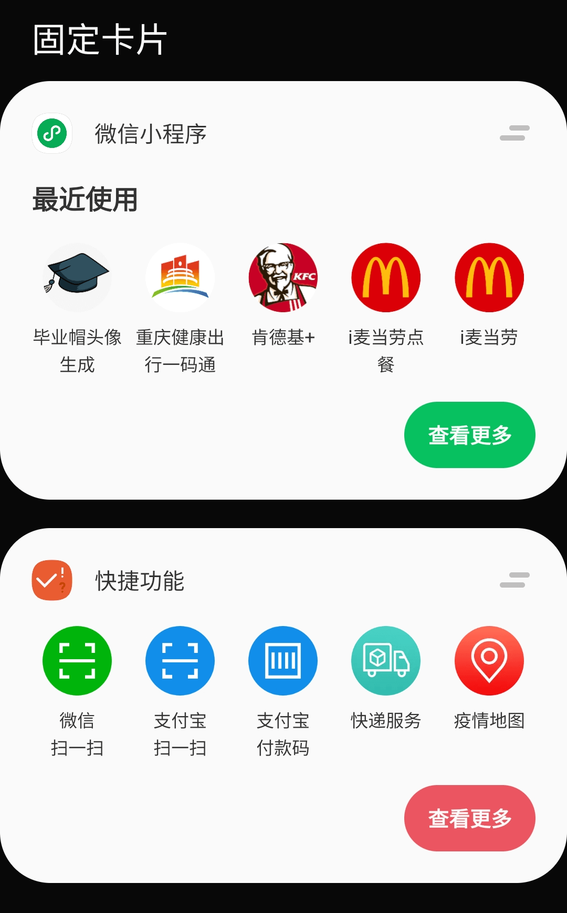

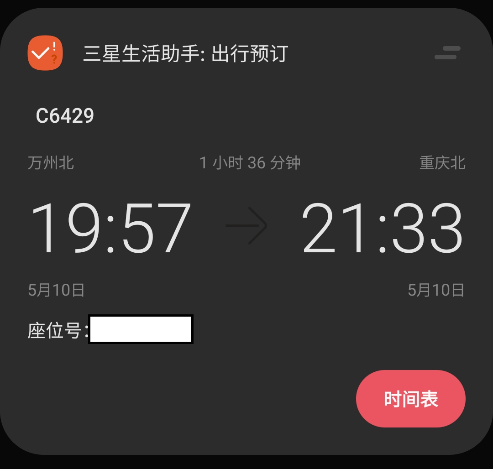

另外本来说One UI的[照片应用可以使用OneDrive同步](https://support.microsoft.com/en-us/office/samsung-gallery-and-onedrive-99c4e77b-8e63-4ddc-aede-19f81acee1a3)，但是国行没有，应该是被阉割了。但其实影响不大，只要关掉三星的备份、单独使用OneDrive应用备份就行。

## 链接到Windows

**链接到Windows**。是微软推出的同步工具，用起来比较折腾，首先电脑和手机都得翻墙、然后把Windows的区域设置到美国，而且功能也挺一般，只有同步通知、同步照片等功能，而且因为要经过互联网，所以同步速度堪忧。

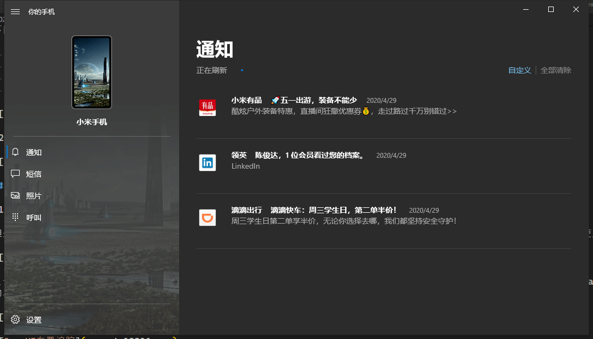

本来所有Android手机都可以用，但是[微软对三星的手机开了小灶](https://www.samsung.com/levant/support/mobile-devices/what-is-link-to-windows/)，额外支持同步手机屏幕和在电脑上打电话两个功能。

打电话可以直接将电脑当作一个蓝牙耳机，从而实现不拿手机打电话，有电话来的时候还有提示。

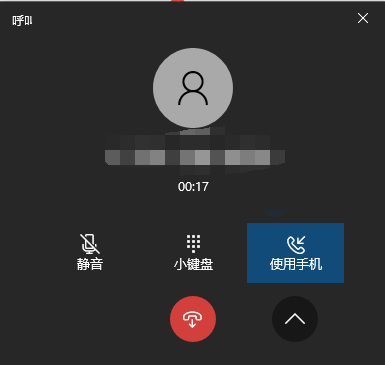

同步手机屏幕功能和华为的有差距，最大的问题就是同步手机屏幕输入的时候是调用的手机输入法而不是电脑输入法，这带来了体验的割裂。另外，我也只有一次成功了投影了电脑屏幕，后续都没能成功（手机端有提示已经投影，但是电脑无法显示），不知道为什么。

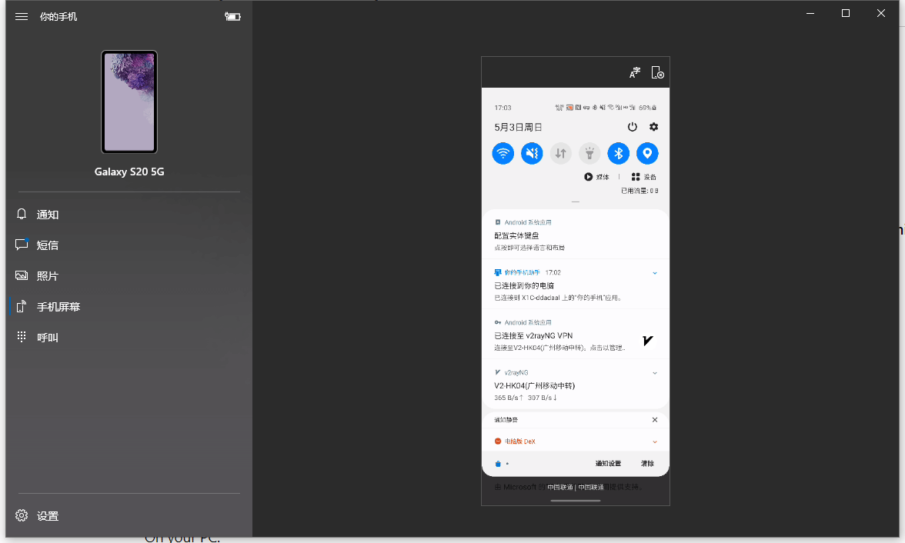

注意，国行的系统阉割了这个功能，国行三星要想使用这个功能，需要单独装一个APK（Link to Windows Service，[apkmirror链接](https://www.apkmirror.com/apk/samsung-electronics-co-ltd/link-to-windows-service/)），然后再装Your Phone Companion。

说实话这个功能还是有点鸡肋的，通知同步还要过互联网就离谱，使用体验也不好。这个方面华为和苹果确实还是做的最好的。

## 5G

港版S20刷了国行固件后可以完美支持5G，正好我家附近有5G信号，于是体验了一下5G杀手级应用：测速，结果如下。对于联通，不办5G套餐不换卡可以直接连接5G，但是限速到300Mbps。

我个人认为5G之前吹得太过了，所谓低延迟啥的对普通消费者“感知不强”，而且使用5G而非4G对于我这种在手机上视频都不看的人来说都是”徒增功耗“，这一代的5G也是功耗杀手。所以，目前来说，看看就好。建议下一代再买5G手机，到时候肯定价格会下来（今年手机价格太夸张了），而且也能做的更轻薄更省电。

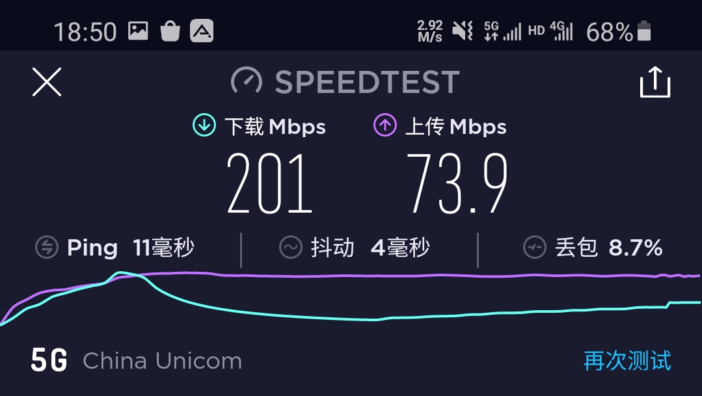

## 电池

虽然S20有4000mAh的电池，但是在865和1080P120屏幕下还是不堪一击。

我的日常使用习惯是这样的：

- Wi-Fi不关
- 双卡，一卡5G一卡4G
- 蓝牙连Amazfit GTS
- 装Google Play但是不一直开梯子
- 不在手机上看视频，不玩游戏，手机主要聊QQ刷知乎，有时候拍拍照
- 1080P120
- 晚上自动切换黑暗模式，白天不用黑暗模式
- 自动亮度

在这样的使用习惯下，手机从100到0应该只能8个小时，其中亮屏2个半小时左右。

说实话，这个续航真的挺一般的。希望以后注销一张卡，以及日常把5G关掉可能会好一些吧。

当然普通用户如果不用Google Play、不用蓝牙、不用双卡的话，应该会好不少。

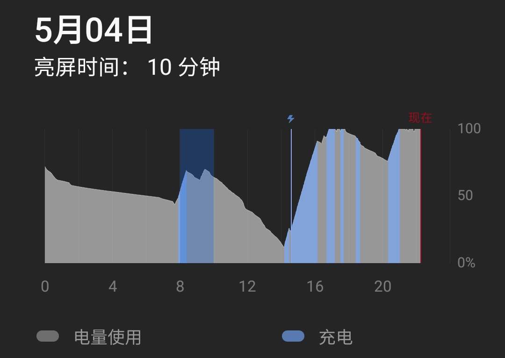

其实这也是这代5G的毛病，看现在几乎所有手机的电池都4000mAh左右或以上，高端机都一般5000mAh。做这么大，一个原因也是目前5G不够成熟，功耗太大。所以，不想尝鲜的同学还是明年再换机吧，等等党永远胜利。

## 其他细节

- 震动马达比9 SE和6提升巨大，但是应该还是不如目前主流的X轴马达
- 屏幕仍然是曲面的，但是这个曲面几乎和没有差不多，不会出现误触（国产机全部投入夸张的曲面屏，这让我这种单手党很为难啊）
- 无线充电好，15W无线充电好，25W线充速度还可以，但是港版的充电头是港版的，需要带转接器。可以去淘宝上搜“电友”，有那种可以支持所有手机牌子的私有协议+PD 65W的头
- 说小屏，其实S20也不算小屏，由于高度高了一点，可操作性还是不如短了4mm方便，尤其是需要操作屏幕上方时。在现在这个19.5:9甚至21:9屏幕当道的时候，这是无解的。

# 后续：卖了又买了

根据上文所说，S20似乎已经满足了我对智能手机的一切需求。那为什么我还是把它闲鱼出了呢？

问题就在硬件和软件支持上。

三星在国内的市场占有率一律下滑，这并不可怕，可怕的是三星在国内的硬件和软件支持出了问题，而且这个情况只会逐渐恶化，不会变好。

- S20在国内卖6999的价格，首先就非常的离谱：除了三星死忠粉和什么都不懂的人，这价格基本卖不出去
- One UI虽然本地化还行，但是那也只是针对其他国际厂商比较。将One UI和MIUI、EMUI等国产厂商的UI比，那确实差距还比较大。对我来说，MIUI12出了后，我基本就被绑定在小米了。MIUI12实在太香了。
- 三星的丑闻的每年都会见到多次：就不说Note7了，今年有S20U绿屏拒保和闰四月锁屏应用崩溃门。虽然都没有影响我，但是这些都证明了，三星在国内的硬件和软件的支持都存在着问题。
  - 国行One UI 3.0对动画的阉割虽然有专利的原因，但是也说明了三星对于软件的支持仍然不够上心

这几点是一个死循环：用的人越少，厂商对于软件和硬件支持的程度就会越低，这样又会让用户减少。更别提国产厂商的飞速进步了。

在用S20这一个月中，我一直在想这些问题。最终，还是让我在使用不到1个月之后，把它从闲鱼出了回血，等待明年新一代硬件出来之后再尝试换机。

转眼间到了2021年，我的小米9SE实在已经撑不住了，且不说2个小时的亮屏时间，一些正常的功能也因为性能不足运行缓慢甚至无法进行。例如北大需要在微信小程序上进行人脸识别的注册，注册时需要调用手机摄像头拍一张照然后回到小程序界面。但是在9SE上，拍完照之后回去发现微信小程序已经被杀了，又回到了初始界面，使得我完全不能使用手机摄像头注册。

趁着暑假，去京东线下店体验了一些小手机（一加8、OPPO Reno 5 Pro+、S21、小米11等）发现，小米11所谓的“轻薄”却仍然有74mm宽度的机身让我完全无法接受，72mm宽度的一加8和Reno5Pro+就已经超越了我可以掌控的范围了，而S21相对于S20的升级实在是太小，反而因为变宽了2mm和平面屏影响了手感（背盖塑料影响不大）。最后转了一圈下来，居然S20还是现在最香的产品……

再想到今年骁龙888差强人意的表现以及国产厂商仍然到稍小一点的屏幕的手机的需求的忽视，今年（甚至以后）可能都只有三星和苹果会稍微考虑一下小屏手机的用户了，所以反手从闲鱼上拍了一个3800的S20国行，重新回到S20用户的行列。

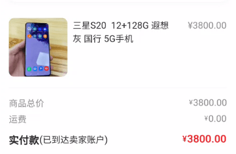

# 总结

在这个小手机消失的年代，总有一些“前朝遗老”想着回到那个单手就能掌控手机的时代。这个群体的人数，说大不大，手机厂商都不愿投钱做这个市场，上一个坚持这个市场的SONY Compact系列已经死了；但是这个群体的人数说小也不小，iPhone SE 2推出时，也有很多剁手党直接就剁手了。iPhone 12 mini也为小屏手机带来了一场讨论。

我也是这样的前朝遗老。如果要让我来确定我对手机的要求，那么我的要求如下：

1. 宽度小于72mm，71mm以下最好
2. 电池能用一天，亮屏5小时以上
3. 带有无线充电
4. 相机、震动马达等外围配件不要阉割地太过分
5. 当年性能最强的、没有挤牙膏的次旗舰处理器

当前满足这些需求的产品有iPhone 12、iPhone 12 mini、三星S20和S21。很可惜，在现在和可预见的将来，这样的产品可能也就只有三星和苹果可选了。

