# WSL 2使用GUI

众所周知，WSL 2开始使用真正的Linux内核，所以理论上来说，我们已经可以在WSL 2运行几乎所有的Linux程序，包括带有GUI的Linux程序。但是目前来说，由于第一方X11 Server的缺失，WSL 2主要还是在命令行中使用。

Build 2020上，微软已经宣称[开始做WSL 2的GUI支持](https://devblogs.microsoft.com/commandline/the-windows-subsystem-for-linux-build-2020-summary/#wsl-gui)，并已经给出了宣传图。

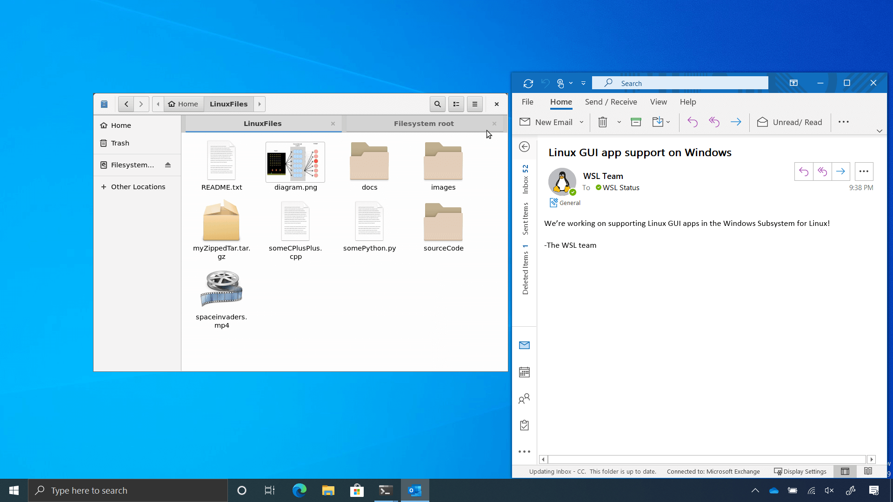

但是，事实上，借助X11 Forwarding，我们现在已经可以做到类似的效果了。

如果你之前折腾过在WSL上跑GNOME等各种桌面环境，则这篇文章的原理和那些文章是一致的，但是由于不需要启动桌面环境，其使用更加方便，各种Linux程序窗口和Windows的集成更加无缝，个人认为实用性比启动一个Linux桌面环境再在里面启动程序更强。

下图为跑在WSL 2上的IDEA、通过IDEA启动的JavaFX程序与Windows计算器共存的截图，注意看到状态栏上的窗口图标的IDEA图标，完美与Windows进行兼容。

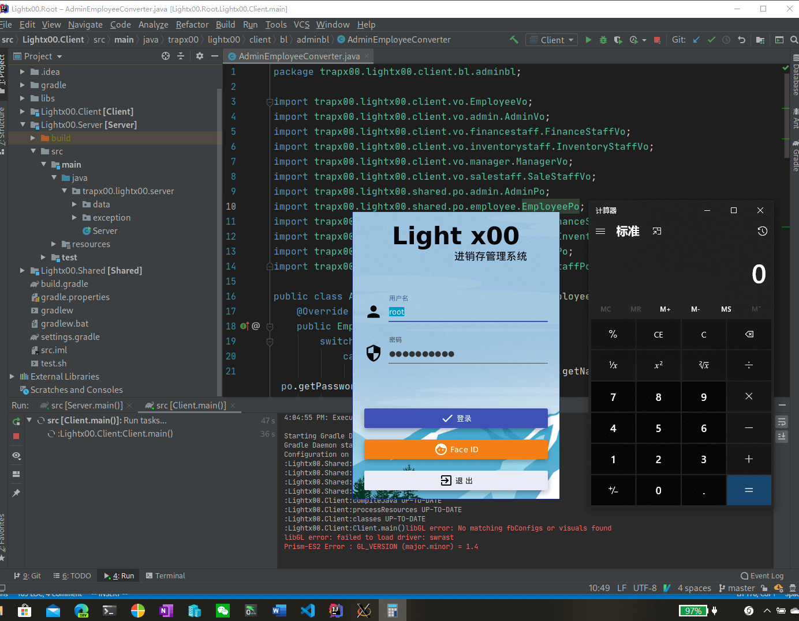

# X11 Forwarding

X Window是目前Linux上使用得最为广泛的窗口系统。虽然它有各种各样的问题（包括不支持多个显示器不同DPI的硬伤），我在使用Linux桌面的时候也经常推荐Wayland作为代替，但是其**X11 Forwarding**的特性是相当的有用。

下图是X11的架构。

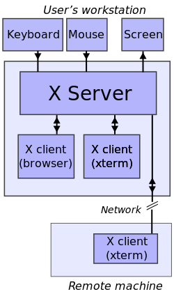

在X11系统中，显示GUI的程序（Client，包括各种浏览器、IDE等的程序）和用于真正负责显示、以及捕捉键盘、鼠标等输入的服务器（Server）是分离的，且二者之间通过网络通信的。

对于普通的Linux系统，其Server和Client是跑在一台机器上的。但是，由于二者之间是通过网络进行通信的，所以X11窗口系统不需要Server和Client运行在同一台机器上。

所以，我们可以在其他电脑（甚至不需要是Linux）上跑一个X Server，然后通过配置DISPLAY环境变量，让X Client和位于网络上的X Server相连，就能让在一台电脑上运行的程序的GUI显示在另一台电脑上。

这就是X11 Forwarding，将一台电脑的程序的GUI Forward到另一台电脑上去显示。

# 配置

X11 Forwarding的原理很简单，配置其实也很简单。其分为两个大部分：Windows端（Server端）和WSL端（Client端）。

## Windows端

在Windows端需要安装一个X Server。

X Server有多个，我比较建议[vcxsrv](https://github.com/ArcticaProject/vcxsrv)（名字记忆：vc x server），因为其功能和操作比较简单。

可以从上面给的github链接进行安装，也可以通过scoop进行安装，scoop安装命令如下：

```
scoop install vcxsrv
```

安装成功后，在开始菜单或者其他启动器启动新安装的XLaunch，会弹出一个向导以配置X Server的属性。在一步选择Multiple windows，第三步选择Disable access control，其他不变。

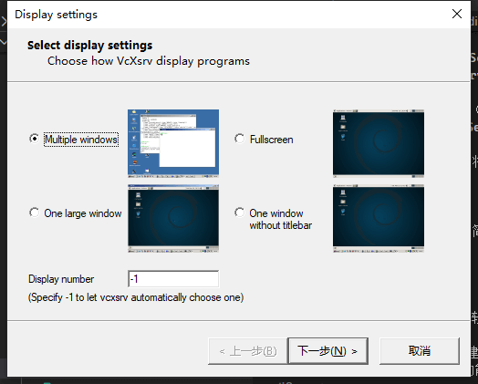

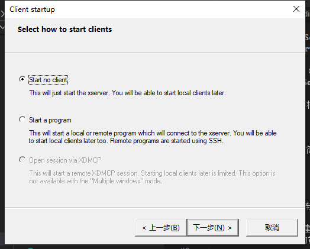

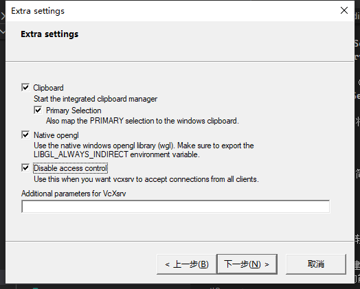

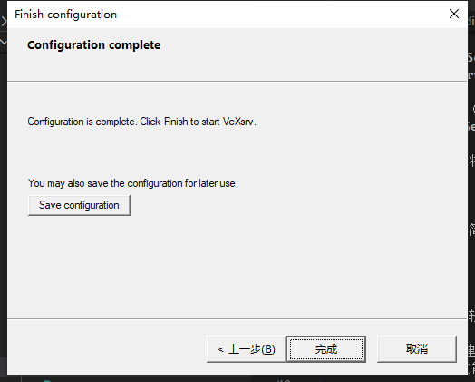

最后在状态栏可以看到一个新的图标，鼠标悬浮上去可以看到其地址，其格式是`{电脑的hostname}:{地址}`，记住后面这个地址。例如说，下图中，其地址为`0.0`。

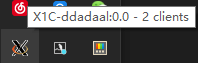

## WSL端

WSL端需要做两个工作：

- 设置DISPLAY变量
- 配置字体等GUI相关的设置

### 设置DISPLAY

DISPLAY环境变量用来指定X Server的地址。由于WSL 2使用虚拟机，其IP和Windows不同，所以需要进行一些特殊方法来访问Windows上的X Server。

在.bashrc或者.zshrc里加入以下代码，然后重新进入WSL。

```bash
# 若安装了Docker for Windows，且启动了WSL 2后端
export WINDOWS_HOST="host.docker.internal"

# 若没有安装Docker for Windows，则可以从/etc/resolv.conf中读取Windows的IP
# 这个IP有可能会变，所以不能直接一劳永逸。
# export WINDOWS_HOST=$(grep nameserver /etc/resolv.conf | awk '{print $2}')

# 可以尝试使用Windows的hostname，未尝试过
# 但是我在Hyper-V虚拟机中使用hostname访问Windows有时候会遇到奇怪的卡住的问题，不推荐
# export WINDOWS_HOST={你的Windows的hostname}

# 下面的"地址"替换为之前记住的Windows上的X Server的地址，一般（以及上面的例子）是0:0
export DISPLAY="$WINDOWS_HOSRT:地址"
```

### 配置字体

由于WSL的distro一般都比较简单，可能没有安装字体以及对应的配置，所以需要自己手动安装字体。

这里以`noto-sans-cjk`举例，你可以自己安装自己想要的字体。

字体安装后不能直接启动GUI程序，现在直接启动会遇到奇怪的报错问题（忘记截图了，可以自己试试）。

可以安装一个简单的X程序来初始化，并验证X11环境是否已经配置成功：如xclock：

```bash
sudo pacman -S xorg-xclock
```

### 使用xclock测试是否能够正常使用

安装之后，确认DISPLAY变量已经设置后，输入

```bash
xclock
```

若弹出一个时钟窗口，则配置成功。

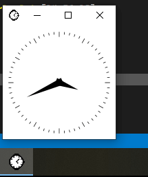

## 效果

现在你可以开始在命令行里启动各种程序了：

Intellij IDEA在WSL 2上启动IDEA比Windows上快多了，我正在考虑将整个Java环境迁移到WSL 2中。

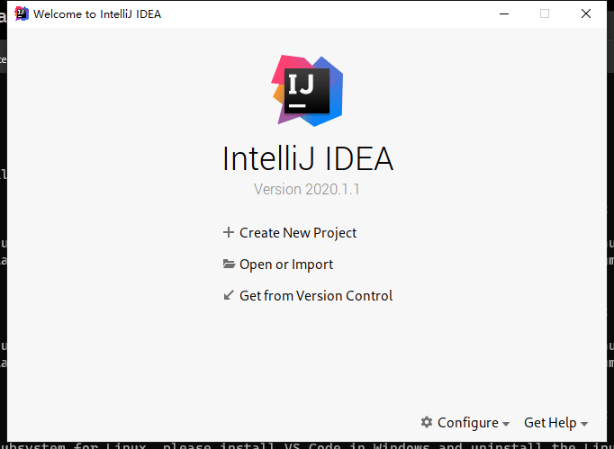

VSCode也可以以Linux窗口来启动，其启动速度也比Windows快多了：

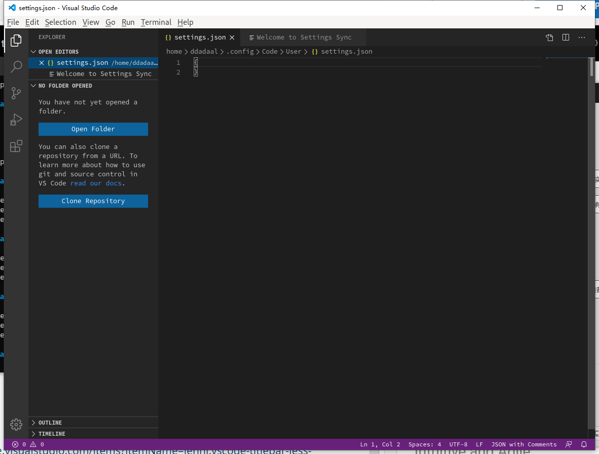

在设置中设置以下后VSCode可以隐藏标题栏，但是这样之后无法拖动窗口，最大化窗口后也无法还原，所以不建议。

```json
{
  "window.titleBarStyle": "custom"
}
```

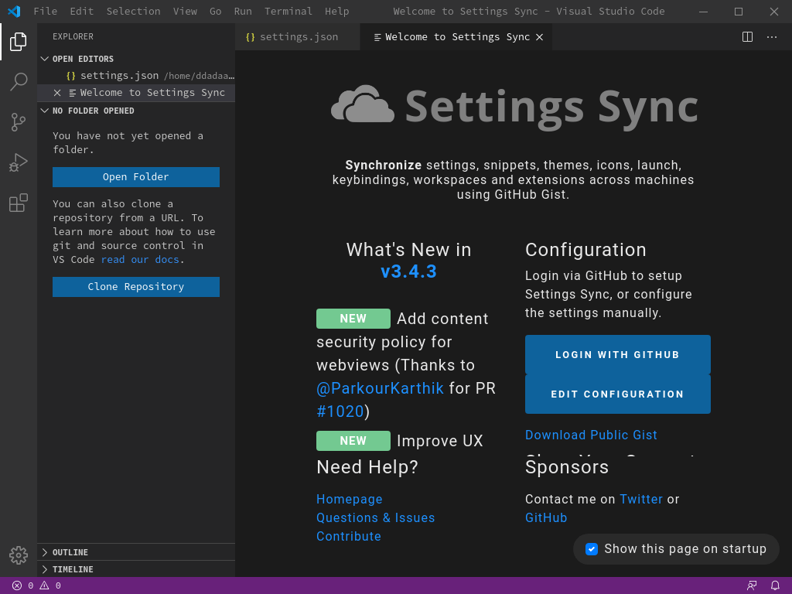

一些其他细节：

- 这些X Window的剪贴板和Windows剪贴板也是同步的，可以自由地双向复制粘贴
- vcxsrv适配了高DPI，在高分屏上使用完全没有问题

## 限制

这样的解决方案虽然看上去很完美，但是有一些限制，但是可用性也非常高了：

- 无法隐藏丑陋的标题栏
- 无法直接调用Windows的输入法，需要在Linux下重新配置输入法
- 有可能仍然遇到字体问题（如在现在的情况下编译JavaFX程序），安装完一整套字体、正确设置`/etc/locale.gen`之后即可修复。

## 后续启动

以后重启电脑后，只需要重新启动XLauncher，然后在WSL中启动GUI程序即可使用。

# 延伸和总结

这套配置也不仅限WSL，任何虚拟机和远端电脑上的Linux应用程序均可以使用SSH和X11 Forwarding进行连接。

使用SSH和X11 Forwarding可以解决很多远程桌面相关的问题。

我们很多时候使用虚拟机安装Linux系统，其实并不是要使用Linux的桌面环境，而是使用Linux的命令行和一些GUI程序。

对于命令行程序，使用SSH完全可以解决；

而对于GUI程序，我们也可以通过这篇文章介绍的X11 Forwarding来解决。

和正常的连接到Linux再进行操作相比，SSH和X11 Forwarding的优势其实很明显：

- 避免进入Linux的GUI环境，而可以在我们熟悉的Windows/macOS环境下使用Linux的各种功能
- 避免配置Virtualbox Guest软件、Hyper-V的Enhanced Session等虚拟机的增强软件
- 由于避开了图形界面的模拟，SSH和X11 Forwarding也通常有更好的性能

对于WSL来说，目前的解决方案仍然有一些限制，但是我们可以发现在Build 2020上的效果图已经没有的标题栏，说明微软也正在解决一些X11和Windows集成的问题。相信当微软的X11集成正式发布时，我们在Windows上使用Linux程序的体验，可能比在Linux上使用Linux程序更好了。
