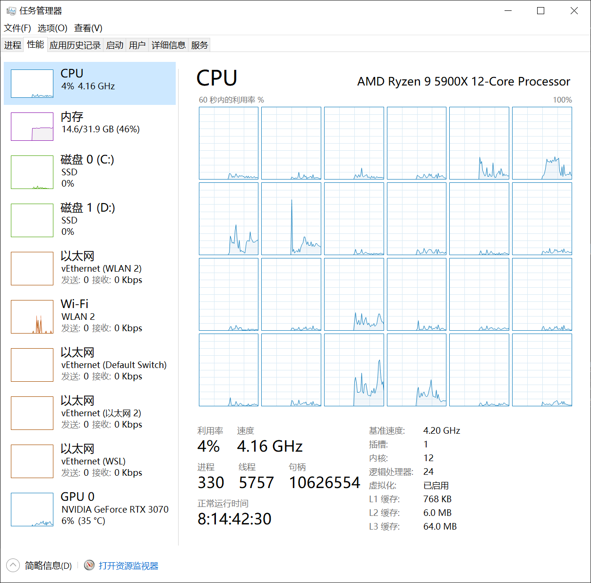
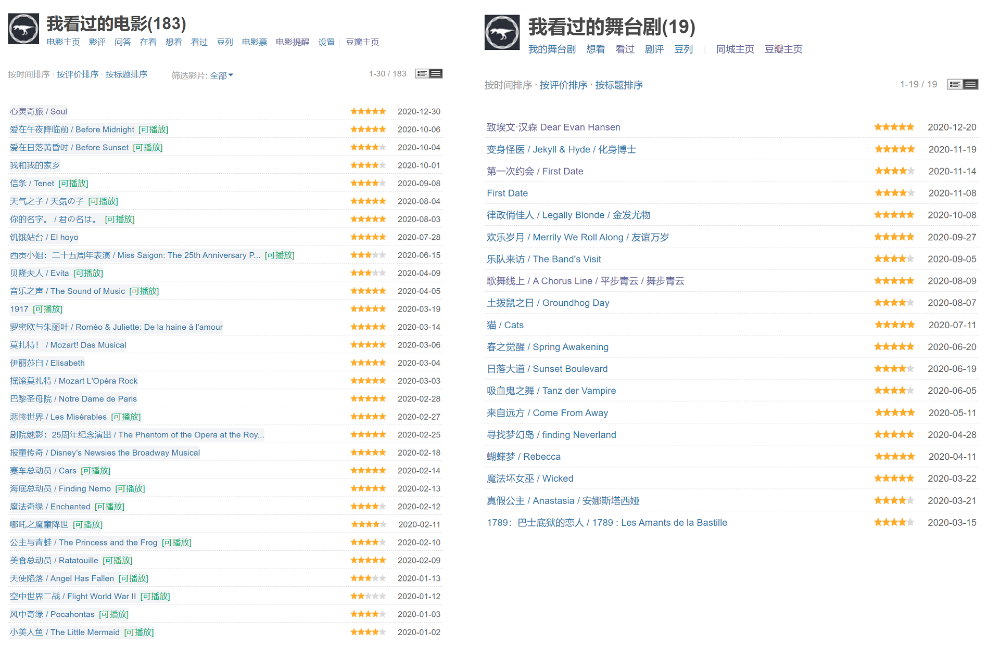

# 2020年的四个阶段

不管对世界还是对我来说，2020年都挺魔幻的。对我来说，2020年可以分为四个阶段：

- 与毕设一起在家度过的上半年
- 在南大的最后半个月
- 最后的无忧无虑的暑假
- 研究生的第一个学期

其中前三个阶段都在我的上一篇文章：[美好的回忆和未知的未来：写在研究生开学前](/articles/good-memories-and-unknown-future)中这篇文章中做了总结，所以这里就`#include`一下。

本篇总结的内容是对这三个月研究生生活的总结，以及一些值得纪念的生活小事。

# 三个月研究生生活总结

## 课程

一般提到研究生课程这东西，大家都会习惯性忽略，说：研一主要就上课就行了。但是呢，研一这研究生课程这东西嘛，它虽然不重要，但是也挺闹心的。

研究生课程确实不重要，体现在**成绩的高低**上：

毕业只要及格，连评奖评优都只需要及格，只要及格之后，成绩项的得分就是75分的定值。而且老师也一般都不会太严格，一般的课一年挂的人也是1个或者2个。一句名言：

> 研究生课程最好的GPA是及格GPA。

但是它又很重要，这体现在**能否及格**上：

没有补考，只有重修，而且挂两三门直接退学？另外我导师说，他的第一个研究生就是因为课程考不及格而退学的。

更麻烦的是，这里的课程和本科的课完全不一样：之前总结了一下，本科的课一般只需要做两件事：**背书**和**做大作业**。背书这个就不说了，大家都背，考试的题目和背的题目基本也大差不差；而本科的大作业基本都是我所喜欢和擅长的，因此我本科的成绩才能比较高。

而到这里就不一样了：信科是重理论重科研的，所以它的课也是重理论重科研的。

所以**软件测试**课上完基础知识，接下来是现场想论文框架？30分钟完成思考问题，提出解决方案，用实例验证，提出解决方案的不足之处的全过程，还要做PPT？上课这一点点时间开脑洞出来的方法我还真不信能用……我还以为是真的拿几个软件制品来真正测试一下呢。

所以一门叫做“海量图数据的管理和挖掘"的课程，一次三个小时的课讲20多篇论文的算法/方法，也不管大家能不能听懂？下图是某一次课上课涉及的内容的来源论文，前面一页PPT还有10个。

还有一门课，**数据库原理与技术**，说实话上课质量确实比较高，内容很充实，讲的很清晰，但是无平时作业，考核是通过读论文和最后的纸面考试实现的，而且考试的难度有点过分，是不可能背出来的……其实相比起来问题也不大，但是我觉得这种课至少应该写点代码吧……

我选择的最后一门课**高级编译技术**，是在[UT Austin的CS 380C](https://www.cs.utexas.edu/~pingali/CS380C/2019/index.html)上进行的简化，去掉了不少内容（比如寄存器分配等）。虽然这课难度比较高，而且又有平时作业、又有大作业、又有考试，但是由于它的内容是经典的、成体系的，上课的节奏比较可以接受，可以说是我这学期最喜欢的课程之一了。但是一开学就布置的三个大作业我一直在上周（12月中）才知道，难度也是相当大（[1](http://sei.pku.edu.cn/~yaoguo/ACT11/labs/lab1.html)、[2](http://sei.pku.edu.cn/~yaoguo/ACT11/labs/lab2.html)、[3](http://sei.pku.edu.cn/~yaoguo/ACT11/labs/lab3.html)），时间也很紧张，还是相当难顶的。截至发稿，三个作业也就做了1.05个（按得分记），而且已经遇到了很困难的、还没想到方法解决的问题……

这些课上课的内容让我觉得我本科根本不是学计算机的（好吧，软工的确不是计算机）。整个研一期间，除了上课和写作业，基本没做成什么其他事情，最近期末这段时间疯狂赶DDL，啥都不想干了。说好的研究生期间是给老师打工呢？现在看来，我倒是希望给老师打工了，至少打工的时候的工作能给我带来一些成就感和满足感。

## 学工

在上一篇文章中我提到研究生期间的人际关系将会变窄，所以在开学的时候我去申请了信科研会的职位。当时我已经意识到研一可能会有很多工作，所以在投志愿的时候选择了看起来较为轻松的部门，职位由于只能选择部长和副部长，所以我选择了副部长，准备尝试去划水和了解一学年。

其实这时候我已经觉得有点奇怪了：为什么招新会直接招部长级别呢？新生什么都不懂，直接负责一个部门的事务是不是风险有点大？而且更奇怪的是，面试的时候我当面强调不要部长，后面却直接给了我部长职位；更主要的是之后发现部门的工作确实不是我喜欢的（而且甚至有点不太乐意干的），而且感觉课程压力变大了，所以没过一个月，就找了接盘侠，把研会退了……

说到底，其实还是自己的原因，一开始没有仔细了解部门的工作，过于冲动了，所以造成后面的一些不方便的事情，现在见到之后的研会的同学还是有点小尴尬。

但是研会的机会让我认识了一位上一届的研会的部长，他现在在负责北大的微软学生俱乐部。南大微俱的三年让我印象深刻（[2016至2019，和南京大学微软学生俱乐部一起成长](/articles/growth-with-njumsc-2016-to-2019)），所以一开学我就想继续在北大微俱继续做事，但是在百团大战的时候我并没有发现北大微俱，以为北大微俱已经凉了，本来还有一点小遗憾，结果现在来了个惊喜。所以当时他问我要不要加入微俱的时候，我想都没想直接同意了。

之后发现，北大微俱去年断档了，甚至已经被取消注册了，今年的北大俱乐部基本可以说是“从头再来”。企业俱乐部本来就很难办，面向研究生的更难办，所以我本科时的“面向新生”的策略基本不能应用在年级更高的同学身上。所以其实在之后，北大微俱也就组织了一次去MSRA的参观活动，其他活动似乎很难办。

所以其实说到底这一学期我根本没有任何学工活动。虽然没有学生工作让我平时少了很多事情，轻松了很多（可以把更多时间放在肝课程作业上……），但是这使得我失去了最好的认识其他朋友的机会，所以我现在人际关系其实是比较成问题的……

## 人际关系

人际关系方面，基本和我在上一篇文章中说的一样：

> 认识的人：当然，研究生和工作期间也会认识新同学新朋友，但是由于参加的活动将会减少，社交面会急剧变窄；而且，研究生期间的同学和以后的同事都是成年人了，都懂了自己想要什么，都有了自己的安排，都有了自己的人脉圈甚至家庭，不能像本科时的兄弟们一样时时刻刻泡在一起。

唯一值得庆幸的是，我和室友以及实验室同年级同学的关系（包括我共5个人，其中3个是舍友）的关系还可以，和清华的本科同学关系比之前更好了，还加了一个打羽毛球的小圈子，但是也就仅此而已了：这些就是我当前认识的所有圈子。

大家都知道自己想要什么，都在朝着自己想做的方向去努力：三位舍友两位想转博，一位目标是走选调回家，三位舍友卷得昏天黑地，每天早上就走，最早每天晚上11点才回宿舍，包括周末。所以除了约饭、上课以及偶尔出去看个电影之外，其实也干不了什么，周末平时想出去看个电影都找不到人。

唉，每次想找人却找不到的人时候，就想念本科的兄弟萌，十一的时候和兄弟萌短暂的几天相聚，也当是重温我的逝去的美好青春了。

大环境是个更大的问题，简单来说，**和其他同学像是两个世界的人**。

就像之前说的，信科主要注重科研，所以周围的同学也基本都是科研方向（或者选调方向），而我仍然想做工程。我的能力、兴趣、方向和他们不说是冲突的，至少是正交的。所以不像本科时大家方向都大致或者互补，现在我完全找不到能一起做事的人。这几个月实验室有两个工程项目，都只能我一个人做；想参加一些项目相关的比赛，找不到愿意参加的同学；好不容易有个课程有个组队的工程项目，一个简单的社交网站平台，结果发现找不到有过稍微正经一点的工程经验（比如项目或者工程任务的实习）的同学……据我老师说，整个计算中心可能只有我一个人能搞开发。

核心问题并不是技能不匹配，有兴趣的话工程相关的知识其实比科研所需要和使用的知识简单多了，但是问题是我和其他人互相对对方的工作**没有兴趣**：我没兴趣去想idea做实验，其他人没有兴趣做工程。我觉得从工作中认识同伴是最好的、最自然的认识的人的方式，而兴趣的不匹配加上上面说的学工的情况，我已经没有办法从工作中认识同伴了。

# 其他生活中的小事

## 成都之行

10月底和一名同学参加了一个看起来并不想参加的比赛，所以有机会从学校生活中喘喘气，去成都玩了5天。最大的感受是和北京比，成都的物价是真的便宜，每顿都在外面吃，最后人均总共才200多一点：在北京在外面吃我就没吃过一顿人均低于100的。

## 装机

从双十一开始买电脑配件，直到12月12日，终于抢到了电脑的最后一个组件5900X，历时一个多月，终于装好了我的第一台自己装的电脑。配置如下：

| 组件      | 型号                                       | 价格  | 渠道 |
| --------- | ------------------------------------------ | ----- | ---- |
| CPU       | AMD Ryzen R9 5900X                         | 4099  | JD   |
| CPU散热器 | 雅浚ProArtist Gratify5 G5                  | 249   | JD   |
| 主板      | 华硕 TUF GAMING B550M-PLUS WIFI            | 749   | JD   |
| 内存      | G.SKILL Trident Z 3200 16G *2              | 999   | JD   |
| 主SSD     | 三星 PM9A1 512G PCIe 4 NVMe                | 866   | 淘宝 |
| 副SSD     | 海康威视 C2000PRO 1T PCIe 3.0 NVMe         | 749   | 天猫 |
| 显卡      | 映众 GeForce RTX 3070 冰龙版               | 4199  | JD   |
| 机箱      | 迎广 301 黑色                              | 459   | JD   |
| 电源      | 长城 G7 750W 金牌全模组                    | 569   | JD   |
| 机箱风扇  | 酷冷至尊 漩涡120 ARGB *5 + RGB和风扇集线器 | 435   | JD   |
| 总价      |                                            | 13373 |      |

从价格来说，其实这套配置的价格已经算比较高的了，如果要讲究性价比的话，有很多地方可以缩配，缩到12000以下应该是比较简单的，比如：

- 买丐版3070，-300
- 双SSD换成SSD+HDD配置，-400
- 去掉RGB，-500
- 缩点电源，650W应该也够用，-100
- 机箱也可以缩缩，-200

而且如果只是臭打游戏的话，5900X也很overkill，5800X应该能够非常好的满足需求，不需要加这上千块强上5900X（更别提5900X现在还在耍猴了……），这样甚至可以压缩到10000以内。再减1000换个什么3060Ti，噫，性价比爆表。

另外，本套配置是个mATX配置，空间较小，操作并不如标准ATX方便，对我这种第一次独自装机的不太友好，所以花了整整两天才完成，还拆掉了一些不该拆掉的螺丝，造成现在侧面盖板无法完全合上，而且完全没有理线，所以现在看上去很乱……另外，其实宿舍空间相当充足，mATX既没有ATX的扩展性，也没有ITX的便携性，有点小亏，下次装机还是要么ATX要么ITX了，mATX在中间不伦不类的，两头不占好。

不管怎么说，这台电脑最难得的是在这个耍猴的年代，CPU和显卡都是从京东原价抢到的，其他配件也是近期最低价，配置也是相当满意，5900X太强了，用了几天后用笔记本感觉反应贼慢，而且，24个框框看上去太爽了！

## 剧和电影

这半年去现场看了一次《第一次约会》中文版（[豆瓣](https://www.douban.com/location/drama/35014083/)），在去看之前专门先看了一下百老汇原版，总的评价是原版质量中规中矩，是一个很典型的爱情轻喜剧。中文版和原版相比，除了把台词和歌曲翻译成汉语、把一些梗改成了中国人更能理解的梗（比如男女主犹太教vs基督教改成了本地人和外地人），其他的（剧情、舞台设计、舞蹈等）基本没有变化的，个人觉得这种翻译还是有点生硬的感觉，可能是因为先看了原版先入为主的缘故吧。

但是看剧体验并不佳，主要原因是世纪剧场的音效太垃圾了，二楼靠前的座位只能勉强听清台词，歌曲的词就完全无法听清了，而且由于是中文剧所以没有字幕，所以很严重地影响了对剧情的理解。比如犹太教和基督教的“冲突”点的歌《The Girl for You》在原剧里相当搞笑，但是在这次表演中由于音效的原因，除了知道剧情改成了外地人以外，改的词完全没听清楚在讲什么，只能看到舞台上热火朝天的舞蹈，感觉还是怪尴尬的。其他歌也基本是同样的问题，我看过原剧所以理解每首歌主要讲的内容，但是没看过的观众就比较尴尬了。我的票也是中档价格的票了，但是体验仍然这么差，只能给剧院差评了。希望明年去的剧院能好好考虑一下音效效果，连歌都听不清，还看什么音乐剧……

本年度还看了不少电影和音乐剧，列表如下图。

今年开始可以说正式踏入了音乐剧大坑，解锁了一个电影以外更大的世界。由于疫情的原因，这几年可能都很难能够在国内看到原版的国外音乐剧，还是稍显遗憾的，但是一些中文版的剧评价也相当不错，也值得专程去剧院欣赏。希望疫情能够早日结束，也希望国产剧能够越来越好。

# 总结

总的来说，研究生生活方面和我之前考虑的差别不大，除了课程的难度让我有点措手不及以外，其他方面基本大差不差。而信科从任何角度来说（包括但不限于课程设计、院系发展的方向、同学的基本情况），确实不适合想做工程方向的我。可能这也是当时做选择的时候考虑不周到吧：只考虑了学校，没有考虑专业的匹配性。本院的学长学姐对清华和上交的偏爱确实也有他们的理由。人际关系方面也是因为客观条件以及自己的冲动相当受限，更别提其他比如感情方面了。而日常生活方面也是比较平淡，但是也可以通过一些简单的活动从中短暂体验到生活的美好。

对于选校，现在说后悔也都晚了，唯一的慰藉是导师、实验室的氛围和工作仍然还是非常好。只有研一会上课，之后都是以实验室为主，实验室良好的氛围也让我对未来稍微有点希望，盼望以后能够不这么挣扎，找回自己当初选这里的初心，能够真正做点实用的、能为他人带来帮助的事情。而人际关系方面还需要适应，也不希望能够改变现状，可能这就是成年人的生活吧。

另外，我发现，不管是日常生活中还是写代码的过程中，我似乎很久没有再找到大一大二时的激情了，那种可以为了一个问题可以花几天时间啥都不想就想深追到底的激情。我仍然记得软工2大作业中途有3天我满脑子都只有一个CI的问题，除了吃饭上课就是在电脑前尝试解决这个问题。而现在感觉什么事都可以凑合过去，难道这也是成年人的生活吗？
