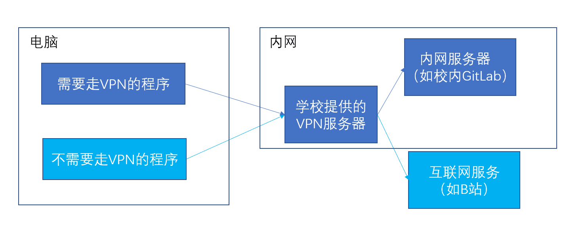
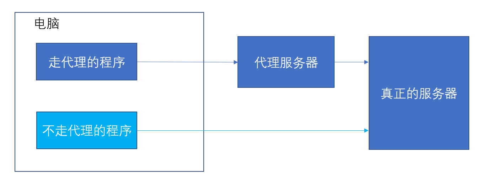
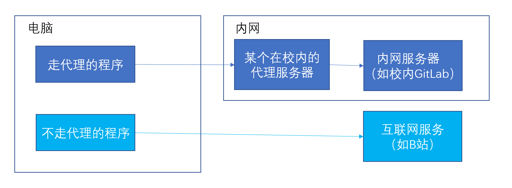
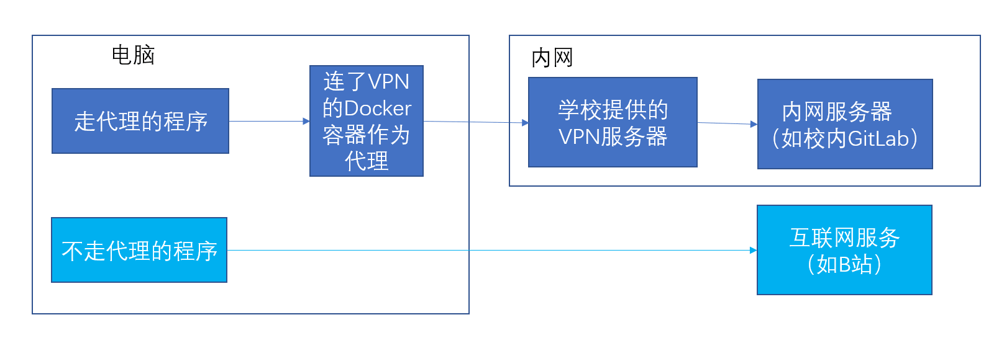
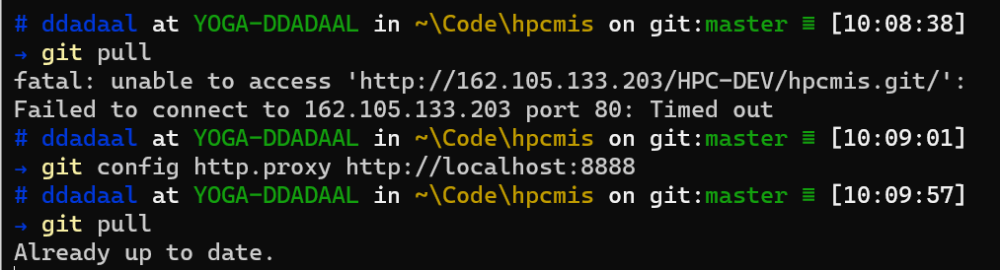

# 需求

虽然放假了，但是学校还有活要做，而且学校的活的代码仓库在学校内建的内网GitLab上，在外网需要VPN才能访问。但是，大家都知道连接VPN会让整个系统里的所有流量都走VPN，但是很多流量其实是不需要走VPN的，比如聊天、看视频网站等，VPN是有带宽限制的，把所有流量都走VPN会使得不需要走VPN的网络请求变慢。

那么，有没有办法可以让需要访问内网资源的程序走VPN，不需要访问的程序不走VPN呢？

# 代理

> 代理服务器的基本行为就是接收客户端发送的请求后转发给其他服务器。代理不改变请求URI，並不会直接发送给前方持有资源的目标服务器。（[维基百科](https://zh.wikipedia.org/wiki/%E4%BB%A3%E7%90%86%E6%9C%8D%E5%8A%A1%E5%99%A8)）

简单的理解，代理服务器（proxy server）就是一个程序，它会将它收到的流量转发到其他服务器上。这个服务器有可能就是真正的目标服务器，也有可能是其他代理服务器。

当前大部分程序都支持设置代理服务器。如果一个程序设置了代理服务器，那么它发送的流量将**不会**直接发送到真正的目标服务器上的，而是发送到代理服务器，由代理服务器进行处理后发送到目标服务器上。

# 如果有在内网的代理服务器……

如果我们有一台在内网的服务器，并且这个服务器可以从公网被访问，那么事情就很简单了：

我们将在这台服务器上开一个代理程序，这个代理程序就是简单地把收到的请求再转发到真正的目标服务器上。
然后在我们本机上，把需要内网资源的程序的代理服务器设置为这个服务器的地址。

这样设置之后，我们本地的需要内网资源的程序的流量将会被发送到这个内网的服务器上，内网服务器收到了，将会把请求转发到内网的服务器上。这样，我们的程序就可以访问内网的资源了。

# 最终方案：把连接到VPN的服务器作为代理

那我们没有一台在内网的、可以被公网所访问的服务器怎么办呢？

这时，VPN的作用就出来了：连接了VPN的电脑的所有流量都会转发到内网去，那么这台电脑就可以被看作一个在内网的服务器。

我们可以在本机上起一个虚拟机或者docker容器，使这台虚拟机或者容器连接到VPN。同时，在这个虚拟机或者容器上起一个代理程序，工作就是简单地把收到的请求转发到真正的目标服务器上。

我们将需要走内网的程序的代理设置为这个虚拟机或容器，那么需要走内网的程序的流量将会首先发送到虚拟机或者容器。由于这个虚拟机或容器连接了VPN，那么由这个服务器发送的请求就会走隧道到内网，能够访问到我们需要的内网的服务。而没有设置这个虚拟机或容器为代理服务器的程序的流量将会不经过内网，直接连接到互联网服务。这样，我们的问题就解决了！

# 设置代理

最后一步，如何给一个程序设置代理呢？

这个需要根据程序而定，一般是如下的策略：

- 有的程序自己有设置代理的设置，需要看程序的帮助界面
  - 如`git`、`npm`等
- GUI程序一般会跟随系统代理设置
  - 去系统的设置菜单里寻找
- 一般命令行程序会使用`HTTP_PROXY`、`HTTPS_PROXY`、`http_proxy`和`https_proxy`环境变量的值作为代理服务器

在我们的原始需求中，我们使用的git。所以，我们可以在仓库中使用`git config http.proxy 代理地址`和`git config https.proxy 代理地址`来设置，使得这个仓库的pull和push操作都使用代理地址对应的代理服务器。我们只在仓库层面进行设置，只有这个仓库的操作会走这个代理服务器，其他仓库不会使用这个代理服务器。

# 借助Docker的实现

根据这个原理，我编写了一套使用Docker容器来实现这个解决方案的脚本，可以在经过简单的设置之后，使用一条`docker-compose up`命令就可以简单地启动这样一个代理服务器，方便使用。由于使用了docker，所以Windows/*nix等支持docker的操作系统全部支持。

仓库地址为：https://github.com/ddadaal/vpn-as-http-proxy

感兴趣的同学可以进入仓库参考一下使用方法和实现原理。使用方法写在README文件中了。由于每个学校和组织的VPN地址、参数等都不相同，我也鼓励大家尝试找到连接自己学校的VPN的命令，并将命令模板通过PR方式贡献给本仓库，这样使得更多的同学能够更简单地使用这个解决方案。
