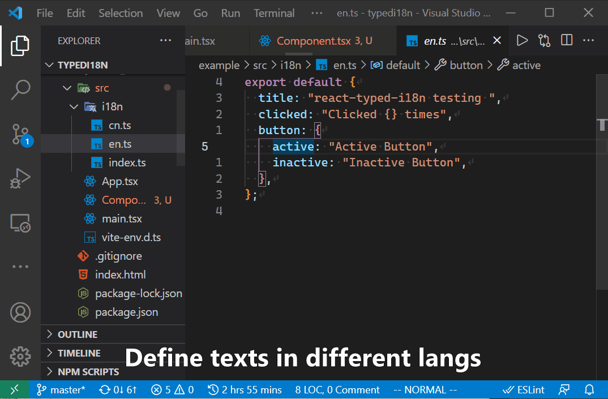

# react-typed-i18n

最近学习了一下TypeScript最新的[Template Literal Type](https://www.typescriptlang.org/docs/handbook/2/template-literal-types.html)特性，突然想起来可以使用这个实现一个使用字符串字面量的i18n库，以用来替换之前的使用了一些黑魔法的[`simstate-i18n`](https://github.com/ddadaal/simstate-i18n)库，也在这个新库中解决一些技术债，例如只使用React Context、加入测试、增加一些新功能等。

新的库名字叫`react-typed-i18n`（[GitHub](https://github.com/ddadaal/react-typed-i18n)）。花了一个周末将功能和测试写好发到了npm上，并很快把本网站用这个新库重写了，体验比较好。

于是通过此文章介绍一下i18n的概念、常见实现方式以及本库的亮点，其中介绍部分的内容使用了之前写过的关于`simstate-i18n`的文章 [Strongly Typed i18n with TypeScript](/articles/strongly-typed-i18n-with-typescript)。要想更详细的了解一些i18n的内容以及当时写`simstate-i18n`的考虑，请查阅此文章。

# i18n

国际化，英文叫Internationalization，简称i18n（因为首尾字符i和n中间有18个字符），是指让一个软件产品能够显示按多国语言显示。

比如你正在访问的我的博客就是支持国际化的网站，你可以尝试在右上角的下拉框中切换不同的语言（当前只中文和英文），切换后，整个网站的将会以被选择的语言来显示。

国际化的核心是将网站中的所有文本元素都拿出去单独定义，然后在原本应该硬编码文本的地方，使用对所有语言都一致的元素进行代替。在编译时或者运行时，这种元素将会被替换为实际显示的语言的对应的文本元素。

例如说，对于这个p元素`<p>Hello World</p>{:html}`如果我想将它支持多语言显示，那么应该做以下的工作：

1. 不能直接硬编码文本，而是应该用一个ID之类的东西（例如`helloWorld`）替代硬编码的文本
2. 在其他地方，用不同的语言定义ID和文本的对应关系。例如，定义`helloWorld`对应`你好，世界！`（中文）或者`Hello World`（英文）
3. 使用一个机制，在编译时或者在运行时将界面中的ID替换为当前语言的文本

# 定义ID和文本的对应关系

这种ID和文本的对应关系可以有很多种，最简单的就是**KV**，一个ID对应一个文本。iOS ([示例](https://medium.com/lean-localization/ios-localization-tutorial-938231f9f881)) 和 ASP.NET Core MVC ([示例](https://docs.microsoft.com/en-us/aspnet/core/fundamentals/localization?view=aspnetcore-2.2))其实就是这种对应关系。

简单的KV对应虽然很简单，但是当文本信息多起来之后，ID可能会非常长，例如：

```
app.header.userIndicator.loggedIn.dropdown.login.button.text
app.header.userIndicator.loggedIn.dropdown.username.button.text
app.header.userIndicator.loggedIn.dropdown.logout.button.text
```

UI基本都是以树结构组合起来的，所以，我们也可以以树结构组织我们的ID，同一个页面、同一个组件下的文本信息组织在同一层级，每个层级之间使用`.`连接。

在JS中，我们可以使用对象表示这样的树结构的定义。例如以下例子，两种语言分别定义对象，其key为每个部分的ID，叶节点的value即是对应的文本信息。所有语言的这个这个对象具有相同的结构。那么，英文下的`login`和中文下`登录`这个文本信息对应的ID就是`login.button.text`。

```tsx
// en.ts, 定义英文的ID的文本对应关系
export default {
  login: {
    button: {
      text: "Login",
    },
  },
}

// cn.ts, 定义中文的对应关系
export default {
  login: {
    button: {
      text: "登录",
    },
  },
}
```

# 通过ID取得当前语言的文本

这个ID其实也是一个访问对象属性的路径。通过这样的ID，我们可以很简单的从当前语言的定义对象中取得当前语言的文本。加上一些状态管理的加持，动态切换语言也是很简单的工作。

```tsx
// 这个组件通过ID获得当前语言的对应的文本。
function LocalizedString({ id }: { id: string }) {
  // 通过React Context等方式或者当前语言的定义对象currentLanguageObject
  // ...

  // 把ID以.拆开，然后一层一层访问就可以了。
  const value = currentLanguageObject;
  id.split(".").forEach((k) => {
    value = value[k];
  });
  return value;
}

// 一开始我们是把文本硬编码在组件里……
<Button>Login</Button>

// 现在使用LocalizedString来动态获取文本
<Button><LocalizedString id="login.button.text" /></Button>

```

# 强类型地输入ID

上述方式已经能够完成任务了，但是有一个很大的问题：**写id的时候没有类型检查，容易写错**。

除了字符串，也有一些其他方式可以来定位，其他方式在我的[simstate-i18n的文章中](/articles/strongly-typed-i18n-with-typescript#make-it-strongly-typed)中有介绍，最后还是认为上一节的字符串和组件的方案具有优势。

所以现在的问题变成了**如何强类型地生成ID**。我之前的库[`simstate-i18n`](https://github.com/ddadaal/simstate-i18n)使用`Proxy`来截取对对象的访问路径来生成ID。这个点子比较新奇，也能很好地完成工作，但是总感觉有点奇技淫巧，而且使用Proxy总会对性能产生一些影响。

# 使用Template Literal Type计算所有可能的ID

[Template Literal Type](https://www.typescriptlang.org/docs/handbook/2/template-literal-types.html)的出现使得我们可以直接使用字符串字面量作为ID，并通过一些类型计算，使得TypeScript可以确定出所有可能的ID，并在编辑器实现自动完成和错误检查。

TypeScript支持**字面量类型(literal type)**和**联合类型(union type)**。

- 借助字面量类型，TS可以将对象和字符串字面量推断出非常精确的类型：例如，TS可以推断出上面的对象的类型为`{ login: { button: { text: string }}}{:typescript}`。而字符串字面量的类型也可以推断地非常精确，例如`"123"{:typescript}`的类型就是`"123"{:typescript}`。
- 通过联合类型，具有多种但是有限种可能取值的值的类型也可以限制地非常精确：例如如果一个变量可能取值`"1"`或者`"2"`，那么这个变量的类型就是`"1" | "2"`

而新支持的`Template Literal Type`简单来说，支持了字符串字面量类型的拼接。并且，在拼接的时候，如果有一个操作数是联合类型，将会运用分配律将字符串展开：

```ts
type A = "A1" | "A2" ;
type B = "B1" | "B2" ;

type C = `${A}.${B}` // type C = "A1.B1" | "A1.B2" | "A2.B1" | "A2.B2"
```

在这个功能的基础上，再加上一些TS的高级类型（例如`Mapped types`, `keyof`等等等）我们就可以实现从对象字面量推断出所有可能的ID了。

在JS代码中，我们要生成这样的ID是很简单的：对对象做一个DFS就可以了

```js
const a = { login: { button: { text: "Login" } } };

const dfs = (obj) => {
  if (typeof obj === "string") {
    // 已经到了文本，下一层的key就是""
    return [""];
  }

  // 保存至这一层的所有ID
  const ids = [];

  // 遍历obj的所有key
  for (const key in obj) {
    // 获得下一层的所有key
    const nextLevel = dfs(obj[key]);

    // 将本key加到所有下一层key的前面
    ids.push(...nextLevel.map((x) => `${key}.${x}`));
  }

  return ids;
};

// 按上述方案写出来的ID最后会多出一个.，使用这个函数把最后的.去掉
const removeTrailingDot = (str) => str.endsWith(".") ? str.substr(0, str.length-1) : str;

dfs(a).map(removeTrailingDot); // ["login.button.text"]
```

当然，我们可以使用一个更FP的方式写这个`dfs`函数：

```js
const flattenArray = (arr) => arr.reduce((prev, curr) => {
  prev.push(...curr);
  return prev;
}, []);

const dfs = (obj) => typeof obj === "string"
  ? [""]
  : flattenArray(Object.keys(obj).map((k) => dfs(obj[k]).map((sk) => `${k}.${sk}`)));
```

现在我们要做的，就是在类型的层面、借助TS的类型系统，完成同样的工作。这里先放代码：

```ts
type ValueOf<T> = T[keyof T];

type Concat<T, U> = `${string & T}.${string & U}`

type LangRec<D extends string | Definitions> = D extends string
  ? ""
  : `${ValueOf<{[k in keyof D]: Concat<k, LangRec<D[k]>>}>}`

type RemoveTrailingDot<T extends string> = T extends `${infer U}.` ? U : T;

export type Lang<D extends Definitions> = RemoveTrailingDot<LangRec<D>>;

type A = Lang<{ a: "2", b: { c: "4" } }>; // type A = "a" | "b.c"
```

这段代码看起来很唬人，但是如果我们把类型看成函数，类型参数看作函数参数，就可以看出来，这个代码基本就是JS代码的直接翻译。其中有几点可以提一下：

- 递归类型

`LangRec`是一个递归类型，可以理解成递归函数，其中`LangRec`是函数名，类型变量`D`为函数的变量。为了使得递归类型能够递归结束，必须需要使用`条件类型 conditional type`判断当前D的实际类型，并当它是字符串（即已经到达对象的叶节点）时，结束递归

- Mapped type

`ValueOf<{[k in keyof D]: Concat<k, LangRec<D[k]>>}>{:typescript}`处运用了mapped type，将D的每个key（`k in typeof D{:typescript}`）映射成一个新的类型`Concat<k, LangRec<D[k]>>{:typescript}`。

本来mapped type只支持映射把对象映射到对象（如`{a: string; b: string}{:typescript}`到`{ a: number; b: number; }{:typescript}`），但是我们只关系值的类型（映射后的类型），不关心原来的key的类型，那么可以使用`ValueOf`取得所有值的类型。

- 分配律

在原来的JS代码中，下一级生成的key是一个`string[]`，而本级的key是一个`string`，要将本级的key加到所有下一级key的前面，就需要使用`map`方法，并在最后使用`flatten`方法，把`string[][]`打平成`string[]`。

对应到在我们的类型代码中，下一级生成的key是一个联合类型（`"a" | "b"{:typescript}`），本级的key是一个字符串字面量`"a"{:typescript}`。但是，借助分配律，我们可以直接得到拼接后的联合类型`"a.a" | "a.b"{:typescript}`。

- 去掉最后的点（RemoveTrailingDot）

类型系统中没有`.endsWith`方法，也没有`.substr`方法，但是可以借助`inferred type`，看看原类型能不能推断(infer)出一个类型`U`，这个`U`类型加上一个`.`，就等于原来的类型`T`。如果可以，那么U就是删掉最后的点后的类型。

通过这个Lang类型和语言对象的字面量类型，我们就可以直接获得所有可能的ID，将它用在ID的类型上，我们就实现了强类型的文本ID。借助TS提供的类型信息，VSCode等编辑器可以给出自动完成，极大地提高编程体验。

```tsx
const language = { login: { button: { text: "Login" } } };

type TextId = Lang<typeof language>;

// 这个组件通过ID获得当前语言的对应的文本。
function LocalizedString({ id }: { id: TextId }) {
  // ...
}

<LocalizedString id="a" /> // error
<LocalizedString id="login.button" /> // error
<LocalizedString id="login.button.text" /> // correct
```



# ID前缀

随着代码量的增长，UI树越来越复杂，对应的ID的结构也越来越复杂，深度越来越大，这就会使得ID越来越长，但是在同一个UI里用到的各个ID都具有相同的前缀，例如下面这个真实项目中的例子：

```
app.header.userIndicator.loggedIn.dropdown.login.button.text
app.header.userIndicator.loggedIn.dropdown.username.button.text
app.header.userIndicator.loggedIn.dropdown.logout.button.text
```

所以，我们可以将前缀提取出来，然后在真正使用的地，就可以直接输入后面不同的部分就可以了。

当然了这个过程也需要有类型检查。本库提供了`prefix`这个helper function，在运行`createI18n`时可以获得。对于上面三个例子，使用`prefix`函数可以写出如下代码。

```ts

const p = prefix("app.header.userIndicator.loggedIn.dropdown.");

p("login.button.text"); // app.header.userIndicator.loggedIn.dropdown.login.button.text
p("username.button.text") // app.header.userIndicator.loggedIn.dropdown.login.button.text
p("logout.button.text") // app.header.userIndicator.loggedIn.dropdown.logout.button.tex
```

这是怎么实现的呢？

```ts
type FullLang<D extends string | Definitions> = D extends string
  ? ""
  : `${ValueOf<{[k in keyof D]: `${(StringOnly<k>)}.` | Concat<k, FullLang<D[k]>>}>}`

type PartialLangFromFull
  <D extends Definitions, FL extends FullLang<D>, L extends Lang<D>> =
  FL extends `${L}.` ? never : FL;

export type PartialLang<D extends Definitions> =
  PartialLangFromFull<D, FullLang<D>, Lang<D>>;

export type RestLang
<D extends Definitions, L extends Lang<D>, Partial extends PartialLang<D>> =
  L extends `${Partial}${infer Rest}` ? Rest : never;

const p: <TPartial extends PartialLang<D>, TRest extends RestLang<D, Lang<D>, TPartial>>
  (t: TPartial) => (rest: TRest) => `${TPartial}${TRest}` = (t) => (s) => t+s;
```

这看着比上面的获得所有ID要复杂不少，但是简单来说可以分为这几步：

1. `FullLang`类型取得DFS过程中所有中间节点的ID
    - `Lang`只会取得到叶节点的ID，而`FullLang`会把途径的中间结果的ID也获得
    - 另外还有一个区别是这个得到的所有ID最终的`.`是没有去掉的


```tsx
const language = { login: { button: { text: "Login" } } };

type D = typeof language;

type FL = FullLang<D>; // "login." | "login.button." | "login.button.text.";
```

2. `PartialLangFromFull`类型把到叶节点的ID去掉
    - 对于`FullLang`的每个取值，如果它是某个`Lang`的取值后面加个`.`，那么这个其实是到叶节点的ID，不是前缀，是不应该取的(`never`)
    - 到这里已经获得前缀了

```tsx
type PLFF = PartialLangFromFull<D, FullLang<D>, PartialLang<D>>; // "login." | "login.button."
```

3. `RestLang`是通过前缀来获取可以接受的后缀
    - 这个也是通过`infer`的方式来实现的，看看是否某个`Lang`的取值可以是传入的前缀和后缀拼起来`${Partial}${infer Rest}`，如果可以，就把后缀`Rest`返回

```ts
type RestLang = RestLang<D, Lang<D>, "login."> // "button.text"
```

4. 最后，`p`函数的实现其实就是一个`(t) => (s) => t+s{:ts}`，非常简单，运行时几乎没有什么开销。

# 总结

TS具有现在常见编程语言中最强大的类型系统，而这个类型系统如果能用得好，能够极大地提高编程效率。这个方案借助了TS的强大的类型系统，使得i18n的过程也能享受到较为完善的类型检查，能够在编译器避免很多因为string写错的带来的运行时bug。并且，在运行时就是普通的字符串，和之前的通过proxy截取对象访问路径生成ID的方案相比，不会在运行时产生任何开销。

这个方案也有一个潜在问题，即当语言对象很大很复杂时，编译器的类型运算本身可能会消耗较多运算资源，影响编辑器的流畅度。但是，当前我的网站具有151行的语言定义，ID的自动完成性能还算可以接受（基本不会有可见卡顿），所以对我来说性能已经够用了。

希望有更多用户可以来试试`react-typed-i18n`（[GitHub](https://github.com/ddadaal/react-typed-i18n)）。
