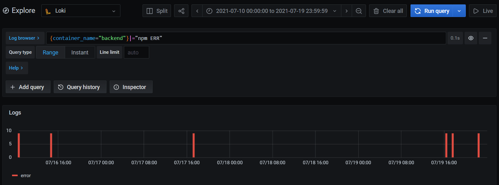
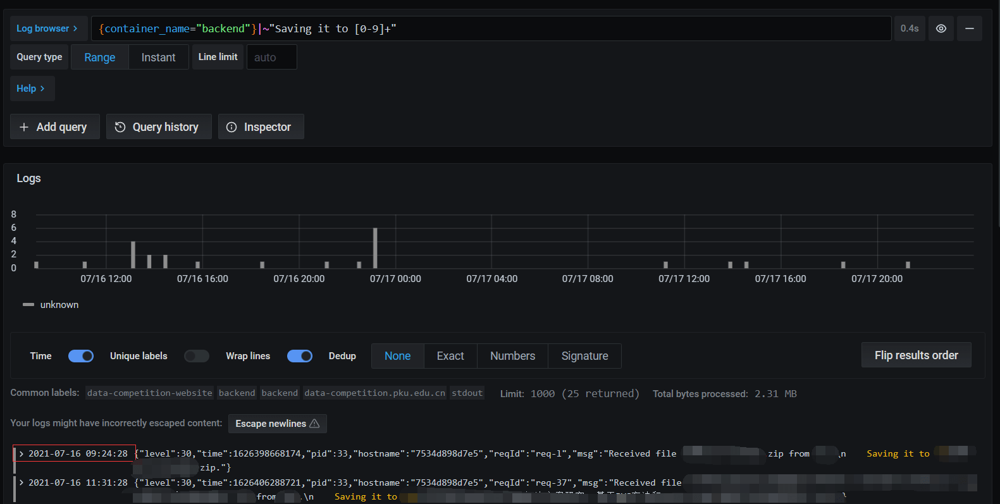

# 生产事故

我最近负责了一个比赛后台网站的开发和维护，在比赛临近结束、正在接受用户提交成果文件的时候出了一场生产事故，造成了丢失了一段时间内用户上传的文件。本文主要讲讲生产事故从发现到确定影响范围到确定原因的过程。在整个过程中，后台程序记录的日志起到了巨大的作用。

关于这个项目的总结，可以查看这篇文章：[我的第一个真实项目：总结和经验](/articles/summary-of-my-first-real-project)。

# TL;DR

| 要素     | 内容                                                                                                   |
| -------- | ------------------------------------------------------------------------------------------------------ |
| 表现     | 丢失`2021-07-16 09:00:10`至`2021-07-17 18:00:57`期间所上传的文件                                       |
| 原因     | 7月16日的一次提交，使得之后文件上传到了一个容器内部的、没有mount出来的目录，容器重启后，这些文件丢失了 |
| 补救     | 进入容器，找回了最后一次容器重启后到问题发生期间上传的文件                                             |
| 后续处理 | 通过log、数据库数据等找到了受到影响的用户，通过邮箱、电话和短信提醒他们重新上传文件                    |
| 经验     | 实现依赖业务，而非业务依赖实现；重视测试细节；log中记录尽可能多的信息                                  |

# 问题发现

项目基本情况是这样的。用户可以注册团队，一个团队有一个队长，队长可以提交一个团队的成果文件。管理员可以看到各个队伍的提交情况，以及也可以直接下载团队提交的文件。

19日下午4点左右，我用管理员登录了系统，本来只是在随便看看有哪些团队提交了成果，结果突然发现有的团队的成果点击下载下不下来。


赶紧上服务器上看是怎么回事。打开服务器存放上传的文件的目录，grep一下发现对应的ID发现没有这个文件。

上传文件的逻辑是这样的：

1. 获取上传的文件
2. 把文件保存到`upload/{团队ID}/文件名`
   1. 保存之前，打日志`Received file {文件名} from {用户ID}. Saving it to {完整路径}.`
   2. 保存完成后，打日志`${完整路径} saved successfully.`
3. 更新数据库，记录文件名(列名为`filename`)和上传时间（`last_update_time`）

如果第二步失败，就不能进行第三步，不会出现保存文件失败但是写了数据库的情况。但是如果没有写数据库，我在后台就不会看到这个团队有成果，就不会能够点击下载了。

后端程序运行在docker中，但是`upload`是一个mounted volume，其中的文件和容器外的一个目录是进行了共享的，所以不管容器怎么重启，这里面的文件是不会掉的。

```yaml
# docker-compose相关部分, /dist是容器中存放程序文件的根目录
backend:
  volumes:
    - "./backend/upload:/dist/upload"
```

马上翻了下日志，按上面说的格式搜一下日志（下面的队伍ID为实际的团队ID）：

```logql
{container_name="backend"}|="Saving it to upload/队伍ID"
```

发现**没有结果**。

这就奇怪了，于是把`upload/队伍ID`从查询语句中删除，直接看有哪些保存的日志，这一看就出事了。我看到了一堆这样的日志：

```
{"level":30,"time":1626528267191,"pid":36,"hostname":"2358983e224d","reqId":"req-29","msg":"Received file 文件名.zip from 用户ID.\n    Saving it to 团队ID/文件名.zip."}
```

文件被保存到`{团队ID}/文件名`下了！而`{团队ID}`这些目录是没有被mount的，容器重启就重启了，没了！

马上进入容器里运行`ls`，果然在容器根目录看到了一堆`{团队ID}`的目录。

# 确定影响范围和补救

首先，我把容器里已有的这些文件复制了出来，并定时检查有没有新的文件。还好，在排查问题的整个过程中都没有新的文件名上传。这些文件应该是在上一次容器重启之后才上传的。

之后，是找到哪些队伍的文件仍然丢失了，也就是数据库中`filename`不是NULL，但是`upload`下面没有这个队伍。这些队伍的文件应该是在上一次重启之前就上传了，上一次重启使得这些文件丢失了，应该是无法找回了。

通过各种查找资料，写出来以下的bash脚本：

```bash
# 查询filename不是NULL的团队的ID，写入db.txt
query="""
use data_competition_prod;
select id from team where filename is not null;
"""
echo $query | mysql -u root -h 127.0.0.1 -P 3306 -p密码 | sed '1d' | sort -n > db.txt

# 查询upload下的所有目录名，写入folder.txt
ls -d */ | cut -f1 -d'/' | sort -n > folder.txt

# diff两个文件
diff db.txt folder.txt
```

这个bash脚本得出filename不是NULL的、但是upload下没有对应的目录有**11**个。所以这11个团队的文件是丢失了。

但是除了丢失文件的情况，还有在出现问题之前就上传了版本，但是在这问题发生后更新了文件。这样，虽然在系统上有他们的问题，但是这些文件版本不是最终的版本。

为了找到这些团队，首先需要找到最近几次重启的时间，以及问题开始时的时间。容器重启的时候之前的容器会被强制退出，会打出有`npm ERR`的日志，通过这个ERR可以找到最近几次重启的时间。

```logql
{container_name="backend"}|="npm ERR"
```



可以看到图上有三次重启：

- `2021-07-16 09:00:10` (`t1`)
- `2021-07-16 15:50:07`
- `2021-07-17 18:00:57` (`t3`)

最后一次重启（19日的）是后面修改代码中的bug引发的重启，此时文件能恢复的文件已经恢复。而查询时间段之前的代码我知道是没有问题的。所以可以确定，`t1`-`t3`之间的数据是丢失了，而我之前从容器中补救出的文件是`t3`之后的数据。

为了确定事情是不是`t1`这次重启后发生，我又进行了一次确认。问题的原因是没有保存到`upload/团队ID/`下，而是直接保存到`团队ID/`下，可以通过正则表达式匹配`Saving it to 数字`的log，查看第一次出现这样的log的时间为`2021-07-16 09:24:28`，是在`t1`之后，所以可以确定原来的时间段是正确的，或者说，更详细的说是9点24-15点50之间的数据丢失了。

```logql
{container_name="backend"}|~"Saving it to [0-9]+"
```



把查询时间设置在`t1`到`t3`之间，运行以下语句，通过正则表达式，提取在这期间上传的团队的ID，获得了一个团队ID的列表。那么这些就是受到本次影响的团队了。

```logql
{container_name="backend"}|~"Saving it to [0-9]+" | regexp "Saving it to (?P<id>[0-9]+)" | line_format "{{.id}}"
```

# 后续处理

第一步当然是恢复还能恢复的文件并火速修改bug，并确认了一下在修改bug发布之前没有团队上传了新的文件。

由于这些文件无法被恢复，只能麻烦组委会其他人去通过电话、短信和邮件联系对应参赛队员，让他们重新交一份文件。

# 出错原因

这次项目我给后端项目写了测试，覆盖率已经达到了94.3%，对文件上传这部分也进行了重点的测试，但是为什么还是没有发现这个问题呢？


因为之前我之前都是通过以下代码，将配置中的`config.upload.path`（取值为`upload`，就是之前根目录）和团队ID和文件名拼接起来，来获得一个团队的上传的文件的实际路径。


```diff
diff --git a/backend/src/entities/Team.ts b/backend/src/entities/Team.ts
index 38c381b..cf2957a 100644
--- a/backend/src/entities/Team.ts
+++ b/backend/src/entities/Team.ts
@@ -1,4 +1,3 @@
-import { config } from "@/utils/config";
 import { EntityOrRef, toRef } from "@/utils/orm";
 import {
   ArrayType, Collection, Entity, IdentifiedReference,
@@ -66,7 +65,7 @@ export class Team {

   get filePath() {
     return this.filename
-      ? urljoin(config.upload.path, this.id + "", this.filename)
+      ? urljoin(this.id + "", this.filename)
       : undefined;
   }
```

这次错误的commit为了重构**下载**的相关代码，修改了这个地方的计算逻辑，把拼接`config.upload.path`的代码移到了处理下载请求的代码中，而忘记了**上传**时确定文件保存的路径时也使用了这个`filePath` getter，造成了上传时使用的路径不包含顶级的`config.upload.path`，而是直接就是`{团队ID}/文件名`。

而在测试中，判断上传之后的文件是否存在时，仍然是使了`filePath` getter获得路径，这使得其实不管`filePath`怎么写，测试肯定都能通过，因为测试代码和业务代码所使用的计算路径的代码是相同的，所以并没有发现目录计算错误这个问题。

```ts
// 测试文件是否存在
expect(path.basename(t.filePath!)).toBe(newFileName);
```

# 教训

1. 实现依赖业务，而非业务依赖实现

之前把计算文件真实路径的代码放在业务模型里（`filePath`属性）这样的设计是有问题的。

按照DDD的思想，**业务逻辑**（保存用户上传的文件）不应该直接依赖**实现逻辑**（通过`config.upload.path`计算实际路径，然后使用`fs`直接操作文件系统），而是应该反过来，实现层面依赖业务逻辑。也就是说，应该

> 提供一个保存用户文件的方法，这个方法接受保存文件所需要参数（比如操作用户、文件名、文件流），这个方法来负责进行实际保存文件的工作。

用传统的OO和DI的说法，就是定义一个保存文件的接口，实现层实现实际的保存文件的逻辑，并通过DI注入给用户逻辑。业务逻辑通过这个接口完成保存文件的工作。

这样，既可以避免本文这种问题，还有利于以后进行扩展，比如不保存到本地，而是保存到云端的存储。

2. 重视测试细节

虽然这次写的测试并没有发现这个问题，但是现在复盘发现，如果在运行测试的时候能够留意并重视一个细节的话，仍然也可以发现这个错误。

测试结束后的运行的代码（`afterEach`）中，指定了删除`config.upload.path`的目录。

```ts
afterEach(async () => {
  await server.close();
  // delete the test upload path
  await fs.promises.rmdir(config.upload.path, { recursive: true });
  // ...
});
```

但是由于错误的代码没有写到这个目录中，删除`config.upload.path`并不能删除测试上传所创建的文件，那么跑完测试将会有新的文件生成，就像下面这样：

```bash
➜  git status
On branch master
Your branch is up to date with 'origin/master'.

Untracked files:
  (use "git add <file>..." to include in what will be committed)
        10/
```

现在我想起来，当时确实发现了这个问题，但是并没有引起重视。

3. log中记录尽可能多的信息

从上面的发现问题的过程中可以发现，log相当重要。要是log中没有记录真实的完整路径，我可能需要花更多时间才能明白问题的原因。要是没有对每次文件保存都打log，我甚至都不能知道哪些队伍受到了影响。log记录了系统运行的整个流程，是分析系统的运行流程的最准确的工具。如果log打得好的话，能够从log中提取出很多没有记录到数据库中的数据。

所以应该在log里尽可能记录更多的信息。最基本的，错误必须打到log中，不能直接吞掉。而且在进行一些容易出错的行为时，也应该尽可能把相关上下文打到log里，以供后续查找。
