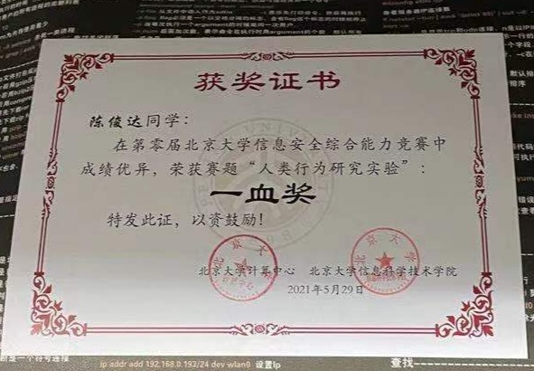
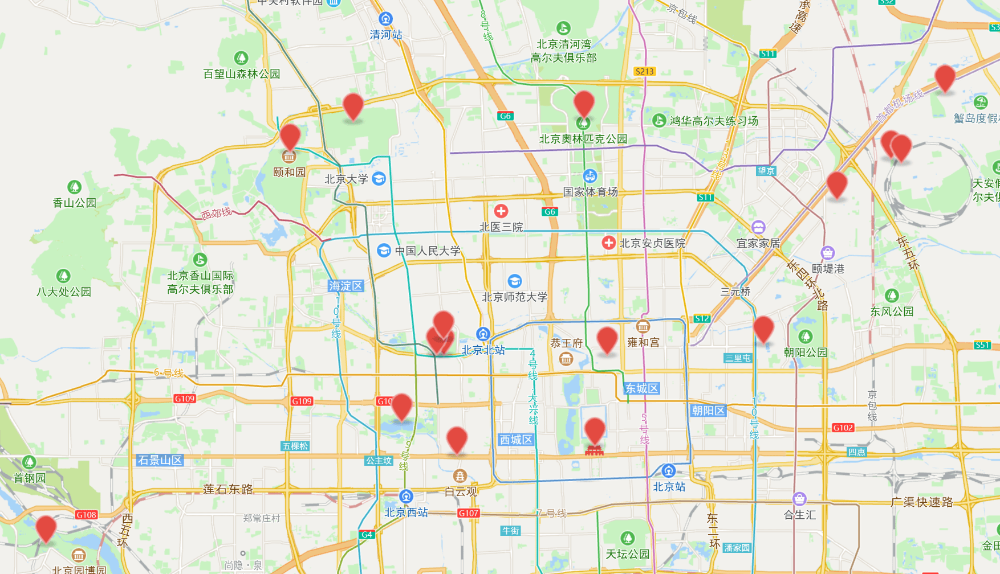
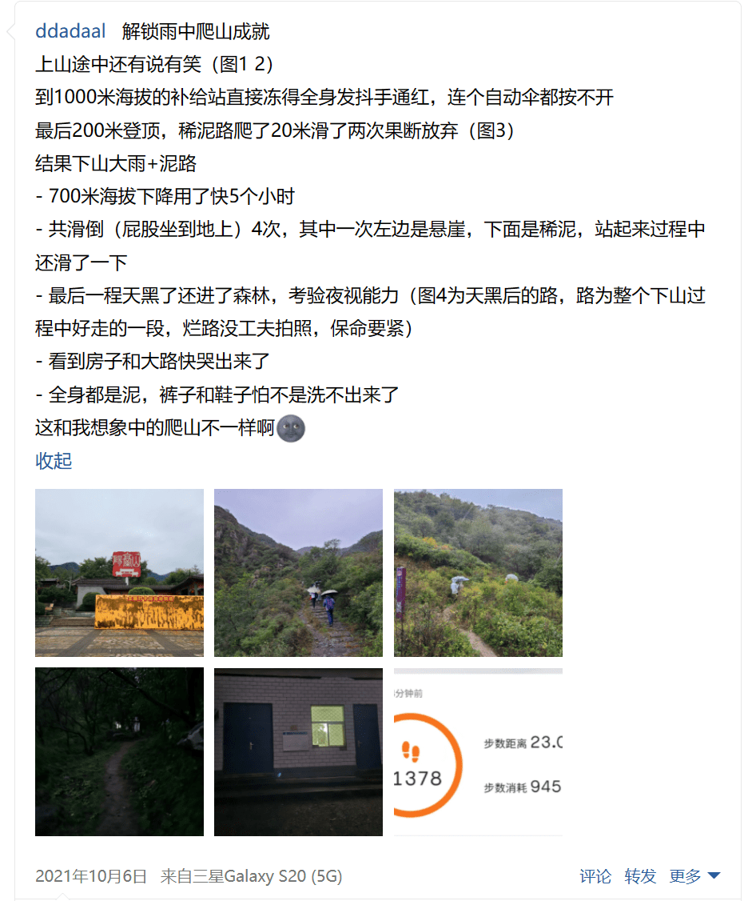
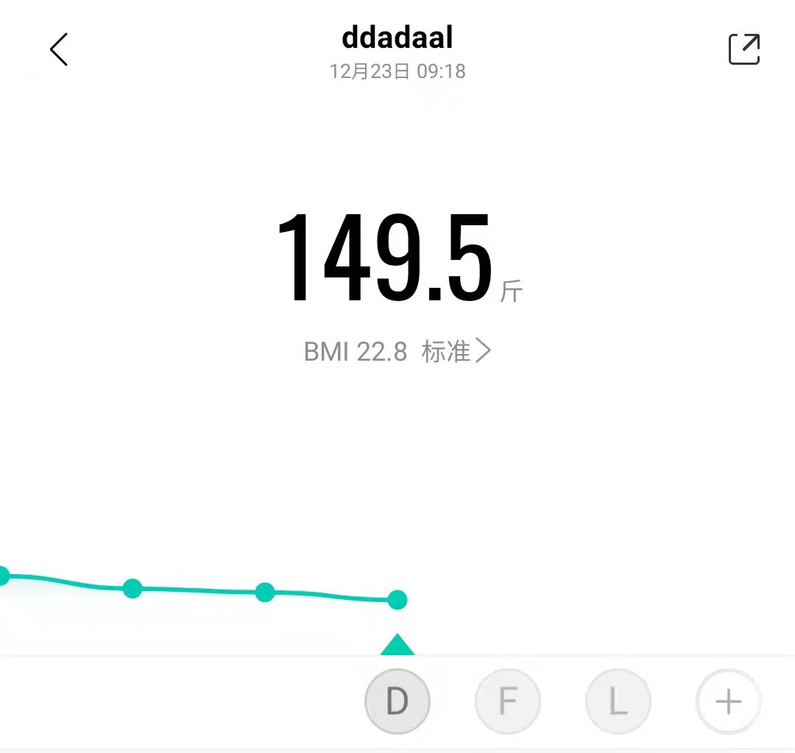
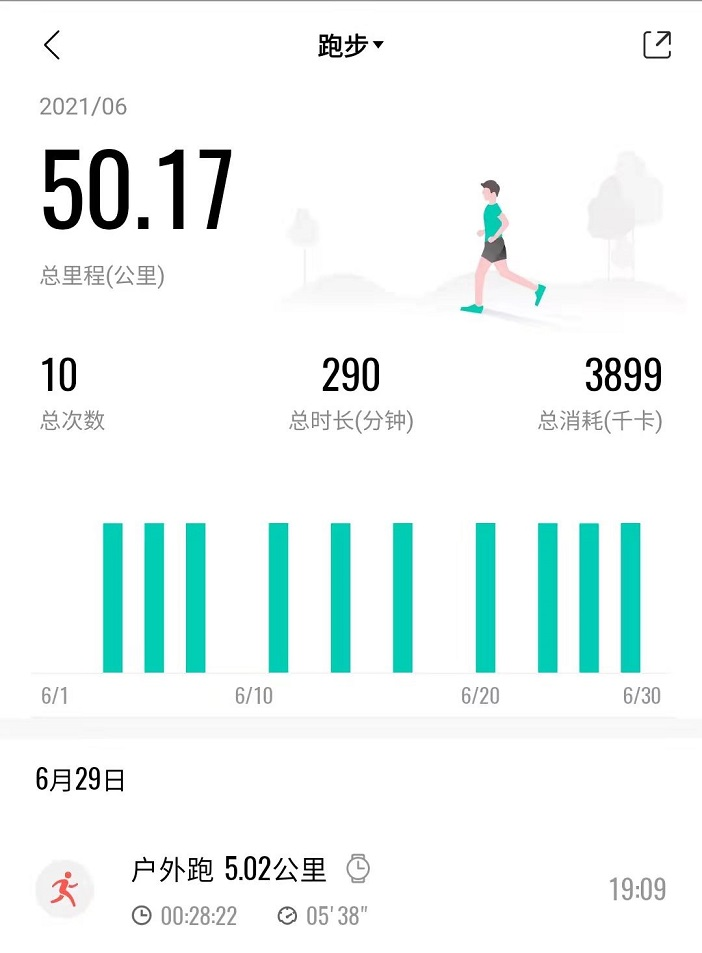
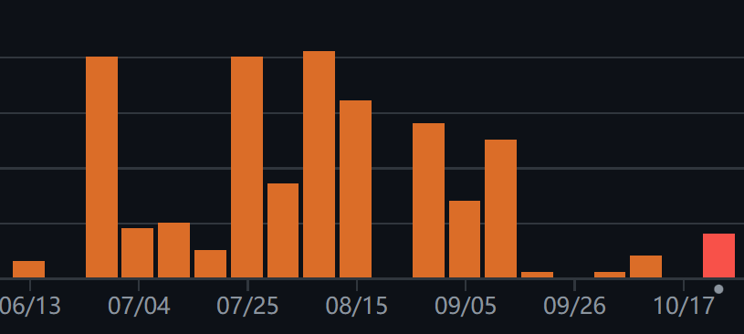
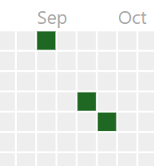
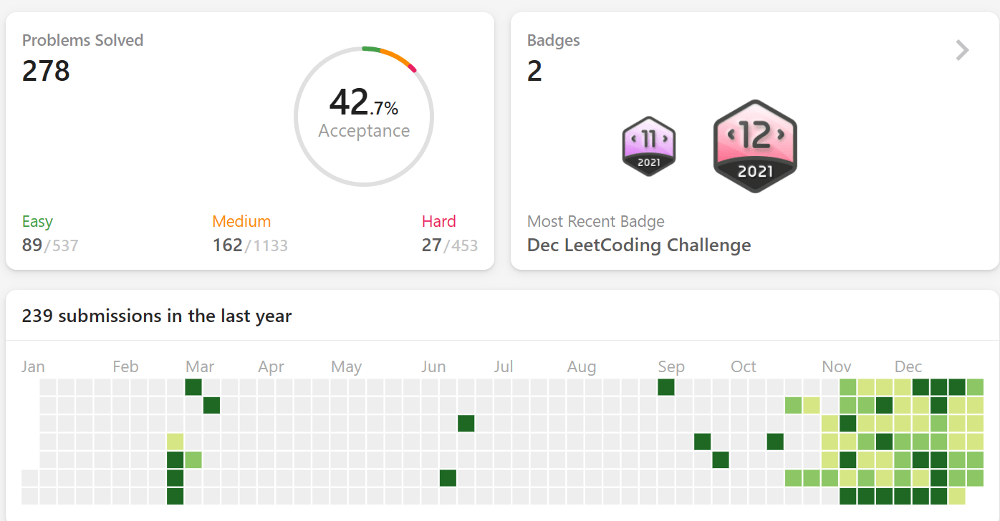

# 暴风雨之前的宁静

站在2021的年尾回看这一年，发现这一年着实有点波澜不惊。

这一年中没什么非常关键的里程碑事件。没有2018年的各种比赛和活动充实我的简历（以至于现在还在吃当年的老本）；没有2019年决定保研，确定了未来三年的生活状态，以及实习，第一次进入梦想中的公司去工作；没有2020年的本科结束，告别至今对我最具意义的四年，以及研究生开学，迎接一段外表看上去光鲜、但是自己却不那么肯定的研究生生活。这一年发生的各种事件看上去都那么的日常，有时候日常地甚至连朋友圈都懒得发。

但是，可以遇见到，2022年将会是一个“腥风血雨”的一年。再次准备实习面试，再次暑期实习，参加秋招，确定出路，每个步骤都是一场不可避免的硬仗。用**暴风雨之前的宁静**来总结2021年实在是再合适不过了。

# 本年度的事件

## 项目和比赛

我一直认为，不被人使用的项目没有意义。所以，即使项目是大家都觉得没啥技术含量的CRUD，只要真的有人用，我仍然会接受并且愿意花心思和时间把它做好。所以上半年除了上课，很大一部分时间投入到了data-competition.pku.edu.cn的开发上了。这个项目之前写过文章详细介绍，我这里就不讲了。

5月份的时候参加中心主办的“新手友好”的CTF比赛，结果就会做娱乐题和web题，其他题一点思路都没有，说到底还是我太垃圾了。最后趁着大佬还在睡午觉没有发力、以及相关技术（JWT）之前开发用过偷了个web题的一血奖，本以为还能蹭个30名万岁，结果比赛DDL当天早上一觉起来被卷王卷下去了，行吧。

这学期年中的时候参加了学院组织的持续48小时的hackathon比赛，由于是线上，所以差点现场一起卷的感觉。但是瑕不掩瑜，4个人在48小时从0开始卷了个类似大众点评的小程序出来，也算是学了个新技术（虽然小程序其实可以说就是个阉割版和私有版的web）。

年末的时候还参加了个比赛，说好10月中旬结束的，结果到现在还没结束，日程表一改又改，也是无语了。

## 城市旅游/参观

和长距离的旅游相比，我更喜欢城市/城郊的旅游和参观，原因很简单：规划更简单、当日去当日回。加上疫情期间学校对进出京比较严格，以及北京作为首都，还是存在不少值得一逛的地方，所以这一年通过和同学和社区的方式，一起参观了北京城里和城郊的多处公园、博物馆等景点。

- 公园：圆明园、颐和园、玉渊谭公园、北京动物园、奥林匹克森林公园、798艺术区（可能不算公园……）
- 博物馆：农业展览馆、天文馆、古动物馆、园林博物馆、电影博物馆、民航博物馆、铁道博物馆、首都博物馆
- 雁栖湖
- 阳台山
- 古北水镇

可以发现大多数景点都较为冷门。有的景点的门票实在是约不上有空的时间，如故宫等；但是更重要的是我不太喜欢人太多的景点。人太多的景点，看到的人比看到的景还多，那还有什么意义？所以这些景点大多数我都尽量选择工作日去参观的，避开北京汹涌的人流。这也是作为学生的福利的了吧，以后工作了之后，想避开高峰都做不到了。

这些景点总结一下，

- 各个博物馆虽然离城里近的人多、人少的太远，但是质量普遍较高，例如电影博物馆的20多个展厅个个内容充实，强烈推荐；
- 雁栖湖太远而且风景不如南京玄武湖（玄武湖yyds），票价较为，而且周边除了国科大啥都没有，吃饭的选择都比较少，劝退；
- 公园较为普通，适合散步聊天，动物园假期人流量太大（我是五一去的），建议避开高峰；
- 古北水镇很偏（都快到河北了），但是开发得还可以，而且人比较少，参观体验良好并且市郊铁路12块钱直达，附近酒店、民宿也比较便宜，附近还有长城景点，适合周末放松；
- 阳台山是跟随社团去的，总体体验参考下图：

## 运动和减肥

这一年可能唯一能称为标志性的事件就是我的体重人生中第一次降低到了标准值（BMI<24）。当前最低下过150斤（149.5，下图，是前一天晚上运动后第二天早上吃饭之前的结果，不具普遍意义），平时一般稳定在155左右。

自从我记事开始我都是在超重或者肥胖的状态，且深受大体重的困扰，比如体力不行，运动成绩特别差，中考体育几乎全员满分的情况下只得了41/50分等等问题，没有得心理问题已经是万幸了。大学第一学期在一学期没有出过校、天天吃食堂的情况下降了30斤之后，之后的情况虽然比高中要好多了，但是仍然是在超重状态，且在正负20斤的范围内徘徊。直到研究生第一学年结束后，体重仍然离标准体重差了十几斤。终于有一天，我的体重终于降下来了！

其实根据这5年的经验，我觉得**减重最重要的还是饮食**，运动用处不大。

拿大一上学期和大三下学期举例：这两个学期，我的运动量基本都是一周2-4小时羽毛球的水平，但是大一上学期我每天吃20块的三餐，午饭晚饭基本就是一份鸡肉（因为鸡肉便宜，而且除了肉没很多骨头之类的其他配料）、一份青菜和2两米饭，完全没有出去吃过（那一学期就没有出过学校），除了有时候吃点水果，完全没有零食和奶茶等三餐之外的东西。而大三大四时对吃基本什么限制了，有时候晚上2两饺子+鸭削粉丝汤，中午30块的香锅，每周还出去吃2、3顿。这样的最终结果，就是大一上学期220斤起点少了30斤、大三180斤左右的起点最后甚至好像还重了5、6斤的样子。

研究生期间的情况其实也差不多。到目前这三个学期，第一学期2-4个小时羽毛球，第二学期没有羽毛球，平时基本没有其他运动，但是5、6月保持两三天一次<6配速的5km，第三学期4-6小时羽毛球，吃的情况差不太多，但是体重变化方面，前两学期每学期-10斤左右，第三个学期下降得比较明显，快20斤了，但是我觉得还是因为吃得少了：这学期因为懒得去学校，所以早上基本每天一碗纯麦片，中午吃万柳的比校内食堂种类和量少太多、但是价格贵不少的食，这样摄入得少，体重也就下来了。

现在既然体重已经回归正常体重了，所以我现在也没有继续控制体重了，想吃啥吃啥，有时候甚至还吃点零食，所以最近体重没有继续往下走了。啊，不胖的感觉真好。

# 技术、工作、职业发展

## 浪费掉的暑假

7月，因为自己懒，在实习和选择了回家过最后一个暑假这两个选择中，选择了后者，并给自己找了个借口：继续写yaarxiv（[GitHub](https://github.com/ddadaal/yaarxiv）这个项目。

这是我今年最后悔的一个选择。

这个项目的主要功能2020年9月就已经完工，可是这一年多时间了，一点推进的迹象都没有。上个学期整整三个月，这个项目就发生了这三个变化：加了个logo，注册了个域名，上了个HTTPS，没了。

我本应该从上个学年这个项目的情况推测出这个项目完全没有前途，结果仍然把宝贵的暑假时间投入到这个巨坑中，结果在开学之后发现认识的同学个个要么实习、要么学生工作、要么论文在投，各种方向做得有声有色（至少能往简历上写），感到十分后悔。后悔归后悔，想着赶紧推动另一个实验室项目，结果在整整一个月的时间内项目（又）一点的动静都没有，连个会都拉不起来，连个需求都理不出来，焦虑感直接拉满。那段时间找各种事情来做，做leetcode、做tidb的实验、各种看新技术，但是由于是焦虑驱动的，根本无法坚持下来（leetcode刷了几天没刷了），而且碰到难题无法静下来debug（比如tidb实验的一个bug到现在都没de出来），所以那段时间也可以说是一无所获。

直到项目终于开始之后，我像是抓到了一个救命稻草一样，把我研究生能否有任何值得一提的成果全部压到那个项目上去了，所以接下来几个月基本全身心投入到了那个项目的开发上去。做了2个月之后，项目终于初步可用并内部上线试用了。但是现在想起来，那个项目只是个业务逻辑稍微复杂、涉及外部系统有点多的CRUD，仍然只是个玩具，仍然不具有什么含金量，并不能拯救我的简历，焦虑如闪电般归来。

## 工作和职业发展

明年就要找工作了，上半年暑期实习，下半年秋招。最近刷校内的BBS，总能看到很多同学的求帮忙比较offer的帖子，现在大家一般都不会只看薪资，普遍更重视职业发展、稳定性等因素，这也造成选择一个比一个难。而我因为不愿意做行政工作，也不愿意加班，完全没有做过科研，选择面瞬间少了很多（比如本校同学热衷的选调对我来说就完全不是一个选项）而且我很讨厌（怕）面试，理想情况是面个1、2次、拿到不那么差的offer就停止了，所以从某种角度来说可能明年也不会那么纠结（当然这种拿着多个offer的纠结和拿着1、2较差的offer是两种纠结）。

在职业发展上，纯业务的发展路径是不可持续的：业务是可以复制的，而且目前互联网的发展明显出现了瓶颈，各种“优化”层出不穷就是一个证据。另外一条路是走纯技术路线，掌握并精通业界的实用技术，如分布式、数据库、UI等，虽然这才是做“技术人”的正途，但是其难度较大，门槛较高（比如应用规模必须大到一定程度才会遇到分布式的需求和对应的问题，但是做实验室的玩具项目基本就完全用不到这些问题；比如只有面向关注UI的用户才会对UI提出要求，才能倒逼去学习和实践CRUD之外的UI技术，但是一般内部的业务都不重视UI，能用就行了）。这种需求的培养的脱节已经被受到很多批评了，但是现实就是这样：工程确实不是学校的重点。

我之前的技术栈都在web上，但是受限于实验项目的需求和人力（毕竟只有一个人），而且我有种“用不上的东西就学不进去”的坏习惯，所以无法通过项目学习公司想要的高的技术难度上，而需要写没什么简单、但是量大的业务代码（写这些成果在找工作的时候基本没有用，面试官只会觉得没什么难度，大家都能做。其实到目前为止我手里的项目、比赛在找工作的时候基本没什么含金量）而如果换方向，因为我已经在这个方向上投入了这么多，现在距离找工作也只有几个月的时间了，贸然换方向存在极大的风险：很容易最后变成两边都是半吊子，两边的工作都找不到的问题。其实，我现在掌握的技能已经太过分散，什么都会一点=什么都不会，如果不背面经，连正经大厂实习都不好找。

除了开发，我仍然参与搭建和维护实验室的一些基础设施。我也认同管理、基础设施等看似和技术无关的东西对于软件项目同等重要。但是同样是因为当前手里的项目难度和规模上不去，这些管理和运维的经验在业界看来就是个笑话，还不如不写，省得到时候面试官想，就这？

说到底，这几年所做的工作基本对找工作没什么帮助。所以最后找工作，还是只能像本科生一样，靠算法题和八股文。算法题方面，由于我算法水平很差，所以在11月开始坚持每天一道LeetCode的每日一题，到现在能不能做出来另说，起码看到题不会慌了，也是一个好的进步吧。而八股文方面，还是在这个假期好好静下心来背，就当是一个更大的、更重要的期末考试了。

# 日常学习生活状态

一个正常的学习路径是入门的时候先学习掌握基础、个人技能，之后通过项目学习多人合作以处理更复杂的问题，可是我到现在的路径是反过来的：本科特别推崇多人合作，基本所有项目都是多人合作完成的；结果上了研究生之后项目却都变成个人做了，甚至实验室都变成了甲乙方关系，实验室只管提需求，我把需求分析、设计、实现、测试、部署、运维等事情全部搞定，甚至还得去push甲方，否则东西做完了，又没人用，重蹈覆辙。

在这个学期之前，我其实一直在找能够一起做项目的同伴，最好还有大佬可以抱，还不用自己动脑想做什么了。但是现在已经完全放弃了，或许一个人做也挺好的，毕竟每个人都有自己的想法，不能强求，能依赖的都只有自己。换个角度看，读研和工作也没什么区别，研究生三年可真就完全变成了用三年经验和工资的差价换一个研究生学历了。

由于就是一个人做项目，加上课在研一都上完了，所以我的日常生活也基本变成了“一个人的狂欢”。白天在宿舍/实验室一个人写项目，有问题去微信上问问甲方，饭点到了吃饭，中午到了午睡，正常情况下白天一句话都不用说。实验室也能不去尽量不去：宿舍又方便又暖和（或者凉快，取决于拒绝），平时又没有人非常自由，不去实验室还可以避开早晚通勤高峰，宿舍还有配置比实验室高的电脑，因此除了老师要我去实验室，以及宿舍区的食堂实在太难吃了，有时候还得去学校改善下伙食之外，实验室基本都看不到我。每天最开心的时候还是晚上有时和新认识的其他同学打打球，晚上11点后舍友回来了和室友聊天的时候。

虽然最近几个月的生活似乎就是copy-paste，几乎没有什么变化，但是这种确定性还是挺让人心安的。要是以后我的生活也能够像这样，每天稳定地做着自己喜欢的事情，我也已经很满足了。

# 又是一个转折点

有时候我在想，要是两年前我选择了工作，现在是怎样的呢？现在是股票翻倍，升职加薪，还是被优化了，现在正忙着各种找下家呢？有没有后悔当时没有保研呢？要是当时加入了AI的浪潮，现在是在读博做学术，还是也是在考虑找工业界的工作呢？现在是在拿着几篇论文意气风发呢，还是idea想不出来、实验卡住了，和现在一样、甚至比现在更焦虑呢？在做出某个选择的时候没感觉那么重要，可只有回头看的时候才知道人生的轨迹被改变了。这也说明，没有最好的出路，只有适合自己的才是好的。希望明年结束的时候，能够找到一个满意的出路吧。
