# 转折点

**又是一个转折点**，是2021年总结的最后一节小标题。不出意外的，2022年确实是一个**转折点**。

# 玩具项目开始“玩真的”

上半年，继续维持2021年下半年的状态，像是做个玩具一样，在一个人的宿舍没有压力地写着实验室的项目。

可是，像是被赶鸭子上架一样，五月份项目放到GitHub开源（[仓库地址](https://github.com/PKUHPC/SCOW)），在一个小会上做报告，六月份写了一篇论文投到HPC China会议上然后拿了满分评价和优秀论文提名，之后项目组多了好多学弟学妹、老师和同事。公开的demo集群（[点击访问](https://hpc.pku.edu.cn/demo/scow)，用户名密码参考仓库README）上线了，潜在用户来找我们了：项目突然变得认真了。

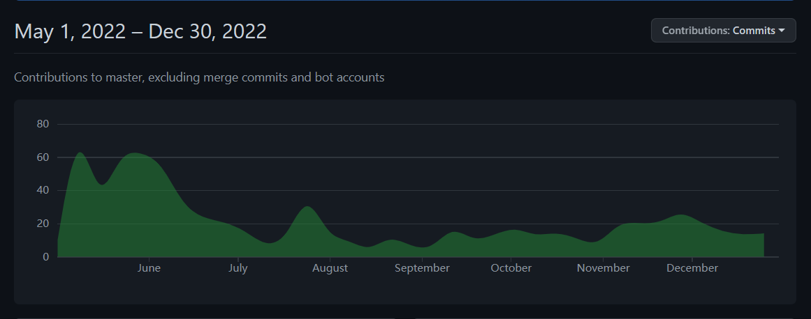

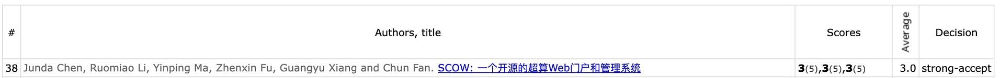

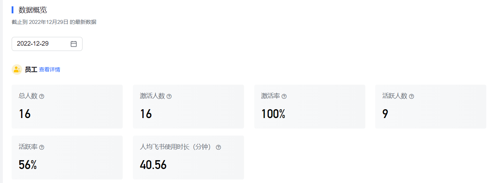

从一个随便写着玩的小程序员到啥都管的“小老板”，带人给了我更大的压力。不同的人有不同的背景、不同的能力、不同的期望。应该把什么样的工作给谁做？我自己应该把事情做到什么程度？我应该提供什么样的支持？什么事情应该他自己思考？怎样高效地沟通？如何我的想法更高效、更准确地告诉其他人，如何让同事更好的告诉我他所想的？如何和一个有数年、甚至数十年工作经验的人合作？这些问题对不同的人都有不同的、且随时都在变化的答案。我的一切行为可能都会影响同事接下来的一段时间如何开展工作，一丁点没有考虑到的细节，一点工作需要的、但是没有写进文档的、而且我也没亲口告诉的知识点都可能让别人浪费数倍的时间。甚至，我连我需要什么样的人这样基础的问题，我都没法给出一个自信的回答。如何作为一个并没有实际工业界经验的小小研究生来说，我只能根据在课堂和网络上看到的以及短时间的实习中体验到的经验依葫芦画瓢，尝试建立一个尽可能高效的团队。目前看来还有很长的路要走。

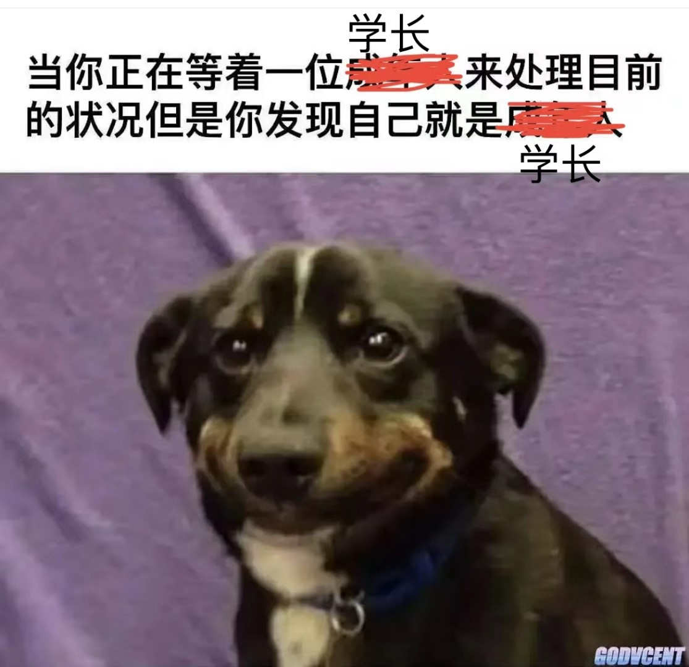

项目本身也有很长的路要走。项目复杂起来之后，CI/CD流水线、自动化测试、文档、协作工具、仓库管理、版本发布，甚至如何保证代码风格的一致性，这些繁琐的事情的重要性越来越高了。代码之外，用户究竟需要什么样的功能，如何让用户部署和使用系统更方便，什么样的需求该做和不该做，项目应该朝什么样的方向发展，虽然最终拍板的不全是我，但是这些问题都需要我的参与和讨论。这些问题都不是确定的问题，也没有一个固定的量化指标，但是对于项目来说，可能比写100个功能点更重要。

我现在才算摸到的真正的工程的冰山一角。我自认为我能够勇敢面对困难，但是这半年来，我经常想逃避，issue打开了就放在那里，随便挑点简单的功能点写写代码，而不去想真正紧急的问题，审PR有时候也粗心大意，出现过好几次有重大问题的bug的PR进了主分支的情况。工作后挑战就更大了，如何平衡工作、生活和项目变得格外重要。什么工作都有难点，我不想坐科研的“冷板凳”，但是也逃不过工程的不确定性和复杂度啊。

# 新的娱乐方式

5月份，北京疫情严重了，进入了准封城状态，而高校当然是封控急先锋。5月份封校了，早期我们住校外宿舍区的连宿舍区都出不去，被迫在万柳这个弹丸之地开发娱乐活动。扔沙包、跳广场舞、甚至放风筝，世界仿佛回到了我甚至还没有出生的80、90年代。

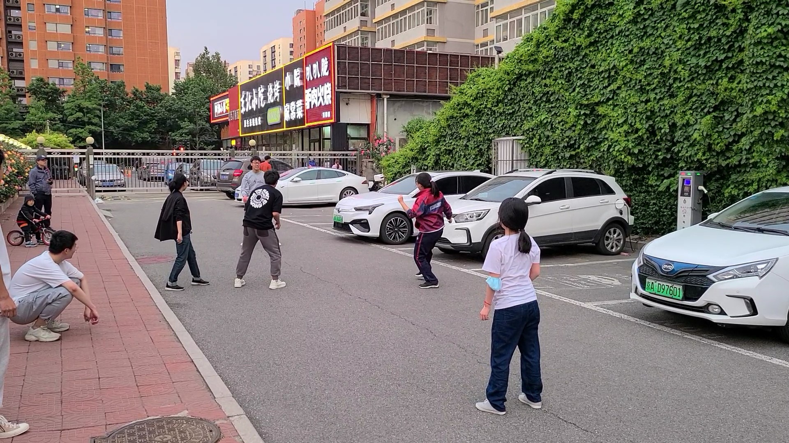

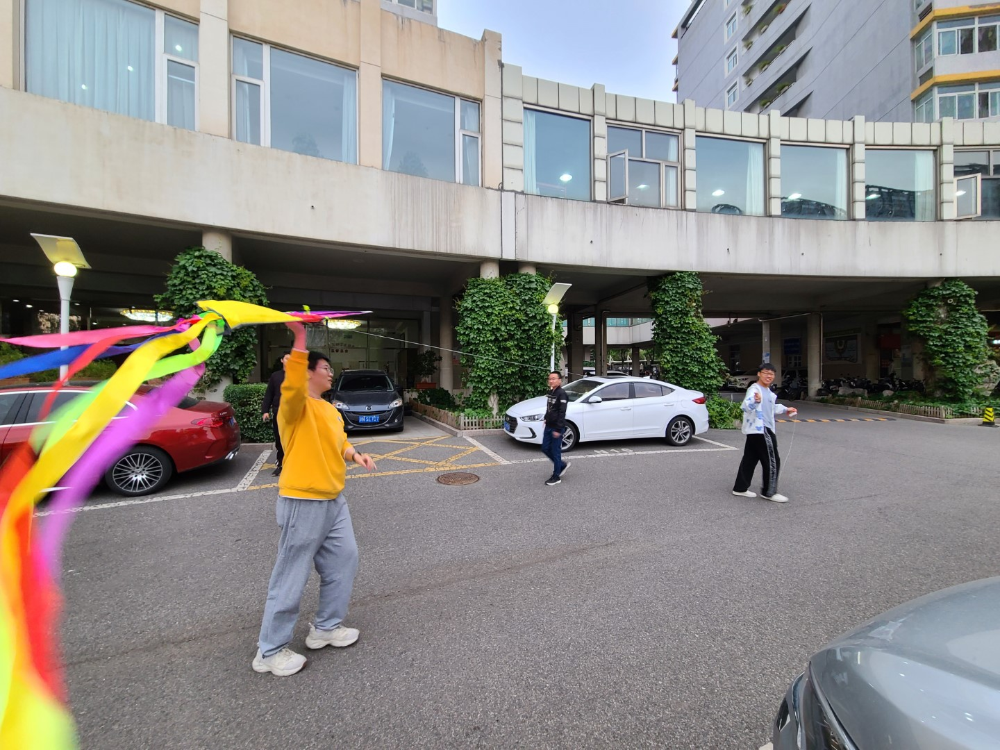

这些室外活动随着学校开通燕园班车以及后续学校解封就消失了，但是室内活动却保留了下来。在工作之余，和朋友们一起吃烧烤、打麻将，还是非常惬意的。

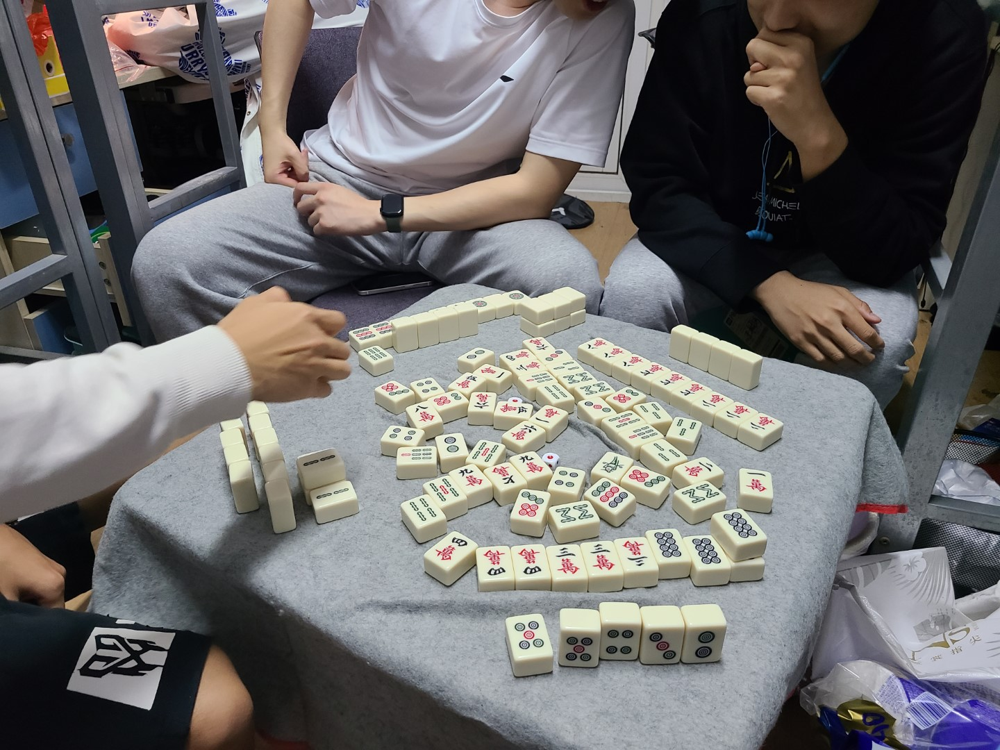

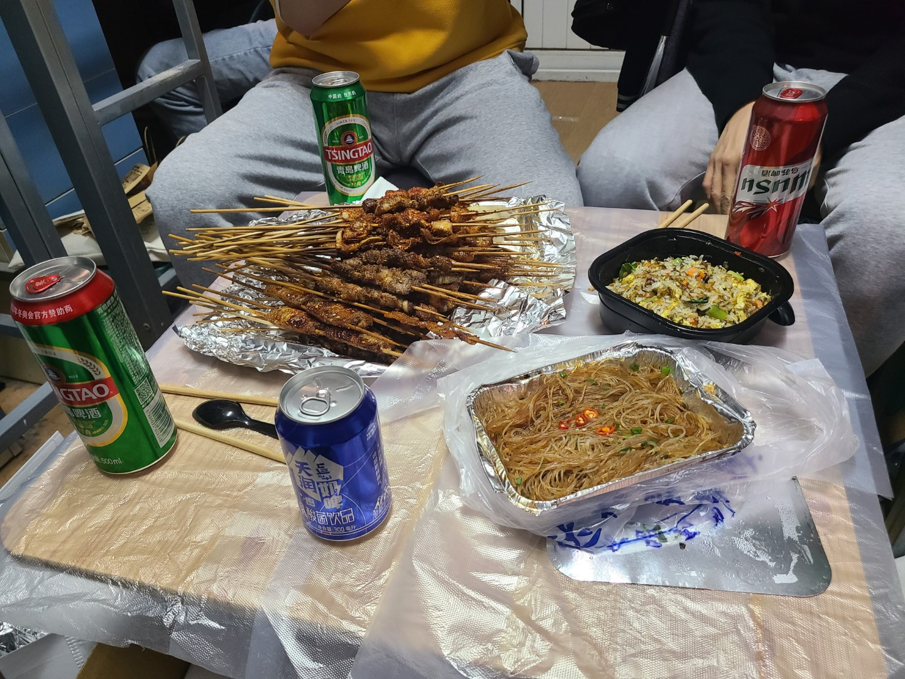

下半年，认识了更多的羽毛球球友，高峰期打球频率甚至提高到了一天2小时。甚至第一次加入了院队，第一次获得了一件有自己名字的队服，第一次和队友参加了几次团体和单项的小比赛。虽然水平很一般，几场比赛都没出线，但是这确实是第一次的体验。我也希望能够在最后一个学期里和同学们多多练球涨球，起码比赛不一轮游一次吧。

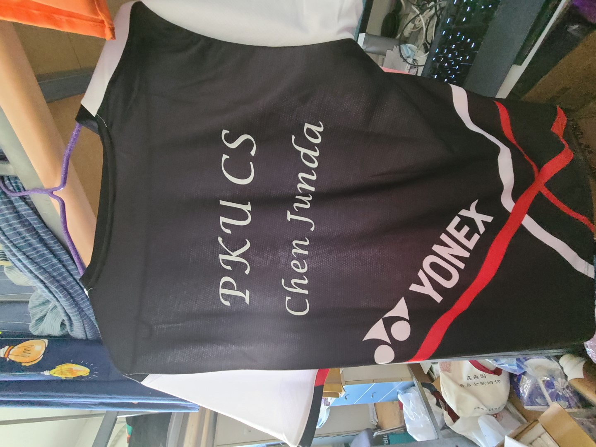

# 最后的比赛和实习

看我的[简历](/resume)就可以知道，我的本科和研究生生活就是用各类项目比赛撑起来的。2021年和本科老搭档参与了一个[AI创新应用大赛](https://www.biendata.xyz/wudao)，本以为已经烂尾，却突然复活并获奖。虽说只是个优胜奖，但是也足够为我这6年的小比赛生涯画上句号了。

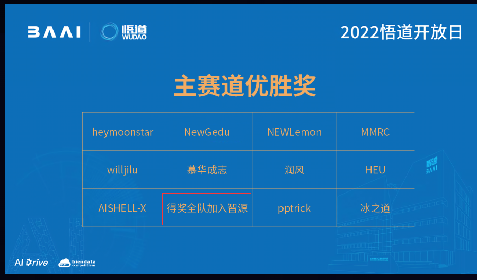

去年末，面试并加入了之前完全没有听说过的alluxio，并在里面第一次体验到了一个外企背景的小技术公司的工作生活状态，并第一次给一个还算出名的开源项目做出了一点不是很简单的贡献([PR](https://github.com/Alluxio/alluxio/pull/15002))。

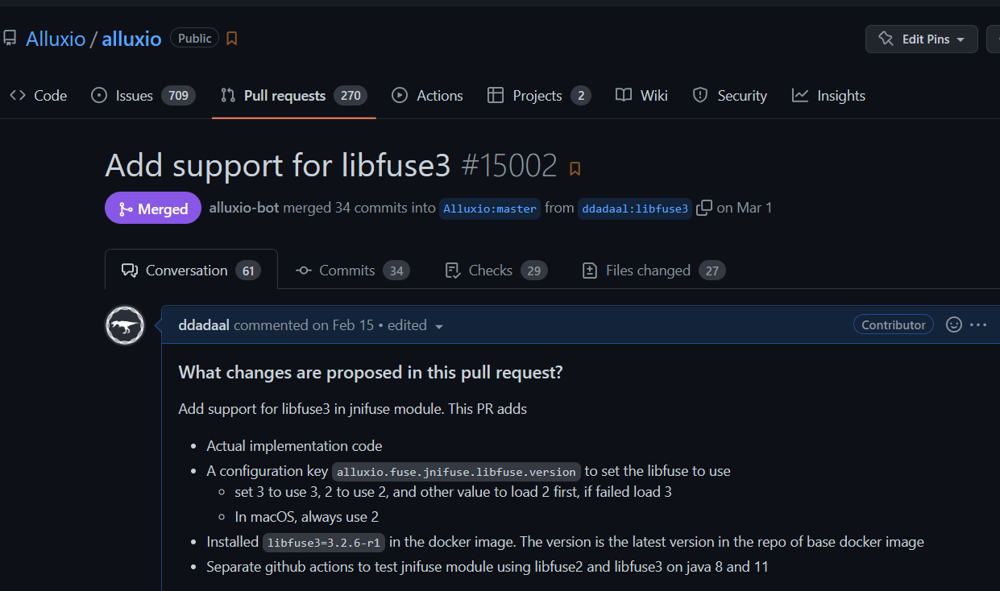

作为一个长期把微软作为第一择业目标的纯粹的微软粉，暑期实习选择了上海的C+AI大组，并在上海数十天的40度的天气、以及此起彼伏的疫情下onsite了整个暑假。这个暑假也是第一次和同学租房（在苏州时租的单人公寓），体验了一把老破小，过了两个月自己买菜做饭的居家生活。体验很不错，但是决定之后再也不租老破小了，高端小区买不起，多花几百块钱租一套体验一下也是很不错的。

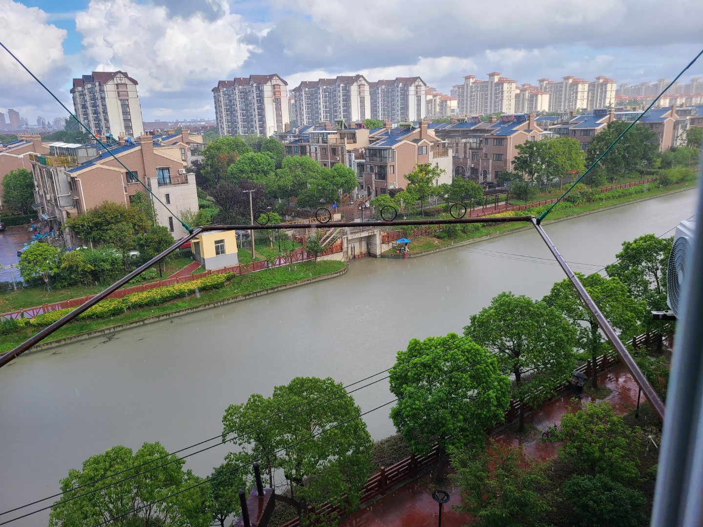

# 回到了原点的职业选择

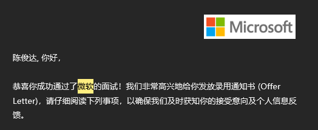

兜兜转转又回到了原点呀。

本科前两年半时，我拿定主意直接工作，却在最后时刻，抱着想看看有没有新的机会的想法，极限转弯踏入了研究生的大门。而研究生的前两年的体验让我认识到高校做工程不靠谱，回去看业界的机会时，发现实验室做的工作不能让我踏入一个所谓更“高阶”的工作，我能投向的业界工作和读本科时基本没有区别。后来，当我意识到，当前国内大环境下体制内的技术工作也并非一无是处，想把握北大应届毕业生这个机会了解一下体制内的机会，但却错过了这个时间窗口，最后仍然投向了微软，和三年前的唯一的区别也就是大组（C+AI vs STCA）和工作地点（苏州 vs 上海）的区别了。

说遗憾肯定是有点遗憾的，毕业时选择工作可能是最重要的人生选择。有些地方毕业时不进，之后就再也不进去了。而很多人都向往的北大学历最后在找工作方面并没有发挥什么用处。但是这几年让我认识到，人是会变的，现在的想法只能代表现在，不能代表未来。甚至有几个被项目的事情困扰的晚上，我还在认真考虑现在去科研是不是还来得及。考虑了这么多，最后只会发现，一切都是有好有坏。在微软，起码短期内实现Work Life Balance、收入还可以的“小目标”实现起来还是比较简单的，而且还能接触到先进的软件产品和软件项目管理方式。虽然世界大环境对外企不利，但是世界变换得太快了，几年后的日子谁又能预测得到呢？

虽然终点一样，但是心态不一样了。在体制外，没有各种各样的限制，没人管的另一面就是自己为自己负责。这三年大环境的变化让我意识到，和体制内不同，公司是要赚钱的，我们和公司只是合作关系。发展得好，一起吃肉；发展得不好，分道扬镳。换公司（无论是自愿的还是非自愿的）对任何人来说几乎是肯定的事情。一定会发生的事情也没什么需要担忧的，需要做的只是为它做准备。公司的目标是为客户提供服务赚钱，那我们也得想办法增加**自己作为个人（而不是作为公司的一员）对他人、对社会的价值**。目前来看，实验室的项目似乎迈入了一个正确的轨道，采用的客户越多，越能体现我的价值。如果它真能发展起来，那对我个人的发展来说是一个大大的加分项。

# 迎接未知的新生活

这一年像是2019年的重演。升到毕业年级；暑假去外地微软实习；纠结了几个月后强势转向，2019年从就业选择了保研，2022年，从偏向体制内选择了上海微软。甚至直到疫情防控放开前，我还在担心明年会不会又像2020年一样，无法返校过最后一个学期。

但是有一点不同：**现在，无论愿不愿意，都得迎接新生活了**。

高中时，所有精力都放在高考，“一分一千人”，似乎一切事情高考完就结束了；大学时，毕业就是一个看得见的里程碑，想工作的同学去实习，想科研的同学去科研，大家都为即将到来的新的生活而努力。而现在毕业了，工作了，没有看得到的终点了，反倒之前以学业为理由不想考虑的事情一下子都变得重要了起来，之前遇到了可以找家长、找老师、找学校帮忙的事情现在必须得自己花精力处理。大到找对象、结婚、买房、下一代、升职加薪、照顾父母，小到租房、做饭、做家务等日常琐事，都变成了一个一个无法逃避的事情。同时，现在朝夕相处的同学们也会有自己的生活，绝大多数时间都需要自己想办法度过。

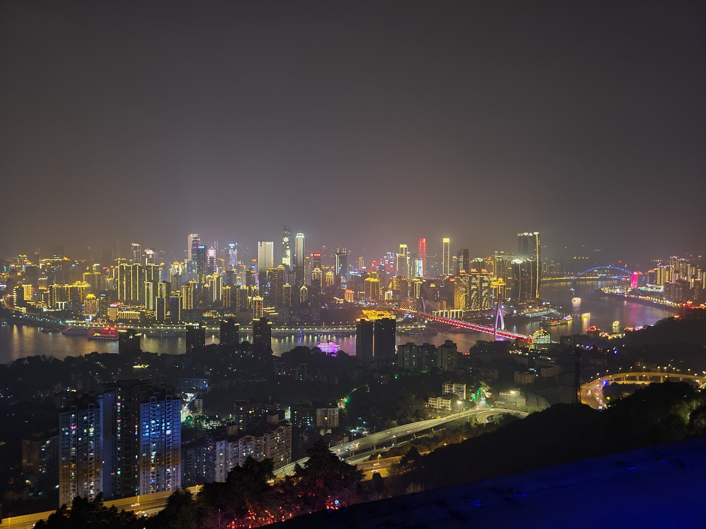

站在校园生活的末尾才发现，即将挥手告别的生活可能是最简单、最单纯的生活，即将离开的地方将会是之后永远的回忆。

转折点之后，我们将迎来未知的新生活。新生活下，每个人都是自己生活的第一责任人。

