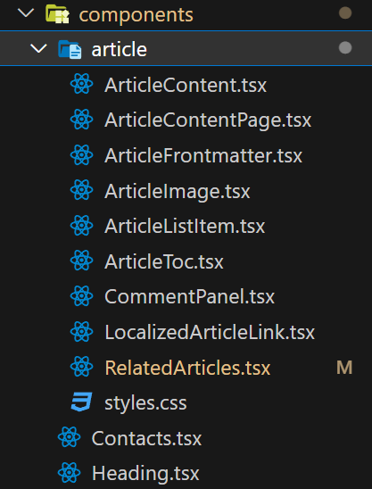
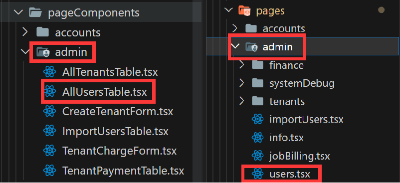
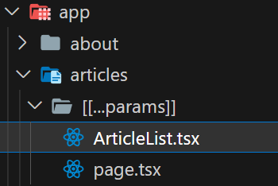
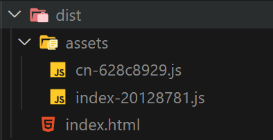
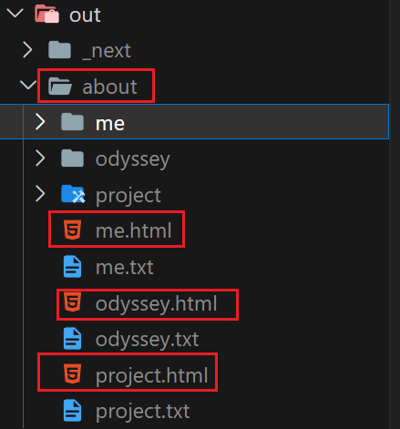
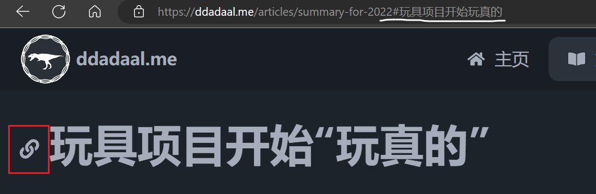
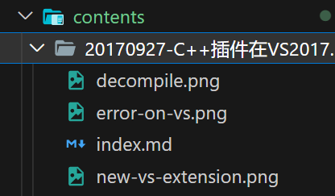
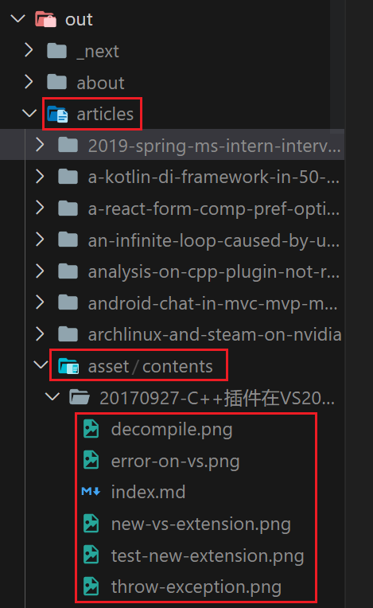
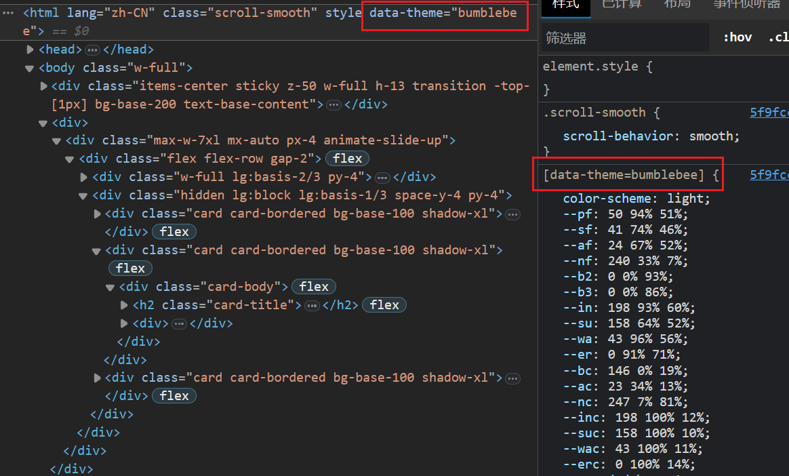

# 鸽了4年的更新

4年前的[博客的发展1](/articles/blog-updates-1)中，我提到了当时博客的几个问题。后来，我通过一个非常hack的方式解决了中文字数统计的问题（[修复gatsby-transformer-remark插件中文词数统计错误问题](/articles/fix-gatsby-transformer-remark-chinese-word-count)，但是最重要的**重构样式和完善UI设计**的问题一直搁置，并且随着时间和技术的发展，项目也遇到了不少的问题，例如

1. 样式的混乱使得我一直使用老的bootstrap v4版本，无法升级到最新的bootstrap版本
2. gatsby生态更新太快，很多组件我无法理解它们具体做了什么工作

5月底研究生答辩完后，本来计划好的旅行，在我出发的前一天被我二阳直接推迟了。阳了后基本上也就只能在宿舍呆着。呆着也是呆着，我想起来博客这个”我的门面“。这三年博客本身基本没有任何更新，基本属于年久失修的状态。于是我决定给我的博客来个大手术。

# 新博客的亮点

- 完全使用Next.js编写

由于研究生期间的项目（[PKUHPC/SCOW](https://github.com/PKUHPC/SCOW)）是完全使用Next.js编写的，我对Next.js非常熟悉。而Next.js本身也是一个非常成熟的React框架，并且也支持[导出为静态网站](https://nextjs.org/docs/app/building-your-application/deploying/static-exports)的功能，并且有很多网站均使用了Next.js来作为它们的主页、博客等信息发布平台，所以我在想是否能重用之前的经验，用Next.js来搭建新的网站。一顿操作下来，除了遇到了一些和Gatsby的思路不太一样的地方，整个体验还是挺不错的。

- 完全兼容原有博客

新的网站和原有博客在功能性、整体布局以及各个页面的URL方面都完全一致，原有的所有使用习惯和URL都可以直接使用，原来的所有功能现在都仍然支持，包括但不限于多语言页面、多语言文章、RSS等。这才是**重写**的真正含义吧：所有代码都完全重写了，但是不会影响任何已有的使用体验。

- 使用Tailwind编写样式，去除CSS in JS方案

这是本次重写最重要的地方。我原来是CSS in JS的狂热爱好者，认为使用JS编写网站的所有方便是网页开发的最终目标。现在，我虽然仍然认为CSS in JS方案带来的灵活性是所有其他方案都不可比拟的，但是我也认识到很多情况下样式并不需要那么高的灵活性。另外，由于样式最终还是要到达CSS的层次，在把CSS in JS和其他第三方样式解决方案（例如之前用的bootstrap）集成的过程中，需要大量代码来将两套完全独立的样式系统整合起来。这也是之前样式代码极度混乱的根本原因。

例如，原来代码中的导航栏组件同时使用了bootstrap的`Navbar`组件，并通过styled-components在这个组件的基础上自定义了样式。在自定义样式时，还引用了TS中定义的样式变量。有的组件甚至为了使用bootstrap的定义在`SCSS`中的变量，故还引用了自定义的SCSS文件。而由于有的变量是定义在SCSS中，有的是在TS代码中的，所有很多变量（例如颜色）都需要定义两次。

```ts caption="原来的标题栏实现部分代码"
import { Navbar } from "reactstrap";

const StyledNavbar = styled(Navbar)`
  && {
    max-width: ${widths.mainContent}px;
    margin-left: auto;
    margin-right: auto;
    padding: 4px 8px;

    transition: width 0.2s ease-in-out;
  }
`;
```

另外，我也认识到以传统HTML/CSS来布局和样式的一些优势，例如将UI与具体的开发框架解耦、更好的性能、以及甚至能在不启用JS的环境下展示页面等。当前，以[tailwind](https://tailwindcss.com/)为主的以传统的HTML/CSS为基础的样式方案非常火，这次我也直接采用tailwind以及基于tailwind的纯HTML/CSS组件库[daisyui](https://daisyui.com/)来编写新的博客，并体验到了前所未有的开发效率和开发体验。直接写语义化的类型名，确实比写JS代码要方便太多了。


# 实现

## 完全采用Next.js App Router

Next.js的[App Router](https://nextjs.org/docs/app)功能可谓是万众期待，虽说有评论说这个功能（以及后续的Server Actions）把Next.js[变成了PHP](https://www.youtube.com/watch?v=10Yt5vRimNI)，但是不可否认的是，App Router极大地提高了开发体验和灵活度。

在新的博客中，App Router带来的各种优势里，让我最受用的是以下两点：

- React Server Component （RSC，服务器端组件）

React Server Component (RSC)实际上是React的概念，在2020年就提出来了（[Introducing Zero-Bundle-Size React Server Components - React Blog](https://legacy.reactjs.org/blog/2020/12/21/data-fetching-with-react-server-components.html)）。简单来说，原来的React的组件都是运行在客户端的。浏览器首先把项目代码下载下来，然后再浏览器中运行代码，这些代码将会通过浏览器端DOM API在浏览器上画出UI，并处理用户的交互。而React Server Component允许用户编写**运行在服务器端的**React组件。而Next.js 13第一次实现了这一概念。

这颠覆了传统的前端开发模式。代码在服务器端运行的，这就意味着组件可以直接执行在服务器端才能执行的代码，例如访问数据库等，而不再需要单独的一套API来实现客户端和服务器端之间的交互。

在新的博客中，所有博客的内容都是以本地文件的方式存放在`contents`目录下。所有的页面会去读取自己所需要的数据，之后将这些数据渲染出来。

假设我们的网页不是一个静态网站，而是一个传统的React+后端的模式，那要实现这个功能，我们首先需要设计一个API来获取后端的数据，在后端，我们编写一个服务器实现这个API，然后在前端，我们通过`fetch`调用这个API，拿到数据后在UI上渲染出来。

```ts caption="后端"
// 后端，编写API
const app = express();

app.get("/articles/:id", async (req, res) => {
  const content = await readContent(req.params.id);

  res.send(content);
});

app.listen(5000, () => {});
```

```tsx caption="前端"
// 前端，通过fetch API获取数据
export const Page = ({ id }) => {
  const [data, setData] = useState();

  useEffect(() => {
    fetch("http://localhost:5000/articles/" + id)
      .then((x) => x.json())
      .then((x) => setData(x));
  }, []);

  return data ? (
    <ArticleContent data={data}/>
  ) : <Loading />;
```

然后通过RSC，我们可以直接使用React来实现这个需求：

```tsx
export default async ({ params }: Props) => {

  const data = await readContent(params.id);

  return (
    <ArticleContent data={data} />
  );
};
```

这区别实在太大了。不再需要一个单独的后端项目，不再需要复杂的API设计、管理、调用、维护，从获取数据到渲染UI的过程非常直观。甚至说如果这个`ArticleContent`组件不需要用户交互的话，用户甚至不需要下载这个组件的代码，浏览器不启用JS就能访问网页。

从某种角度来说，App Router确实是把React变成了PHP这类传统的服务器端渲染的方案。但是，毕竟Web前端是JS的世界，PHP等不能直接使用后端语言编写前端的交互逻辑，只能做一些简单的模板替换的功能，一旦涉及一些复杂的逻辑和交互，就不能不重新使用JS，而这就要求两套不同的语言，两套不同的工具链以及两套不同的生态，以及前后端之间的交互。而Next.js是以前端为基础，用一种非常自然的方式将前后端融合在一起，用同一套生态编写从前端交互到后端逻辑整个链条，实际上是一套和传统完全不一样的方案。


- [Colocation](https://nextjs.org/docs/app/building-your-application/routing/colocation#safe-colocation-by-default)，即**把相似用处的文件放在相近的位置**。

在原来的`pages`目录下，每个文件定义了一个页面。例如`/pages/test.tsx`和`/pages/test/test2.tsx`就分别对应`/test`和`/test/test2`两个路径。但是，在绝大多数情况下，一个页面中的代码都不能在一个代码中完全写完。对于一些公用的组件，例如布局的header, footer等，我们可以把这些代码放在类似`layouts`、`components`的目录下，这些组件不涉及任何业务逻辑，可由具体的业务页面引用并组装。



但是还有一些组件，它只在某个特定的页面下有用，例如为了完成某个特定的业务逻辑的组件。这种组件一般来说又是过于复杂，不能把它直接写在页面文件中，但是如果把这些组件直接放在页面组件文件的旁边，那么它们会被当成一个新的页面。

由于在原来的事件中，我会创建一个`pageComponents`目录用于存放这种位于真正的基础组件（`components`）和页面（`pages`）之间的组件。例如在下图中，`pageComponents/admin/AllUsersTable.tsx`就是一个比较复杂的、涉及到业务的组件，它只会在`pages/admin/users.tsx`中被使用。



除了这一方案，我也看到了一些项目采用的是和`Angular`类似的`Module`概念，把某个功能相关的代码都放在一个`modules/模块名`目录下，然后在`pages`目录下引用模块下的页面组件。

但是不管是什么方案，实际上都是在为**一个文件=一个路径**这一概念打补丁。这一概念看着很美好，但是只要项目复杂度稍微高一点就会遇到上述的问题。同一个功能，有的代码在`pages`下，有的在`pageComponents`下，这会使得文件非常混乱。

而`App Router`解决了这一个问题。在`App Router`下，路径由目录（而文件）定义。每个目录下，只有一些特殊的文件会被Next.js处理（例如`page.tsx`为这个页面的组件，`layout.tsx`为这个路径下的公共布局，其他文件Next.js直接忽略，都由自己组织。这就使得我们可以把一个页面所需要的组件拆分出来，放在和页面相同的目录下。

例如在现在的项目中，`app/articles/[[...params]]`包括了文章列表页面的定义，其中就需要一个文件列表页面的布局的组件`ArticleList`。这个组件很明显需要被拆分出来。在原来的实践中，这种组件就应该被放在`pageComponents`或者`components`里。但是这个组件实际上只会在这个路径下被使用，所以使用`App Router`后，我们就可以把这个组件放在这个页面的文件（`page.tsx`）的旁边。这样，我们保证了所有这个页面相关的业务逻辑（公共组件不包含业务逻辑）都存放在这个路径下，这对代码后续维护、多人合作开发等方面都有非常多的好处。



App Router所带来的优点远不止这两点。由于本博客是个静态的博客，且整体布局较为简单，所以并没有用上使用Next.js的动态功能，但是在我其他的项目中，App Router的**嵌套布局**（[Nested Layout](https://nextjs.org/docs/app/building-your-application/routing/pages-and-layouts#nesting-layouts)）、Server Actions带来的**直接在前端代码中调用后端逻辑的能力**都极大地提高了网站开发的效率。

## Next.js静态生成

### 静态网站

我之前使用Next.js的项目都是传统的前端应用，也就是编译为前端+一个提供服务器端渲染（SSR）能力的Express后端的传统的Next.js项目。但是Next.js一直还支持直接生成只包括HTML/CSS/JS的静态网站的能力。

传统的单页应用（SPA）会把整个应用编译为一个（或者多个）JS bundle以及一个实际上并不包含真正UI的模板HTML。用户访问任何路径时，都会下载这个HTML。这个HTML的唯一作用就是提供一个根DOM组件以及引用编译好的JS Bundle。JS Bundle将会被自动下载，通过浏览器的History API在浏览器端实现路由功能，并负责通过DOM API渲染用户的UI。



而Next.js生成的静态网站和Gatsby, Hugo等静态网站生成器相同，会在编译时对每个路径获取这个路径所需要的数据，并将这些数据渲染成HTML。渲染出的结果中，每个路径都有对应的HTML。比如在下图中，`about/me.html`就对应了`/about/me`路径，并且其中包含了在服务器端渲染后的UI。用户访问路径时，会直接获取这个HTML，并直接就能渲染出已经渲染好的内容，无需等待下载和执行JS Bundle的过程。



### 和Gatsby的区别

在我上次重写ddadaal.me时，我选用了Gatsby，因为当时Gatsby的生态更加的成熟，有大量现成的模板、插件和教程可供使用和参考。几年后的现在，Next.js的静态生成功能也是非常成熟了，并也提供了很多的API来实现静态网站渲染的功能。但是和Gatsby项目，Next.js提供静态网站渲染的API的思路有所不同。

Gatsby主要通过`GraphQL`让开发者访问数据([Gatsby and GraphQL](https://www.gatsbyjs.com/docs/graphql/))。开发者在页面中可以声明这个页面所需要的数据的GraphQL查询，并在页面中通过props访问读取到的数据以及渲染UI。在编译时，gatsby将会负责运行这些查询，并将数据传递给需要数据的组件。而可以访问到的数据，则可以通过插件或者自定义`gatsby-node.ts`脚本来向后端的GraphQL服务器中增加数据节点。

```ts
// https://github.com/ddadaal/ddadaal.me/blob/57fe926eb0/src/pages/slides.tsx
// 声明需要的数据
export const query = graphql`
  query Slides {
    allSlide(filter: {type: { eq: "dir" }}) {
      nodes {
        name
        html_url
        type
      }
    }
  }
`;

interface Props {
  data: {
    allSlide: {
      nodes: { name: string; html_url: string }[];
    };
  };
}

const Slides: React.FC<Props> = (props) => {
  // 通过Props读取获取到的数据
  const { data: { allSlide: { nodes } } } = props;

  // 使用这些数据渲染UI
};
```

当然，要想更灵活地访问数据和创建页面，开发者还可以通过`gatsby-node.ts`编写编译时在node端执行的脚本。这个脚本是在编译器在Node.js中运行的，故可以访问任何本地数据。Gatsby还提供了大量[Gatsby Node API](https://www.gatsbyjs.com/docs/reference/config-files/gatsby-node/)来帮助用户创建页面、GraphQL数据等。

```js
createPage({
  // 生成页面的路径
  path: "/articles/" + pageIndex,
  // 页面所对应的React组件
  component: indexTemplate,
  // 组件所需要的数据
  context: {
    limit: pageSize,
    skip: pageIndex * pageSize,
    pageCount,
    pageIndex: pageIndex,
    ids: notIgnoredGroups
      .slice(pageIndex * pageSize, pageIndex * pageSize + pageSize)
      .map((x) => x.frontmatter.id),
  },
});
```

总的来说，Gatsby通过GraphQL和Gatsby Node API将**UI**和**数据**完全隔离开来。用户定义各个页面所需要的数据类型，一方面编写脚本或者插件将各类数据源转换为GraphQL等页面需要的数据，另一方面编写React代码将这些数据渲染成UI。

而在当前使用App Router的Next.js项目中，获取数据以及渲染页面的方法有所不同。Next.js的路由一直是基于文件路径的，没有类似`Gatsby Node API`的API以及`gatsby-node.ts`的脚本可以用来手动创建各个页面。取而代之的，是

- 通过文件路径定义路径
- 通过`generateStaticParams`函数获取所有可能的路径参数
- 通过RSC同时实现数据获取和渲染

例如说，我的博客中`/about`路径下包含了`/about/me`、`/about/odyssey`和`/about/project`三个路径，分别对应3篇文章。要实现`/about`路径，我需要

- 定义`app/about/[id]`目录
- 在`generateStaticParams`中，返回`id`参数的所有可能值`["me", "odyssey", "project"]{:ts}`
- 在`app/about/[id]/page.tsx`（实际上不是这个路径）中，定义一个RSC，获取到路径的ID的参数，之后获取到对应的文章内容，并同时根据文件内容渲染出UI

可以看出，通过Next.js，我们不再需要GraphQL将数据和页面分割开来，而可以直接使用RSC同时完成读取数据和渲染UI的功能。通过`generateStaticParams`列举了所有可能的路径，然后对每个路径渲染它对应的RSC，生成了每个路径的页面，从而编译出了整个网页。


## 自定义的markdown渲染流程

在之前使用Gatsby时，我直接使用了一些现成的gatsby插件（如[`gatsby-plugin-remark`](https://www.gatsbyjs.com/plugins/gatsby-transformer-remark/)）来帮助我完成把markdown渲染成HTML的过程，故我对markdown渲染的流程几乎没有了解。但是在Next.js中没有这些插件了，所以我就需要自己去学习markdown渲染的知识，并自己完成markdown渲染的工作。

当前，项目中是使用`remark`和`rehype`生态实现markdown的渲染的。[`remark`](https://github.com/remarkjs/remark)是一套把分析并转换markdown的生态，包含由大量插件。它可以分析markdown文件并将其转换为AST，并支持通过各类插件对这个AST进行分析和转换。而[`rehype`](https://github.com/rehypejs/rehype)类似`remark`，只不过`rehype`是针对HTML的。整个渲染流程可以通过[`unifiedjs`](https://unifiedjs.com/)连接起来。

现在，博客在渲染markdown时，经历了以下的步骤：

- [remark-parse](https://www.npmjs.com/package/remark-parse): 把markdown转换为remark AST
- [remark-gfm](https://www.npmjs.com/package/remark-gfm): 以GitHub Flavored Markdown格式解析AST
- [remark-rehype](https://www.npmjs.com/package/remark-rehype): 将remark AST转换为rehype AST
- [rehype-raw](https://www.npmjs.com/package/rehype-raw): 使markdown中的裸HTML标签最后能正常显示
- [rehype-slug](https://github.com/rehypejs/rehype-slug): 给各个标题标签加上对应的id
- [@stefanprobst/rehype-extract-toc](https://www.npmjs.com/package/@stefanprobst/rehype-extract-toc): 分析HTML中的各个标题标签，并生成对应的树状结构
- [rehype-react](https://github.com/rehypejs/rehype-react): 根据rehype AST生成对应的React组件树
- [rehype-pretty-code](https://rehype-pretty-code.netlify.app/): 美化代码风格，增加代码高亮等

了解了markdown的渲染过程给我带来了几个好处：

第一，我可以自己自定义渲染的流程了

之前，对于一些已有插件不支持的功能，我是通过一些比较hack的方式完成的。例如文章的Table of Contents，我是通过在渲染后通过DOM API分析页面中各个`h1/h2/h3`等元素来动态生成的。而现在，我可以自己去寻找可以解析TOC的插件（@stefanprobst/rehype-extract-toc），并将它插入到渲染的流程中，并在最后得到结果并自己完成渲染的过程。又比如，我想给渲染出的标题的前面增加一个图标，点击这个图标就获取到跳转到这个标题的URL。通过`rehype-react`，我可以很简单的实现这一点。

```tsx title="src/components/article/ArticleContent.tsx"
.use(rehypeReact, {
  // ...
  components: {
    // ...
    // 使用自定义的React组件渲染h1/h2/h3组件
    h1: ((props) => <HeadingWithLink element="h1" props={props} />) satisfies
      ComponentType<JSX.IntrinsicElements["h1"]>,
    h2: ((props) => <HeadingWithLink element="h2" props={props} />) satisfies
      ComponentType<JSX.IntrinsicElements["h2"]>,
    h3: ((props) => <HeadingWithLink element="h3" props={props} />) satisfies
      ComponentType<JSX.IntrinsicElements["h3"]>,
  },
})
```



第二，我可以完全自己控制RSS的渲染过程了

之前我采用的是[`gatsby-plugin-feed`](https://github.com/gatsbyjs/gatsby/tree/master/packages/gatsby-plugin-feed)插件，通过定义GraphQL以及一些自定义的参数来生成RSS流。由于当时无法控制markdown的渲染结果，所以在生成RSS的时候感觉非常不自然。另外这个插件还不支持在开发时运行，所以我在开发时不能测试RSS的编译结果。现在，我可以自己创建一个`app/rss.xml/route.ts`的Route Handler，并和渲染文章页面一样，手动创建RSS的信息，以及各篇文章在RSS中的渲染结果。

## 静态生成图片

在编写整个网站的过程中，最大的挑战是**如何生成博客内容所需要的图片**。

在所有能查找到的使用Next.js编写博客网站的文章和项目中（如[Next.js官方blog-starter模板](https://github.com/vercel/next.js/tree/canary/examples/blog-starter)），都是通过[`public`目录](https://nextjs.org/docs/pages/building-your-application/optimizing/static-assets)来引用图片等静态文件的。在编译时，`public`目录下的文件将会直接复制到构建目录下，在部署后，这些文件将可以直接通过`/`访问。

但是这并不能满足我的需求。因为我的博客中，博客文章和图片都是放在`contents`下的同一个目录下的。而`contents`目录不能被公开访问。



```md
<!-- 在Markdown中通过和md文件的相对路径访问 -->

```

一个简单粗暴的解决方案是编写一个脚本，在编译后把所有静态文件从`contents`复制到`public`下，并在编译markdown时，修改所有的图片路径到编译后的路径中。但是这个做法也太不优雅了，有没有什么更好的、不需要自定义编译流程的方案呢？

答案是[Route Handler](https://nextjs.org/docs/app/building-your-application/routing/router-handlers)。

Route Handler可以使开发者对某个路径编写自定义的处理逻辑。通过Route Handler，我可以定义一个专门用于获取静态文件的路径。我定义了一个`/articles/asset/[...path]`的route handler，当使用`GET`方法访问这个路径的时，handler将会去读取这个路径的对应的文件的内容，并以流的形式返回。Route handler同样支持`generateStaticParams`。通过这个方法，我遍历`contents`下的所有静态文件。这样，在编译时，Next.js将会把`contents`下所有文件的路径都传入这个Route Handler并运行，并将handler的结果（也就是文件内容）存放在`/articles/asset/contents/{文件相对于contents的路径}`下，发布后可以通过`/articles/asset/contents/{相对路径}`这个URL访问到图片。

```ts title="src/asset/[...path]/route.ts"
export async function GET(request: NextRequest, { params }: { params: { path: string[] }}) {
  const fullPath = params.path.join("/");

  const fileStat = await stat(fullPath);

  // 读取文件流并返回
  const stream = createReadStream(fullPath);

  // @ts-ignore
  return new NextResponse(Readable.toWeb(stream), {
    headers: {
      "Content-Type": lookup(fullPath) ?? "application/octet-stream",
      "Content-Length": fileStat.size,
    },
  });
}

export async function generateStaticParams() {

  // 遍历所有路径
  const paths: { path: string[] }[] = [];

  async function rec(dir: string[]) {
    const dirents = await readdir(dir.join("/"), { withFileTypes: true });

    for (const dirent of dirents) {
      if (dirent.isDirectory()) {
        await rec(dir.concat(dirent.name));
        continue;
      }

      paths.push({ path: dir.concat(dirent.name) });
    }
  }

  await rec(["contents"]);
  return paths;
}
```



现在图片有了，下一步是将markdown中对图片的引用地址修改到真实的编译后的地址。这实际上很简单，通过`rehype-react`将HTML的``使用自己的组件渲染，然后在自己的组件中把`src`属性修改为真正的图片路径即可。

```tsx title="src/components/article/ArticleContent.tsx"
.use(rehypeReact, {
  // ..
  components: {
    // 使用自己的Image组件渲染HTML中的
    img: ((props) => <ArticleImageServer article={article} props={props} />) satisfies
      ComponentType<JSX.IntrinsicElements["img"]>,
```

我们使用了Next.js自带的`<Image>`组件来显示图片（在`ArticleImage`中）。这个组件有很多友好的功能，例如通过指定图片大小防止Layout Shift，在支持的环境下支持先加载更小的图片以更快的显示界面等。通过把`<Image>`和自定义的markdown流程相结合，我们就实现了显示图片的需求。

## 多主题

本次更新在样式方面最大的可见的更新就是支持了**多主题**。目前网站已经开放了12个主题可供选择，当然，我的美学能力远远不够自己设计这么多的主题，所有主题都是由[daisyui提供的](https://daisyui.com/docs/themes/)。

daisyui首先定义了一些固定的[颜色变量](https://daisyui.com/docs/colors/#-2)，这样在编码时，所有元素的颜色都可以通过颜色变量，而不是写死的颜色值，来指定。例如下面的代码就指定了一个背景颜色为`base-200`、文本颜色为`text-content`的`ul`组件。

```tsx
<ul className="bg-base-200 text-base-content">
</ul>
```

之后，daisyui通过识别`<html>`组件的`data-theme`数据属性来获取到当前用户所选择的主题，并通过CSS选择器将对应的颜色的CSS变量修改为对应的主题的对应颜色变量的值。要想切换主题，只需要修改`<html>`组件的`data-theme`数据属性即可。



由于各个主题的颜色风格大相径庭，我原来博客的代码背景就不可以使用了。新的主页背景必须得能够自适应完全不同的颜色风格。要想实现这一点，新的背景必须是使用CSS动态生成的。

于是我在网上找到了一个[绝妙的网站](https://alvarotrigo.com/blog/animated-backgrounds-css)，这个页面中提供了数十种纯用CSS实现的背景动画。我选中了其中的第三个Floating Squares。这个动画的背景色、以及各个方块的颜色都是由CSS的定义的，我需要做的，就是把其中的基础颜色替换为当前所使用的主题的CSS变量，这样，新的背景就能自动和当前所使用的主题相匹配了。

```css {2,12}
.area {
  /* 使用daisyui的颜色变量 */
  background: linear-gradient(to bottom, hsl(var(--p)), hsl(var(--pf)));
  width: 100%;
  height: 100vh;
}

.circles li {
  position: absolute;
  display: block;
  list-style: none;
  width: 20px;
  height: 20px;
  /* 使用daisyui的颜色变量 */
  background: hsl(var(--a));
  animation: animate 25s linear infinite;
  bottom: -150px;
}
```

# 总结

本来我一开始并没有打算完全重写整个项目，而是打算在已有的代码上做一些小修小补。但是当我真的打开了代码开始准备修改时，就发现了原来的代码中各个组件之间的依赖像是形成了蜘蛛网一样，完全无法下手。随便改任何一处已有的代码，都会涉及到巨量的其他代码，可谓牵一发而动全身。想起来2018年开始写Gatsby的ddadaal.me的时候，一大驱动力就是原有的屎山实在无法维护了。而5年后，当年的新代码变成了新的屎山，而被更新的代码取代之。果然，和世间其他万物一样，技术在发展，代码也是常用常新，需要不停地跟上时代的步伐。重写后的博客功能和以往一致，但是更轻、更快、更易维护，也算是一次成功的重构实践。


