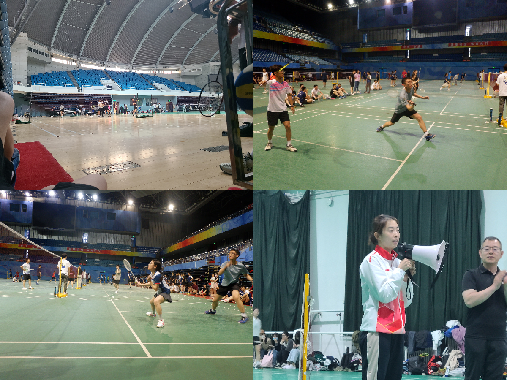
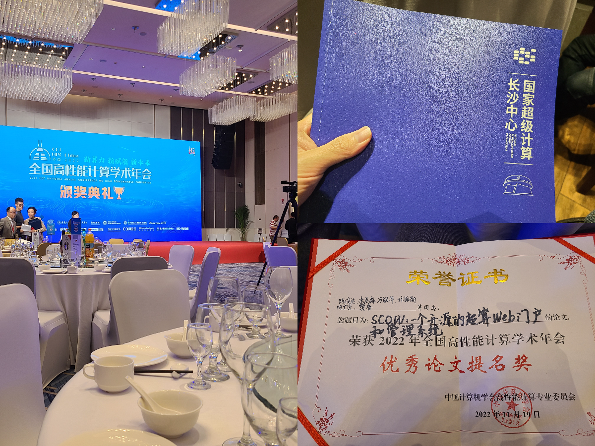
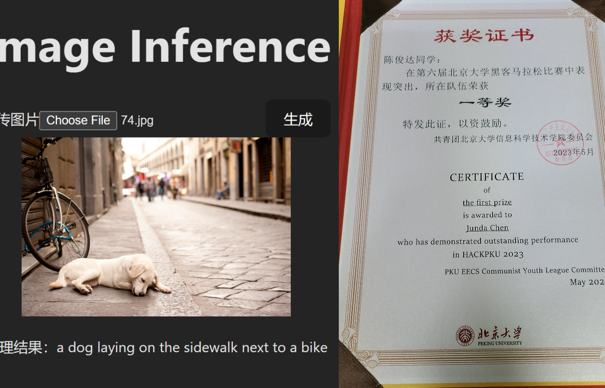
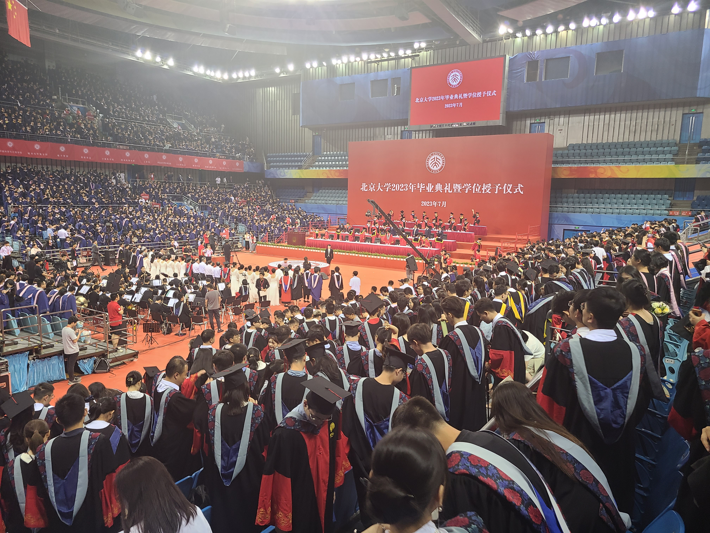
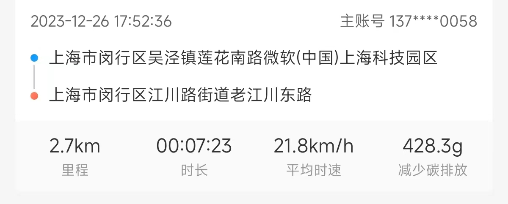
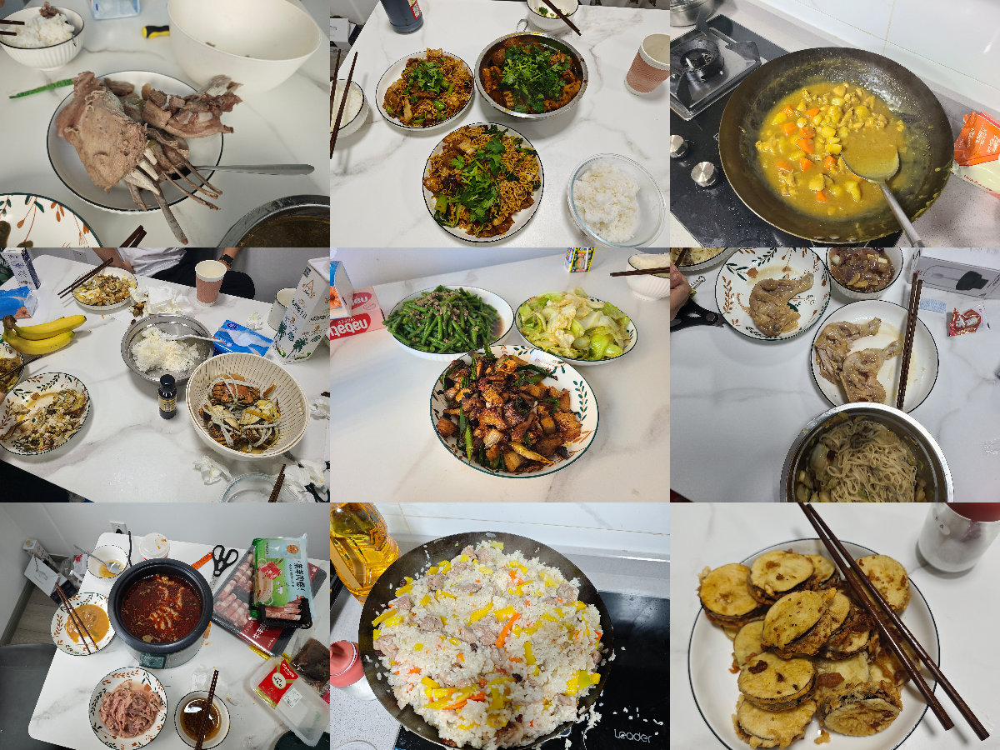
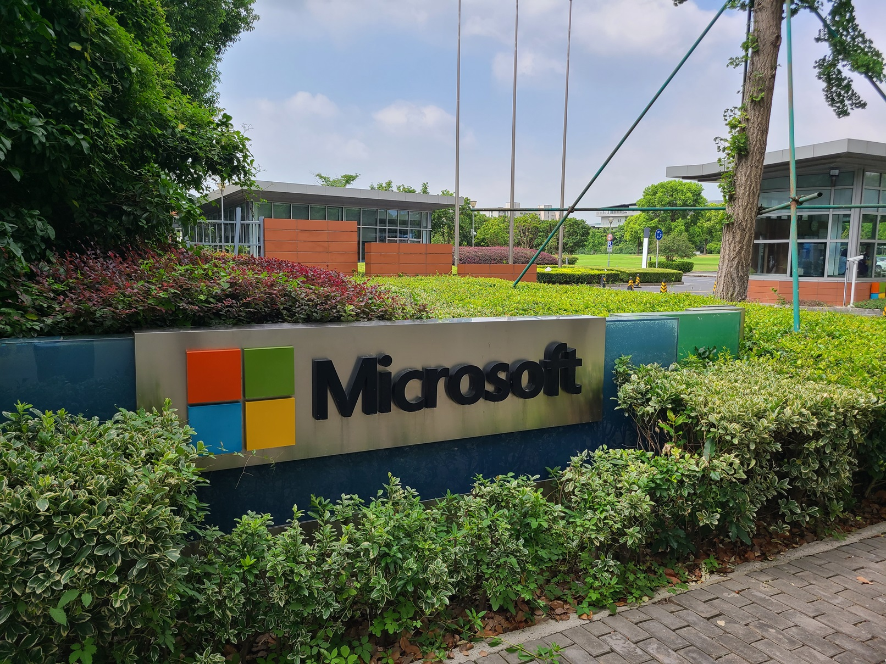
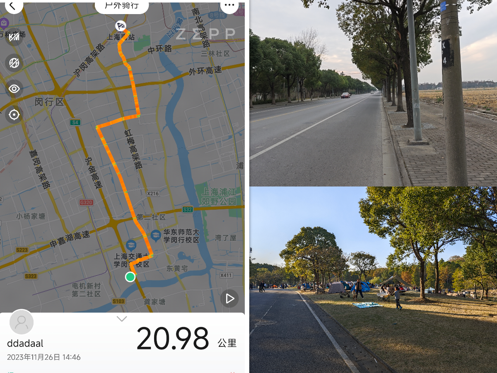
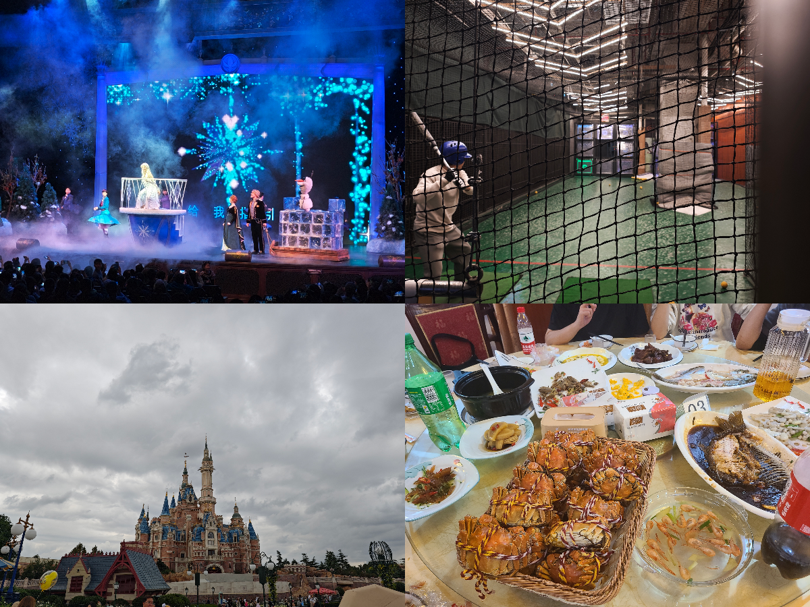

# 一段历史的终结

从2019年10月开始，在我对未来的所有计划中，2023年就是最后一年。我知道我会在2023年完成毕业论文并毕业，加入一个公司（在2022年确定是上海微软），再往后会发生什么，就彻底没有意识了。对我来说，2023是19年学生生涯的结束，也是我最熟悉的生活的终结。

# 没有干扰的毕业季

由于疫情，2020年的毕业季变为了宅家季，整个研究生期间的生活也受到了不小的影响，更别说在北京，以至于之前连出京看个牙有时候都是一种挑战。随着疫情防控的结束，生活总算可以回归正常。因此，我也在学生生涯的末尾再次体验到了一把久违的正常生活。

## 羽毛球比赛

作为一个经历了体重困扰22年的“减肥困难户”，我一直以为体育运动和我没有关系。可谁知道竟然能在研究生期间减重成功，结交了愿意一起运动的朋友，甚至还加入了院里的球队。生活正常了后，各种比赛也多了起来，在来自同学、球队的帮助下，我也有机会参加各种比赛。

3月在清华综合体育馆，第二个球就把腰闪了，坚持打完21分后在场馆边成为“球场流浪汉”；4月法学院组织的比赛，当时因为身体不太舒服没有上场，却与王适娴面对面，队友还获取了王适娴在球衣上的亲笔签名；5月和球队参加硕博杯比赛，可是却打出只获得3分、5分的惨烈对局，最后甚至还发现3分那一场的对手在朋友圈里；6月和老搭档的比赛前半局大比分领先，可后面却被逆转。这可能这是这半年最大的遗憾了吧，没能在实力接近的比赛中赢下一局。

## 旅行

今年可能是我出游最多的一年。3月QQ火花1100天+的大学同学考研复试，在北京参观；4月大学同学回国飞深圳，3天时间在深圳闲逛，顺带拜访了港中深的同学；6月和研究生同学去了明孝陵和青岛、淄博和济南；7月大学同学回国飞香港，快十年后又一次出境游，回到国内后窝在民宿里，除了吃饭就是聊天，一个景点都没有去，还顺路在江门和研究生同学打了一场球；8月陪研究生同学游重庆。

我不喜欢一个人旅游，对我来说，旅游的重点不在去哪儿，而在和谁一起去。有这么多愿意玩的同学朋友，我感到很幸运也很感激。

## 研究生期间的工作

随着负责的实验室项目迈入正轨，项目的事情也逐渐越来越多。从一开始的只要按照自己的写代码，到后面要去投稿、参加会议、和人越来越多的团队合作。虽然马上要毕业了，之后应该也与学术圈不会再有交集，但是在老师的支持下，在这最后半年里，浅浅体验了一下这条我之后不会再有机会经历的道路。

另外，要毕业的时候，赶上了HackPKU Hackathon比赛的末班车。上大学以来总共参加和组织过5次hackathon，每次hackathon都是一次学习效率拉满的体验，这次hackathon更是在完全不同的情况下，在ChatGPT的支持下学习了一些WebGPU相关的能力，虽然真的很累，这种以兴趣驱动、有目标导向的体验真的难得。

## 毕业

虽然三年前我们仍然能够回到学校，在学校度过本科阶段最后的日子，但是没有正式的毕业活动，总感觉没有真正的结束。还好，19年的学生生活有一个完美的结局。毕业典礼最后合唱燕园情的环节，不仅是对燕园、三年研究生生活的告别，也是对学生生活的告别。

# 从激动到平淡的新生活

新的生活一开始是让人激动的，后面才意识到，它是复杂的。

## 从零开始打造理想中的生活

今年来租房的时候，根据去年经验，我和合租的同学定下了一个以下要求：不要老破小，通勤时间短，周边生活方便。可是，在到上海的前几天，预先看好的房源一个一个被订走，我们只好妥协对户型和地铁站距离的要求，最后租了一套在附近住房里离公司最近的、21年才交付的全新的动迁房，再购买了一辆二手电动车，从出门到公司电动车停车位停车总共8分钟。

入住后一番收拾，在客厅的一角把台式机打造成了工作站，设置好了厨房，后面还邀请了在工作中认识了几位南软的小伙伴，请他们在来家里一起吃我们订的螃蟹和做的饭。

由于是实习转正，所以入职直接进了去年实习的组，一切都是那么熟悉。办公环境没有变，工位和实习工位隔了2m，老板没有变，同事没有多没有少，工作仍然是接手的实习项目，熟悉到入职第一周就完成了一个功能。

总的来看，一切就和当年想的一样进行着。

## 总会遇到新的问题

但是哪儿有完美的事情呢？

工作上，这四个月内我一直在做一个新的业务，具体的功能实现和节奏都由带我的同事和我自己掌握。而与此同时，我的在其他组的同学每天有具体的要求，还有从早到晚的各种会议，工作十分充实，这个对比让我十分不解：我的工作是不是太水了？和老板进行了一次6个小时的一对一聊天，了解到了组里的情况，组里目前还没有业务，分配给我的任务也是探索性质的，所以目前仍然是比较自由的状态。对纯粹混日子来说，这种组无疑是很合适的，但是毕竟公司主要还是以盈利为主，如果一个组一直不出业绩，组里分到的资源以及个人的发展前途肯定会受到影响，而这些事情是目前我一个小兵无法左右的。另外更具体地了解薪资和结构后，简单计算一下得知，即使是在升职顺利且不被裁员的情况下，收入前五年平均下来也只能维持几乎不变，距离在上海买房那还是差远了。

升职加薪没啥指望了，重点就要在生活上找乐子了。理论上来说，在上海应该不缺乐子。可是，如果要进市区的话，地铁出行一小时刚到徐家汇，开车由于经常堵车时间并没有本质区别，再加上没有搭子，即使去市区，等到了地方，也只能简单逛逛就得准备往回走，音乐会等最好多人一起参加的活动至今也还没有参加过。不进市区的话，周边都是工厂和农田，在冬天降温之前为了运动，倒是骑着共享单车把周边都转了一圈。

由于来了全新的城市，原来的朋友都在外地，而工作中的认识的同事以及现在仍然方便联系的朋友全部都已经有对象、有家庭甚至有小孩，都有自己要关心的更重要的事情，不太可能再像之前一样想约就约。公司倒是比较慷慨，组织了几次团建活动，迪士尼、甪直古镇，以及在市区一个酒吧的团建，但是主要也是为了大家单纯的放松和白嫖团建预算而已。

11月的时候办户口，虽然户口可以网上办理，但是为了再和上半年的朋友们再见一次，我还是再次去北京待了3天，在可预期的未来最后一次见了北京的朋友们，三天见了6波人。之前做MBTI做出来结果为E，我自己都感觉不可思议，但是从社交是否能给我带来活力来说，这个结果确实挺准确的。

# 找寻新的目标

我从国内顶尖的学校毕业，进入了梦想的行业，在梦想的公司过着压力不大的、通勤10分钟的工作，我原来的目标似乎完全实现了。

自很小的时候在父母的单位上接触了电脑（从一张老照片上确认是2001年）后，我对计算机产生了兴趣。那个年代比尔盖茨的故事家喻户晓，我也认为计算机软件是我将会从事一生的行业。当别的小孩在外面疯玩的时候，我在家里鼓捣电脑，甚至还给小区里的邻居装系统、解决电脑问题。高考填志愿的时候，我果断地填了软件工程专业，在坚定的目标中度过了充实的七年大学和研究生时光。选择工作的时候，我也完全没有考虑目前很火的考公、国企，我喜欢我做的工作，虽然这两年裁员、降薪新闻一个接一个，但是我仍然选择了这个行业。而当大家都去国内大厂的时候，我却只盯着外企，以至于目前三段实习经历都是外企，最后也除了出于好奇往华为投了一份简历（然后面试通过后石沉大海）之外，一个其他企业都没有投，最后也顺利把握住了最近两年最后一批校招的机会，进入了微软。

但是，成年人的世界就是选择并承担后果。选择了Work Life Balance的外企，就要接受工资不高不低以及存疑的稳定性；选择了住在郊区，享受了极快的通勤时间和相对市区低廉的房租，摆脱了干什么都要排队的拥挤，就必须接受出行的不便以及看着像30年前小镇子的环境。

仔细想来，我完全不能抱怨环境。工作条件灵活，假期充足，老板不push，工作内容暂时压力不大，相处的同事能力强好沟通，甚至还能带我去俱乐部打球，可以说我可能很难再找到这样的环境。我也感觉一直非常的幸运，一直到今天，所经历过的事情、认识和结交的人都非常的nice。那我还有什么不满意的呢？归根结底，是我还需要回答这个最重要的问题：**我到底想要什么**。

但这个问题有那么好回答吗？

工作之前觉得郊区生活成本低，通勤方便，房价低，有希望能留下；而现在却觉得，住在这么偏远，出行动辄1小时，也算在上海吗？同样一份Work Life Balance的工作，之前觉得工作和待遇取得平衡，现在却觉得待遇离能在上海定居差了十万八千里，晋升又慢，还要担心中美关系，混日子工作有什么意义吗？同样是居住，4个月前我唯一的念头就是离公司近，但是现在却萌生了去市区居住和体验的想法。又回想到2019年，从“坚持”本科毕业去工作到保研，这个转变也就发生在一个月内。

前段时间看到有人说，一个人成长的标志是感觉到以前的自己非常幼稚。我很高兴我仍然处于成长当中，但更重要的在成长中找寻新的方向。在过去的十九年中，总有一个“毕业升学”的目标围绕着我。而现在以及以后，永远不会再有这样一个固定的目标了，找寻新的目标成为了以后最重要的问题。明年，我将会更熟悉工作的状态，可能会和更多人合作，承担更多的工作；明年合租的同学离开，我将再有一次换居住环境的机会；可能会通过更多的渠道认识到更多的人。希望我能在不停的变化、体验、接触之中，慢慢地搞清楚我究竟想要什么样的生活。
