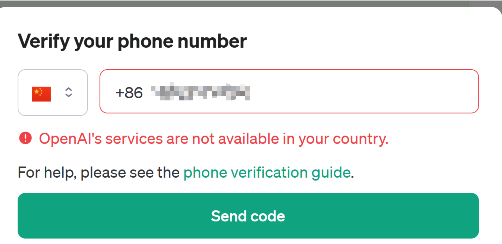
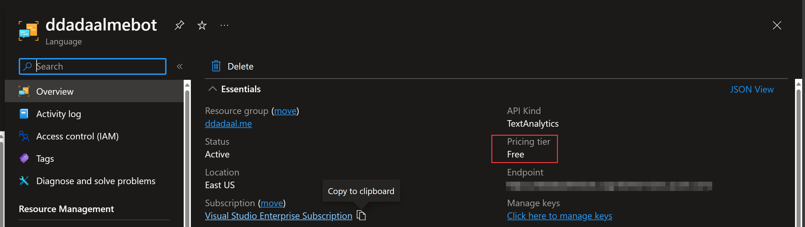
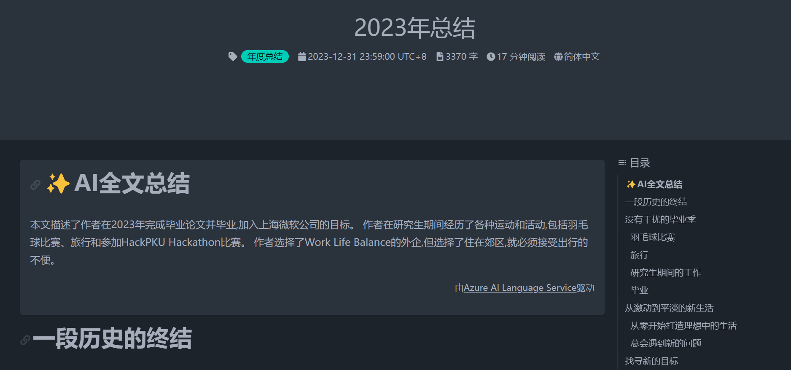
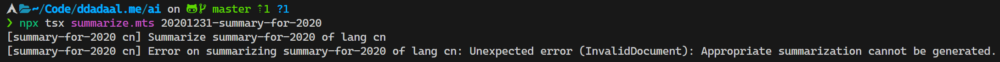

# 一条朋友圈的提示

当昨天的[2023年总结](/articles/summary-for-2023)发出后，朋友圈有人对文章做出了总结，这启发了我，何不自己用AI给文章加个总结功能呢？正好也是第一次在真实场景中实装AI功能，看看目前在真实项目中集成AI需要什么步骤，体验怎么样，能做到什么功能。


# 选择AI服务

确定了要做这事，下一步就开始调研应该用什么AI服务。


第一反应肯定用[OpenAI API](https://openai.com/blog/openai-api)，去年某段时间注册OpenAI账号不需要手机号，趁着这个机会直接注册了一个，至少最基本的ChatGPT可以用GPT 3.5模型聊天了。而当我想去用OpenAI的API的时候，发现要获得OpenAI的API需要验证手机号，而国内手机号当然验证不了的。除了手机号，支付方式也是一个问题，虽然我有国内银行的VISA卡但是似乎仍然不能使用。



于是接下来我想到了公司的[Azure OpenAI](https://azure.microsoft.com/en-us/products/ai-services/openai-service)服务。虽然Azure的服务都偏贵，但是由于公司每年都给员工送150刀的Azure额度，所以一点简单的应用还是可以开发的。可是真的去注册的时候发现Azure OpenAI Service并没有完全开放给所有客户，要注册必须填个注册表，且必须以公司身份注册。


正当我在想“不会要去找国产服务了吧”的时候，我想到两个月前在Ignite上亮相的[Azure AI Studio](https://azure.microsoft.com/en-us/products/ai-studio)。仔细研究了下，发现这个功能本身只是一个集成平台，它是基于一些已经已经发布的[Azure AI服务](https://learn.microsoft.com/en-us/azure/ai-services/)，而上面想尝试的Azure OpenAI只是这些服务内的一个。在这些服务中，有一个[Language服务](https://learn.microsoft.com/en-us/azure/ai-services/language-service/)，正好用于处理自然语言的场景，而其中正好还自带了[Summarization](https://learn.microsoft.com/en-us/azure/ai-services/language-service/summarization/overview?tabs=document-summarization)功能，其中的Abstractive summarization模式只要输入文本，它就能输出一段总结这段文本的文字。

一切都是正好。微软爸爸真懂我。

# 使用Azure AI Language Service

根据[Quickstart文档](https://learn.microsoft.com/en-us/azure/ai-services/language-service/summarization/quickstart?tabs=document-summarization%2Clinux&pivots=programming-language-javascript)，我们首先需要创建了一个[Language资源](https://portal.azure.com/#create/Microsoft.CognitiveServicesTextAnalytics)，获取资源对应的endpoint以及key。

文章总结功能的一大好处是这个功能**不需要实时交互**。也就是说，我可以在后台把总结生成好，像文章内容本身一样作为静态资源放在仓库里。这样，我们根本不需要能够支持大量调用的AI服务，只要运行一次，就完全可以使用了。创建的资源的时候，每个subscription可以创建一个免费的资源，我们本来也就不到50篇文章，免费的资源就完全够用了。



接下来需要在项目中安装SDK来使用这个资源。我们的博客使用的是Node.js，于是我们选择Node.js继续进行下一步。使用`npm install --save @azure/ai-language-text@1.1.0`安装SDK后，根据指示直接在项目使用SDK即可。

由于只要内容不变，总结就没有必要更新，所以最简单最直接的做法，就是直接放在本地写个脚本，读取文章的内容，然后把文章内容的markdown直接一股脑送给服务获得内容的总结，然后把总结的内容生成到文章对应的目录下，读取文章的时候顺便读取生成的总结，然后在UI中渲染就好。

```ts title="ai/summarize.mts"
// 总结文本
async function summarize(text: string, languageCode: string): Promise<string[] | Error> {
  const lro = await client.beginAnalyzeBatch([
    // 使用AbstractiveSummarization模式
    { kind: "AbstractiveSummarization" },
    // 根据文章的语言指定所使用的语言，实现中文文章输出中文总结，英文文章输出英文总结
  ], [text], languageCode);

  // 这是个耗时操作，等待耗时操作结束
  const results = await lro.pollUntilDone();

  for await (const actionResult of results) {
    if (actionResult.kind !== "AbstractiveSummarization") {
      return new Error(`Expected extractive summarization results but got: ${actionResult.kind}`);
    }
    if (actionResult.error) {
      const { code, message } = actionResult.error;
      return new Error(`Unexpected error (${code}): ${message}`);
    }

    for (const result of actionResult.results) {
      if (result.error) {
        const { code, message } = result.error;
        return new Error(`Unexpected error (${code}): ${message}`);
      }

      // 返回输出的结果
      return result.summaries.map((x) => x.text);
    }
  }

  throw new Error("No result");
}

async function summarizeArticle(articleDir: string) {
  // 获取此文章的所有markdown文件
  const mdFiles = (await readdir(articleDir)).filter((x) => x.endsWith(".md"));

  for (const mdFile of mdFiles) {
    const mdFilePath = join(articleDir, mdFile);

    // 读取并解析文章内容
    const mdContent = await readFile(mdFilePath, "utf-8");
    const { data: frontMatter, content } = matter(mdContent);

    // 计算并更新文章Hash，如果文章内容hash没有变，之后就不要重新生成总结了
    const contentHash = hashContent(content);

    const summaryJsonFilePath = join(articleDir, `${frontMatter.lang}.summary.json`);

    if (existsSync(summaryJsonFilePath) && (await stat(summaryJsonFilePath)).isFile()) {
      const existingSummaryJson: ArticleSummary = JSON.parse(await readFile(summaryJsonFilePath, "utf-8"));

      existingSummaryJson.hash = contentHash;

      if (contentHash === existingSummaryJson.hash) {
        log("log", "Content is not changed after the last summarization. Skip summarization.");
        continue;
      }
    }

    // 总结文本
    const summary = await summarize(content,
      azureLanguageCodeMap[frontMatter.lang as keyof typeof azureLanguageCodeMap]);

    if (summary instanceof Error) {
      log("error", "Error on summarizing %s of lang %s: %s", frontMatter.id, frontMatter.lang, summary.message);
      continue;
    }

    // 在文章目录下生成一个[语言id].summary.json文件，存放内容hash、总结以及相关操作信息
    const summaryJson: ArticleSummary = {
      articleId: frontMatter.id,
      lang: frontMatter.lang,
      lastUpdateStartTime: startTime,
      lastUpdateEndTime: new Date().toISOString(),
      summaries: summary,
      hash: contentHash,
    };

    log("log", "Write summary of %s of lang %s to %s", frontMatter.id, frontMatter.lang, summaryJsonFilePath);

    await writeFile(summaryJsonFilePath, JSON.stringify(summaryJson, null, 2));
  }
}

```

# 效果

最终效果嘛，你在打开本文章的时候应该就看到了。如果一篇文章能够成功生成总结，那么文章页面的一开头，以及右侧的目录部分就会有**AI总结**这部分内容。



为什么说“如果可以成功生成总结”呢？在具体操作中，[2020年总结](/articles/summary-for-2020)这篇文章死活不能生成总结。



而对应成功生成总结的文章，总的来说英文文章的总结效果显著好于中文文章。例如，[An Infinite Loop Caused by Updating a Map during Iteration](/articles/an-infinite-loop-caused-by-updating-a-Map-during-iteration)这篇文章的总结包括了问题描述、问题解决过程以及最终的解决方案，语言流畅，逻辑清晰；

> The author encountered a problem during the development of the 2.0 version of [simstate], where an infinite loop occurred during the iteration of a set of ' observers' stored in a ES6 Map. The problem was initially confused due to the Map having only one element and remaining unchanged between and inside loops. However, after investigation, the author discovered that the root of the problem was the call to observer, which alters the Map itself during iteration. This led to the infinite loop, even when deleting and re-adding an entry during iteration.

而同样类型的[问题探究](https://ddadaal.me/articles/search?query=problem-investigation)类文章[一次生产环境的文件丢失事故：复盘和教训](/articles/summary-of-a-file-lost-accident)，得出的总结就过于简单，而且也没有找到问题重点，得出的文本中甚至都是英文标点。

> 作者通过log、数据库数据等找到了受到影响的用户,通过邮箱、电话和短信提醒他们重新上传文件。

# 总结

这是我第一次在实际项目中运用AI，在充分的文档帮助下，整个过程花费了6个小时左右，其中集成这个功能可能花了1个小时左右，而最终的效果不能算非常完美，但是也是是差强人意。在2023年的最后一天完成这个过程，在新年的第一天给博客实现这个新的功能，也算是一个新年礼物了吧。在AI的时代，与其害怕AI替代自己，不如主动拥抱AI提高生产效率，而这对于从业者的我们天生就有优势。
