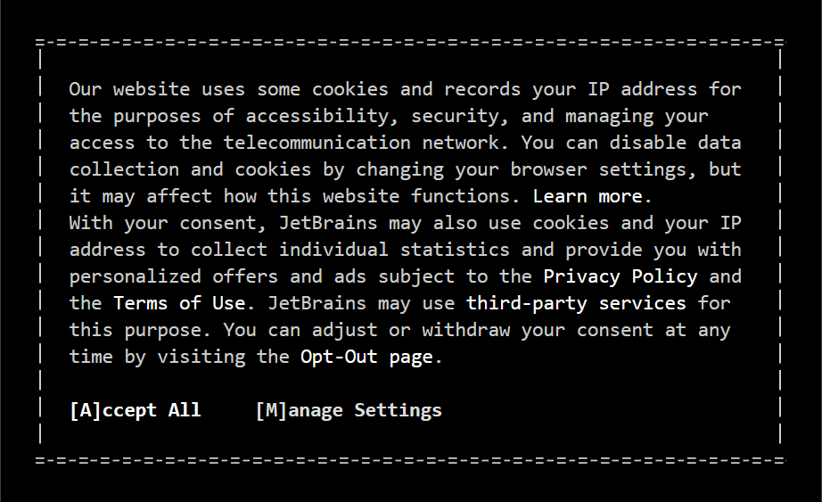
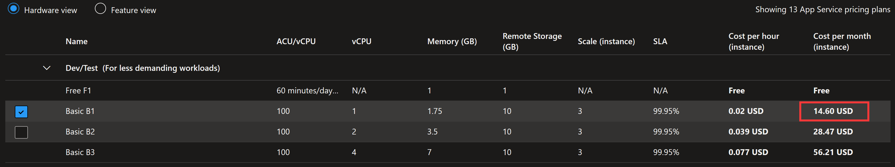
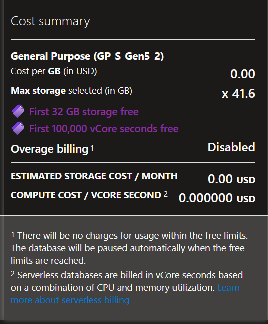
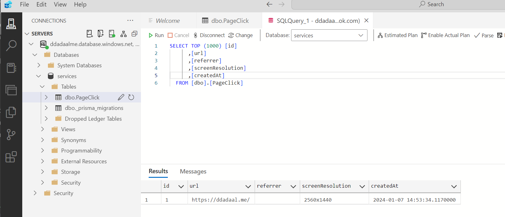

# 为什么要加统计？

作为一个创作者，我还是很希望能够获取我的网站的一些统计和监控信息的，例如各个页面的点击量等。且不说这些数据到底有什么具体的作用，但是单纯地看着网站的访问量上涨，这对我来说还是非常有成就感的，说明我写的东西还是有人看的😂

但是在过去的5年里，我的博客一直没有部署一个稳定的统计系统。之前用过使用Google Analytics、[友盟](https://www.umeng.com/web)以及百度统计，但是最后均遇到了各种各样的问题没能使用下去。例如，Google Analytics的数据过于复杂，我甚至没搞懂怎么看某一页的访问量？友盟的信息只保存一年等。前几天看到一个[Analytix](https://analytix.linkspreed.com/dashboard)的服务，看界面非常清新简洁，也没有提到要付费的情况，非常对我胃口，结果装进去发现报告数据的API有错误，仍然无法使用。

来到了新的一年，我打算这次一口气解决这个问题。我连简历的样式都是自己用CSS排的，写个统计功能还难住我了？用第三方功能总会有所担心，担心要收费、数据丢失，自己写的功能就没有这些问题了。于是花了一天完成了一个最简单的博客点击量统计功能，并正式上线。

# 如何收集访问者的信息？

绝大多数统计网站访问者的模式都是相同的：先在平台上注册一个账号并注册自己的网站，平台给予一个`<script>`HTML标签，这个标签需要被加到被统计的网站上。当标签加上去后，这个标签就会下载一段javascript脚本，这个脚本会将一些访问者的信息发送到平台上，平台收集数据后做数据统计，这样我们就获得了网站访问者的信息了。

这个脚本具体怎么写呢？在研究上文提到的Analytix为啥用不了的时候，我研究了它要求我们插入的脚本：<https://analytix.linkspreed.com/js/script.js>（点击直接查看）。它所做的事情，主要有两个：

1. 加载脚本时，把当前页面地址`page`、来源地址`referrer`、屏幕分辨率`screen_resolution`发送到他们的endpoint
2. hook `history.pushState`函数，当这个函数被调用时（即页面URL修改时），再次执行上面这个事件

这样，每次用户访问网站时，脚本就会把访问信息上报到API，并且通过`history.pushState`确保即使是单页应用，也能正确报告所有访问的URL。

# 收集了哪些信息？

要想分析用户的信息，最简单的方式莫过于把用户的IP地址收集上来。有了IP地址，我们就可以分析很多信息了，例如用户来源的分布等。但是，我们再仔细看看Analytix所收集的信息，只有三个：**当前页面地址**、**来源地址**以及**屏幕分辨率**。是不是感觉有点少？没有IP地址，怎么去重，怎么分析哪些来访者是来自于何处？

我认为这很可能和GDPR有关。GDPR（通用数据保护条例）是欧盟的一项关于数据隐私的法律，是对所有欧盟个人关于数据保护和隐私的规范，所有互联网服务只要涉及到和欧盟的人或者公司，都需要遵守这个规定。这个规定非常复杂，我也没有信心完全读懂，但是其中以下几点非常重要：

1. 要获取用户的个人信息，就需要获取用户的同意，并且这些信息还要满足大量的数据安全要求
2. 所有能够识别到某个具体个人的信息都是个人信息，其中包括**IP地址**

把这两点连起来看，就是说网站不经过用户同意就能收集的信息实际上就非常有限了。Analytix可能也是考虑到这个因素，所以才默认只收集了URL以及屏幕分辨率信息，最重要的IP地址等均没有被收集。除此之外，脚本中还单独判断了`navigator.doNotTrack`，如果这个值为真，则不报告信息。根据MDN的信息，[`navigator.doNotTrack`](https://developer.mozilla.org/en-US/docs/Web/API/Navigator/doNotTrack)是个非标准的API，当用户浏览器设置了Do Not Track时，这个值为`true`。这也充分满足了用户的意愿，如果用户不愿意被track，就真的不会被track。这也是为什么现在很多网站在第一次访问时都会有一个很明显的弹出框等方式，里面会明确说明网站会使用cookie、记录访问者的IP地址，以及给用户说明如果不愿意收集可以明确被退出，要求用户显式地同意。这些也都是GDPR、以及其他国家后续类似推出的信息保护条例的要求。

作为一个负责人的网站开发者，我认为个人信息确实是非常重要。目前我也没有必要收集用户的IP地址来做进一步的分析。为了保护用户的隐私，我也选择了和Analytix一样的收集方式，目前只收集了这些和个人信息无关的信息。您可以访问<https://services.ddadaal.me/monitor/script.js>来获知访问网站时下载的脚本具体执行了什么代码，发送了什么信息。

# 如何开发和部署？

目前网站的统计逻辑基本上就是照抄Analytix，写一个信息上报地址、写一个脚本，然后在博客中加一个`<script>`标签。

项目本身我采用了我比较熟悉的Node.js，使用[fastify](https://fastify.dev/) HTTP库编写了代码。之后，我将其打包为Docker镜像，部署到了[Azure App Service](https://learn.microsoft.com/en-us/azure/app-service/configure-custom-container?tabs=debian&pivots=container-linux)上，并将`services.ddadaal.me`解析到部署后的地址。`Azure App Service`使用的是最便宜的版本，每个月的费用预计为15刀左右。

采集到的信息保存在[Azure SQL Database](https://azure.microsoft.com/en-us/products/azure-sql/database)上，主要原因是它有一个[免费的offer](https://learn.microsoft.com/en-us/azure/azure-sql/database/free-offer?view=azuresql)，每个月32G存储和第一个100000核秒的计算是免费的，这些计算能力和存储对我来说绰绰有余了。

它实际上是一个`Microsoft SQL Server` SQL服务器，Node.js下虽然有能用的`mssql`库，但是生态支持`mssql`的还是太少了，为了更方便地访问数据库，我使用了支持`mssql`的[Prisma](https://www.prisma.io/)，正好尝试了一下这个全新的"ORM"框架。目前总体用起来，和传统的[mikro-orm](https://mikro-orm.io)等用起来还是有不少的区别的，例如它的客户端是通过codegen生成出来的，编写schema也是通过自己的prisma语法，不是传统的用TypeScript来定义。总的来说，因为这个库是有公司在背后支持的，所以可用性还是不错的。另外，微软的[Azure Data Studio](https://azure.microsoft.com/en-us/products/data-studio)甚至Prisma的[Prisma Studio](https://www.prisma.io/studio)都可以访问MSSQL的数据，维护起来问题不大。

# 后续

有了统计数据，之后第一件事肯定是数据分析。目前可以通过SQL语句来分析，但是这也太不直观了，后续可能我会开发一个简单的dashboard用来查看统计数据。

另外，这个博客是一个静态博客，所有的动态功能均需要单独部署服务来实现。而`services.ddadaal.me`会变成博客后端的服务的基础。后续博客的动态功能也会部署到这个域名之下。
