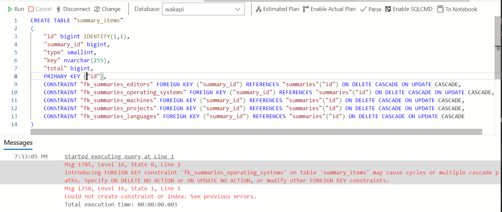
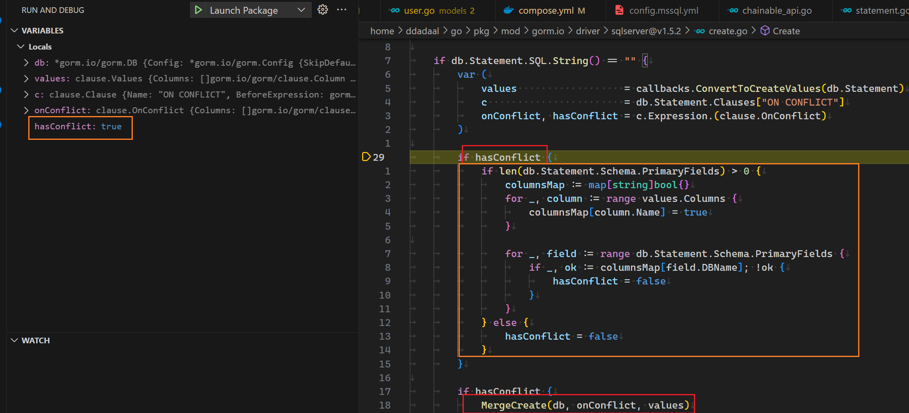
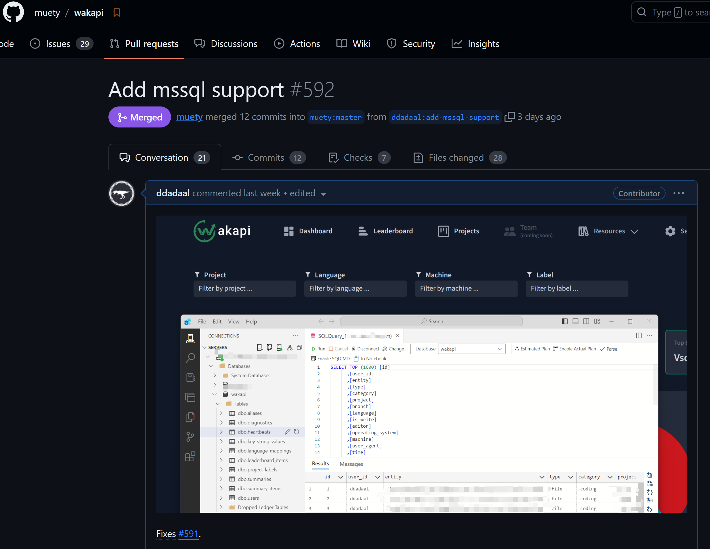

# 不就是调库嘛……

在[上一篇文章](/articles/added-blog-page-click-monitoring)中，我给博客增加了点击量监测，并将这个服务部署到了Azure，数据库采用了使用SQL Server的Azure的SQL服务。由于SQL Server有免费的订阅，微软的Azure Data Studio也还算好用，于是我觉得可以重用一下刚才学习的这个技能，将其他的服务也使用SQL Server部署。

我之前在用[wakatime](https://wakatime.com/)来记录我的编程的数据（例如每天的编程时间、所使用的编程语言等），但是wakatime免费用户只能保存14天的数据，而且wakatime没有提供官方的可自己部署的后端，所以我也一直在寻找wakatime的替代品。之前尝试使用了一段时间的[codetime](https://codetime.dev/)。这个软件的功能和wakatime类似，但是它当前只支持VSCode客户端，虽然免费保存数据，但是仍然没有提供可自己部署的后端。我在很早之前也尝试找过wakatime的后端替代品，但是当时并没有找到一个能用的。但前不久，同学给我推荐了[wakapi](https://www.wakapi.com/)项目，这个项目重新实现了wakatime的后端API，这样wakatime的丰富的客户端插件可以直接使用，并且完全可以自己部署，不用担心数据并存放在别人的服务器上。

它就是我一直寻找的wakatime替代品！

很激动地浏览了一下项目，看到wakapi当时并没有原生支持SQL Server，但是在README中提到，wakatime使用了[gorm](https://gorm.io)作为数据库访问框架，而gorm本身是[支持SQL Server](https://github.com/go-gorm/sqlserver)的。

我想，既然库都支持了，SQL Server支持有什么难的？引入`gorm.io/sqlserver`包，引入创建一个`Dialector`，用gorm的API编写的绝大多数数据库操作就完成了。

```go
sqlserver.Open(mssqlConnectionString(c))
```

这有什么难的，开跑！结果遇到了一大堆报错。

# 遇到并解决一个一个一个的问题

## SQL语句

仔细一看，这些报错主要是来自于数据库migration中的原生SQL语句和片段。

程序启动的时候，会运行数据库migration脚本。随着软件开发更多的新功能，其使用的数据库的结构总会发生变化，而migration是指一些代码，这些代码的作用是修改数据库schema、让schema满足当前版本的要求。当软件功能越来越多，对数据库的变化也就越来越多，所以在一个成熟的软件中，你常常会看到有很多的数据库migration的代码。在程序启动的时候，这些migration将会被一个一个地执行，使得程序正式开始时，数据库的schema也更新到最新。

```bash
> tree migrations
migrations
├── 20201103_rename_language_mappings_table.go
├── 20201106_migration_cascade_constraints.go
├── 20210202_fix_cascade_for_alias_user_constraint.go
├── 20210206_drop_badges_column_add_sharing_flags.go
├── 20210213_add_has_data_field.go
├── 20210221_add_created_date_column.go
├── 20210411_add_imprint_content.go
├── 20210411_drop_migrations_table.go
├── 20210806_remove_persisted_project_labels.go

```

而有的migration（尤其是自动生成的migration）很可能包含了一些原生SQL。同时，由于ORM是对数据库操作的抽象，而再强大的抽象也不如原生的SQL来得强大和方便，所以很多时候，开发者仍然会选择在一些地方使用原生SQL语句的片段或者语句来实现一些功能。虽然SQL本身是有标准的，但是各个数据库厂商实际上自己实现了很多新功能，很多时候我们本以为理所当然的功能，实际上并不在标准中，而是数据库厂商自己实现的，一旦手写SQL而没有意识到有的SQL实际上只在部分数据库中兼容，就可能会在不兼容的数据库中遇到问题。

举个例子，wakapi的某个版本需要在数据库的`users`表中新增一个`has_data`列，而对于已经存在的`users`表中的数据，这个列需要被设置为`TRUE`。代码中用于执行此次migration的代码使用如下SQL语句实现了这个功能：

```sql
UPDATE users SET has_data = TRUE WHERE TRUE;
```

看上去是个很简单的人畜无害的SQL语句，对吧？但是这个SQL语句在mssql中中是非法的，因为mssql中并没有`TRUE`, `FALSE`常量！sqlserver中没有`boolean`类型，所有这些类型都是使用一个字节的`tinyint`来表示的，而`TRUE`和`FALSE`就对应使用`1`和`0`来表示。但是，`1`和`0`在sql server中并不是一个合法的`boolean`表达式，所以它们并不能直接用在`WHERE`中。所以，在MSSQL中，以上SQL语句就必须重新成以下的样子：

```sql
UPDATE users SET has_data = 1;
```

## SQL语句片段

另一个情况是**SQL语句片段**。虽然ORM的一大作用就是将软件代码映射为SQL语句，减少我们手写SQL可能带来的错误，但是为了实现的灵活性，ORM常常同样也允许在自己的API中编写一些SQL的片段，而ORM会尝试将这些SQL片段嵌入进去。但是这些SQL片段可能也会有不兼容的情况！例如，下面的代码

```go
result := db.Table("summaries AS s1").
			Where("s1.id IN ?", faultyIds).
			Update("num_heartbeats", "3")
```

上述gorm数据库仓库将会被映射为类型以下的SQL语句。注意`Table`和`Where`方法的参数与下列SQL语句中对应的语句的对应关系。

```sql
update summaries AS s1 set num_heartbeats = 3 where s1.id IN ?
```

是不是感觉很简单？但是MSSQL仍然不支持！MSSQL不支持在`update`持语句中给表新增一个别名，所以以上SQL语句中的`AS s1`必须被去掉。

## 重用Dialector的逻辑，为关键词加上引号

再看一个SQL语句片段：

```go
r.db.Model(&models.User{}).Select("users.id as user, max(time) as time").
```

这段SQL语句一般会被映射为：

```sql
select users.id as user, max(time) as time from users;
```

有问题吗？有！`user`在MSSQL中是关键词，要作为标识符使用必须使用`""`或者`[]`将它包裹起来！而`user`在mysql等数据库引擎中都不是关键词，因此可以随意直接使用。

这个将关键词作为字符串使用的过程实际上编程中很常见，被称为`escape`，或者更简单的叫`quote`，加引号。但是更坑的是，不同的SQL引擎所使用的加引号的方法不一样。MSSQL使用的是`""`或者`[]`，但是mysql使用的是`。如何通过一段代码来为不同的数据库加上正确的引号呢？

其实，这个加引号的过程实在是非常常见，只要ORM需要将程序员所写的名字（表名、列名等）映射到SQL，那么就需要考虑给这些名字叫上引号，防止这些名字和SQL自己的关键词冲突。如果你写一个名字叫`select`的表，没有这段逻辑，那么这个表就没法通过ORM来映射成SQL了！

因此，根据Don't Repeat Yourself原则，ORM为数据库系统的适配器中肯定会有对应的逻辑。而我们与其自己编写这个处理逻辑，最好的方法当然是调用适配器中已经写好的逻辑了。

gorm使用`Dialector`接口作为ORM支持不同数据库系统的适配器的接口，所有gorm支持的数据库都有一个对应的实现了`Dialector`接口的`Dialector`。所以，第一步就是去看看gorm的`Dialector`里定义了哪些接口。

```go {8}
// https://github.com/go-gorm/gorm/blob/0123dd45094295fade41e13550cd305eb5e3a848/interfaces.go#L12C1-L21C2
type Dialector interface {
	Name() string
	Initialize(*DB) error
	Migrator(db *DB) Migrator
	DataTypeOf(*schema.Field) string
	DefaultValueOf(*schema.Field) clause.Expression
	BindVarTo(writer clause.Writer, stmt *Statement, v interface{})
	QuoteTo(clause.Writer, string)
	Explain(sql string, vars ...interface{}) string
}
```

从名字判断，这个`QuoteTo`方法似乎就是我们要的接口。再随便点开一个dialector实现的代码浏览一下，就能确定，`QuoteTo`就是加引号的方法。

可是这个方法看上去和我们想象中的不太一样：我们预期这个功能是一个`(string) => string`的函数，这里怎么是一个`(clause.Writer, string) => void`的函数，这个`clause.Writer`是什么玩意？

由于拼接SQL说到底，就是要生成各个SQL的片段，然后将这些片段的字符串拼接起来。在绝大多数编程语言里，`string`都是不可变的，所以拼接字符串实际上是创建了第三个字符串，然后把两个字符串的内容复制进去。这个过程如果进行太多次，就非常浪费时间和内存。所以编程语言常常会提供一个**组装字符串的工具类**。这个工具类可以理解成是一个**可变**的字符串，你可以直接在这个_字符串_的后面增加新的字符串，而不需要每次操作都创建一个全新的字符串对象。而这个`Writer`接口，就是gorm定义的一个这样的能够**组装字符串的工具类**所需要实现的接口。这个`Writer`接口定义如下：

```go
// https://github.com/go-gorm/gorm/blob/0123dd45094295fade41e13550cd305eb5e3a848/clause/clause.go#L13
type Writer interface {
	WriteByte(byte) error
	WriteString(string) (int, error)
}
```

很简单，很直白：`WriteByte`：在后面增加一个字符；`WriteString`，在后面增加一个字符串。

熟悉Go的同学可能会说了：啊，这个接口看上去非常熟悉，原生的`strings.Builder`就是用来做这个事情的，而且也有这两个方法！是不是可以直接用一个`strings.Builder`来作为这个`clause.Writer`？

正确！所以我们可以直接创建一个`*strings.Builder`来作为`clause.Writer`（用指针的原因是这个`strings.Builder`的这两个成员方法是使用的指针接收者而不是值接收者，所以只有对应的指针类型才算实现了这个接口。具体关于指针接收者和值接收者的区别我们就不在这里介绍了，有兴趣的可以学习一下Go语言），并在调用后获取这个`builder`最终的字符串，这样就直接调用了`dialector`中实现了加引号逻辑。

```go
func QuoteDbIdentifier(db *gorm.DB, identifier string) string {
	builder := &strings.Builder{}
	db.Dialector.QuoteTo(builder, identifier)
	return builder.String()
}
```

然后，我们将此函数用在所有需要在SQL片段中使用自定义的名字的地方，这样，我们就重用了dialector的逻辑，用同一套代码兼容了所有的数据库。

```go {2}
r.db.Model(&models.User{}).Select(
  fmt.Sprintf("users.id as %s, max(time) as time"), utils.QuoteDbIndentifier(r.db, "user")
)
```

## 重写不支持的功能

而在进一步查找并修改原生SQL的语句中，我找到了一段如下的原生SQL语句，直接让我眼前一黑。

```sql
with projects as (
			select project, user_id, min(time) as first, max(time) as last, count(*) as cnt
			from heartbeats
			where user_id = ? and project != ''
			and time between ? and ?
			and language is not null and language != '' and project != ''
			group by project, user_id
			order by last desc
			limit ? offset ? )
select distinct project, min(first) as first, min(last) as last, min(cnt) as count, first_value(language) over (partition by project order by count(*) desc) as top_language
			from heartbeats
			inner join projects using (project, user_id)
			group by project, language
			order by last desc
```

这段SQL语句就这样赤裸裸地写在代码里。经过以上几个例子，是不是以为这个SQL在MSSQL中必定问题巨大，不重新写一份根本跑不起来？

我一开始也是这么想的。而我自己对SQL Server并没有那么熟悉，所以聪明的我，在给一些名字叫上引号后，直接把这段代码扔给了GitHub Copilot，让它帮我改成SQL Server能用的。反直觉的是，这段代码实际上问题没那么大：


具体来说，除了第三点去掉了不需要的引号后，有两个问题：

1. 不支持`join using`，需要使用常规的`join on`代替
2. 不支持`limit offset`。查找了一下，mssql可以使用`offset ? ROWS fetch next ? rows only`来代替，当然`limit`和`offset`的参数顺序是反过来的

啊，原来这么简单！由于需要修改的地方并不多，于是我就简单的通过if判断，将其中SQL Server不兼容的部分修改为SQL Server兼容的SQL语句，这段SQL语句也就完成了。

## 把同一个go类型在不同的数据库中映射为不同的列类型

修改了这些SQL语句后，程序仍然运行不起来，仔细一看，报错如下：

```
mssql: A table can only have one timestamp. Because table 'users' already has one, the column 'last_logged_in_at' cannot be added.
```

简单翻译，一个表只能有一个类型为`timestamp`的列，而`users`中有多个列都是`timestamp`的类型，所以SQL Server报错了。

去代码中一看，`users`表对应的`User`struct确实有好几个字段都通过[gorm的field tag功能](https://gorm.io/docs/models.html#Fields-Tags)`type:timestamp`，确定了在数据库中这些列需要映射为`timestamp`类型。

```go
// https://github.com/muety/wakapi/blob/fc483cc35cb06313da8231424d1d85b291655881/models/user.go#L17
type User struct {
  // ...
  CreatedAt           CustomTime  `gorm:"type:timestamp; default:CURRENT_TIMESTAMP" swaggertype:"string" format:"date" example:"2006-01-02 15:04:05.000"`
	LastLoggedInAt      CustomTime  `gorm:"type:timestamp; default:CURRENT_TIMESTAMP" swaggertype:"string" format:"date" example:"2006-01-02 15:04:05.000"`
  // ...
  SubscribedUntil     *CustomTime `json:"-" gorm:"type:timestamp" swaggertype:"string" format:"date" example:"2006-01-02 15:04:05.000"`
	SubscriptionRenewal *CustomTime `json:"-" gorm:"type:timestamp" swaggertype:"string" format:"date" example:"2006-01-02 15:04:05.000"`
}
```

`timestamp`有什么问题呢？MySQL不都是使用`timestamp`来代表时间类型吗？去查找`sql server timestamp`，我才发现，SQL Server里的`timestamp`的含义和别的数据库中的含义不一样。在别的数据库中，`timestamp`就是一个表示时间戳/时间点的类型，而根据[这个stackoverflow回答](https://stackoverflow.com/a/12063938)，`sql server`中的`timestamp`主要用于乐观锁的情况（具体不在这里阐述），只是用来标记本行上一次被修改的时间，所以每个表只能存在一个`timestamp`的列。而在SQL Server中如果要表示一个时间戳，需要使用`datetimeoffset`。

所以现在问题就变成了：**如何将一个类型在不同的数据库中映射为不同的列的类型**。

`type:timestamp`这个tag肯定是不能用了，于是我们就需要查找有没有其他更动态的方法，可以自定义一个go字段映射到数据库中的类型。经过一番查找，我们找到了[Customize Data Type](https://gorm.io/docs/data_types.html#GormDataTypeInterface)功能。gorm允许定义一个自定义的`struct`，并给这个`struct`实现`GormDBDataTypeInterface`接口，来返回这个类型的字段所真正对应的数据库类型。

```go
type GormDBDataTypeInterface interface {
  GormDBDataType(*gorm.DB, *schema.Field) string
}
```
这个函数的第一个参数就是`gorm.DB`对象，指向当前操作的数据库对象，可以获取到当前正在使用什么类型的`Dialector`，我们就可以根据`Dialector`类型，来输出对应的数据库列类型。另外，这个`CustomTime`正好是代码中所定义的一个新的`struct`，我们可以直接在`CustomTime`上实现这个接口。

看来比较简单，但是为了以防万一，我们再全局搜索一下`type:timestamp`，看看有没有什么其他的用法。果然被我找到了！

```go /timestamp(3)/
// https://github.com/muety/wakapi/blob/fc483cc35cb06313da8231424d1d85b291655881/models/heartbeat.go#L27
type Heartbeat struct {
  // ...
  Time            CustomTime `json:"time" gorm:"type:timestamp(3); index:idx_time; index:idx_time_user" swaggertype:"primitive,number"`
  // ...
}
```

这里用到了`timestamp(3)`。根据[mysql的文档](https://dev.mysql.com/doc/refman/8.0/en/fractional-seconds.html)，`timestamp(n)`中的`n`是代表精确到秒后面的第几位浮点位，`3`代表精确到毫秒，而`6`代表精确到微秒。而SQL Server的`datetimeoffset`也支持类似的标记（[文档](https://learn.microsoft.com/en-us/sql/t-sql/data-types/datetimeoffset-transact-sql?view=sql-server-ver16)），`datetimeoffset(n)`中的`n`也同样表示精确到秒后面的第几位浮点位。由于我们不能直接使用`type`tag，但是我们还需要一个tag用来表示这个精确的位数（根据sql server的文档，将这个位数称为`scale`），所以，我们可以定义一个全新的`timeScale`的tag，其值就是`scale`的值。而一个字段上具体有哪些tag，正好可以通过`GormDBDataType`的第二个参数获取。

于是根据这个思路，我们实现了`CustomTime`的`GormDBDataType`方法：

```go
// https://github.com/muety/wakapi/blob/1ea64f0397e5ee109777b367e9bd907cfdd59bdb/models/shared.go#L44
func (j CustomTime) GormDBDataType(db *gorm.DB, field *schema.Field) string {

	t := "timestamp"

  // 如果使用的是SQL Server Dialector，则将其类型设置为datetimeoffset
	if db.Config.Dialector.Name() == (sqlserver.Dialector{}).Name() {
		t = "datetimeoffset"
	}

  // 如果一个属性有TIMESCALE的tag，那么给类型后面增加(n)参数
  // gorm将所有gorm下的tag的key转换成了全大写
  // 参考：https://github.com/go-gorm/gorm/blob/0123dd45094295fade41e13550cd305eb5e3a848/schema/utils.go#L35
	if scale, ok := field.TagSettings["TIMESCALE"]; ok {
		t += fmt.Sprintf("(%s)", scale)
	}

	return t
}
```

同时，我们将所有的`timestamp`都直接去掉，将`type:timestamp(n)`修改为了`timeScale:n`：

```go
// https://github.com/muety/wakapi/blob/1ea64f0397e5ee109777b367e9bd907cfdd59bdb/models/user.go#L17
type User struct {
  // ...
  CreatedAt           CustomTime  `gorm:"default:CURRENT_TIMESTAMP" swaggertype:"string" format:"date" example:"2006-01-02 15:04:05.000"`
	LastLoggedInAt      CustomTime  `gorm:"default:CURRENT_TIMESTAMP" swaggertype:"string" format:"date" example:"2006-01-02 15:04:05.000"`
  // ...
  SubscribedUntil     *CustomTime `json:"-" swaggertype:"string" format:"date" example:"2006-01-02 15:04:05.000"`
	SubscriptionRenewal *CustomTime `json:"-" swaggertype:"string" format:"date" example:"2006-01-02 15:04:05.000"`
}

// https://github.com/muety/wakapi/blob/1ea64f0397e5ee109777b367e9bd907cfdd59bdb/models/heartbeat.go#L12
type Heartbeat struct {
  // ...
  Time            CustomTime `json:"time" gorm:"timeScale:3; index:idx_time; index:idx_time_user" swaggertype:"primitive,number"`
  // ...
}
```

这样就解决了这个问题。

## 避免创建递归的级联修改外键约束

没想到的是，到这里仍然无法启动程序。报错如下：

``` {3}
[2.938ms] [rows:0] CREATE TABLE "summary_items" ("id" bigint IDENTITY(1,1),"summary_id" bigint,"type" smallint,"key" nvarchar(255),"total" bigint,PRIMARY KEY ("id"),CONSTRAINT "fk_summaries_editors" FOREIGN KEY ("summary_id") REFERENCES "summaries"("id") ON DELETE CASCADE ON UPDATE CASCADE,CONSTRAINT "fk_summaries_operating_systems" FOREIGN KEY ("summary_id") REFERENCES "summaries"("id") ON DELETE CASCADE ON UPDATE CASCADE,CONSTRAINT "fk_summaries_machines" FOREIGN KEY ("summary_id") REFERENCES "summaries"("id") ON DELETE CASCADE ON UPDATE CASCADE,CONSTRAINT "fk_summaries_projects" FOREIGN KEY ("summary_id") REFERENCES "summaries"("id") ON DELETE CASCADE ON UPDATE CASCADE,CONSTRAINT "fk_summaries_languages" FOREIGN KEY ("summary_id") REFERENCES "summaries"("id") ON DELETE CASCADE ON UPDATE CASCADE)
2024-01-19T19:29:35.607826413+08:00 [ERROR] mssql: Could not create constraint or index. See previous errors.
panic: mssql: Could not create constraint or index. See previous errors.
```

`Could not create constraint or index. See previous errors.`这个等于什么都没说嘛，只知道创建一个外键约束或者索引的时候失败了，而其他的错误信息被gorm或者gorm的sqlserver dialector忽略了。还

还好我能看到具体执行的SQL语句，所以我们可以把这段SQL语句手动输入到Azure Data Studio中，看看数据库引擎到底报了什么错误。



> Introducing FOREIGN KEY constraint 'fk_summaries_operating_systems' on table 'summary_items' may cause cycles or multiple cascade paths. Specify ON DELETE NO ACTION or ON UPDATE NO ACTION, or modify other FOREIGN KEY constraints.

看起来，是因为`fk_summaries_operating_systems`这个级联的外键索引会造成级联递归（cycles）。和外键约束有关，而外键约束是通过gorm定义，所以我们先去看看代码里涉及这个外键约束的两个表的定义。

```go
// https://github.com/muety/wakapi/blob/fc483cc35cb06313da8231424d1d85b291655881/models/summary.go#L29
type Summary struct {
  // ...
	Projects         SummaryItems `json:"projects" gorm:"constraint:OnUpdate:CASCADE,OnDelete:CASCADE"`
	Languages        SummaryItems `json:"languages" gorm:"constraint:OnUpdate:CASCADE,OnDelete:CASCADE"`
	Editors          SummaryItems `json:"editors" gorm:"constraint:OnUpdate:CASCADE,OnDelete:CASCADE"`
	OperatingSystems SummaryItems `json:"operating_systems" gorm:"constraint:OnUpdate:CASCADE,OnDelete:CASCADE"`
	Machines         SummaryItems `json:"machines" gorm:"constraint:OnUpdate:CASCADE,OnDelete:CASCADE"`
}

type SummaryItems []*SummaryItem

type SummaryItem struct {
  // ...
	Summary   *Summary      `json:"-" gorm:"not null; constraint:OnUpdate:CASCADE,OnDelete:CASCADE"`
	SummaryID uint          `json:"-" gorm:"size:32"`
}
```

也就是说，`Summary`和`SummaryItem`两个表是1:m的关系，这个关系映射到数据库中，也就是`SummaryItem`表中有到`Summary`的ID的外键`summary_id`，而这个外键的约束则是通过`Summary`表中的tag定义的。

转回头去看生成的SQL，生成的SQL里有**5**个完全相同的外键（`fk_summaries_editors`, `fk_summaries_operating_systems`，`fk_summaries_machines`，`fk_summaries_projects`和`fk_summaries_languages`）。由于这五个外键都是级联删除（`ON DELETE CASCADE`）和级联更新（`ON UPDATE CASCADE`），实际上确实是会存在一个级联递归：当一个`SummaryItem`被删除，会造成其对应的`Summary`被删除，而`Summary`被删除可能会造成这个`SummaryItem`也被删除。

那问题又来了，那为什么之前在MySQL、PostgresSQL等数据库里均正常呢？通过[这篇Stack Overflow](https://stackoverflow.com/a/852047)的回答，我们知道了这种问题在其他数据库中并不是问题：其他数据库会尝试解出一条级联路径出来。而SQL Server不会去尝试解，发现了这种循环，就会直接报错。

那如何解决这个问题呢？根据外键名和`Summary`中的属性的对应关系，我们可以推测，这五个外键是`Summary`中五个引用一一对应过来的。由于这五个外键实际上是一模一样的，只需要保留一个就可以了。所以，最终的解决方案是，只保留一个字段的外键tag，其他字段全部给一个`-`的tag，让gorm不要为这些字段生成外键。

```go {3-6}
// https://github.com/muety/wakapi/blob/1ea64f0397e5ee109777b367e9bd907cfdd59bdb/models/summary.go#L30
type Summary struct {
	Projects SummaryItems `json:"projects" gorm:"constraint:OnUpdate:CASCADE,OnDelete:CASCADE"`

	Languages        SummaryItems `json:"languages" gorm:"-"`
	Editors          SummaryItems `json:"editors" gorm:"-"`
	OperatingSystems SummaryItems `json:"operating_systems" gorm:"-"`
	Machines         SummaryItems `json:"machines" gorm:"-"`
}
```

## 规避gorm sqlserver的bug

至此，系统终于能启动起来了，并且大多数功能已经可以正常使用了。而在代码审核过程中，作者还[发现了一个问题](https://github.com/muety/wakapi/pull/592#issuecomment-1892627154)：代码中有一个`Heartbeat`表，它就是wakatime的客户端插件定期给服务器端发送的数据，其中包含了正在工作的项目、使用的编程语言等信息。而这个表中有一个字段为`Hash`，这个字段的值根据其他信息算出来，并且有一个`unique index`，通过这个字段，就避免给`Heartbeat`表插入多个重复的数据。

```go
// https://github.com/muety/wakapi/blob/1ea64f0397e5ee109777b367e9bd907cfdd59bdb/models/heartbeat.go#L13
type Heartbeat struct {
  // ...
	Hash            string     `json:"-" gorm:"type:varchar(17); uniqueIndex"`
  // ...
}
```

在插入的时候，作者使用了`ON CONFLICT DO NOTHING`的语句，这个语句的作用就是，如果当插入一行的时候，发现有些行违反了某个`unique index`的要求，则**忽略**这个问题，不插入这一行，也不报错。这刚好非常适合插入有可能有重复的`Heartbeat`的场景。

```go
// https://github.com/muety/wakapi/blob/1ea64f0397e5ee109777b367e9bd907cfdd59bdb/repositories/heartbeat.go#L52
// 下述代码将会被映射为ON CONFLICT DO NOTHING
if err := r.db.
  Clauses(clause.OnConflict{
    DoNothing: true,
  }).
  Create(&heartbeats).Error; err != nil {
  return err
}
return nil
```

这种行为被称为**插入或者更新**，又被称为**Upsert**（Update/Insert），其行为是一个简单的判断：如果一行已经存在，则更新这一行的内容；如果不存在，则插入这一行。而如何判断**一行是否存在**呢？则是通过`unique index`来判断。

可是遗憾的是，SQL Server不支持`ON CONFLICT DO NOTHING`。要想在SQL Server中模拟upsert的行为，[有很多方式](https://michaeljswart.com/2017/07/sql-server-upsert-patterns-and-antipatterns/)，一个比较常见的方法是使用`merge into`语句。具体如何编写比较复杂，这里就不再具体讲解。

由于这里是使用的gorm的API，并不是使用原生SQL语句，所以理论上来说，gorm是可以知道用户的意图，并根据不同的数据库生成行为相同的、但是兼容对应数据库的SQL语句的。根据[这个issue](https://github.com/go-gorm/sqlserver/issues/47)，gorm的SQL Server库确实在很早之前就尝试通过生成一段的SQL Server兼容的SQL语句来支持这个功能，在gorm的文档里也[提到了](https://gorm.io/docs/create.html#Upsert-x2F-On-Conflict)，`clause.OnConflict`会根据不同的数据库生成不同的语句，而对于SQL Server，其对应生成的正好就是`MERGE INTO`语句。

但是，既然库都支持了，那为什么还会遇到这个错误呢？再次检查所实际执行的SQL，发现这一次`Create`实际上生成的SQL语句仍然是最普通的`INSERT INTO`，并没有不是正确的`MERGE INTO`，。

```SQL {2}
024/01/19 20:10:23 /home/ddadaal/Code/wakapi/repositories/heartbeat.go:54 mssql: Cannot insert duplicate key row in object 'dbo.heartbeats' with unique index 'idx_heartbeats_hash'. The duplicate key value is (d926be93ebcc4b6f).

[10.830ms] [rows:0] INSERT INTO "heartbeats" ("user_id","entity","type","category","project","branch","language","is_write","editor","operating_system","machine","user_agent","time","hash","origin","origin_id","created_at") OUTPUT INSERTED."id" VALUES ('ddadaal','/home/user1/dev/project1/main.go','file','','wakapi','','Go',1,'','','','curl/8.5.0','2024-01-16 02:16:18.954','d926be93ebcc4b6f','','','2024-01-19 20:10:23.378');
```

看来，要想弄明白这个问题，就得进到`gorm`的源码里来查看问题出在哪里了。使用VSCode启动一个调试版本的程序，给上面的代码的位置打上断电，使用`curl`连续插入两次同样的`Heartbeat`，根据断点往内查找，当进入到gorm的sqlserver的适配器的时候的代码的时候，我们发现了一些端倪：



当前，我们正在图中的`if hasConflict`的位置，且`hasConflict`当前为true。根据下面的一段代码，如果`hasConflict`为`true`的话，将会进入`MergeCreate`函数，而这个函数即是一个在MySQL实现类似行为的SQL的语句的代码。但是，实际在橙色块结束后，`hasConflict`**被改成了`false`**，所以最终并没有进入`MergeCreate`，最终的结果就是一个普通的`INSERT INTO` SQL。那么也就是说，橙色这段代码就是罪魁祸首！

这段代码干了什么事情呢？简单来说，它会检查要插入的行中的各个列中有没有包含主键。如果没有设置主键，则将会把`hasConflict`改为`false`；而如何设置了主键，才会进入`MERGE INTO`流程。回想前面，要想正确生成upsert行为，我们需要判断**一行是否存在**。而很显然，这里的代码将**一行是否存在**的判断标准等价为了主键是否存在，而忽略了其他具有的`unique index`的列。

当然，其他人也发现了这个问题，gorm-sqlserver的仓库中也有[已经半年前打开的issue](https://github.com/go-gorm/sqlserver/issues/100)正好就是关于这个问题。而很遗憾，这个问题过了半年依然没有修复。

要想解决这个问题，有多种方法，而我最终选择了最简单粗暴的方法：不管！这个函数的目的是同时插入多个`Heartbeatt`，那我们就手动一个一个插入，如果一个行插入失败了，我们简单判断一下，如果这个错误是因为hash重复造成了，那我们就不管了！检查了一下代码中调用这个方法的场景，其实大多数情况下都是只插入一行，所以这样写对性能造成的影响是可以接受的。

```go
// https://github.com/muety/wakapi/blob/1ea64f0397e5ee109777b367e9bd907cfdd59bdb/repositories/heartbeat.go#L34
if r.db.Dialector.Name() == (sqlserver.Dialector{}).Name() {
  for _, h := range heartbeats {
    err := r.db.Create(h).Error
    if err != nil {
      if strings.Contains(err.Error(), "Cannot insert duplicate key row in object 'dbo.heartbeats' with unique index 'idx_heartbeats_hash'") {
        // ignored
      } else {
        return err
      }
    }
  }
  return nil
}
```

# 总算还是完成了

终于，经过了一周的时间，本来以为只是一个简单的调库，结果却发现了这么多的问题。经过这个过程，之前连SQL Server用都没用过的我也知道了很多SQL Server的细节；之前没有接触过gorm，现在却连源代码都好好翻了一通。

而关于go，虽然我一直不喜欢go的语法，觉得它太简单，类型系统太弱，很多代码都花在固定的模板代码上（比如`if err := nil`），但是不得不承认的一点是，go确实非常的**explicit**。没那么多乱七八糟的反射、运行时黑魔法，控制流非常清晰，想知道什么代码调用了一个方法，直接`Shift+F12`就完事了，出来的结果不会多不会少；要想某个错误是在哪里处理的，跟着繁琐的错误处理代码总能找到。它确实缺少一些特性，但是它非常地工业化。

解决这些问题后，PR顺利合并进了主分支，成就感满满，这可能也是我第一个没那么简单的开源项目的贡献了。



对我来说，设定一个目标是学习的最好的途径，在这次实践里再次得到了印证。
