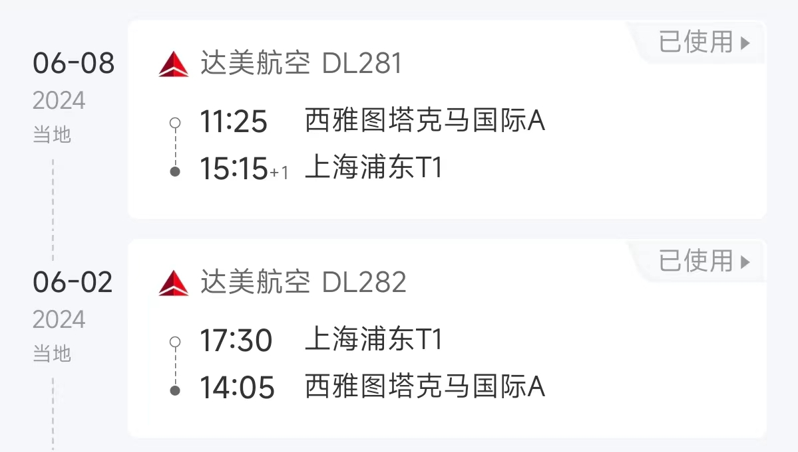
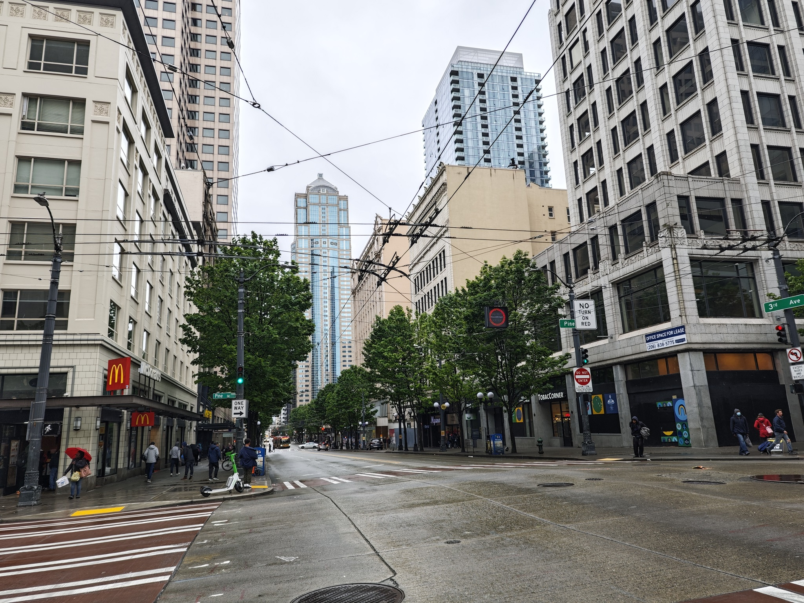
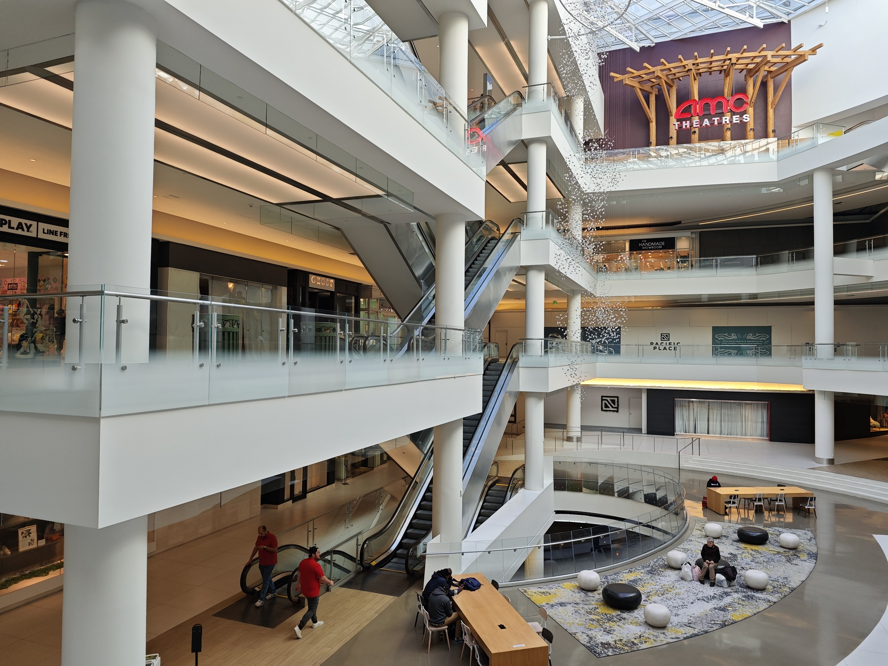
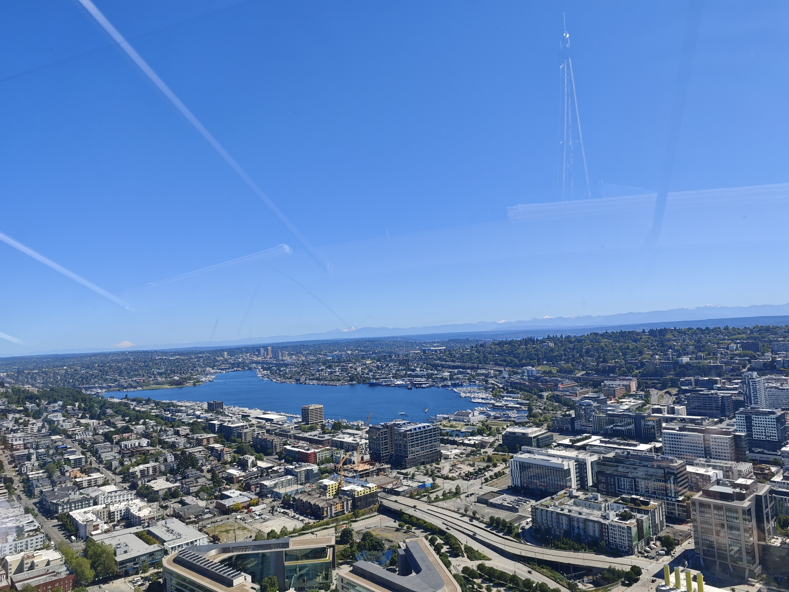
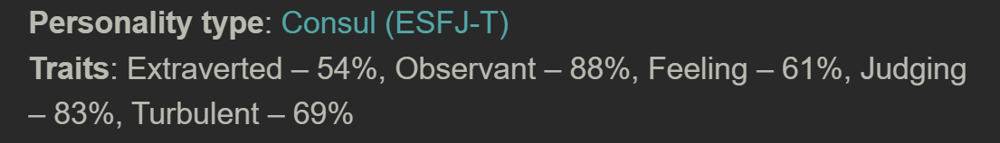
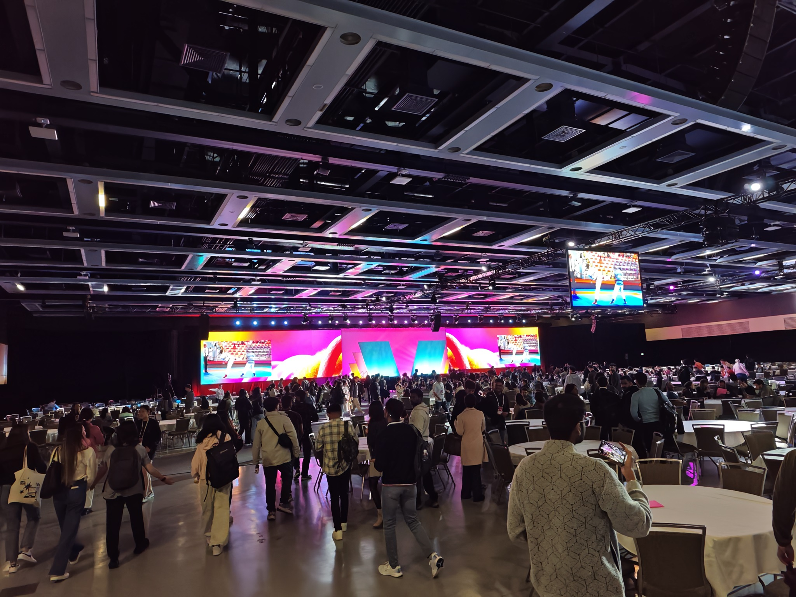

# “洗洗班味”

上班之后的生活千篇一律：起床，上班，去食堂吃午饭，去游戏室睡觉，上班，下班，看视频玩游戏，睡觉。按朋友的话来说，这样的日子会让人“班味很重”。所以当在3月份第一次听说公司组织的Aspire Start Strong+活动的时候，我虽然不是那么一个喜欢旅游的人，但是还是仍然感觉非常激动，很珍惜这个机会，毕竟这个活动**由公司出钱**、**不占用自己的假期**、**和全世界去年的校招生一起去美国参加**，而因为有了这三点，活动具体是干什么的反而都不重要了，在全新的环境里给生活暂时换个节奏，按同事的话说，“洗洗班味”，是最重要的。于是开始火速走流程，给老板科普这个活动是干什么的、去北京办美签、订酒店，终于在上周成行。

# 体验另一个世界

这不是我第一次出国出境，但是确实是第一次在到美国，这个完全和国内、甚至东亚主流生活方式完全不一样的地方。

由于活动会场在市区，所以我们住在西雅图的市区（downtown）。这一个区域确实有大城市的感觉，高楼大厦鳞次栉比，由于西雅图并不平，有山，车道也普遍仅有双向四车道，第一次进市区以为回到了重庆的渝中。但是这个区域并不移居，人不多，有经典流浪汉，并且也比较危险，途中左边的麦当劳被称为“死亡麦当劳”，听说我们到达的前一天发生了枪击案，因此，第三天晚上被迫不得不在快天黑的时候出去时，我和舍友不得不加快脚步。并且，市区虽然有很多商场，但是实际上非常萧条，我们去的一个比较大的商场Pacific Place里面仅仅只有几个商店。

而在市区之外的地方，并不是国内郊区常见的农田或者工厂，而仍然是城市，只不过是一望无际的平房大house，大多数的中产生活在这里。这些地方不能叫西雅图的郊区，因为实际上是另一个小城市，各个城市有自己的downtown，甚至Apple Store和一些品牌的专卖店都只有这些小城市的购物中心才有。各个城市之间的交通，也主要以车为主。各个城市之间非常近，例如微软总部所在的Redmond和西雅图市区开车仅需30分钟，相当于[同属主城区的闵行](https://www.shmh.gov.cn/shmh/tdgll/20230509/555227.html)和人民广场之间的距离。所以，这次我深刻体验到了什么叫”没车就是没腿”。

由于我对我的驾驶技术并没有太大信心，加上市区开车成本极高，所以没有租车，所以我也只能在市区简单逛逛旅游景点，旅游景点之间的交通也是通过打车。这和国内所有资源都集中在市区的情况可谓大相径庭。

世界的不同同样也体现在社会的各个角落：和陌生人进入电梯也要打招呼，和其他人沟通时经常能看到幅度很大甚至有点夸张的表情和肢体动作，几乎每次打车遇到的司机都想和乘客聊天，甚至餐厅吃饭时，服务员的服务，结账时的流程也完全不同，于是在前一两天，干啥事都要做好出丑的准备。

# 社交，社交，还TM是社交

微软官方对这个活动的主要内容的一个关键词就是**Networking**，**社交**。整个活动总共三天，每一天都由几个讲座以及讲座之间的休息时间组成，而在休息时间，也包括讲座期间，主要工作就是和其他人社交。到这里，E人听了狂喜，I人听了害怕。而我作为一个IE各半的人（测试结果仅供参考），虽然并不害怕日常社交，但是仍然感觉有点陌生和有挑战性，完全不知道和这些来自世界各地的人会如何社交。

在活动正式开始的前一天，我所在的组织安排了一次参观交流的活动，邀请了全组织的新人去**园区参观**，以及**和组织内老板的的交流**。这种形式的参观交流活动，我也是经历过很多次了，本科时我甚至参与组织过一次组织微软俱乐部的同学去苏州微软参观交流的活动，总体体验还是比较放松的：行程都安排好了，照着做就好了，交流的时候有问题就问，不想公开问就等着私下交流的时候问，没啥好问的就划水，轻松+愉快。但这次的参观交流活动加上了浓浓的社交元素，情况就完全不一样了。从10点多登上去园区的大巴开始，一直到4点整个活动结束，社交过程一刻不停：在大巴车上，主持人就让所有人打乱座位，开始和不认识的同事聊天；下午，先和老板有一次Panel，也就是各位领导坐在前面，参与者坐在下面，领导分享，参与者提问的形式，之后，又是所有所有的参与者在一个空间里自由的交流。只有上下午中间的参观园区的Visitor Center的环节有一点休息的时间。

而接下来的三天也是同样的节奏：讲座的时间，大家坐在一个大圆桌，除了听讲座的内容，就是根据讲座的要求做一些同桌之间的交流；而在讲座时间以外，就是在一个大会场内找吃的喝的，以及社交。甚至第三天的晚上，公司组织了所有的参与者去西雅图的流行音乐博物馆（Museum of Pop Culture, MoPoP），在里面除了常规的参观博物馆展馆，还可以参与蹦迪、剧场小游戏等可能在西方世界常见的娱乐活动，而，当然，还有一个大的空间可以用于社交。每天这样的节奏从早到晚，使得每天晚上几乎都是沾枕头就能睡着。

# 语言壁垒

由于我从小到大都是生活在汉语的环境下，社交遇到的第一个问题就是**语言**。

虽说工作在外企，但是这只意味着工作相关的文字资料以及占据少比例时间的会议是英文的，而其他时候，尤其是日常的沟通交流，仍然使用汉语。而当处在英语环境下的时候，情况就完全不一样了。读写英文对大多数来说都不是问题，看到不会的可以查，写的时候可以慢慢斟酌用词，也可以让AI帮忙。而开会的时候，由于大多数内容都是工作相关的，工作相关的内容本来从头就是用英文思考的，所以听说没有遇到什么大的障碍，即使遇到可能听不懂的，也可以用Teams的Live Caption实时生成字幕，把听转换为读，难度一下子就降下来了。而日常交流最重要的是听和说的情况就完全不一样了。

关于听，容易出现的一个问题就是**在关键的地方卡壳**，这会使聊天进入一个不停地**pardon**/**sorry**状态，很影响聊天的氛围。第二天中午吃饭的时候和几个来自美国的员工聊关于电动汽车的事情，其中一个美国员工提到美国对中国的电动汽车加征了100%的关税**tariff**。这个词如果写出来给我看我还是认识的，但是当时完全没有反应过来，于是聊天被迫中断了一下。还好我很快根据语境猜出了这个词是在说关税，聊天才可以继续进行下去。这还是比较容易的情况，而更多的例子是伙伴说了一句话，我甚至没有听出这句话是在问问题，敷衍地笑笑，然后尴尬地发现聊天中断了，甚至还不知道为什么。另外，众所周知，微软、亚马逊等公司招募在大量的来自全世界的员工，本次活动我推测来自美国、英国等英语国家的员工甚至不到一半，而非英语国家的员工的英文也有不同的口音，毫不夸张地说，每听一句话都说一下**sorry**，让对方重复一下。

而至于说，说出一个句子简单，但要流畅、快速地说出完整的、简单的句子继续对话，这让我耗费了大量精力，以至于时间长了我甚至有点不敢说话了。去园区参观的车程总共20分钟，我在对话刚开始的时候，除了找关键词表达意思之外，还可以注意句子的时态、语法等细节。但是聊到后面，尤其是聊到熟悉或者不熟悉的话题、情绪比较激动的时候，就只能保证表达出关键词，什么`is`/`was`、问句结构，通通一边去吧。另外，由于中文和英文的语言表达习惯不一样，而我仍然是用中文思考，加一个汉译英的环节，这会使得说出来的话不那么简洁，甚至感觉有点奇怪。有一次打车的时候，我想问司机**最近有没有接到其他同样来自微软的员工**。由于我仍然是中文思维，要说出来需要进行一次汉译英，但是定语稍微一长（这里的**同样来自微软**），我就喜欢用从句，于是我脱口而出：

> Have you taken any other people **who also come from Microsoft**?

说到*who*的时候，我就感觉有点奇怪，于是后面变得有点不自信，说话声音都变小了。果不其然，司机没有听清，于是我又重新说了一句这段话，这时才感觉到，似乎没有必要这样说，一个简单的**Microsoft employees**甚至**Microsoft people**就行。

总的来说，这是我第一次在全英文的环境下的与人日常交流。虽然大家都会很耐心，但是在本来就不是很擅长日常聊天的情况下叠加一个语言debuff，仍然让我精疲力竭。我一直以为我的英语能力还可以，每天都无字幕看YouTube视频，但是真到对应的环境下，还是处处体现出不适应。语言果然还是要一个环境，没有环境的语言就是哑巴语言，如果之后真被relocate到国外，第一个要迈的坎就是语言壁垒。

# 同龄人社交和环境

由于公司在上海的规模不大，而且近几年校招的名额非常少，分配到每个组的新人就更少，而且绝大多数员工来公司都不是来奋斗的（奋斗比滚出微软！），所以公司的氛围比较传统，公司就是工作，到点就回家，甚至公司组织的活动都是面向家庭的。这对于有家庭的人来说当然是天堂，但是对于我这种刚毕业单身狗来说，虽然工作也非常轻松愉快，但是同样容易感觉无聊。再加上公司所在的地理位置又是邻近一个50年代开始开发的郊区卫星城，周边的城建、商业、住房等都是纯纯的老城区模样，居民也是中老年人居多，甚至在附近的羽毛球俱乐部里每次都能遇上头发花白的老大爷老奶奶，毛估所有参与者的平均年龄没有40也得有35。虽然有两个高校，但是高校自成一体，基本和社会面不在一个圈子里。本来我并没有注意到身边环境的特征，而契机是在今年春节回家时，和研究生同学约在家里的附近羽毛球馆，发现球馆里全是年轻人的时候，我突然意识到，我所处的环境似乎有点老了。

这次去了Aspire活动，我体验到了一种年轻人的环境。所有参与者都是2023年4月后加入微软的校招新员工，背景都是类似的，很多人还愿意去互相了解，对职业发展抱有期待，聊天的时候更容易有共同话题，即使都只是工作中，由于同处同一个职业阶段，所以大家思考的、追求的东西基本都是类似的。在去园区参观的路上，我和一位来自印度的女生聊了很久，虽然上文提到，对我来说听说仍然不够流畅，但是仍然交流了很多，为什么选择学计算机，为什么来微软，来美国的感受，组内的情况，想要什么样的生活。我们甚至后面还留了邮箱，互相发了几封极其类似上学时英语课写的小作文（英语课小作业还是有用的:D）。在活动中，也认识了来自印度、美国、日本、以色列等各个地方的新同事。有的同事很符合“刻板印象”，有的甚至完全相反；有的主动过来聊天，完全被带飞，而有的交流寥寥几句后，似乎只能以*Nice to meet you*结束；有的加了LinkedIn等联系方式，有的甚至出现在面前也不会再认出来。在认识新人之外，同样也见了很多许久没有见面的、同在微软的南大同学，聊的话题除了工作，还包括本科时期经过的一些事情，似乎又回到了2020年前的本科生活。

回想这次活动之前和期间的自己的感受，我发现**环境真的很影响人**。为什么在学校的时候，和同学交朋友似乎很容易？朝夕相处，同处一个人生阶段，工作和休息的节奏、思考、烦恼、追求的事情都是一致的，自然而然就能有话聊，相互理解，发展关系。而在工作后，有家庭的同事的生活的重心自然而然会放到家庭中去，没有家庭的也会去形成以自己为主的工作生活节奏，不会轻易因为他人而改变，即使参加活动，目的性也都极为明确，也就是说，每个人或多或少都会稳定到一个适合自己的生活方式上。而环境又会影响回每个人。如果实验室的同学都在努力学习发论文，那么自己不去科研就会被认为为“异类”；如果身边的人都到处参加活动，那么自己可能也在某一刻想去试试；如果身边的人的生活都非常稳定，那自己也得主动或者被动地去寻找一个稳定的生活方式。而这个环境的不同，才是上学和上班最大的区别。

# 重回现实

由于没有找到固定的搭子抱团，所以我并没有安排活动的后续旅程，活动结束后在市区和几位之前认识的小伙伴简单玩了玩市区景点后就回上海了。

回想起来，我到底得到了什么？在西雅图的全新的环境中，锻炼了一下之前一直处于哑巴状态的英语，体验了美国的生活方式，和来自全世界各地的同龄人高强度社会……这是一次独一无二，甚至很可能不会再有第二次的机会。感谢在西雅图的6天短暂、全新，比现在更有活力的生活，让我更理解环境的意义，让我在解决“我想要什么”这个终极问题的路上更进一步。

