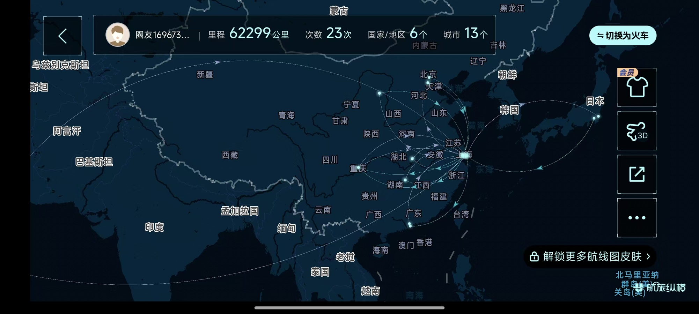
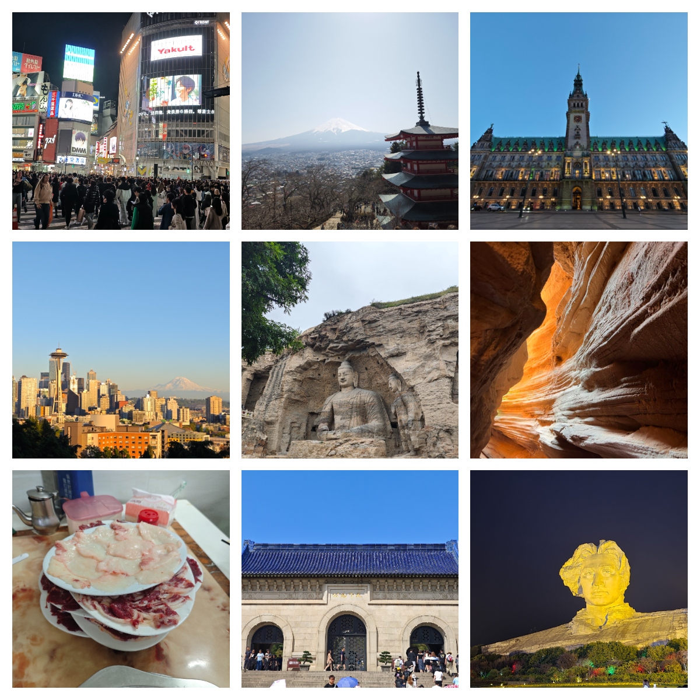
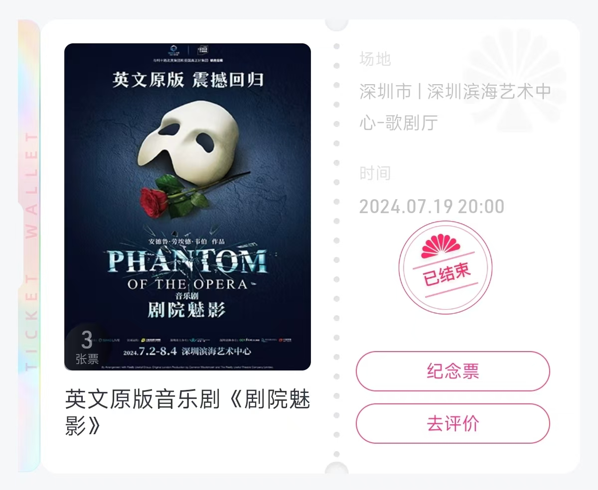
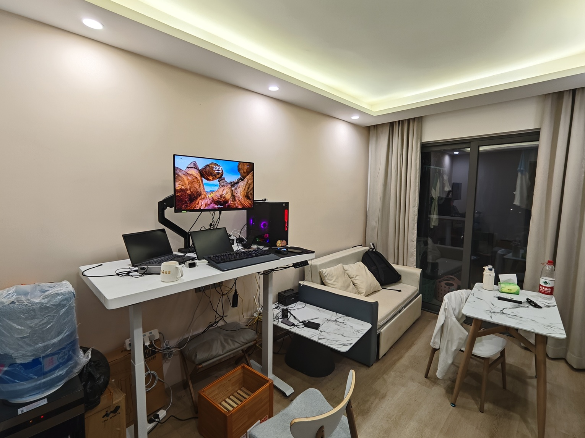
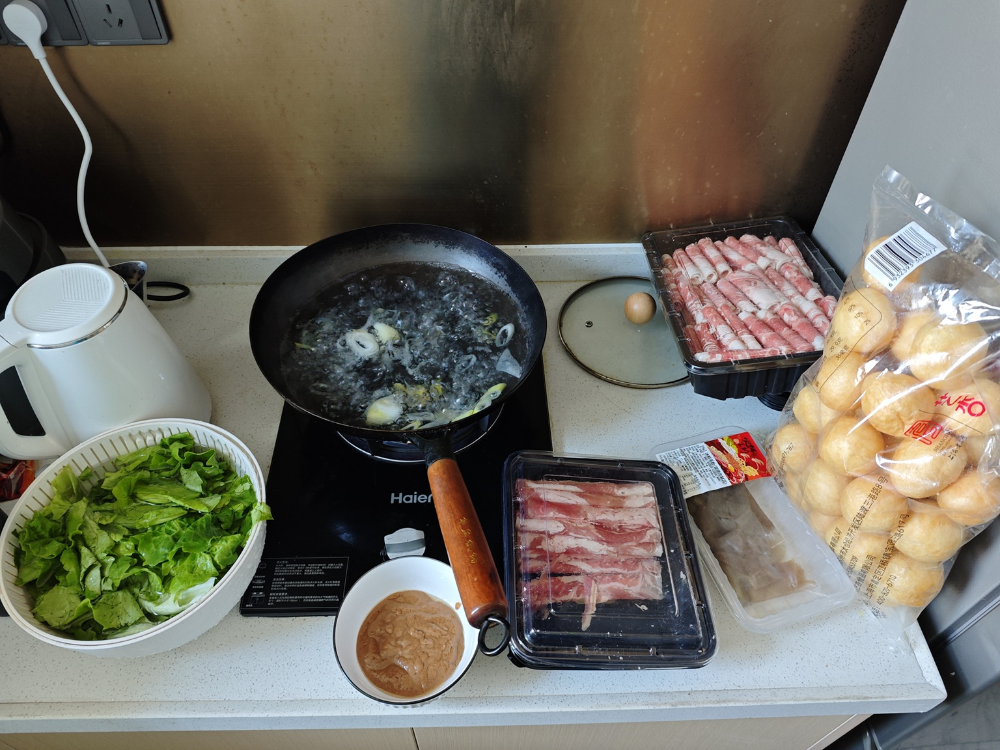
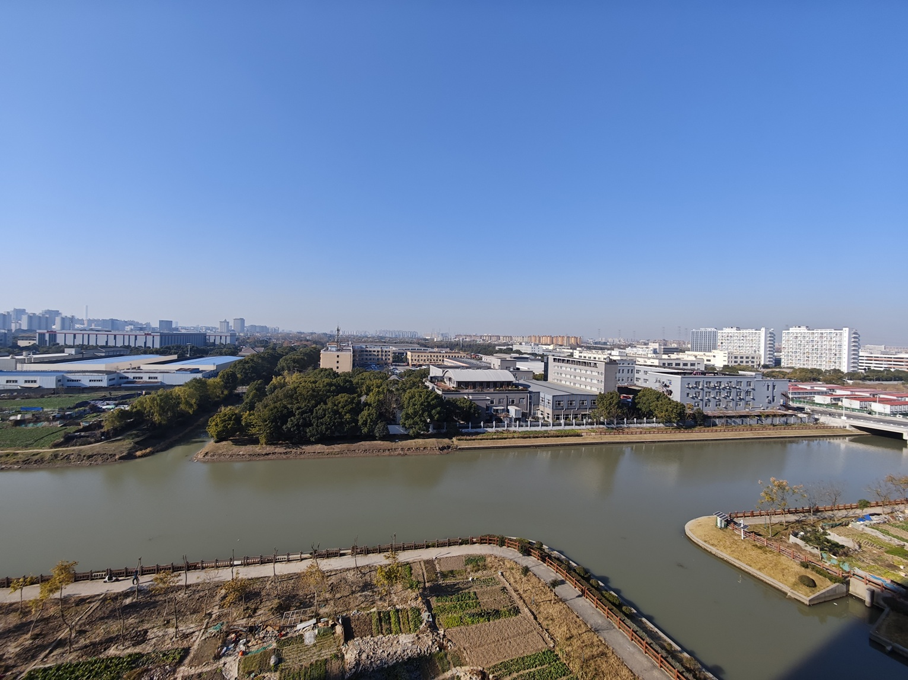
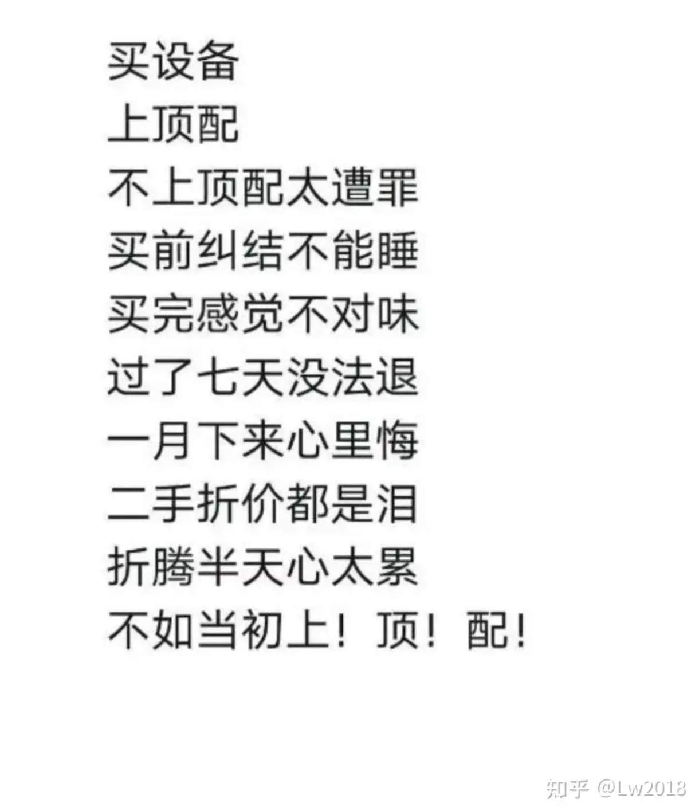
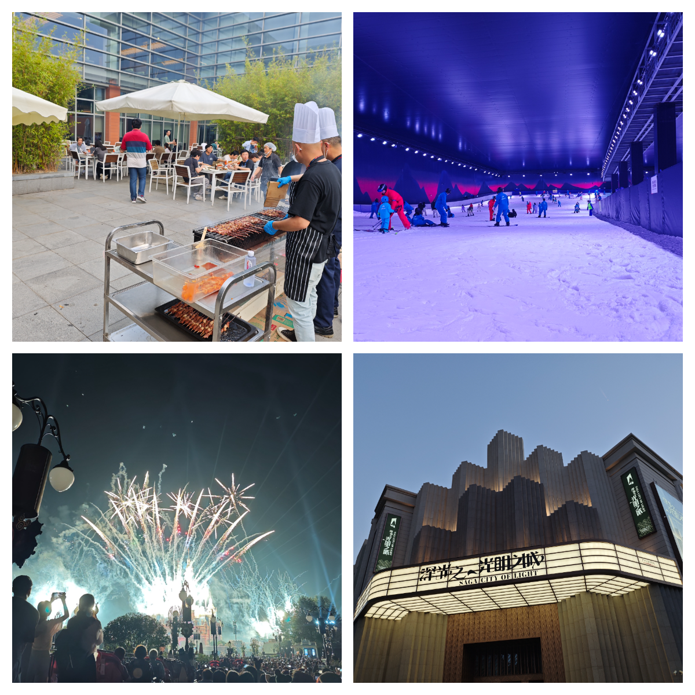

# 最好的年龄该如何度过？通过深入体验现有的生活

毕业后的第一年，没有物质压力，有大把时间可以自由支配。**这最好的年龄该怎样度过？** 我今年的答案：**深入体验现有生活**。

# 旅游，和朋友和家人刷新地图的边界

随着之前的朋友毕业、上班，有了更多时间，以及个人工作生活的稳定，今年的旅行数量可能大于之前26年来的总和，三个国家，国内十余个城市和景点。根据航旅纵横的数据，只算飞机，今年的飞行里程甚至超越了99.13%的用户。要是有规划地选择航司，现在应该能飞个银卡吧。

我不是一个非常喜欢旅游的人，如果只有一个人，外出旅游不会成为我的首要选择。正因为有了朋友和家人一起，我才能有机会和动力去打卡这些可能之前都没有听说过的地方。比旅游本身更重要的，是和朋友和家人在一起的这段经历。很感谢你们愿意花时间陪我去做我一个人不会去做的事情。

# 搬家，开启独居生活

和大多数人一样，上大学前和家人合住，上大学后和舍友合住，而在今年8月，随着合住的大学同学搬走，我终于租下了一个一室一厅的公寓，第一次开始独居生活。

我的“第一套房子”是一个公司附近的保租房公寓。好处很明显：离公司比较近（电动车10分钟），楼体和装修新，空间勉强够用，各个功能区分割比较现代和合理（甚至是三分离的卫生间），且也没有遇到太多质量问题。

但更重要的是，**没有其他选择了**！公司地处偏远，附近几乎全是老破小楼梯房，电梯房本来就寥寥无几，而离地铁和公司近的房子只有几栋10年前的动迁房，而实地看房的第一印象就是廉价的装修：本来就只是为了出租而进行的装修，在10年后更加显现出岁月的痕迹，租金却也没比保租房公寓便宜多少。

于是也不用犹豫了，很快定下合同，还没入住的时候我就迫不及待地购入了升降桌，在家人的帮助下，将这个可能会是待的时间最多的地方好好打造了一番，还正好蹭上手机号所在的运营商的活动，拉上了18块一个月500M的宽带，开始美美地独享这个小窝。

由于公寓是住宅标准，所以有正常的厨房和煤气。一个人住，也不用拘泥于吃饭的形式：想吃火锅却懒得买电火锅，也可以直接凑在灶台前吃。

为了解锁更多菜谱，我还买入了一个电压力锅，平时可以当快速的电饭锅，当想做需要长时间炖煮的菜品，如烧牛腩、焗鸡、梅菜烧肉时，因为锅可以产生压力，所以这些菜品都可以用一小时左右的时间完成，操作也非常方便。

这次搬家，算是达成了**独立生活**的第一个小目标。接下来又追求什么呢？

公司有非常宽松的在家工作的政策，越来越老油条的我去公司的次数越来越少。而只要进城，不管具体去哪儿，甚至都得先花40分钟才能到城市边缘。即使不进城，当我在外完成每天8000步，差不多6-7km的散步任务时，路线上只有老破小、厂房和大货车。

突然有一天想通了：既然不用每天通勤，为何不进城呢？公寓的单位租金已经100块/平米，接近中外环的楼梯房，为什么不再加点钱，去体验真正的大城市生活？

下列打油诗来自[这个知乎回答](https://www.zhihu.com/question/601462384/answer/3178762190)，我觉得不仅是设备，任何选择都适用此原理。

明年的7、8月又将迎来搬家，我已经开始期待下一个房子，以及真正的住在大城市的体验了。

# 工作，享受生活，稳定？

今年是第一个完整工作的年份，也第一次享受了公司组织的福利和活动：

- 6月份的西雅图之行是个意外之喜，花了公司3万块免费旅游，[在西雅图给生活换了个环境](/articles/a-change-of-environment-in-seattle)
- 每年例行的迪士尼票还正好在国庆大假前，人流量反常地少，以至于没有买速通还能一天玩完所有项目
- 年底第一次接触滑雪，直接选择找教练练单板，2小时好歹学会了落叶飘，能正常滑下来了

我对公司和小组的工作也有更深入的理解。我发现，我很幸运在一个“小而美”的组：

- 产出为运维领域的技术产品，并不是在做黄赌毒、投机倒把、坑蒙拐骗的帮凶，符合我自己的价值观
- 所用技术本身和市场并不过于脱节，且以功能而非技术分工，鼓励大家了解项目的各个方面，而非仅仅是个螺丝钉
- 主要为企业用户，以稳定为重，节奏较慢
- 同事友好，人员组成也比较稳定

再加上宽松和假期和在家工作政策，听起来是一个性价比高、适合享受生活的工作。

当然，有时候也会有一些担忧：

- 无法和当前大热的AI扯上关系，发展空间受限
- 客户本身的需求也不复杂，造成产品深度和难度不够
- 想卷都卷不起来，很多时候有一拳打在棉花上的感觉，再加上经典的大公司病，很多时间和精力都无谓浪费掉了
- 实习两年后我甚至仍然是全组最年轻的成员，没有新人加入

所谓相对**稳定**也是当年选择公司的一个重要原因。

- 作为J人，有计划、有秩序的生活让我觉得安心
- 大公司确实有比较成熟的组织结构、产品规划、工作流程以及晋升路线，作为小兵需要考虑和有能力左右的事情不多
- 公司大多数同事都是要么毕业就来，要么在外面没干多长时间就过来并在此长时间工作

可是，

- 仅今年上半年期间，认识的朋友所在的组有的被多次调整所在组织和业务，有的直接离开中国，像我组这样组织结构和业务没有变化的反而是少数
- 也就在一年以前，公司因为在AI领域的大手笔动作，股价接连高升，彷佛50年的企业即将迎来第二春，结果今年上半年多次组织结构调整，几次财报均不达预期，明年初裁员的传言连父母都有所耳闻
- 认识了Intel的被裁员的老哥，想起五年前第一次来到闵大荒这边看到Intel的大楼，还觉得Intel的统治地位牢不可破，谁能想到也就不到5年，Intel的市值已经不足当年濒临倒闭的AMD一半

仅仅半年就能发生这么多事情，再加上特朗普再次上台，世界局势的变化，谁知道明天又会有什么惊喜？

# 该有所改变吗？

回答文章开头，**最好的年龄该如何度过？**，为什么会有这么一个问题？

今年有一次羽毛球局，和一个偶尔组的同事大姐姐混双打男双，打完后她对我说的第一句话是：**“感觉你的身体素质不如之前”**。

混双打男双局里，混双方男队员的能力能很大程度影响表现，而能力主要又分技术和身体素质。我没有做技术和身体素质的专门训练，但我自认为和之前也没有什么区别。排除了这些因素，那为什么身体素质下降了？只能归结于**年龄大了一岁**。20多岁是人类的巅峰年龄，而我已经处于20多岁的下半场，身体素质已经开始走下坡路，时间已经不站在我的这边。

工作之后，生活逐渐稳定，可内心却充满了各种患得患失：

- 想留在大城市，但又觉得付出了金钱和住房质量，却并没有充分利用到大城市独有的东西
- 清晰地明白当前平淡的生活状态的珍贵，但有时候又想追求更年轻化、更有活力的生活
- 舍不得这在各个方面都十分优秀的工作，但又认识到稳定的预期已不存在，变化不可避免

该维持现有状态，还是应该有所改变？

今年我也面临过一些选择，进行了或者仍然在进行很多心理斗争。在这些选择和心理斗争的过程中，**心里没有决定**、**身体没有行动**二者互为因果，最终**保持不变**成为了今年对这个问题的答案。

今年我游戏时间最长的游戏是《沙石镇时光》。在这款游戏里，玩家扮演一个新的沙石镇工坊主，去到一个没落的城镇开始职业生涯，认识了大量的镇民、经历了各种各样的事，最终让这个没落的城镇重现辉煌。

这游戏剧情平平无奇甚至有点幼稚，好在内容丰富，设定也比较接地气。玩完后，给我印象最深刻的反而是主线的精神状态：**认同、热爱一件有意义的事，和一个团队一起去追求它**。

回想自本科以来，所有我真心投入了大量时间精力的事，都是因为我认可它。如果我不认可一件事，那么无论这件事能给我提供多大的物质回报，我都没有办法说服自己去做它。即使不得不去做，最终都放弃了。

我总是尝试做一个**理性**的人，可是这一点就是最大的不理性。很多选择，即使理性告诉我它就是最优解，即使我知道我的想法是有局限性的，可是我还是无法接受。

明年还会出现选择，且会更加急迫。最好的年龄正在慢慢消失，明年我会做出什么选择呢？是充分珍惜当前难得的生活工作状态，在已经拥有的基础上尝试改良？还是打破平衡，用最好的年龄去冒险？那就只能明年才知道了。
