# 为什么选这一台？

最近有一次换笔记本的机会，因为之后需要频繁旅行，于是选择了14寸的笔记本作为主力机；考虑到平时开发经常需要占用大量内存，32G的内存不够用，需要64G。而现在轻薄本里提供64G选项的，主流的选择只有可以自己加内存的ThinkPad T14p，但是T14p的CPU和GPU性能都在轻薄本中中规中矩，且被11代酷睿折磨了5年的我，现在已经变成了十足的I黑😅。而AMD只有Max+系列的设备有搭载64G及以上内存的产品，且当前只有华硕幻X和HP ZBook Ultra G1a（又称战99Ultra）这两款。前者平板形态虽然非常帅，但是在非桌面场景下使用体验较差，所以最终选择了后者。主要配置如下：

| 配置   | 配置                              |
| ------ | --------------------------------- |
| CPU    | AMD Ryzen AI Max+ 395 16C32T Zen5 |
| 内存   | 64G LPDDR5 8000MT 4通道           |
| 硬盘   | SK Hynix PC801 2TB PCIe 4         |
| 显卡   | Radeon 8060S 20CU RDNA3.5         |
| 显示器 | 2880x1800 144Hz OLED带触屏        |
| 重量   | ~1.6kg                            |
| 电池   | 74Wh                              |

16核32线程的Zen5加20CU的RDNA 3.5居然能装在14寸的笔记本上，在这颗处理器真正面世之前简直是不可想象的。虽然用脚趾头想都知道这么小尺寸的笔记本不可能可以发挥这颗处理器的全部性能，但是，规模大了，提高多少功耗就能提高多少性能，而实测下来这台笔记本的功耗在14寸的笔记本中也不低，所以在所有同样的尺寸和功耗等级的笔记本中，这颗CPU的性能应该也是最强的。而四通道内存甚至在MSDT平台上花多少钱都体验不到。

由于价格原因，大多数人应该没有机会能用到这样的笔记本，网上也少有这款设备真实的使用体验的评测。到现在也算用了这个处理器的笔记本3周了，可以说说体验。

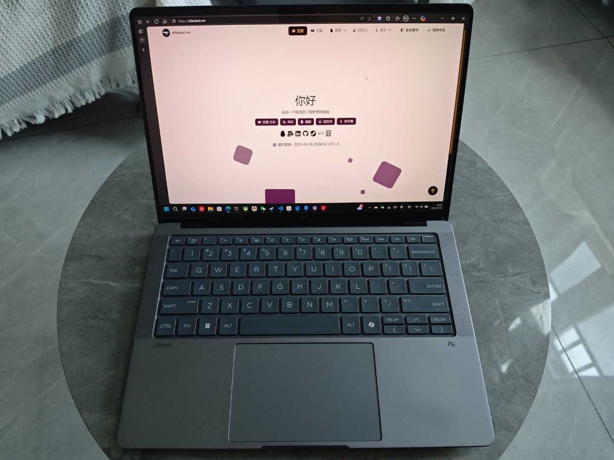

# 性能和功耗

买这台笔记本就是为了性能。这台笔记本的性能确实很强。

插电的状态下CPU-Z可以跑760/12300左右。这段时间内CPU功耗最高80W，虽然不能一直持续，但是长时间跑仍然可以稳定70W。14寸笔记本能稳定70W的据我所知还是比较少的，再加上这个CPU恐怖的规模，基本可以确定这颗CPU的性能应该就是这个尺寸笔记本的顶尖了。

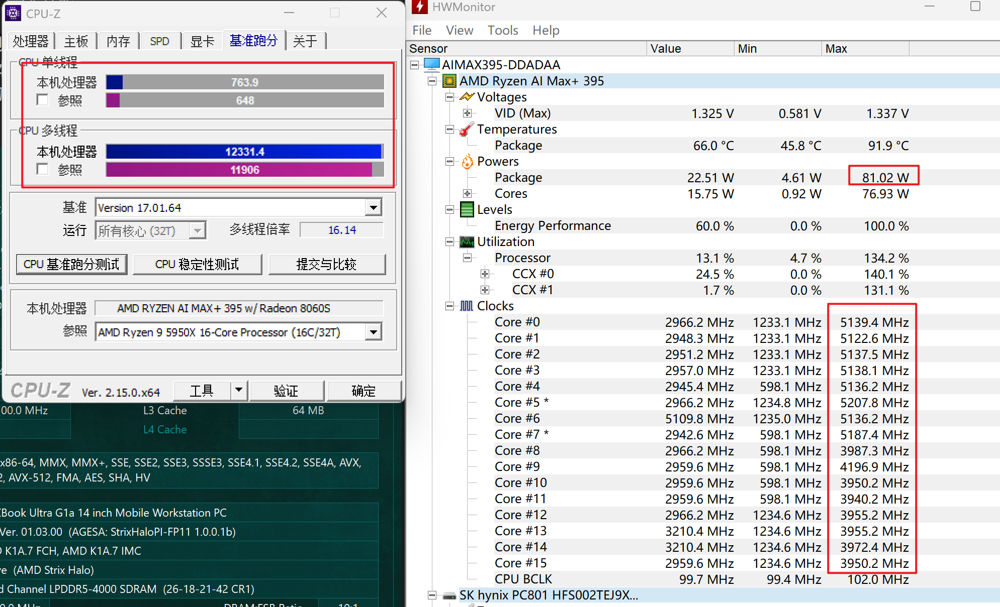

离电状态下CPU-Z的结果是326/6892，正常功耗在35W，长时间功耗在25W左右，这个功耗在离电状态下也比较正常，并且可以看出，CPU在低功耗下倾向于重点使用一个CCD，这也是控制功耗的一个做法。

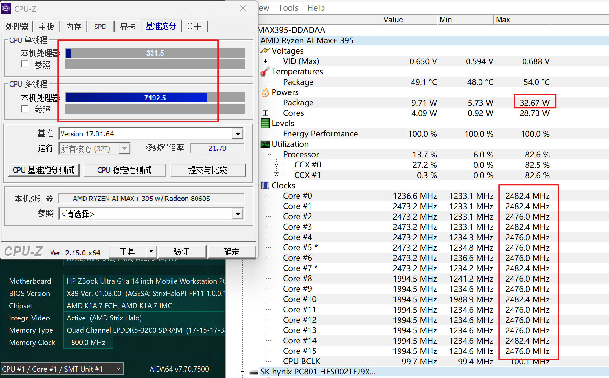

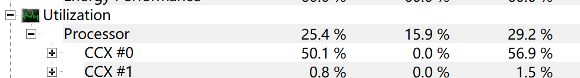

打游戏的话，最近只玩了三角洲，大战场下2880*1800分辨率超高画质有100帧左右。

内存性能测试结果这里也放一下。考虑到是LPDDR5内存，延迟较高，但是读写性能确实体现出了4通道内存的水平。

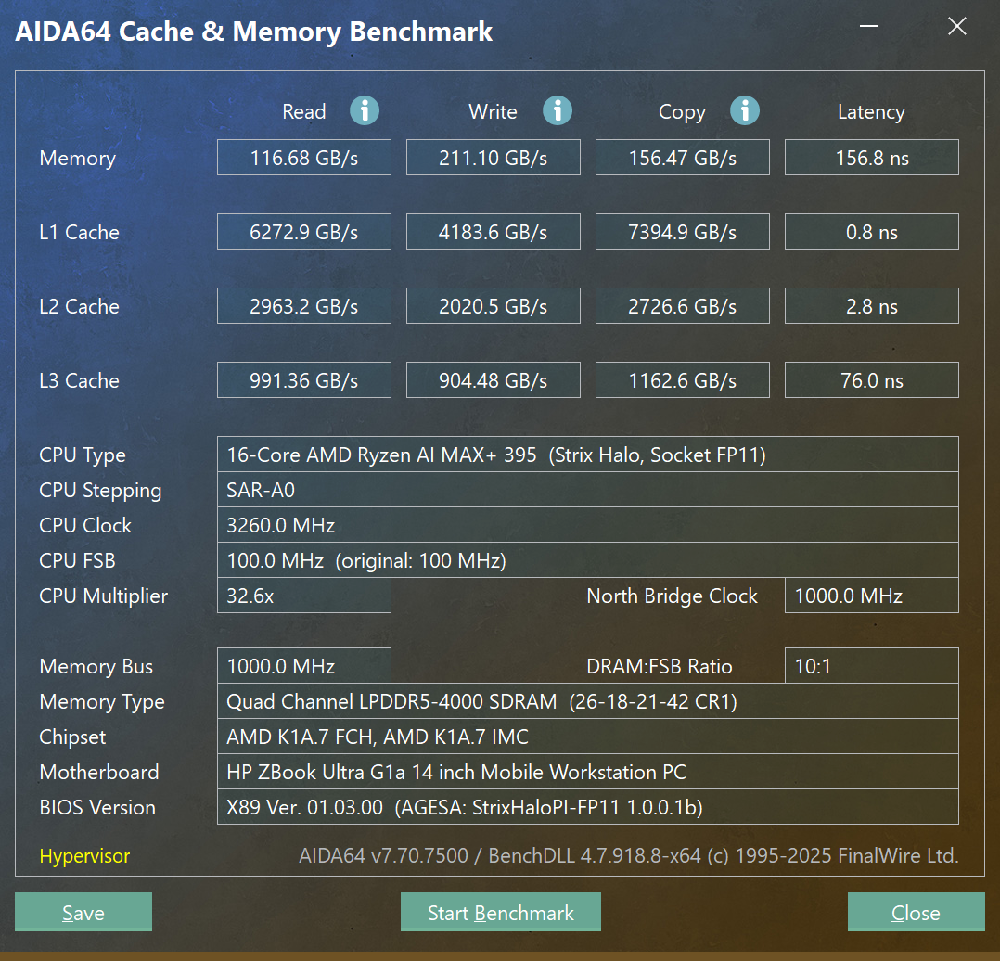

# 续航

影响笔记本续航的因素有很多，并且随着驱动的更新，结果也会变化，这里只说一下我这段时间的使用情况。在正常的主要使用微信和浏览器的办公场景下，CPU基本上在6-15W范围波动，整机功耗12-20W。由于电池是74Wh，所以整机续航在5小时左右。

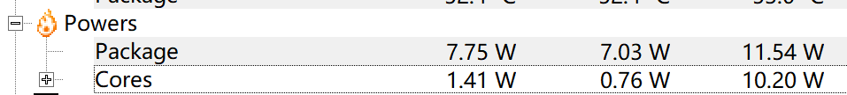

这个续航表现只能说中规中矩。主要原因我认为还是空载功耗仍然太高。上面这个图里，虽然核心只占了1.41W，但是整个CPU居然消耗了7.75W，和Lunar Lake以及苹果M系列处理器的1W以下的外围功耗比起来，这个功耗实在是过于离谱了。

# 充电

万万没想到，这台电脑的充电情况比我遇到过的所有设备都要复杂。

## PD 100W以下不可用

首先，这台电脑的充电器是C口的，没有问题。但是，这台电脑**并不支持最常见的PD 65W充电！** 插入PD 65W充电器后直接不充电，而不是像一些联想笔记本一样慢速充电。

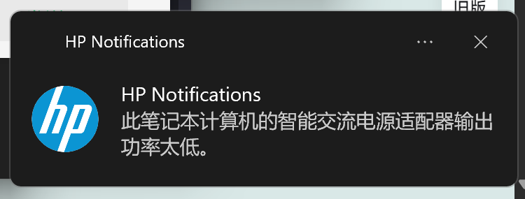

研究后发现，这台设备的包装盒上明确写着仅支持100W以上的PD充电器。

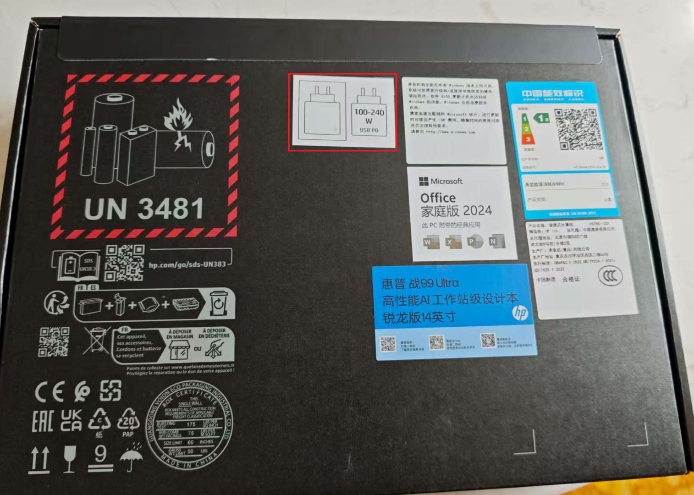

但是具体测试下来，设备支持联想T34WD-40([京东](https://item.jd.com/100238413318.html))上的96W Type-C供电，但是系统会提示低功耗充电器，且CPU功耗被限制在了45W。在这个功耗限制下，CPU-Z全核最高频率2.8Ghz，跑分9500左右，比未限制状态下的12300低了22%，还是下降得比较严重的。并且，现在市面上，除了DELL有两款支持PD 140W给笔记本供电的显示器外，其他显示器都最高只支持90W。所以一线通，这个我本来已经习以为常的办公解决方案，现在也不得不放弃了，在工作时必须再插一个充电器。

## 高功率PD充电器兼容性问题

设备自带的充电器是支持PD 140W的大板砖，除了重，没什么问题。

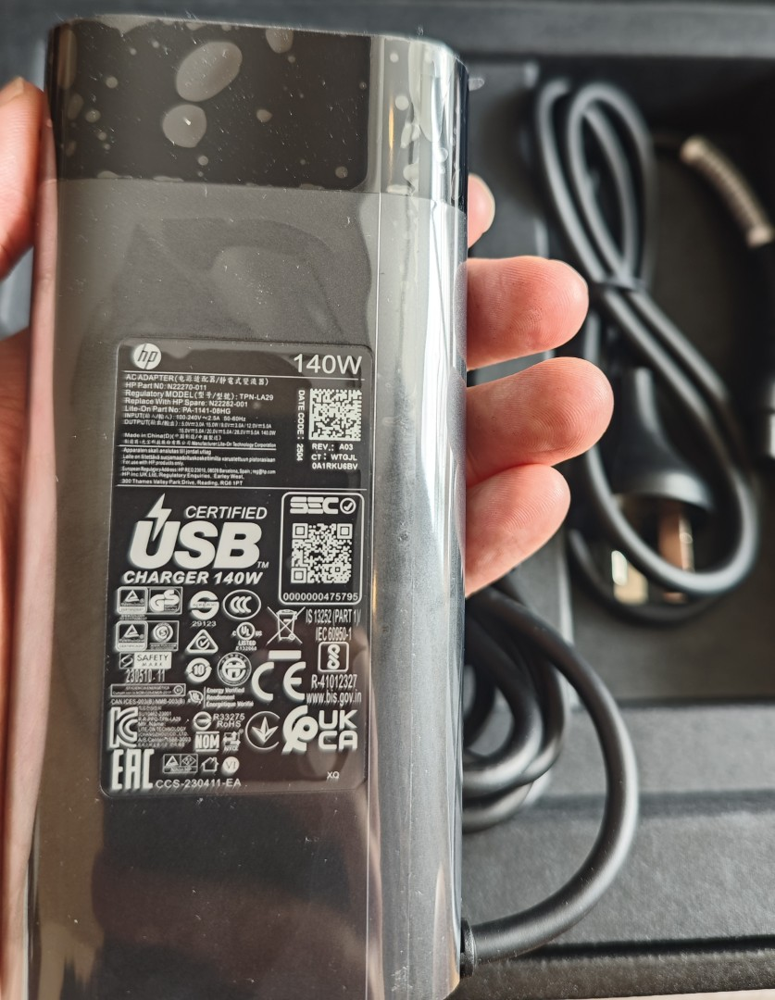

从上可以看到，其支持28V 5A也就是PD标准的140W的充电器。了解了一下，目前市面上真正在使用PD标准进行高功率充电器笔记本，似乎也就只有MBP一家了。没想到苹果的充电在手机上扭扭捏捏，好不容易搞个C口还有一大堆兼容问题，反而在笔记本上热情拥抱标准。

可能是覆盖的产品太少，支持这个标准的充电器并不多，并且同样是声称支持MBP和这个标准的充电器，在这台电脑上仍然存在兼容性问题。

酷态科的15号充电器是140W充电器里价格最便宜的（179不带线），支持小米快充，也声称支持MBP，但是实际使用中并不兼容这台电脑，插入电脑后，**系统充电图标显示一下，HP的软件弹出如下的提示并且系统稍微卡一下，然后马上断开**，以此循环。为了验证是不是线的问题，我还快速购入了酷态科的支持240W的6A线，但是问题依旧。

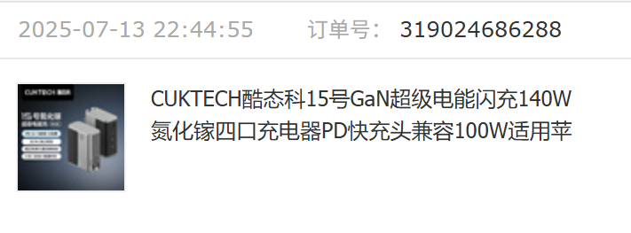

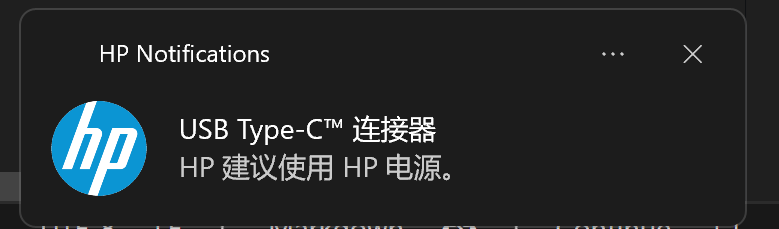

没有办法，只能换了Anker的充电器。虽然Anker的产品相比起来都更贵，但是考虑到Anker牌子和销量更大，兼容性应该更好，于是花更高的价格（279）购入了Anker的支持140W的充电器。而这个充电器确实终于可以用了，但是仍然会有时候会弹出上面的提示并且系统会卡一下。合理怀疑这个问题应该是系统驱动的问题，可能是随着驱动更新解决，但现在也没什么拆塔办法。

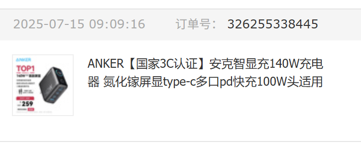

这个充电器带一个屏幕，可以实时显示系统使用的功耗。在CPU-Z跑分、CPU功耗在70W左右时候，整机功耗为120W+，100W的PD确实不能发挥整台机器的所有能力。

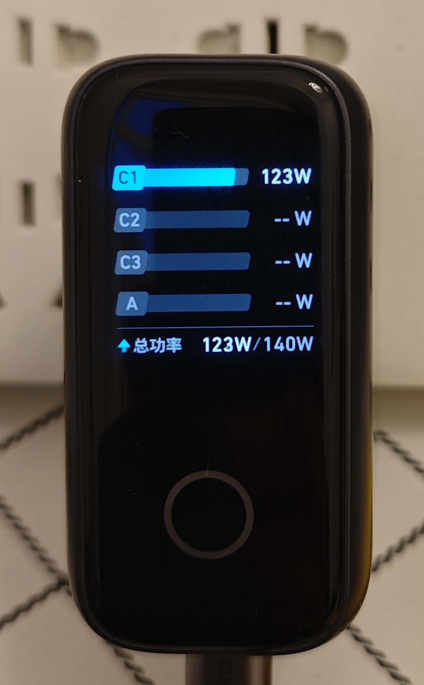

# 内存和显存共享，但是……

搭载这块CPU的设备的宣传材料都是本地跑AI大模型。内存和显存共享芯片确实是一个大卖点。

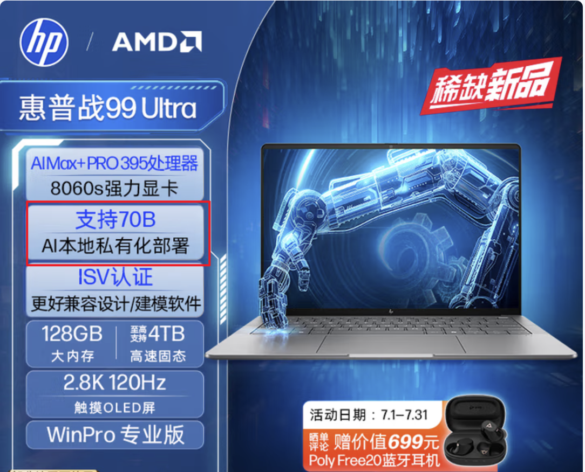

可是，它并不是像苹果那样，完全动态地在运行时分配内存和显存，而是**需要在BIOS里将固定量的内存分配给显存**，且分配给显存的内存就不可以再作为系统的内存使用了。

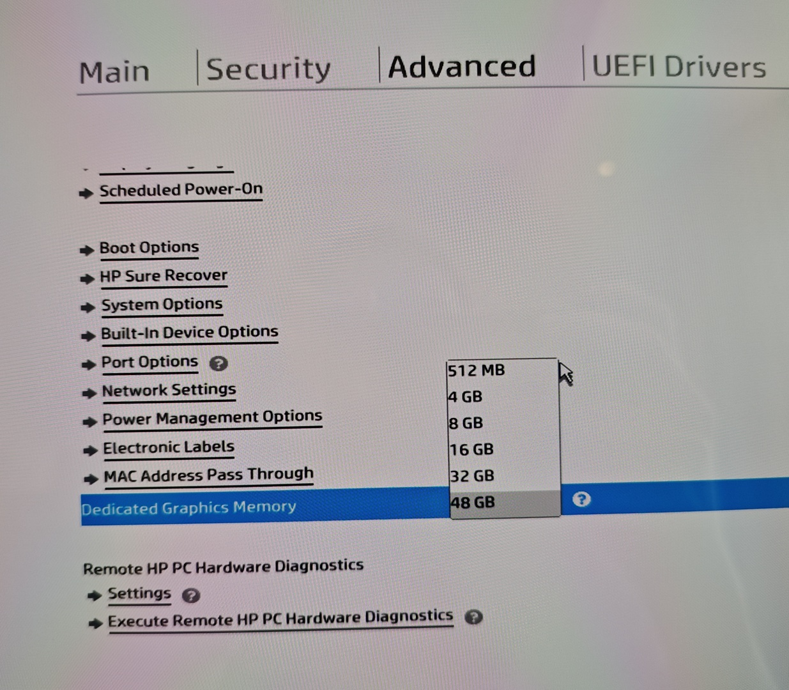

如上图所示，我的64G版本，可以手动选择将512MB、4GB、8GB、16GB、32GB或48GB的内存分配给显存。我日常一般是分配8G，于是日常就只有55G的内存可用了。

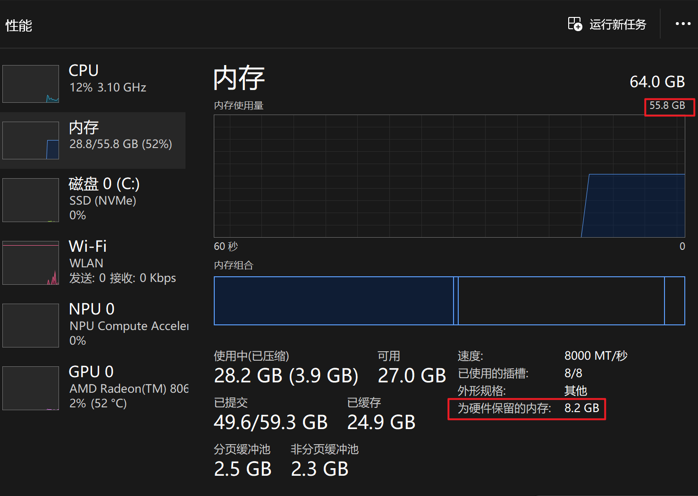

从硬件来说，确实是融合内存：内存和显存共享一块芯片。四通道内存也比常见的双通道内存带宽更高，更适合显卡使用。但是这个具体实现上离最理想的由硬件自己决定分配内存给显存还是有差距。

# 模具、外围配置等

这台设备的模具及外围配置同样一般。一句话总结：CPU以外就是个6000块左右设备的水平。

厚度和重量：最厚处18.5mm，重量1.6kg左右，和MBP一个水平，和轻薄不沾边（考虑到我之前的笔记本是980g的Yoga Carbon，这落差就更大了）

屏幕：一块2880x1800 144Hz的OLED屏幕，但是最高亮度只有400nit，且是镜面屏、触控层存在网格纹，甚至似乎还是PWM调光。

触控板：大小、滑动和按键手感还可以，但是并非压感触控

键盘：中规中矩的笔记本键盘，和ThinkPad等不可比。

另外还有一些小问题，例如

- 有的时候突然无法调整屏幕亮度，只能重启才能解决

- 无法连接到华为路由X1 Pro的Wi-Fi 7热点，只能连接到Wi-Fi 5的兼容模式

# 总结

综上，虽然这台笔记本性能很强，但是我还是不推荐这台笔记本给绝大多数人。

- 对于需要64G内存的，ThinkPad T14p除了CPU之外，完全满足需求
- 对于需要打游戏的，20CU的Radeon 8060S在2K级别分辨率下可用，但是A卡仍然存在一定兼容性问题，且没有DLSS等老黄黑科技加持，游戏体验仍然不如NVIDIA独显的。同样的价格已经可以买幻14这类搭载NVIDIA独显的游戏本了
- 对于需要跑AI应用的，395这块CPU我觉得非常适合在一体机上使用。目前市面上搭载395+128G内存的一体机价格在13000-15000，且性能释放在100W以上，完全没有必要花更高的价格买一台笔记本（战99Ultra 395+128G的配置国补后仍然需要24000）

这种小众机器看着非常诱人，但是价格昂贵，和外围设备兼容性存疑，遇到问题（例如充电器）都无法在网上找到解决方案，厂商的后续支持也会比较有限。只有像我这样什么都要的且愿意折腾的，才可以建议试试这台机器😊。

这台机器在史无前例地在14寸的机器下提供了64G/128G + 16C32T的性能。虽然表现很亮眼，但是OEM的设备少，价格贵，销量也低，后续AMD还会不会出下一代呢？