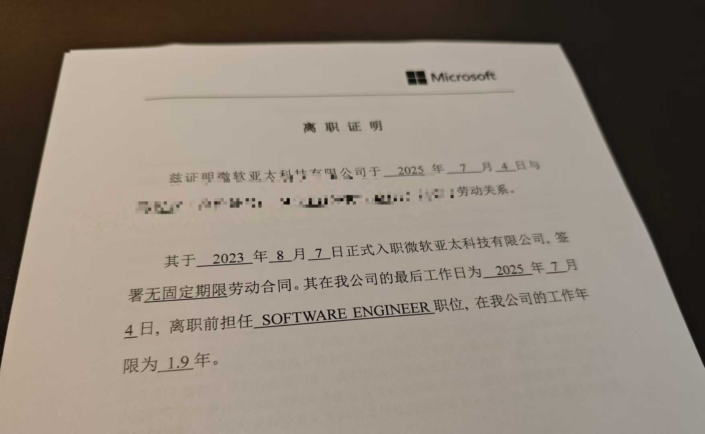
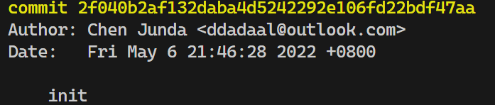
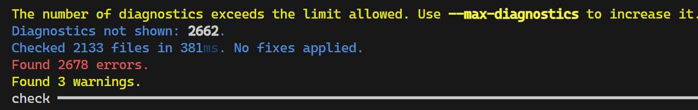
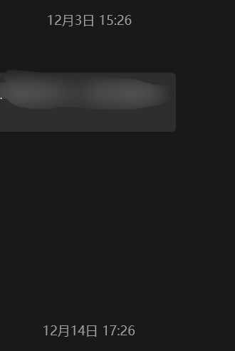
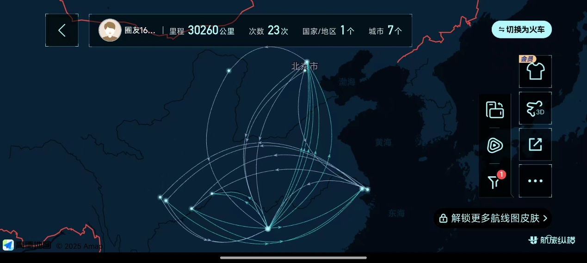
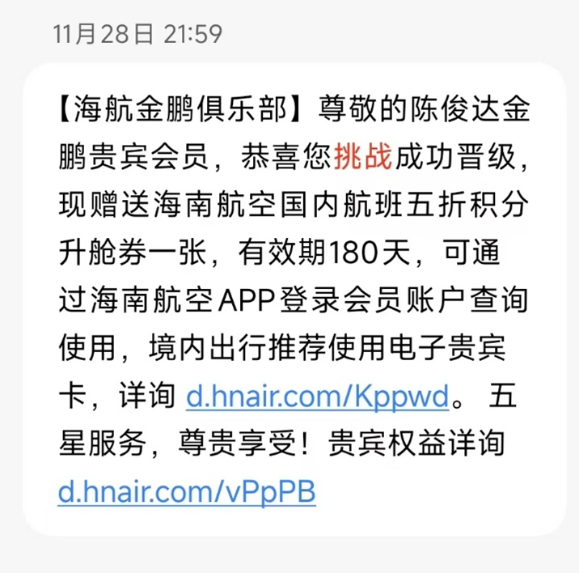

# 主动选择改变

和去年不同，这一年的主题是改变。改变了工作地点，改变了工作角色，改变了城市，改变了生活方式，主动选择了一个未知的、混乱的

# 离职，一个一定会做出的选择

不知道什么时候，我开始认为离开微软是一个艰难、遗憾、但是又一定会发生的事情。

一方面，在公司两年来，虽然绩效都是拉满，但是所做的、所参与的所有项目都胎死腹中，而新的被分配的AI有关的项目怎么看都很不靠谱，很难推动；年初，校招进微软，待了十余年的直接manager从公司离职；身边同事的升职空间和奖金肉眼可见的越来越小；而每个季度都能传出裁员的消息，和身边同事讨论的都是裁员、relocate、大礼包。

另一方面，可能是所有初进社会人的共同点，总是对现状不满，总是还有着自己的想法，想着换一个环境可能会更能实现自己的理想。

想着早晚会做，不如现在就做。于是我在我第一份工作的第23个月，在2025年正好过了一半的日子，我终于决定主动踏出这一步。

可能最黑色幽默的是，我那在之前从不停歇的裁员潮中稳如磐石的组，在我离开三个月后，被全部裁员。也就是说，这一次，我是否主动选择，对结果并没有什么变化，反而主动让我与20多W的赔偿金失之交臂。

# “回到”“原”工作

新的工作，其实也没有那么新：“不新”体现在我回到了研究生期间的、由我从第一行开始从零开始的项目，并且一直以兼职的身份在参与。而“新”则是工作内容的新。从兼职到全职，从一个“局外人”到一个“局内人”，看似相同的工作，看似可以回到研究生期间以及兼职期间的更积极主动的工作状态，但其实是进入一个全新的、未知的、不停地尝试和否定的循环。

## 解决技术问题？

俗话说，所有软件项目到后面都会变成屎山。更别提一个一开始就是没有好好设计，作为一个玩物开始的项目了。

四年可以发生很多事情：项目从开源到闭源，连带着很多设计都需要跟着改变；所使用的框架和技术从无到有，群雄争霸到逐渐稳定；项目功能逐渐增多，需求越来越复杂，发展目标越来越不清晰……在这么大的变化下，事情总是会朝着阻力最小的方向发展。而ToG项目的本质，就决定了大部分工作都是纯业务的，甚至于还会专门花精力做一些不可复制的、临时性的工作。看起来这些工作很没有价值？可是以业务的眼光看，这些工作才是有价值的。

- 项目中大量使用全局变量维持全局状态？无所谓，你的客户不会部署多个实例。
- 项目中存在大量重复代码，风格样式不统一？无所谓，不影响功能，重构反而影响交付节奏
- 明知项目中隐藏着大量的暗雷，但没有精力、时间和能力建立完善的测试方案，甚至都不知道哪里有问题？似乎也无所谓，反正目前客户没有遇到，遇到了

说到底，**只有需求才能定义什么是该做的，什么是不该做的**。客户关心的才值得投入精力和人力，而客户不关心的，投入一分一毫的资源都有可能是对时间、精力的挥霍。

## 解决流程问题？

既然项目的技术本身没什么可做的，于是我将目光投入了一些其他让我不舒服的方向。从流程完善到繁琐的大公司到小公司，当然有极大的不适应。其中，**信息分散**是让我最头疼的：

- 30个人分了四个飞书组织、三个钉钉组织
- 文档信息分散到腾讯文档、金山文档、飞书文档中
- 工作信息和私人信息混杂，工作信息又在飞书又在微信，群聊也有飞书和微信群，想找信息，根本不知道在哪个地方能找
  - 我平时有两台电脑混合着用，没有一台电脑有完整的微信信息（这里再次亲切问候张小龙）
- 会议有时候在飞书，有时候在腾讯文档
- 在实际上的多地base的情况下，没有统一的日历管理，甚至不知道你的同事是否已经请假

于是在来了公司之后的两个月中，我尝试整理流程和推动文档化办公，例如

- 设立需求管理和评审流程、开发和评审流程、测试流程、发布流程、部署流程
- 要求所有可能会重用的信息都必须落实到一个文档中

这些措施有的顺利落地，有的难产；有的受到欢迎，但大部分推动起来困难重重：

- 你的同事认为飞书响应速度很慢，功能不好用，不愿意使用
- 你的同事并不认为一个问题的解决方案值得被写入文档
- 你的同事每天都有无数的事情，什么样的流程和方式才是真正可以被广泛接受并正常使用的？

这些问题说到底，和上一段一样，**哪些真的是问题？**

如果所有成员都已经习惯了工作生活都用微信，微信里聊工作是最方便的方案，即使微信每发一封文件都要复制一份，发到最后自己都不知道哪份是最后的方案；所有人本来就坐在一起，已经习惯了有问题就现场聊天，让留文档反而是负担，即使第二天就忘了第一天聊了什么。

如果想解决的问题本来就不被认为是问题，那解决方案自然也毫无意义。

## 应该解决什么问题？

如果让你指出你所在公司存在的不合理的地方，你能提出多少条？我相信大多数人都能提出很多，并会对公司对这些问题熟视无睹充满了不满以及无奈。

但是当我屁股反转，真正做到“老板”的位置上后才发现，不是所有问题都可以被解决的。很多你认为存在的问题，实际上并不是问题；很多你根本没有意识到的问题，反而已经在暗处默默地影响工作效率、氛围和情绪；很多你认为你解决了问题，实际上反而让情况更糟。比解决问题更重要的是发现问题，评估问题，以及在采取措施后观察效果。而这些工作将会没有标准流程，没有标准方案，甚至于没有反馈，只能通过从各个渠道收集大量信息和反馈，分析信息，小步快跑地去做出对应的调整。

这半年来，我自认为发现了无数的问题，也尝试了一些措施去“解决”无数的问题。但是回头看来，有什么问题是被解决了，我到底提供了什么价值，又给各个同事添加了多少麻烦？我没有答案，也不知道如何回答。

# 双城生活

这半年不得不体验了北京和长沙的双城生活，每两周在北京和长沙之间切换一次base地。

这种生活的前期是新鲜的。北京虽然租房贵，但是多亏有朋友的帮衬，能够免费在西城住上租金过万的、房龄10年左右的电梯房，体验一下全国最核心的城区的生活体验（事实证明北京市中心真不适合年轻人）；长沙租房便宜，即使是工作地旁边的公寓也只有1000多，可以体验到通勤走路10分钟的生活。而两地之间的飞机通勤还让我第一次获得了航空公司的常旅客卡，加上信用卡的福利，基本可以实现休息室自由。

但是这种新鲜感只是短期的，短暂的体验之后，迎来的是缺乏归属感。

大家都说租房是一种临时生活，我个人持部分肯定的态度。我目前没有对大件的需求较少，即使有，租房并不会阻止我采购升降桌、人体工学椅这类的大件，大不了，叫个搬家公司就搬走了。可是两地通勤让我彻彻底底体验到了这个感受。

由于有两个居住地，两地的生活设施都不完整。台式机在北京，于是在长沙时只能用工作笔记本应付平时的休闲，没有显示器，小小的笔记本屏幕也完全无法获得一个较好的娱乐休闲的体验；衣服也分布在两地，在11月初两地各自入冬后，由于厚被子还在北京，在长沙10多度的时候仅有薄被子，凌晨3点被冻醒不得不开启空调才能继续入睡；两周时间说长不长说短不短，每次切换工作地的时候都要考虑各类要带走的衣物和生活，然后将宝贵的周末的至少6个小时浪费在路途中。什么都是临时的，什么都是够用就好，不常用的东西就不买。在长沙公寓的桌子和椅子都是海鲜市场的二手货；之前每周做2-3顿饭，现在甚至连厨具都没有采购；甚至于当被要求提供常住地时，都要考虑下写哪个位置。

这种临时的感觉也让我没有任何爱好和社交的欲望。这几年几部乐队的动画让我想重拾小时候的电子琴爱好，但是由于居住环境的不稳定性，不敢买任何大件，而外面开放的琴行一般都是钢琴，和电子琴在对手的能力的要求、可以演奏的音乐的类型有比较大的区别，并且无论是在北京还是长沙，琴行离居住地都有很远的距离。社交层面，在北京的时候，现在还可以找到之前的朋友；而在长沙的休息日，每天睡眠最多7小时的我，可以在装有万恶之源平板架的床上躺14个小时，在不躺的那10个小时中无比后悔又浪费了一天。

世界上有不少人过着或者已经习惯了这种不定的生活，但是经过半年的尝试，我还是不能说我已经习惯这样的生活方式。

# 混乱的一年

一年以来，我还没休过一天假期。很幸运能在这个一年的最后一周，和老朋友去之前从未去过的东北体验寒风和冰雪，以及成功被滑雪劝退。

对我来说，2025年的前半年和后半年是完全不同的。这是一个混乱的一年。公司变了，工作内容变了，生活地点变了，生活状态变了。是变好还是变坏了？我不知道。

在这一次的变化是主动选择的，是我一定会做出的选择。而后续呢？在旅途中和朋友聊到五年后的职业发展情况，然而这毕业两年半的经历，让我不敢再奢谈未来。
