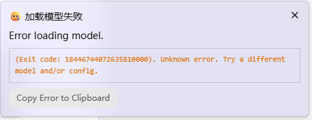
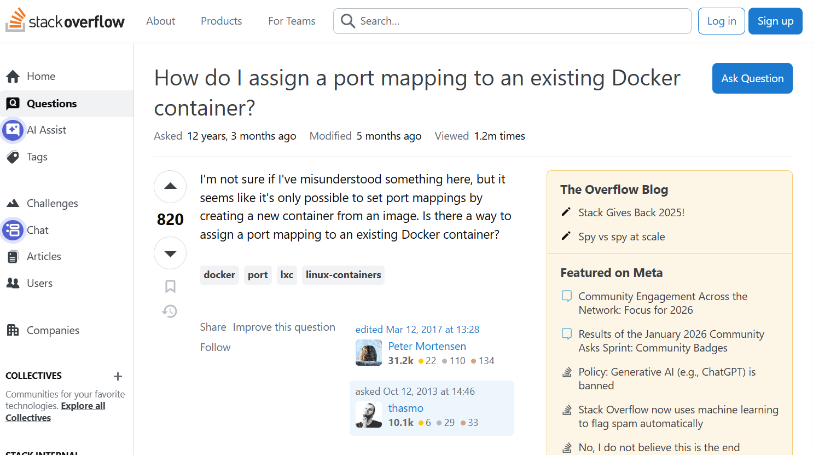
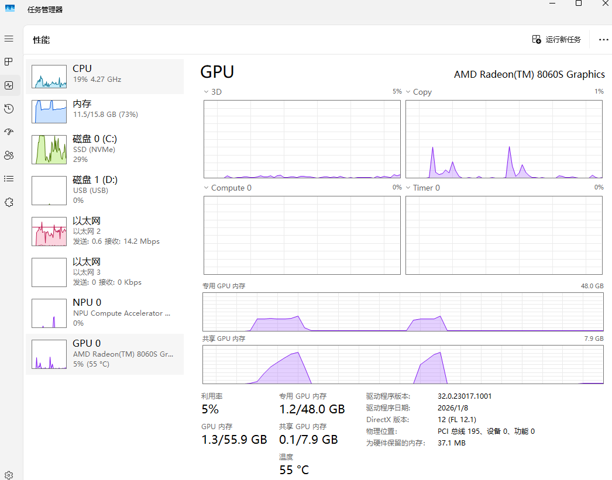
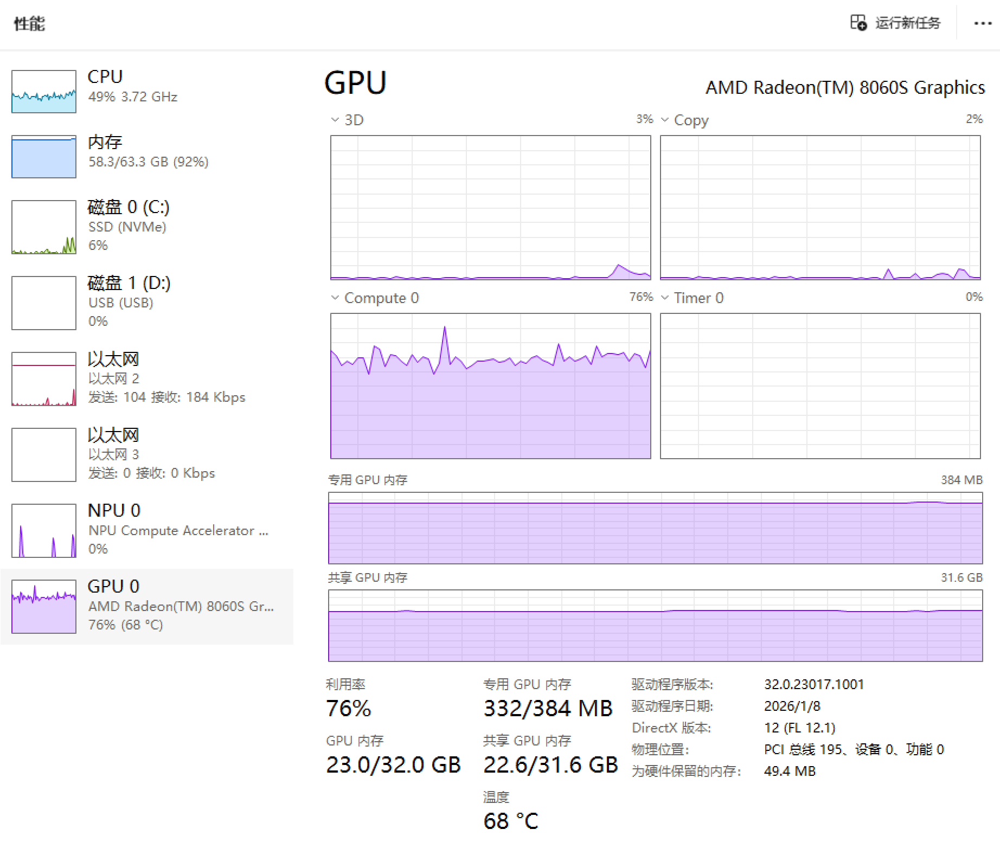
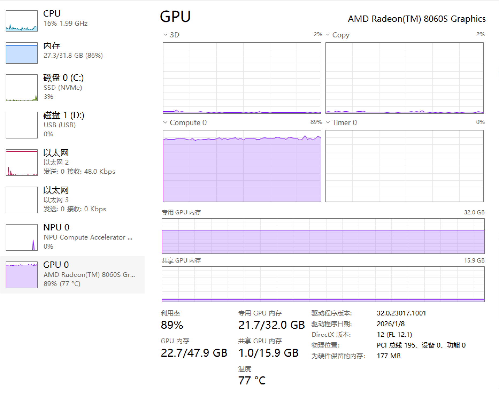
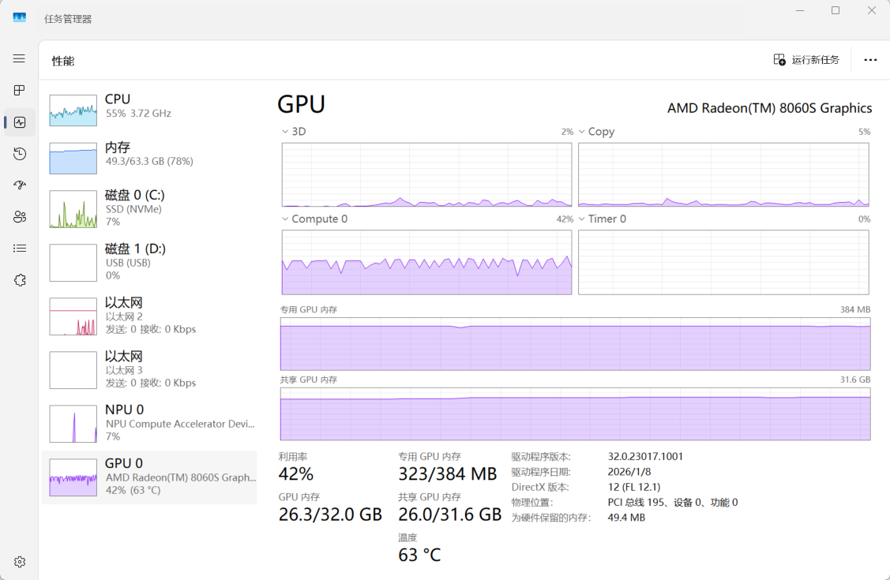
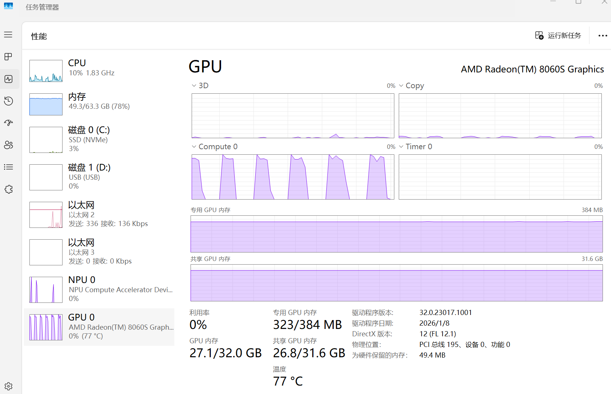

# 前言

之前写过一篇[关于HP战99 Ultra（搭载AMD AI Max+ 395）的使用体验](/articles/aimaxplus395-experience)，今天聊聊这台笔记本在AI推理场景下的表现。作为这台机器宣传的主要场景，AI推理的实际使用情况却优点一言难尽。

# 硬件配置回顾

| 配置 | 详情                                     |
| ---- | ---------------------------------------- |
| CPU  | AMD Ryzen AI Max+ 395 16C32T Zen5        |
| 内存 | 64G LPDDR5 8000MT 4通道可划分显存        |
| 显卡 | Radeon 8060S 40CU RDNA3.5                |
| 显存 | 可在BIOS里将几个固定挡位的内存分配给显存 |

# 关键概念：可划分显存 vs 统一内存

在深入分析数据之前，需要理解几个重要概念：

- **传统显存**：传统独立显卡的固定显存，容量固定，如RTX 4090的24G
- **可划分显存**：静态分配机制，将内存的一部分固定划给GPU作为显存使用，如AI Max+ 395
- **统一内存**：内存和显存统一寻址，整个内存空间CPU和GPU都可以访问，无需显式分配（主要见于Apple M系列芯片）

**重要区别**：AI Max+ 395使用可划分显存架构，需要静态分配部分内存给GPU使用；而统一内存无需显式分配，灵活性更高。

# AI推理测试数据

为了方便，本次测试均使用LM Studio运行。LM Studio中对AMD显卡有两种Runtime：Vulkan和ROCm。我本以为两种Runtime不会有什么很大的区别，但是实际测试下来却axm并非如此。

## GLM 4.7 Flash 

这是个MoE模型，总参数量30B激活3B的规模，主要测试`Q4_K_M`量化的情况。在这个量化等级下，在模型大小为`18.13GB`。

以下的给出Prompt为：

> 编写一个科技公司的官网的HTML

在16K上下文下：

| 专用显存                  | 512M         | 32G              |
| ------------------------- | ------------ | ---------------- |
| 显存占用                  | 20.8G        | 21.3G            |
| Vulkan速度、总数(token/s) | 17.26 (6970) | **42.89** (6107) |
| Vulkan 首token (s)        | 0.8          | 0.8              |
| ROCm速度、总数（token/s） | 15.28 (5262) | 14.42 (6351)     |
| ROCm 首token (s)          | 0.04         | 0.34             |

Vulkan在32G专用显存下的速度实在是过于逆天，于是我重新跑了数次，结果均非常接近。后面我们还能拿到如此让人匪夷所思的成绩。

16K的上下文只能说勉强够用。既然还有这么多显存可用，不妨试试更多的长度上下文。根据LM Studio估计，不同长度上下文的显存使用估计值：

- 16K上下文：**18.59G**
- 64K上下文：**19.57G**
- 最大支持（198K）：**22.3G**

看起来MoE模型的一大好处就是可以把上下文拉大！于是我选择GLM 4.7 Flash最大支持的长上下文 198K下，虽然LM Studio的估计显存占用也仅有**22.3G**，但是512M专用显存的无法正常加载：

只有在32G下可以正常使用，在Vulkan下获得了**37.28 token/s（7857 token，首token 0.15s）**的成绩。

同时我还测试了**Q6_K**的量化模型，在16K上下文、32G专用显存下：

- **模型大小**：24.61GB
- **预计显存占用**：25.12GB
- **推理性能**：
  - ROCm：13.79 token/s（6419 token，首token 0.33s）
  - Vulkan：**25.51** token/s（5717 token，首token 0.20s）

再次看到了不知道该说是Vulkan逆天还是ROCm的成绩！ROCm作为AMD官方的方案，居然被Vulkan拉开了如此大的差距。

在不开启思考的情况下，10 token/s的速度还是可以应付日常使用的。

## Qwen3 VL 32B Q4_K_M

稠密模型的情况就不一样了。这一部分我选择了Qwen 3 VL 32B来测试。

这是个支持图像输入的模型，于是我去stackoverflow上截了如下这一张图，

并给出prompt：

> 使用html和css重现这个HTML页面

以下为结果：

| 专用显存                  | 512M 16K    | 512M 24K    | 32G 16K |
| ------------------------- | ----------- | ----------- | ------- |
| 显存占用                  | 25.8G       | 28.3G       |         |
| Vulkan速度、总数(token/s) | 3.74 (4059) | 3.51 (3676) |         |
| Vulkan 首token (s)        | 36.67       | 39.29       |         |
| ROCm速度、总数（token/s） | 4.15 (3723) | 3.10 (3713) |         |
| ROCm 首token (s)          | 24.59       | 26.56       |         |

可以看到，在24K上下文已经到32G显存的极限了（28G）。

# 分配48G给显存？

395的另一个宣传点是可以将75%的内存划给显存，在64G的型号上，BIOS中最高可以将48G的内存划给显存。

听起来很美？48G显存甚至可以高量化跑32B模型了！

Qwen 3 VL 32B的Q6_K量化模型大小为**28.08G**，在32G显存下可以加载，但是推理的时候因为显存不够了，速度比可以完全在显存中的Q4版本慢很多。经过测试，Q5_K_M是最大的32G显存可以充分的量化规格。

而这时候你想到，48G显存岂不是就可以接近这个问题了？

可是事实却是：**16G的系统内存**不仅使得正常的系统操作会开始缓慢甚至卡顿，甚至模型都无法正常加载！而我已经LM Studio中有三个选项和显存和内存全部调整为不给内存太多压力了：

- KV缓存卸载到GPU内存中：打开，显存够大！
- 保持模型在内存中：关闭
- 尝试mmap()：将磁盘上映射到内存中空间中，关闭

# 内存可划分为显存 != 共享内存

395的主要的宣传口号，就是内存可以当作显存用。这话当然不假，BIOS里确实可以将内存划分给显存，但是，它和我们预期的**共享内存**完全是两码事：

- 被划分给显存部分不可以再作为内存使用
- 每次切换显存需要重启，不可无缝切换

那，如果我们不划分显存，**直接把内存当显存用呢**？其实现在的推理框架都支持把内存当显存用，但是以下两个问题让用内存当显存的方案下的推理速度惨不忍睹：

1. 内存与显存的速度之间有巨大差距
2. 内存中的数据仅能由CPU计算，而CPU在AI计算场景下速度非常缓慢，且CPU和显卡的计算数据需频繁相互拷贝

理论上来说，395的内存和显存均为同一款芯片，问题1不存在，但实际上问题2的问题仍然无法避免：即使是在同一块芯片上，显存仍然不能直接用内存部分的部分，内存和显存之间拷贝仍然非常频繁。

以下为使用512M专用显存（上）和32G专用显存（下）使用Vulkan运行GLM 4.7 Flash Q4_K_M时的任务管理器的图片，可以看出，512M的专用显存下GPU利用率只有70%左右，而32G下可以到达90%以上。而右上角的Copy也可以看出512M专用显存下显存一直在进行复制的操作。

同一现象也出现在512M专用显存下运行Qwen 3 VL 32B Q4_K_M的情况，GPU利用率更是只有50%，而Copy图中也能一直看到复制的过程，而整个过程中CPU也在（艰难地）参与运算。而CPU参与计算在笔记本场景下有抢功耗的问题，更影响了GPU的性能发挥。

更进一步地，如果把上下文拉到24K，进一步加大显存的需求量，在512M专用显存下情况更加恶化了：GPU有接近一半的时间都闲着。要知道，这个时候显存需求甚至才26G！

# 总结

我用两个字总结395的优点：**能用**

- 大显存确实可以跑一些正常显卡无法跑的模型，虽然慢，但是能跑比不能跑好！
- 成本相对较低（相比高端显卡）（也只是相对了）
- 4060移动端的绝对算力，不算高，但是愿意等等的话，它能跑的模型还是能给出结果的

可是这台笔记本形态、64G的总内存的设备却有点尴尬：

- 为了兼顾日常使用，实际上最多只能32G给显存
- 80W的最高功耗，无法充分发挥CPU的性能
- 手动划分显存操作失去了灵活性

所以395确实非常适合小主机场景：

- 这类主机在分配96G显存的情况下还有32G可以用于日常场景，比64G=48G+16G实用太多
- 这类主机的性能释放普遍超过100W，也有更完善的散热方案，可以更完美地发挥CPU和GPU的性能
- 和395刚出来的时候AMD更羸弱的AI生态相比，至少现在主流的推理场景（LM Studio，Ollama、ComfyUI）都已经可以用了

甚至小主机的价格也比笔记本形态的设备（64G 19999）便宜太多（128G普遍15000，希望还没开始涨）。在这个内存价格疯涨的年代，能以这个价格有一台可以跑大模型的机器已经很不容易了。