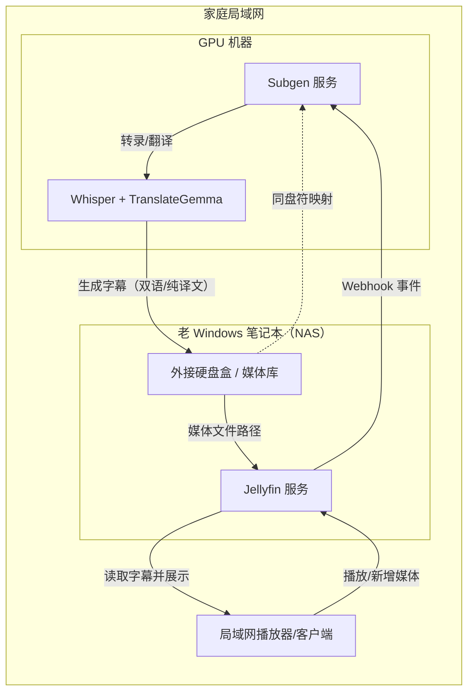
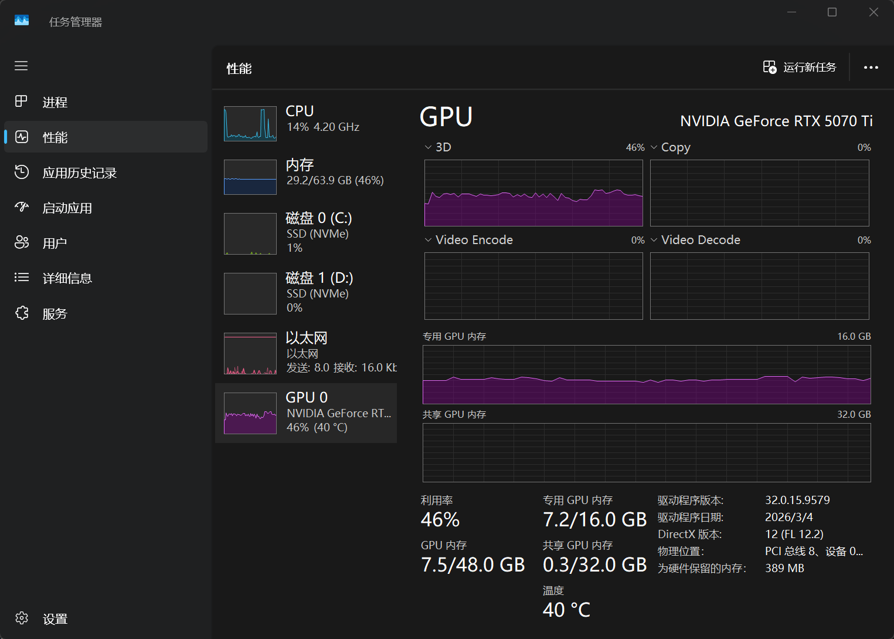

最近我想看一场时长 5 个多小时的日语演唱会录像，但这份录像没有可用字幕，我又不懂日语，没有字幕MC部分根本听不懂。

于是我想到可以用本地语音转录生成字幕。调研后我发现了 [McCloudS/subgen](https://github.com/McCloudS/subgen) 这个项目，发现它已经把“本地自动转录”这件事做得很完整，并且可以用jellyfin集成实现视频加入和播放时自动生成字幕。

在实际体验中，我进一步希望它能覆盖“转录后翻译”的需求，于是决定在原项目基础上做一层轻量扩展，把翻译功能补齐到同一条工作流中。

因此，我在原仓库上创建了一个fork https://github.com/ddadaal/subgen-translate ，实现了：

- 在不破坏原有 webhook / Bazarr 使用习惯的前提下，增加“转录后翻译”能力
  - 使用 https://huggingface.co/google/translategemma-4b-it 进行本地翻译，并同时生成翻译后以及双语反面
- 添加使用CLI转录和翻译的功能，可以直接在命令处理文件，无需从媒体服务器走
  - 转录： `uv run launcher.py -f "D:\Movies\movie.mp4" -t transcribe`
  - 翻译： `uv run launcher.py --srt "D:\Movies\movie.subgen.medium.jpn.srt" --srt-to zh`
- 添加一些工程管理的最佳实践，例如使用`uv`管理环境、`subgen.env.local`来编写本地配置等

## 个人使用场景

我的实际环境是一个典型的家庭局域网多机协作场景：

- 一台较老的 Windows 笔记本作为 NAS 主机，部署了 Jellyfin，并通过外接硬盘盒存放媒体文件。
- 局域网里其他机器没有可用 GPU，CPU 做转录与翻译（尤其翻译）速度过慢。
- 因此需要另一台带 GPU 的机器专门承担转录/翻译计算。

在 Subgen 与 Jellyfin 集成时，有一个关键前提：Subgen 看到的媒体文件路径，必须与 Jellyfin 看到的路径完全一致。为了实现这一点，我

1. 在 GPU 机器上把 NAS 外接硬盘映射成与 NAS 机器相同的盘符路径。
2. 配置 Jellyfin 与 Subgen 的互通（网络可达、Webhook 与服务地址正确）。
3. 让 Jellyfin 的“新增媒体/播放媒体”事件自动触发 GPU 机器上的 Subgen。

这样，Jellyfin 仍然负责媒体管理与播放触发，GPU 机器负责高耗时的转录与翻译，实现了“存储在 NAS、计算在 GPU 机器”的分工。

### 部署拓扑图

### 使用体验

1. `faster-whisper`支持多种模型（ https://deepwiki.com/SYSTRAN/faster-whisper#supported-model-variants ），但是不同模型的使用体验有较大区别：
    - `medium`：在 i5-1135G7 上用CPU大约可以做到 `1s/s`（每 1 秒处理 1 秒原视频），速度可以接受；但效果一般，出现了不少重复字幕、有人声但未识别的情况。和网易云版本对比，部分文字也不完全正确（不过对我影响不大，反正日文我也看不懂）。
    - `large-v3-turbo`：模型体积和 `medium` 差不多，都是约 1.5G；但在我的环境里只能正常处理视频开头，后面基本识别不出文字。
    - `distil-large-v3`：只支持识别英文
    - `large-v3`：模型大小 3G，在台式机 `RTX 5070 Ti` 上大约可达 `6.5s/s`（每秒处理约 6.5 秒原视频）。仍然存在一些错位、重复、未识别的问题，但是效果比`medium`强不少
2. `faster-whisper`只支持CUDA 12，不支持最新的CUDA 13，需要重新安装，但是在Windows上可以正常使用
3. 转录和翻译过程 GPU 不能被充分利用，两个步骤的显卡利用率都只有 40%，且依然需要 CPU 参与处理。

4. 翻译过程测试使用原版 `translategemma-4b-it` 在`RTX 5070 Ti`上速度极慢（25.66s一行），GPU利用率很低，可能需要优化写法
5. 字幕翻译和合并功能其实有很多在线的免费服务可以用，且速度和质量都非常好（甚至比本地模型效果更好），偶尔用一次的话，用这些免费服务更好
   1. 翻译： https://translatesubtitles.co/
   2. 合并： https://subtitletools.com/