# 总图

我的整套方案，除了HDD等硬性开销以外，没有新增任何成本：笔记本是闲置的，云端服务器是已有的，软件全部都是开源的或者使用内置的功能。

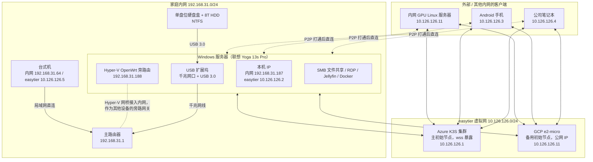

# 古老Windows笔记本作为服务器

整个配置的核心是一个2020年购入的超轻本联想Yoga 13s Pro，配置为i5 1135G7+16G+512G。

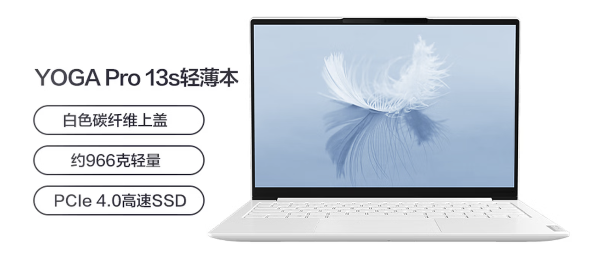

当时买这个电脑最看重的就是它的**轻**：966g的体重非常适合当时还在读书的我在各个场所之间转点。在购入这个本子之前，我长期用的是X1 Carbon 2018，所以超过1.12kg的笔记本用于通勤在我看来都是不可接受的。

这个电脑被我作为出门的主力用到了2023年。工作后公司配发了笔记本，出门要处理工作也只需要携带公司的笔记本，所以这个笔记本就闲置了，直到我开始想搞homelab配置的时候才想起来：与其重新买一个性能可能还不如这个笔记本的NAS，为什么不直接用它呢？

## Windows

大多数用于搭建homelab的设备都会使用Linux，这当然可以理解：安装方便，作为服务器一般也不需要GUI，对配置要求低。但是，我最终还是直接用了笔记本自带的Windows，而没有重新装系统，主要考虑到以下几个因素：

- 直接兼容NTFS

我在搭建homelab之前就有了一个8T的HDD，但用法是直接接了个硬盘盒插到台式机上使用，所以直接格式化成了NTFS。这么多年了，Linux对NTFS的支持只能说是读没问题，而写入就有比较大的风险，甚至于2024年我用一个NTFS的U盘在Linux写了个简单的文件，再把U盘插到Windows电脑上后，Windows就报错。所以如果要在Linux机器上，就不得不格式化成Linux直接兼容的文件系统，而当时硬盘已经写了好几个T了，迁移数据的过程非常麻烦，所以索性就不格式化了，也不换笔记本的操作系统了。

- 功能齐全

Linux能干的当然也能干。Jellyfin，Docker等常见软件Windows都有，文件共享也可以使用内置的SMB方案（右键要共享的目录，当然也有坑，见下文），有大量客户端软件都支持SMB。并且有了WSL2和Hyper-V，理论上Windows可以完成所有Linux可以做的事情，而Linux做不了的，例如各类仅Windows的国产软件，那在Windows上就可以直接使用、而不是用去找绕过方案了。

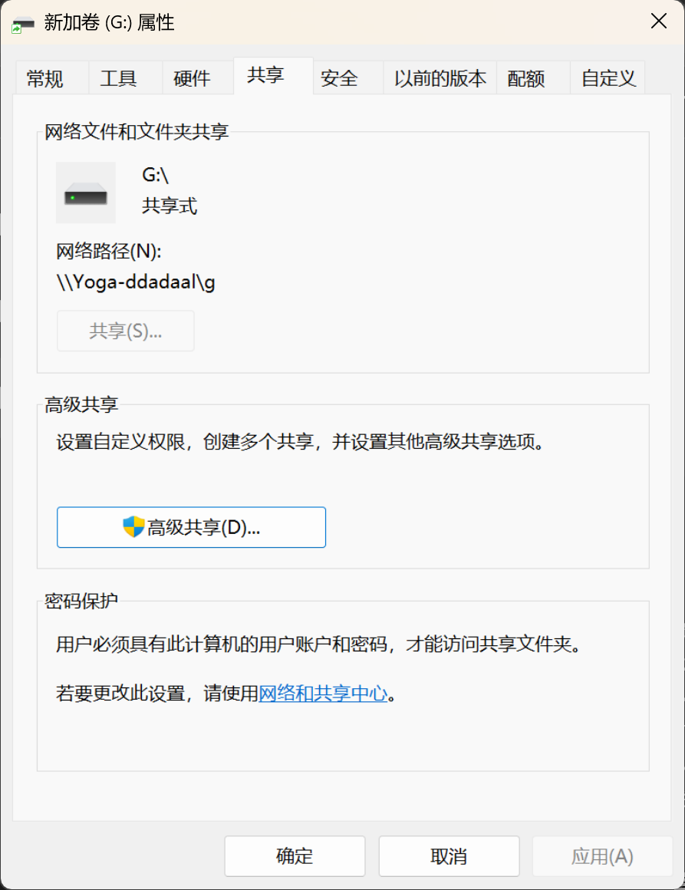

- 易用性

虽然我整天做Linux的运维，但是从易用性层面来说，Windows还是更胜一筹，几乎所有运维操作都可以用GUI解决，而不同于服务器集群运维，绝大多数homelab的运维工作都是临时的、一次性的，不需要自动化。加上RDP，我可以在任何地方，甚至从一个Android平台，连接到服务器并操作。另外，Windows还可以直接运行我需要的软件。例如，某些时候我需要往NAS上下载大文件，而与其在Windows电脑上下载好再传过去，不如直接在服务器上通过GUI操作来下载。

## Windows作为服务器的特殊处理

当然，Windows运维起来和Linux还是有一些区别的，并且还有一些Windows埋下的坑需要特殊注意：

- RDP/SMB用户名和密码

从Windows 8开始微软开始推广微软账号登录，设置了微软账号登录的电脑无需再设置本地密码。但微软似乎忘了RDP/SMB默认的用户名和密码登录模式。RDP还好，如果登录的设备也是用微软账号登录的，那么直接可以直接登录。但是从不是Windows设备，例如Android设备的RDP应用登录时，以及通过SMB来连接共享的文件或者文件夹时，系统要求的用户名和密码到底是啥就比较让人摸不着头脑了。

这个网上有不少处理方法，但是总的来说，都会要求用户**从本地用户登录，再切换到微软账号**，并且**需要至少在锁屏界面使用完整密码登录过一次系统**，之后才能正常地用这个本地用户的用户名和密码登录RDP或者SMB。我更推荐在初始化系统的时候，就先使用本地账户登录，进入系统后再切换成微软账号，因为这样做还有个好处，可以让家目录的目录名是完整的（`C:\Users\ddadaal`）的而不是根据微软账号自动生成的5位字符。

- 防火墙和端口映射

和大多数开启了防火墙的Linux系统一样，Windows也内置了非常完善的防火墙功能，这个功能平时用得不多，因为常见的应用都会自动添加防火墙规则。但是当我们自己写的Windows应用需要监听`0.0.0.0`的时候，系统会弹出提示，需要明确允许才可以监听（如果只是监听`127.0.0.1`就不会）。而如果一个WSL中的程序监听了`0.0.0.0`且WSL的网络是`Mirrored`时，我们就会发现Windows本机可以访问，但是局域网中的机器不能访问，这个时候就需要手动创建一个入站规则，让这个端口可以被其他机器访问。操作也比较简单，运行`firewall.cpl`进入防火墙界面，添加一个入站规则，跟着向导输入端口号即可。图形界面还是比较直观的，作为对比，我到现在都不记得`firewall-cmd`的设置规则的命令。

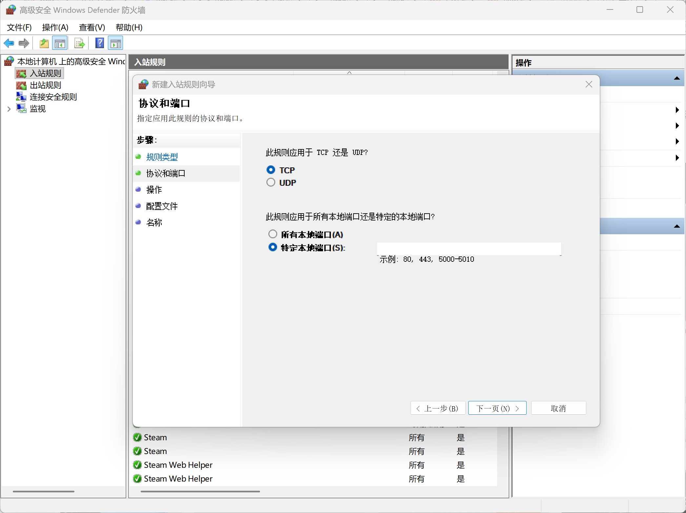

我这里有时候还有一个需求，也就是需要**把仅监听内网地址的服务让内网其他机器也可访问**（说的就是你，DeepSeek Harness）。另外，前几个月的Docker Desktop的端口转发似乎有问题，本来应该直接监听`0.0.0.0`的容器，实际只监听了`127.0.0.1`，于是想在局域网中访问这个服务，就必须把这个端口映射出来。Windows内置的防火墙是直接支持端口映射的，命令格式为（需要在提升权限的终端下运行）：

> netsh interface portproxy add v4tov4 listenaddress=0.0.0.0 listenport=18080 connectaddress=127.0.0.1 connectport=28080

但我都用Windows了，为什么还要输入命令？于是从GitHub上找到了一个可以配置转发规则的GUI程序： https://github.com/zmjack/PortProxyGUI 。非常感谢这个作者！

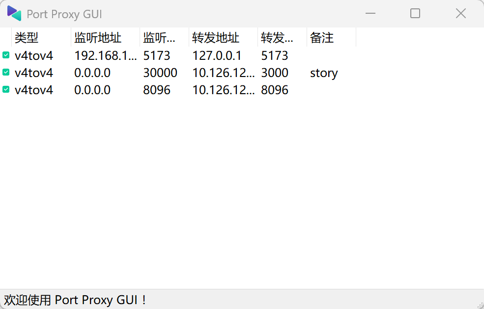

- 自动更新和软件自启动

Windows 10开始微软不允许消费级的Windows系统停止系统更新，这对日常系统来说问题不大，但是对于服务器端用途的设备来说就比较折磨了，所以每次出远门前要记得暂停系统更新几天，并且为了以防万一，必须要让能够提供远程访问的程序在系统重启后自动启动。这样，即使系统真的重启了，也能有一个方法远程连接回电脑来启动其他程序。

## Hyper-V启动的openwrt旁路由

软路由也是玩homelab不得不品的一环。由于我的笔记本只有一个物理网口，直接将它作为路由器不是非常现实，所以我采取了**旁路由**的方案。也就是不改变原来的路由器，而是将这个设备在局域网中作为一个独立的网关，设置局域网中的其他设备的默认网关为这个设备，让这些设备的流量都会经过这个软路由，从而让这个软路由可以处理到流量。而把openwrt装成一个Hyper-V虚拟机，然后建立一个网桥将openwrt暴露到内网并设置一个静态IP，这样就可以完美实现这一方案。

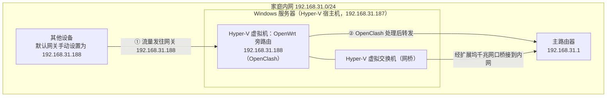

OpenWrt虽然运行在Windows服务器里，但它通过Hyper-V的网桥直接接入了内网，拥有独立的IP（192.168.31.188），而不是和Windows服务器（192.168.31.187）共享IP。其他设备只需要把默认网关改成192.168.31.188，流量就会先经过OpenWrt处理，再由它转发给主路由器。

我使用的是原版的openwrt，并在此之上安装了OpenClash插件，这样经过旁路由的流量就可以自动科学上网了。原版openwrt对资源消耗也比较低，这样一台性能弱鸡的设备也完全可以支撑。

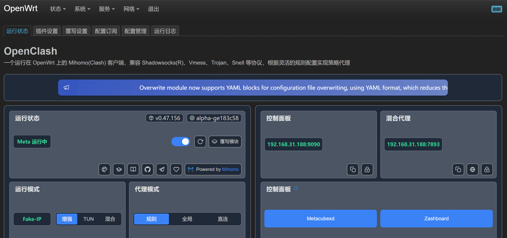

但我最后没有让所有设备都走旁路由，因为我的主要需求实际上只有科学上网，软路由的其他功能（如Docker等）我都通过Windows服务器+easytier虚拟网（后面会讨论）实现了，但是我的各类设备设备不仅要在家里、还需要在外面可以科学上网，所以本来就必须配置好科学上网软件，需要使用的时候直接打开软件就行，不需要走旁路由。但如果以后需要购入单独开科学上网不方便的设备（如各种国外的VR设备），那这个方案还是非常有用的。

## 散热、外设

由于我这个笔记本本身定位是超轻本，所以它的性能和外设都不是设计的重点。

接口层面，整台电脑只有3个C口和一个3.5mm耳机接口，没有A口也没有网口，这对于一个NAS设备来说确实不太够用。于是我找了一个带有千兆网口和USB 3.0的扩展坞，这样就完美满足了需求。和物理网口相比，Wi-Fi在速率和稳定性上确实还是差了不少。

性能层面，虽然笔记本本身是双风扇，但由于本身笔记本也不是性能导向，加上11代i5比较惨的性能和散热设计，还因为我这个笔记本由于用了太长的时间（到现在已经6年了），硅脂等都已经失效，所以只要稍微给笔记本加上一点性能压力，笔记本就特别烫，连带着的就是降频。在不加外置散热+烤机的情况下，CPU频率甚至能低到**0.2Ghz**，系统完全无法使用。由于懒得自己换硅脂，某一天突发奇想，直接用风扇怼着吹，发现性能。后面搬家后这个风扇没有带着一起走，就买了一个散热底座，虽然效果不如风扇直吹，但是起码能用了。

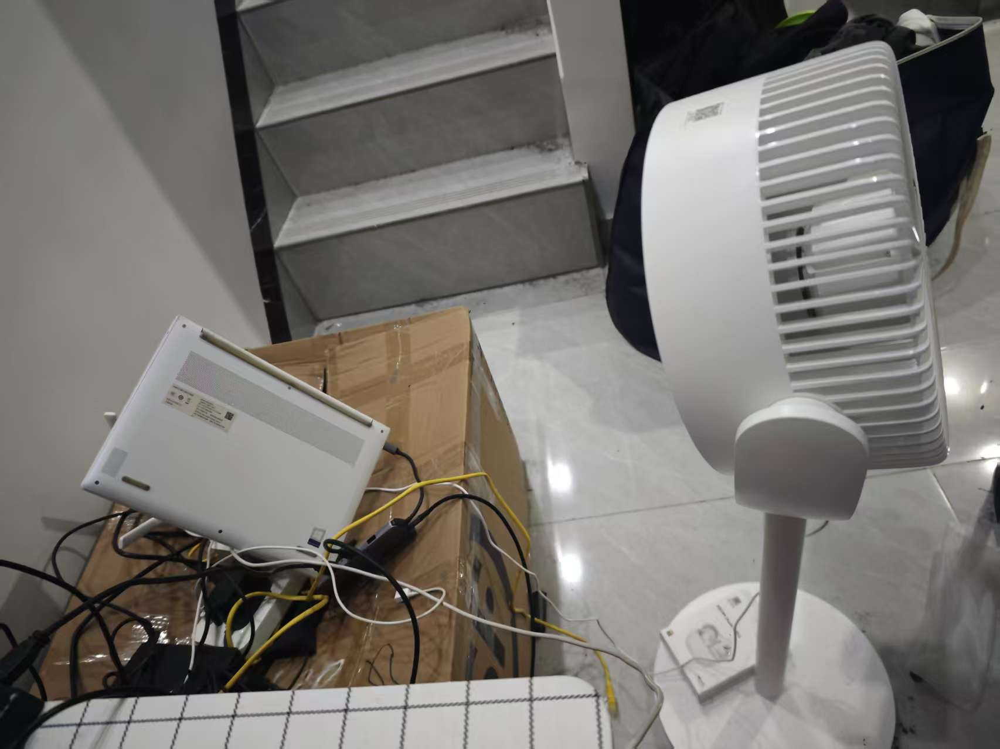

比较有意思的是，我一直以为这个降频是11代i5本身的锅，因为之前公司配发的11代i7笔记本同样也会降频到0.6Ghz。直到后面有一次偶尔在降频情况下摸了一下笔记本底盖被烫到，才发现是散热的问题。

# NAS=硬盘盒+SMB

homelab的一大功能就是提供NAS功能，这也是我的整套配置一开始的想法，所以我很早就买了HDD。但是在当时，我还想着可能之后会有扩展HDD的操作，所以直接一步到位买了一个4盘位的、可以提供软RAID的硬盘坞。可惜，直到我最后放弃这个硬盘坞，我都没有用过这个软RAID功能。

为什么我最后放弃了这个4位硬盘坞？因为**我的数据坏了**。

不知道具体是什么原因，从硬盘坞开始使用第一天，在正常运行的过程中硬盘也一直有“咔咔咔”的声音。这个声音是不正常的：要么是供电不足，要么是硬盘本身有问题。可是我这个硬盘是全新的刚买的呀！而供电不足也只能是硬盘坞本身的问题，但硬盘坞本身有外置电源，且设计是支持四个硬盘的，总不可能一个硬盘都不带起来吧！

死活查不出问题，后面也懒得继续查了。硬盘坞就这么运行了2年多，期间我经历过几次同城和异地的搬家，由于异地搬家需要坐飞机，为了防震，我也做了一些简单的保护，搬家完成后硬盘仍然一切正常，还让我长舒一口气。

可是没想到的是，突然在2025年11月的一天，系统无法访问这个硬盘的数据了。Windows甚至还可以识别到硬盘的总容量和可用容量，但是数据是完全无法访问。尝试了一些方法，最终只能放弃硬盘。还好我的主要数据都是多地备份，重要的数据都在云端有一份，只有本地保存的各类电影、游戏资源还可以重新下载。

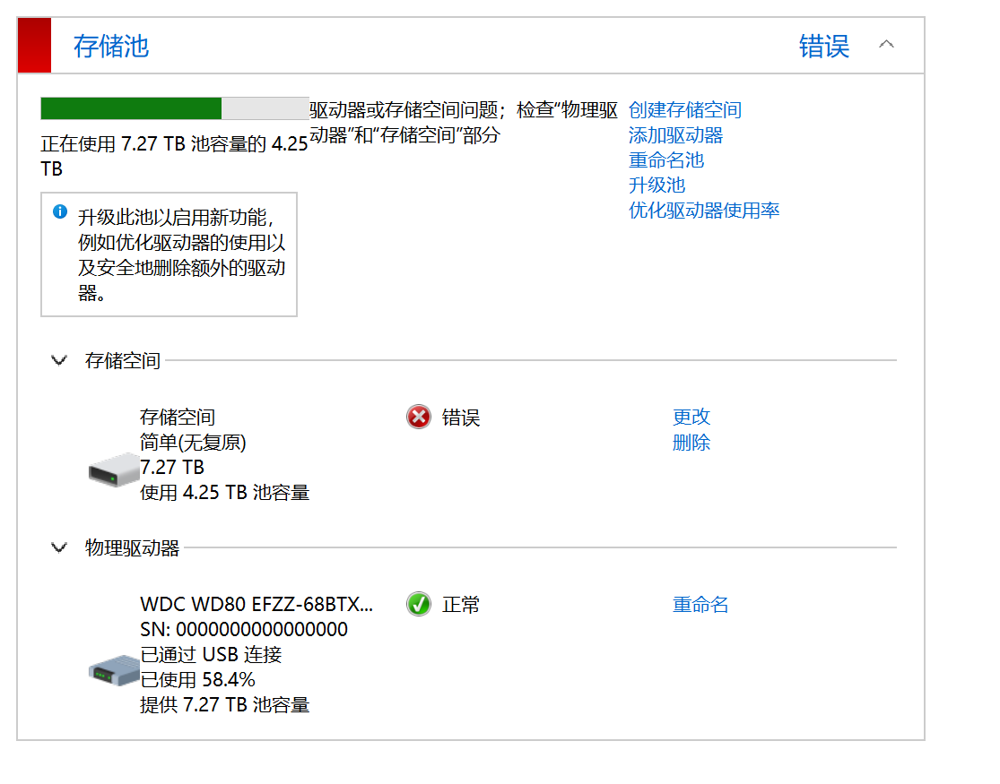

BTW，从那个时候开始存储的价格已经开始飙升。在我2023年8月购入HDD的时候HDD的价格只有1300出头，而此时价格已经涨到了1700。当我已经下单时，在朋友的提醒下发现HDD的保修居然是3年且我当时仍然在HDD的保修范围内，于是直接找京东免费重新换了一个。而现在再去看同款HDD的价格，官方店已经下架，第二方店铺已经快3000了，AI的存储需求实在是太恐怖了。

2023年硬盘价格：

写文时的硬盘价格：

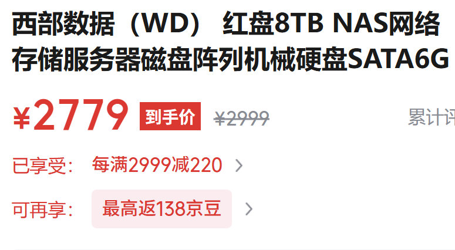

后面考虑到我的NAS需求并没有那么大，且这类硬盘盒方案已经让我损失过一次数据了，所以就换了一个简单的单盘位硬盘盒，这下一切都没问题了：没有咔咔声，移动起来方便，甚至连性能都正常了：当时用硬盘坞的时候，读写只有100MB/S，而现在总算恢复到了200MB/S的正常速度。对于一个仅用于存储文件的硬盘来说，这个性能已经完全够用了。

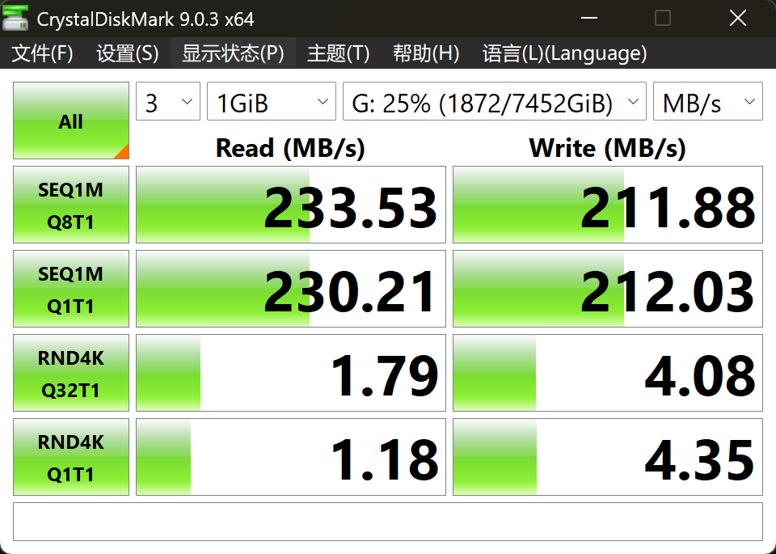

# easytier虚拟网

Homelab的另一个特性就是从互联网也可以访问内网的服务，这也是很多NAS产品的最大卖点。

我一开始使用的是[frp](https://github.com/fatedier/frp)，但frp的配置粒度是端口，且修改配置文件必须重启。这样就不够灵活，每次要新增服务都需要手动修改配置文件并重启转发服务，而如果正好是在远程修改配置，远程桌面都会断掉，而如果配置文件写错了，那就完蛋了，设备直接连不上了。

于是后面开始研究内网穿透方案，第一个选择就是[Tailscale](https://tailscale.com/)。这是一个非常老牌的内网穿透方案，但在我的网络环境中，无论是使用官方的服务器，还是我自部署的headscale开源第三方的控制服务器，穿透成功率都非常低。且tailscale如果想做普通的转发，则必须单独部署DERP服务器。

后面研究了很多方法，最终[easytier](https://easytier.cn/index.html)满足了我的一切需求：

- 它是唯一一个在我所能遇到的网络环境中都可以成功P2P的方案

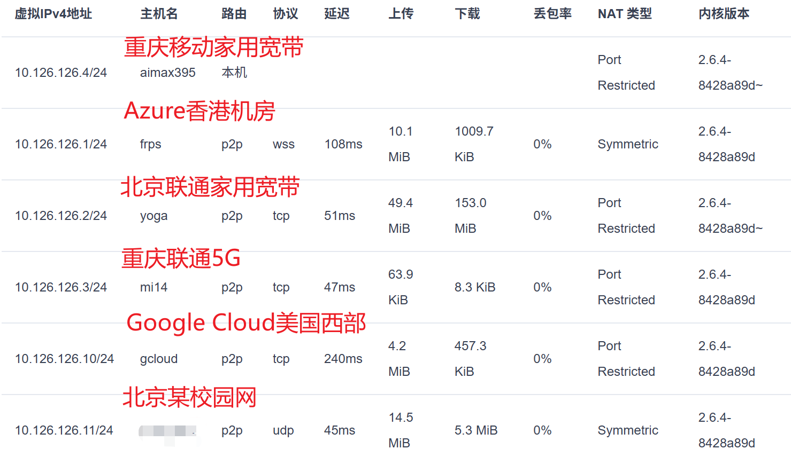

- 速度和延迟基本能跑满物理限制

下图为从重庆移动家用宽带传输的笔记本到北京联通家用宽带中的NAS，已经打满了家用宽带的上行带宽（4MB/S）。比较奇怪的是，Windows Explorer给的传输速度是4MB/S左右，但是任务管理器里`easytier-gui`的网络使用是实际值的两倍，不知道是统计错误还是设计原因。

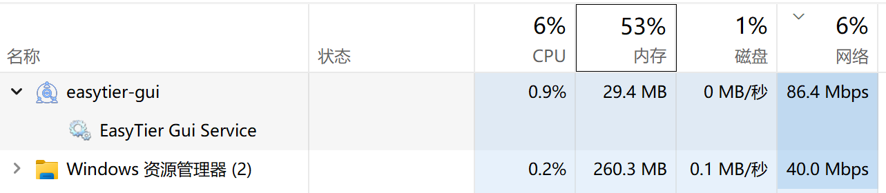

- 各个机器上的应用程序可以按照正常内网的方案暴露到公网中

作为一个虚拟组网的方案，easytier在不开启no tun的情况下，会创建一个虚拟网络，每个网络中的设备都会有一个网段中的IP的虚拟网卡，这样，所有设备上监听了`0.0.0.0`或者这个网络的应用都可以直接访问，不需要每新增一个应用都要改一个配置。服务器上的NAS、RDP等端口无需单独配置即可直接使用。

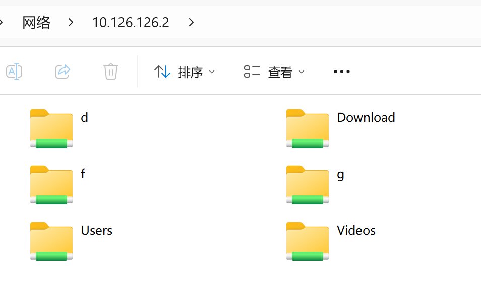

- 可完全自部署，部署方便，客户端种类多

easytier本身不区分客户端和服务器端，所有节点只需要部署一个完全相同的二进制和大致相同的配置文件即可。实际部署需要选择一个公网可访问的节点作为所有节点的初始连接节点。只要能P2P，这个节点本身就不会走数据流量，所以初始节点本身的带宽和延迟就没那么重要。

我将主要初始节点部署在了[博客的发展3：将博客迁移至Azure并添加访问指标采集](/articles/migrate-to-azure)中提到的Azure上的K3S集群。在写文的时候，虽然支持`TCPRoute`/`UDPRoute`的Gateway API v1.6已经Generally Available，但是K3S内置的Traefik还仅支持Gateway API v1.4，v1.4版本中TCPRoute/UDPRoute还处于实验阶段，还不可以直接公开TCP/UDP端口。easytier本身还支持WebSocket协议，所以可以直接将easytier通过wss协议暴露出来。

而Google Cloud Platform目前还提供免费的`e2-micro`虚拟机（[文档](https://docs.cloud.google.com/free/docs/free-cloud-features)），虽然都是`us`的机房，延迟很高，性能也一般，而且似乎还有流量的限制，但是有公网IP，作为一个备用的easytier主节点已经非常足够了。

除了命令行二进制以外，官方还给全平台（甚至Android）提供了GUI客户端。甚至Windows客户端还可以快速地配置为Windows服务，这样即使Windows重启了，easytier也能自动运行，不会让这个机器连不上。

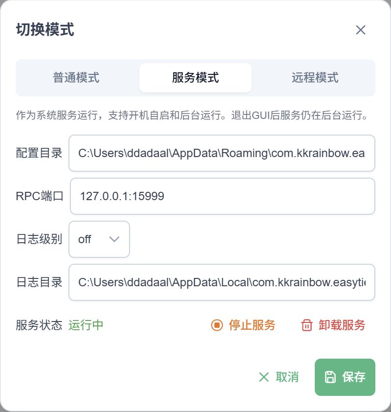

而Android客户端的使用体验虽然就是一个GUI套壳，但是使用起来也完全没有问题，唯一有的问题就是Android不支持多重VPN，启动一个easytier会顶掉科学上网VPN。我看网上有人让AI把科学上网软件和easytier这类内网穿透工具的功能做成同一个软件，这样在系统层面启动一个VPN即可，内部的流量由这个软件负责。

# 后续改进

后续我想做的最重要的事情是**透明加密+网盘备份**。之前损失过一次数据，而要想保护数据完整性，除了本地装RAID以外，另一个比较节省钱的方案是将数据保存到网盘上。但是网盘经常和谐一些文件，所以需要在上传时将文件加密，下载后将文件解密。在Linux上可以使用FUSE做一个虚拟文件系统，如[gocryptfs](https://github.com/rfjakob/gocryptfs)，在一个实际的目录上创建一个挂载点，从挂载点读写的文件时候，写入文件的时候将内容自动加密后存储到实际目录中，读取文件的时候自动解密，而在网盘软件中将实际目录设置为同步目录，这样就实现了从本地读写实际内容，网盘备份加密。而在我影响中，Windows对用户态文件系统没有那么友好，官方并未开放类似FUSE的用户态文件系统解决方案，后续会在AI的帮助下试试第三方的方案如[Winfsp](https://winfsp.dev/)来实现这个比较重要的需求。

另外，我还在考虑做一个控制台，把NAS上的一些常见功能做成一个Web界面。以往这类功能都会直接采用第三方的方案，但是第三方的方案再好，也不如自己写符合自己的需求，而有了AI，定制化开发不再是一个时间问题，许愿式编程真的已经成为了现实。

