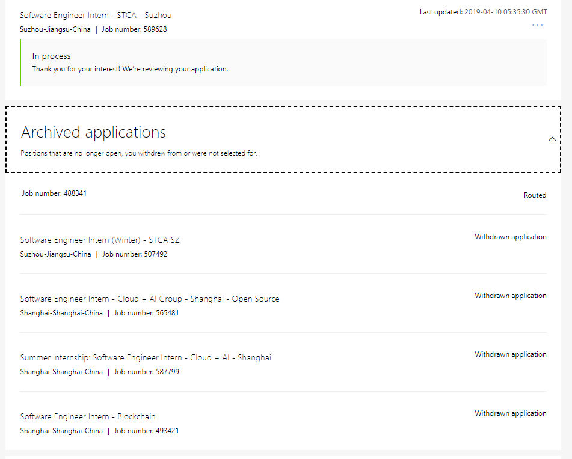
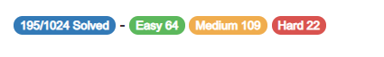

# 介绍

经过几个月的准备、投简历、面试和（最让人难受的）等待，终于在4月16日拿到了**微软苏州STCA SE**的实习Offer。所以在这里记录一下这几个月来所经历过的实习相关的事情，并想发表一下关于实习、关于未来计划的一些思考。

# 面试前

面试前最重要的当然是**刷题**、**选择职位投递简历**。在这次夏季实习之前的2018年底和2019年初，我还经历了一些和微软相关的面试经历。而且，这次夏季实习生的投递简历的过程也是一波三折，在上海和苏州的职位中纠结，最终还是选择了苏州。下图为投递过但最后撤回的职位。

## 2018年底：微软冬季实习

2018年10月份的时候看到了冬季实习的消息（[当时的微信推送](http://mp.weixin.qq.com/s?__biz=MzU1MTU2NjcxMQ==&mid=2247483972&idx=1&sn=f145e95fa8e239730026f76241833071&chksm=fb8e2e5cccf9a74aae92957bc4abd01dec2da4b2868604eaf1d59b5112bf58390776a68d4fd2&mpshare=1&scene=23&srcid=#rd)），感觉非常激动，于是很快就把简历投了上去，选择的职位也是微软苏州STCA的SE Intern。

等了一个月，终于在刚下课的时候等到了来自苏州的一个电话，一接果然是HR，心里非常激动，以为和SAP一样要电面了，可没想到就问了一个可以去的时间，我报了1个月（寒假嘛）后，HR就随便说了说*如果有的话过几天会有HR来通知的*就挂了。然后从同学那里听说这种实习一般都得需要3个月😔，所以就放弃了，最后果然也没有下一步。

## 2019年1月：MSRA和上海Blockchain

之后，在俱乐部邀请两位去过MSRA的学长学姐来介绍实习经历（[俱乐部微信推送](http://mp.weixin.qq.com/s?__biz=MzAxODAzMzczMg==&mid=2659244270&idx=1&sn=84eefec54a126e85853b15714f532000&chksm=80a805c5b7df8cd332704cef69f78060c6f00b787628bebfe2f885569b40f484d75e38787787&mpshare=1&scene=23&srcid=#rd
)）后，学长表示可以内推。心里没忍住，就让学长帮忙内推了MSRA，接下来的事在这篇[面经](/articles/MSRA-DKI-frontend-interview-experiences)中讲的比较清楚，这里就不再说了。这次是我第一次接受比较正式的面试，成功体验到**从自信到自闭**的全过程，最终还收获了宝贵的**我拒了MSRA**的经历。

其实，在这段时间里，我除了投了MSRA，还投过了上海某个**区块链相关**的职位（上图中最后一个）。在拒了MSRA之后我心灰意冷，向和继续在你院浪费半年时间的残酷命运低头，所以过了几天区块链这个职位的HR打来电话问面试时间，我就直接拒绝了面试。

之后迎来了愉快的、本来准备刷题但是最后在家连LeetCode都没打开的寒假。

## 2019年2月：夏季实习投递简历

在第一个工作日就看到了夏季实习生开始投简历的消息（[当时的微信推送](http://mp.weixin.qq.com/s?__biz=MzU1MTU2NjcxMQ==&mid=2247484256&idx=1&sn=50a28ed30057c6d006c498c348e6f5c0&chksm=fb8e2f78ccf9a66eec2dab0f6aa01076de861e37560fb4161b121c88f4032804ad5021d56699&mpshare=1&scene=23&srcid=#rd
)）。因为刚开学，所以时间比较充足，所以在这次网申开始后，我花了一段时间更新简历，之后立刻开始投简历的。投简历经过了以下阶段。

- 苏州STCA，上海C+AI，上海C+AI Open Source

一开始以为可以投多个项目，所以浏览了一下实习列表，除了一定会投的苏州STCA，还发现了上海的两个职位。本来以为上海微软就只有支持，结果发现其实也是有开发岗的。其中普通的C+AI应该和STCA比较相似，但是另一个**C+AI Open Source**的职位吸引住了我。仔细了解后发现这个工作主要是给VSCode写Java扩展……我是VSCode（当然还有其他微软产品，除了Surface）的忠实用户，对这个开源和开发扩展的工作非常感兴趣，于是也把它选上了。

- ~~苏州STCA~~，~~上海C+AI~~，上海C+AI Open Source

后来听说**只能投一个职位**。我纠结再三，最后还是感觉在**在MS写开源**和**在MS写Java**听上去非常酷，而且这样也能提高自己**混开源社区**的能力，也可以**避免把自己螺丝钉化**，而且还可以去**体验上海的生活**，所以最后留下了上海Open Source的职位。

- 苏州STCA，~~上海C+AI~~，~~上海C+AI Open Source~~

结果又没过几天就听说有学长可以帮忙**内推**。这可难办了：内推可以直接**免掉笔试**，而我之前对MS的笔试（好吧那是2015年……）的印象是：*不会做*。虽然当时的我不会做，但是现在我的我也不会做啊……虽然刷了一段时间的题但是还是深知自己算法有多么的弱鸡（不管是从自己做题的要死要活的感受以及和同学比较），所以**免笔试**对我来说是个巨大的诱惑；但是学长**只能内推STCA**，而上海的是C+AI，这是两个大组，不能互推。又纠结再三，追求稳妥的我最后还是选择了**先上车再说**，留下了苏州STCA的申请。有关苏州还是上海这一点，文章后面还会继续讲。

## 刷题

当然了，投简历不重要，在面试前的这段时间里最重要的是**刷题**和**准备面试**。而MS的**面试=做题**（这一点请看下面面试部分），所以面试前的准备就是两个字：

**刷题**。

刷题的感觉每个人都不一样，对我来说刷题就是两个字**痛苦**。几乎每遇到一个题我大脑都是空白的状态，即使刷过50、100、150题以后也是如此；给自己安排的配额是**每天5道**，确实发生过很快就能解决5道的情况，但是那是少数，大多数时候都是**2小时2道medium，每道题一段时间后想不出来就忍不住看Solution，之后心态爆炸准备找3道easy水过，结果被easy难住……**；其他同学刷个几十道甚至几道就能在面试场上游刃有余，拿到新题至少有个思路不会惊慌失措，而我甚至在刷了下图这么多题后看到新题仍然是一脸懵逼，心里发慌；更别提其他人刷题就是放松、“找到真正的快乐”，而对我就是折磨……

总之，这段刷题经历让我终身难忘，也是我最后选择**先上车**的上车：我确实是不想再经历刷题的痛苦了……

PS: 在4月的时候看了下微软笔试题，发现当时选择内推是正确的，也证明了我对自己的认知没有错。

# 面试

